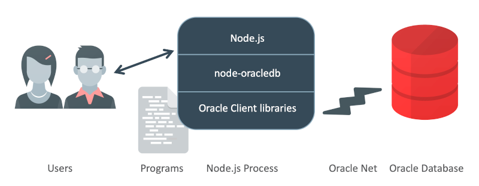

# node-oracledb 5.2-dev Documentation for the Oracle Database Node.js Add-on

*Copyright (c) 2015, 2021, Oracle and/or its affiliates. All rights reserved.*

You may not use the identified files except in compliance with the Apache
License, Version 2.0 (the "License.")

You may obtain a copy of the License at
http://www.apache.org/licenses/LICENSE-2.0.

Unless required by applicable law or agreed to in writing, software
distributed under the License is distributed on an "AS IS" BASIS, WITHOUT
WARRANTIES OR CONDITIONS OF ANY KIND, either express or implied.

See the License for the specific language governing permissions and
limitations under the License.

##
## ===> *** Note: Go to [https://oracle.github.io/node-oracledb/doc/api.html](https://oracle.github.io/node-oracledb/doc/api.html) for production documentation ***

## Manual Sections

This document contains:

- [Node-oracledb API Manual](#apimanual)
- [Node-oracledb User Manual](#usermanual)

For installation information, see the [Node-oracledb Installation Instructions][2].

##  <a name="contents"></a> Contents

1. [Introduction](#intro)
    - 1.1 [Node-oracledb Architecture](#architecture)
    - 2.1 [Getting Started with Node-oracledb](#getstarted)
        - 2.1.1 [Example: A SQL SELECT statement in Node.js](#examplequery)
        - 2.1.2 [Example: Simple Oracle Document Access (SODA) in Node.js](#examplesodaawait)
2. [Errors](#errorobj)
    - 2.1 [Error Properties](#properror)
        - 2.1.1 [`errorNum`](#properrerrornum)
        - 2.1.2 [`message`](#properrmessage)
        - 2.1.3 [`offset`](#properroffset)
3. [Oracledb Class](#oracledbclass)
    - 3.1 [Oracledb Constants](#oracledbconstants)
        - 3.1.1 [Query `outFormat` Constants](#oracledbconstantsoutformat)
            - [`OUT_FORMAT_ARRAY`](#oracledbconstantsoutformat), [`OUT_FORMAT_OBJECT`](#oracledbconstantsoutformat)
        - 3.1.2 [Oracle Database Type Constants](#oracledbconstantsdbtype)
            - [`DB_TYPE_BFILE`](#oracledbconstantsdbtype), [`DB_TYPE_BINARY_DOUBLE`](#oracledbconstantsdbtype), [`DB_TYPE_BINARY_FLOAT`](#oracledbconstantsdbtype), [`DB_TYPE_BINARY_INTEGER`](#oracledbconstantsdbtype), [`DB_TYPE_BLOB`](#oracledbconstantsdbtype), [`DB_TYPE_BOOLEAN`](#oracledbconstantsdbtype),
[`DB_TYPE_CHAR`](#oracledbconstantsdbtype), [`DB_TYPE_CLOB`](#oracledbconstantsdbtype), [`DB_TYPE_CURSOR`](#oracledbconstantsdbtype),
[`DB_TYPE_DATE`](#oracledbconstantsdbtype), [`DB_TYPE_INTERVAL_DS`](#oracledbconstantsdbtype), [`DB_TYPE_INTERVAL_YM`](#oracledbconstantsdbtype), [`DB_TYPE_JSON`](#oracledbconstantsdbtype), [`DB_TYPE_LONG`](#oracledbconstantsdbtype), [`DB_TYPE_LONG_RAW`](#oracledbconstantsdbtype), [`DB_TYPE_NCHAR`](#oracledbconstantsdbtype), [`DB_TYPE_NCLOB`](#oracledbconstantsdbtype), [`DB_TYPE_NUMBER`](#oracledbconstantsdbtype), [`DB_TYPE_NVARCHAR`](#oracledbconstantsdbtype), [`DB_TYPE_OBJECT`](#oracledbconstantsdbtype), [`DB_TYPE_RAW`](#oracledbconstantsdbtype), [`DB_TYPE_ROWID`](#oracledbconstantsdbtype), [`DB_TYPE_TIMESTAMP`](#oracledbconstantsdbtype), [`DB_TYPE_TIMESTAMP_LTZ`](#oracledbconstantsdbtype), [`DB_TYPE_TIMESTAMP_TZ`](#oracledbconstantsdbtype), [`DB_TYPE_VARCHAR`](#oracledbconstantsdbtype)
        - 3.1.3 [Node-oracledb Type Constants](#oracledbconstantsnodbtype)
            - [`BLOB`](#oracledbconstantsnodbtype), [`BUFFER`](#oracledbconstantsnodbtype), [`CLOB`](#oracledbconstantsnodbtype), [`CURSOR`](#oracledbconstantsnodbtype), [`DATE`](#oracledbconstantsnodbtype), [`DEFAULT`](#oracledbconstantsnodbtype), [`NCLOB`](#oracledbconstantsnodbtype), [`NUMBER`](#oracledbconstantsnodbtype), [`STRING`](#oracledbconstantsnodbtype)
        - 3.1.4 [Execute Bind Direction Constants](#oracledbconstantsbinddir)
            - [`BIND_IN`](#oracledbconstantsbinddir), [`BIND_INOUT`](#oracledbconstantsbinddir), [`BIND_OUT`](#oracledbconstantsbinddir)
        - 3.1.5 [Privileged Connection Constants](#oracledbconstantsprivilege)
            - [`SYSASM`](#oracledbconstantsprivilege), [`SYSBACKUP`](#oracledbconstantsprivilege), [`SYSDBA`](#oracledbconstantsprivilege), [`SYSDG`](#oracledbconstantsprivilege), [`SYSKM`](#oracledbconstantsprivilege), [`SYSOPER`](#oracledbconstantsprivilege), [`SYSRAC`](#oracledbconstantsprivilege), [`SYSPRELIM`](#oracledbconstantsprivilege)
        - 3.1.6 [SQL Statement Type Constants](#oracledbconstantsstmttype)
            - [`STMT_TYPE_ALTER`](#oracledbconstantsstmttype), [`STMT_TYPE_BEGIN`](#oracledbconstantsstmttype), [`STMT_TYPE_CALL`](#oracledbconstantsstmttype), [`STMT_TYPE_COMMIT`](#oracledbconstantsstmttype) [`STMT_TYPE_CREATE`](#oracledbconstantsstmttype), [`STMT_TYPE_DECLARE`](#oracledbconstantsstmttype), [`STMT_TYPE_DELETE`](#oracledbconstantsstmttype), [`STMT_TYPE_DROP`](#oracledbconstantsstmttype), [`STMT_TYPE_EXPLAIN_PLAN`](#oracledbconstantsstmttype), [`STMT_TYPE_INSERT`](#oracledbconstantsstmttype), [`STMT_TYPE_MERGE`](#oracledbconstantsstmttype), [`STMT_TYPE_ROLLBACK`](#oracledbconstantsstmttype), [`STMT_TYPE_SELECT`](#oracledbconstantsstmttype), [`STMT_TYPE_UNKNOWN`](#oracledbconstantsstmttype), [`STMT_TYPE_UPDATE`](#oracledbconstantsstmttype)
        - 3.1.7 [Subscription Constants](#oracledbconstantssubscription)
            - [`SUBSCR_EVENT_TYPE_AQ`](#oracledbconstantssubscription), [`SUBSCR_EVENT_TYPE_DEREG`](#oracledbconstantssubscription), [`SUBSCR_EVENT_TYPE_OBJ_CHANGE`](#oracledbconstantssubscription), [`SUBSCR_EVENT_TYPE_QUERY_CHANGE`](#oracledbconstantssubscription), [`SUBSCR_EVENT_TYPE_SHUTDOWN`](#oracledbconstantssubscription), [`SUBSCR_EVENT_TYPE_SHUTDOWN_ANY`](#oracledbconstantssubscription), [`SUBSCR_EVENT_TYPE_STARTUP`](#oracledbconstantssubscription), [`SUBSCR_GROUPING_CLASS_TIME`](#oracledbconstantssubscription), [`SUBSCR_GROUPING_TYPE_LAST`](#oracledbconstantssubscription), [`SUBSCR_GROUPING_TYPE_SUMMARY`](#oracledbconstantssubscription), [`SUBSCR_QOS_BEST_EFFORT`](#oracledbconstantssubscription), [`SUBSCR_QOS_DEREG_NFY`](#oracledbconstantssubscription), [`SUBSCR_QOS_QUERY`](#oracledbconstantssubscription), [`SUBSCR_QOS_RELIABLE`](#oracledbconstantssubscription), [`SUBSCR_QOS_ROWIDS`](#oracledbconstantssubscription), [`SUBSCR_NAMESPACE_AQ`](#oracledbconstantssubscription), [`SUBSCR_NAMESPACE_DBCHANGE`](#oracledbconstantssubscription)
        - 3.1.8 [Advanced Queuing Constants](#oracledbconstantsaq)
            - [`AQ_DEQ_MODE_BROWSE`](#oracledbconstantsaq), [`AQ_DEQ_MODE_LOCKED`](#oracledbconstantsaq), [`AQ_DEQ_MODE_REMOVE`](#oracledbconstantsaq), [`AQ_DEQ_MODE_REMOVE_NO_DATA`](#oracledbconstantsaq), [`AQ_DEQ_NAV_FIRST_MSG`](#oracledbconstantsaq), [`AQ_DEQ_NAV_NEXT_TRANSACTION`](#oracledbconstantsaq), [`AQ_DEQ_NAV_NEXT_MSG`](#oracledbconstantsaq), [`AQ_DEQ_NO_WAIT`](#oracledbconstantsaq), [`AQ_DEQ_WAIT_FOREVER`](#oracledbconstantsaq), [`AQ_MSG_DELIV_MODE_PERSISTENT`](#oracledbconstantsaq), [`AQ_MSG_DELIV_MODE_BUFFERED`](#oracledbconstantsaq), [`AQ_MSG_DELIV_MODE_PERSISTENT_OR_BUFFERED`](#oracledbconstantsaq), [`AQ_MSG_STATE_READY`](#oracledbconstantsaq), [`AQ_MSG_STATE_WAITING`](#oracledbconstantsaq), [`AQ_MSG_STATE_PROCESSED`](#oracledbconstantsaq), [`AQ_MSG_STATE_EXPIRED`](#oracledbconstantsaq), [`AQ_VISIBILITY_IMMEDIATE`](#oracledbconstantsaq), [`AQ_VISIBILITY_ON_COMMIT`](#oracledbconstantsaq)
        - 3.1.9 [Continuous Query Notification Constants](#oracledbconstantscqn)
            - [`CQN_OPCODE_ALL_OPS`](#oracledbconstantscqn), [`CQN_OPCODE_ALL_ROWS`](#oracledbconstantscqn), [`CQN_OPCODE_ALTER`](#oracledbconstantscqn), [`CQN_OPCODE_DELETE`](#oracledbconstantscqn), [`CQN_OPCODE_DROP`](#oracledbconstantscqn), [`CQN_OPCODE_INSERT`](#oracledbconstantscqn), [`CQN_OPCODE_UPDATE`](#oracledbconstantscqn)
        - 3.1.10 [Pool Status Constants](#oracledbconstantspool)
            - [`POOL_STATUS_CLOSED`](#oracledbconstantspool), [`POOL_STATUS_DRAINING`](#oracledbconstantspool), [`POOL_STATUS_OPEN`](#oracledbconstantspool)
        - 3.1.11 [Simple Oracle Document Access (SODA) Constants](#oracledbconstantssoda)
            - [`SODA_COLL_MAP_MODE`](#oracledbconstantssoda)
        - 3.1.12 [Database Shutdown Constants](#oracledbconstantsshutdown)
            - [`SHUTDOWN_MODE_ABORT`](#oracledbconstantsshutdown), [`SHUTDOWN_MODE_DEFAULT`](#oracledbconstantsshutdown), [`SHUTDOWN_MODE_FINAL`](#oracledbconstantsshutdown), [`SHUTDOWN_MODE_IMMEDIATE`](#oracledbconstantsshutdown), [`SHUTDOWN_MODE_TRANSACTIONAL`](#oracledbconstantsshutdown), [`SHUTDOWN_MODE_TRANSACTIONAL_LOCAL`](#oracledbconstantsshutdown)
    - 3.2 [Oracledb Properties](#oracledbproperties)
        - 3.2.1 [`autoCommit`](#propdbisautocommit)
        - 3.2.2 [`connectionClass`](#propdbconclass)
        - 3.2.3 [`dbObjectAsPojo`](#propdbobjpojo)
        - 3.2.4 [`edition`](#propdbedition)
        - 3.2.5 [`events`](#propdbevents)
        - 3.2.6 [`extendedMetaData`](#propdbextendedmetadata)
        - 3.2.7 [`externalAuth`](#propdbisexternalauth)
        - 3.2.8 [`fetchArraySize`](#propdbfetcharraysize)
        - 3.2.9 [`fetchAsBuffer`](#propdbfetchasbuffer)
        - 3.2.10 [`fetchAsString`](#propdbfetchasstring)
        - 3.2.11 [`lobPrefetchSize`](#propdblobprefetchsize)
        - 3.2.12 [`maxRows`](#propdbmaxrows)
        - 3.2.13 [`oracleClientVersion`](#propdboracleclientversion)
        - 3.2.14 [`oracleClientVersionString`](#propdboracleclientversionstring)
        - 3.2.15 [`outFormat`](#propdboutformat)
        - 3.2.16 [`poolIncrement`](#propdbpoolincrement)
        - 3.2.17 [`poolMax`](#propdbpoolmax)
        - 3.2.18 [`poolMaxPerShard`](#propdbpoolmaxpershard)
        - 3.2.19 [`poolMin`](#propdbpoolmin)
        - 3.2.20 [`poolPingInterval`](#propdbpoolpinginterval)
        - 3.2.21 [`poolTimeout`](#propdbpooltimeout)
        - 3.2.22 [`prefetchRows`](#propdbprefetchrows)
        - 3.2.23 [`Promise`](#propdbpromise)
        - 3.2.24 [`queueMax`](#propdbqueuemax)
        - 3.2.25 [`queueRequests`](#propdbqueuerequests)
        - 3.2.26 [`queueTimeout`](#propdbqueuetimeout)
        - 3.2.27 [`stmtCacheSize`](#propdbstmtcachesize)
        - 3.2.28 [`version`](#propdbversion)
        - 3.2.29 [`versionString`](#propdbversionstring)
        - 3.2.30 [`versionSuffix`](#propdbversionsuffix)
    - 3.3 [Oracledb Methods](#oracledbmethods)
        - 3.3.1 [`createPool()`](#createpool)
            - 3.3.1.1 [`createPool()`: Parameters and Attributes](#createpoolpoolattrs)
                - 3.3.1.1.1 [`connectString`](#createpoolpoolattrsconnectstring), [`connectionString`](#createpoolpoolattrsconnectstring)
                - 3.3.1.1.2 [`edition`](#createpoolpoolattrsedition)
                - 3.3.1.1.3 [`events`](#createpoolpoolattrsevents)
                - 3.3.1.1.4 [`externalAuth`](#createpoolpoolattrsexternalauth)
                - 3.3.1.1.5 [`homogeneous`](#createpoolpoolattrshomogeneous)
                - 3.3.1.1.6 [`password`](#createpoolpoolattrspassword)
                - 3.3.1.1.7 [`poolAlias`](#createpoolpoolattrspoolalias)
                - 3.3.1.1.8 [`poolIncrement`](#createpoolpoolattrspoolincrement)
                - 3.3.1.1.9 [`poolMax`](#createpoolpoolattrspoolmax)
                - 3.3.1.1.10 [`poolMaxPerShard`](#createpoolpoolattrspoolmaxpershard)
                - 3.3.1.1.11 [`poolMin`](#createpoolpoolattrspoolmin)
                - 3.3.1.1.12 [`poolPingInterval`](#createpoolpoolattrspoolpinginterval)
                - 3.3.1.1.13 [`poolTimeout`](#createpoolpoolattrspooltimeout)
                - 3.3.1.1.14 [`queueMax`](#createpoolpoolattrsqueuemax)
                - 3.3.1.1.15 [`queueRequests`](#createpoolpoolattrsqueuerequests)
                - 3.3.1.1.16 [`queueTimeout`](#createpoolpoolattrsqueuetimeout)
                - 3.3.1.1.17 [`sessionCallback`](#createpoolpoolattrssessioncallback)
                - 3.3.1.1.18 [`stmtCacheSize`](#createpoolpoolattrsstmtcachesize)
                - 3.3.1.1.19 [`user`](#createpoolpoolattrsuser), [`username`](#createpoolpoolattrsuser)
            - 3.3.1.2 [`createPool()`: Callback Function](#createpoolpoolcallback)
        - 3.3.2 [`getConnection()`](#getconnectiondb)
            - 3.3.2.1 [`getConnection()`: Parameters](#getconnectiondbattrs)
                - 3.3.2.1.1 [Pool Alias](#getconnectionpoolalias)
                - 3.3.2.1.2 [`getConnection()`: Attributes](#getconnectiondbattrsconnattrs)
                    - 3.3.2.1.2.1 [`connectString`](#getconnectiondbattrsconnectstring), [`connectionString`](#getconnectiondbattrsconnectstring)
                    - 3.3.2.1.2.2 [`edition`](#getconnectiondbattrsedition)
                    - 3.3.2.1.2.3 [`events`](#getconnectiondbattrsevents)
                    - 3.3.2.1.2.4 [`externalAuth`](#getconnectiondbattrsexternalauth)
                    - 3.3.2.1.2.5 [`matchAny`](#getconnectiondbattrsmatchany)
                    - 3.3.2.1.2.6 [`newPassword`](#getconnectiondbattrsnewpassword)
                    - 3.3.2.1.2.7 [`poolAlias`](#getconnectiondbattrspoolalias)
                    - 3.3.2.1.2.8 [`password`](#getconnectiondbattrspassword)
                    - 3.3.2.1.2.9 [`privilege`](#getconnectiondbattrsprivilege)
                    - 3.3.2.1.2.10 [`shardingKey`](#getconnectiondbattrsshardingkey)
                    - 3.3.2.1.2.11 [`stmtCacheSize`](#getconnectiondbattrsstmtcachesize)
                    - 3.3.2.1.2.12 [`superShardingKey`](#getconnectiondbattrssupershardingkey)
                    - 3.3.2.1.2.13 [`tag`](#getconnectiondbattrstag)
                    - 3.3.2.1.2.14 [`user`](#getconnectiondbattrsuser), [`username`](#getconnectiondbattrsuser)
            - 3.3.2.2 [`getConnection()`: Callback Function](#getconnectiondbcallback)
        - 3.3.3 [`getPool()`](#getpool)
            - 3.3.3.1 [`getPool()`: Parameters](#getpoolattrs)
                - 3.3.3.1.1 [`poolAlias`](#getpoolattrsalias)
        - 3.3.4 [`initOracleClient()`](#odbinitoracleclient)
            - 3.3.4.1 [`initOracleClient()`: Parameters](#odbinitoracleclientattrs)
                - 3.3.4.1.1 [`options`](#odbinitoracleclientattrsopts)
                    - [`configDir`](#odbinitoracleclientattrsopts), [`driverName`](#odbinitoracleclientattrsopts), [`errorUrl`](#odbinitoracleclientattrsopts), [`libDir`](#odbinitoracleclientattrsopts)
        - 3.3.5 [`shutdown()`](#odbshutdown)
            - 3.3.5.1 [`shutdown()`: Parameters](#odbshutdownattrs)
                - 3.3.5.1.1 [`connAttr`](#odbshutdownattrsconn)
                - 3.3.5.1.2 [`shutdownMode`](#odbshutdownattrsmode)
            - 3.3.5.2 [`shutdown()`: Callback Function](#odbshutdowncallback)
        - 3.3.6 [`startup()`](#odbstartup)
            - 3.3.6.1 [`startup()`: Parameters](#odbstartupattrs)
                - 3.3.6.1.1 [`connAttr`](#odbstartupattrsconn)
                - 3.3.6.1.2 [`options`](#odbstartupattrsoptions)
                    - [`force`](#odbstartupattrsoptions), [`restrict`](#odbstartupattrsoptions), [`pfile`](#odbstartupattrsoptions)
            - 3.3.6.2 [`startup()`: Callback Function](#odbstartupcallback)
4. [Connection Class](#connectionclass)
    - 4.1 [Connection Properties](#connectionproperties)
        - 4.1.1 [`action`](#propconnaction)
        - 4.1.2 [`callTimeout`](#propconncalltimeout)
        - 4.1.3 [`clientId`](#propconnclientid)
        - 4.1.4 [`clientInfo`](#propconnclientinfo)
        - 4.1.5 [`currentSchema`](#propconncurrentschema)
        - 4.1.6 [`dbOp`](#propconndbop)
        - 4.1.7 [`module`](#propconnmodule)
        - 4.1.8 [`oracleServerVersion`](#propconnoracleserverversion)
        - 4.1.9 [`oracleServerVersionString`](#propconnoracleserverversionstring)
        - 4.1.10 [`stmtCacheSize`](#propconnstmtcachesize)
        - 4.1.11 [`tag`](#propconntag)
    - 4.2 [Connection Methods](#connectionmethods)
        - 4.2.1 [`break()`](#break)
        - 4.2.2 [`changePassword()`](#changepassword)
        - 4.2.3 [`close()`](#connectionclose)
        - 4.2.4 [`commit()`](#commit)
        - 4.2.5 [`createLob()`](#connectioncreatelob)
        - 4.2.6 [`execute()`](#execute)
            - 4.2.6.1 [`execute()`: SQL Statement](#executesqlparam)
            - 4.2.6.2 [`execute()`: Bind Parameters](#executebindParams)
                - 4.2.6.2.1 [`dir`](#executebindparamdir)
                - 4.2.6.2.2 [`maxArraySize`](#executebindparammaxarraysize)
                - 4.2.6.2.3 [`maxSize`](#executebindparammaxsize)
                - 4.2.6.2.4 [`type`](#executebindparamtype)
                - 4.2.6.2.5 [`val`](#executebindparamval)
            - 4.2.6.3 [`execute()`: Options](#executeoptions)
                - 4.2.6.3.1 [`autoCommit`](#propexecautocommit)
                - 4.2.6.3.2 [`dbObjectAsPojo`](#propexecobjpojo)
                - 4.2.6.3.3 [`extendedMetaData`](#propexecextendedmetadata)
                - 4.2.6.3.4 [`fetchArraySize`](#propexecfetcharraysize)
                - 4.2.6.3.5 [`fetchInfo`](#propexecfetchinfo)
                - 4.2.6.3.6 [`maxRows`](#propexecmaxrows)
                - 4.2.6.3.7 [`outFormat`](#propexecoutformat)
                - 4.2.6.3.8 [`prefetchRows`](#propexecprefetchrows)
                - 4.2.6.3.9 [`resultSet`](#propexecresultset)
            - 4.2.6.4 [`execute()`: Callback Function](#executecallback)
                - 4.2.6.4.1 [`implicitResults`](#execimplicitresults)
                - 4.2.6.4.2 [`lastRowid`](#execlastrowid)
                - 4.2.6.4.3 [`metaData`](#execmetadata)
                    - [`byteSize`](#execmetadata), [`dbType`](#execmetadata), [`dbTypeClass`](#execmetadata), [`dbTypeName`](#execmetadata), [`fetchType`](#execmetadata), [`name`](#execmetadata), [`nullable`](#execmetadata), [`precision`](#execmetadata), [`scale`](#execmetadata)
                - 4.2.6.4.4 [`outBinds`](#execoutbinds)
                - 4.2.6.4.5 [`resultSet`](#execresultset)
                - 4.2.6.4.6 [`rows`](#execrows)
                - 4.2.6.4.7 [`rowsAffected`](#execrowsaffected)
        - 4.2.7 [`executeMany()`](#executemany)
            - 4.2.7.1 [`executeMany()`: SQL Statement](#executemanysqlparam)
            - 4.2.7.2 [`executeMany()`: Binds](#executemanybinds)
            - 4.2.7.3 [`executeMany()`: Options](#executemanyoptions)
                - 4.2.7.3.1 [`autoCommit`](#executemanyoptautocommit)
                - 4.2.7.3.2 [`batchErrors`](#executemanyoptbatcherrors)
                - 4.2.7.3.3 [`bindDefs`](#executemanyoptbinddefs)
                    - [`dir`](#executemanyoptbinddefs), [`maxSize`](#executemanyoptbinddefs), [`type`](#executemanyoptbinddefs)
                - 4.2.7.3.4 [`dmlRowCounts`](#executemanyoptdmlrowcounts)
            - 4.2.7.4 [`executeMany()`: Callback Function](#executemanycallback)
                - 4.2.7.4.1 [`batchErrors`](#execmanybatcherrors)
                - 4.2.7.4.2 [`dmlRowCounts`](#execmanydmlrowscounts)
                - 4.2.7.4.3 [`outBinds`](#execmanyoutbinds)
                - 4.2.7.4.4 [`rowsAffected`](#execmanyrowsaffected)
        - 4.2.8 [`getDbObjectClass()`](#getdbobjectclass)
        - 4.2.9 [`getQueue()`](#getqueue)
        - 4.2.10 [`getSodaDatabase()`](#getsodadatabase)
        - 4.2.11 [`getStatementInfo()`](#getstmtinfo)
        - 4.2.12 [`ping()`](#connectionping)
        - 4.2.13 [`queryStream()`](#querystream)
        - 4.2.14 [`release()`](#release)
        - 4.2.15 [`rollback()`](#rollback)
        - 4.2.16 [`shutdown()`](#conshutdown)
            - 4.2.16.1 [`shutdown()`: shutdownMode](#conshutdownmode)
            - 4.2.16.2 [`shutdown()`: Callback Function](#conshutdowncallback)
        - 4.2.17 [`subscribe()`](#consubscribe)
            - 4.2.17.1 [`subscribe()`: Name](#consubscribename)
            - 4.2.17.2 [`subscribe()`: Options](#consubscribeoptions)
                - 4.2.17.2.1 [`binds`](#consubscribeoptbinds)
                - 4.2.17.2.2 [`callback`](#consubscribeoptcallback)
                - 4.2.17.2.3 [`clientInitiated`](#consubscribeoptclientinitiated)
                - 4.2.17.2.4 [`groupingClass`](#consubscribeoptgroupingclass)
                - 4.2.17.2.5 [`groupingType`](#consubscribeoptgroupingtype)
                - 4.2.17.2.6 [`groupingValue`](#consubscribeoptgroupingvalue)
                - 4.2.17.2.7 [`ipAddress`](#consubscribeoptipaddress)
                - 4.2.17.2.8 [`namespace`](#consubscribeoptnamespace)
                - 4.2.17.2.9 [`operations`](#consubscribeoptoperations)
                - 4.2.17.2.10 [`port`](#consubscribeoptport)
                - 4.2.17.2.11 [`qos`](#consubscribeoptqos)
                - 4.2.17.2.12 [`sql`](#consubscribeoptsql)
                - 4.2.17.2.13 [`timeout`](#consubscribeopttimeout)
            - 4.2.17.3 [`subscribe()`: Callback Function](#consubscribecallback)
        - 4.2.18 [`startup()`](#constartup)
            - 4.2.18.1 [`startup()`: Options](#constartupoptions)
                - 4.2.18.1.1 [`force`](#constartupoptionsforce)
                - 4.2.18.1.2 [`pfile`](#constartupoptionspfile)
                - 4.2.18.1.3 [`restrict`](#constartupoptionsrestrict)
            - 4.2.18.2 [`startup()`: Callback Function](#constartupcallback)
        - 4.2.19 [`unsubscribe()`](#conunsubscribe)
5. [AqQueue Class](#aqqueueclass)
    - 5.1 [AqQueue Properties](#aqqueueproperties)
        - 5.1.1 [`name`](#aqqueuename)
        - 5.1.2 [`deqOptions`](#aqqueuedeqopts)
            - 5.1.2.1 [AqDeqOptions Class](#aqdeqoptionsclass)
        - 5.1.3 [`enqOptions`](#aqqueueenqopts)
            - 5.1.3.1 [AqEnqOptions Class](#aqenqoptionsclass)
        - 5.1.4 [`payloadType`](#aqqueuepayloadtype)
        - 5.1.5 [`payloadTypeClass`](#aqqueuepayloadtypeclass)
        - 5.1.6 [`payloadTypeName`](#aqqueuepayloadtypename)
    - 5.2 [AqQueue Methods](#aqqueuemethods)
        - 5.2.1 [`deqMany()`](#aqqueuemethoddeqmany)
        - 5.2.2 [`deqOne()`](#aqqueuemethoddeqone)
             - 5.2.2.1 [AqMessage Class](#aqmessageclass)
        - 5.2.3 [`enqMany()`](#aqqueuemethodenqmany)
        - 5.2.4 [`enqOne()`](#aqqueuemethodenqone)
6. [DbObject Class](#dbobjectclass)
    - 6.1 [DbObject Properties](#dbobjectproperties)
        - 6.1.1 [`attributes`](#dbobjattributesattributes)
        - 6.1.2 [`elementType`](#dbobjattributeselementtype)
        - 6.1.3 [`elementTypeClass`](#dbobjattributeselementtypeclass)
        - 6.1.4 [`elementTypeName`](#dbobjattributeselementtypename)
        - 6.1.5 [`fqn`](#dbobjattributesfqn)
        - 6.1.6 [`isCollection`](#dbobjattributesiscollection)
        - 6.1.7 [`length`](#dbobjattributeslength)
        - 6.1.8 [`name`](#dbobjattributesname)
        - 6.1.9 [`schema`](#dbobjattributesschema)
    - 6.2 [DbObject Methods](#dbobjectmethods)
        - 6.2.1 [DbObject Methods for Collections](#dbobjectmethodscolls)
            - [`append()`](#dbobjectmethodscolls), [`deleteElement()`](#dbobjectmethodscolls), [`getElement()`](#dbobjectmethodscolls),
              [`getFirstIndex()`](#dbobjectmethodscolls), [`getKeys()`](#dbobjectmethodscolls), [`getLastIndex()`](#dbobjectmethodscolls),
              [`getNextIndex()`](#dbobjectmethodscolls), [`getPrevIndex()`](#dbobjectmethodscolls), [`hasElement()`](#dbobjectmethodscolls),
              [`setElement()`](#dbobjectmethodscolls), [`getValues()`](#dbobjectmethodscolls), [`trim()`](#dbobjectmethodscolls)
7. [Lob Class](#lobclass)
    - 7.1 [Lob Properties](#lobproperties)
        - 7.1.1 [`chunkSize`](#proplobchunksize)
        - 7.1.2 [`length`](#proploblength)
        - 7.1.3 [`pieceSize`](#proplobpiecesize)
        - 7.1.4 [`type`](#proplobtype)
    - 7.2 [Lob Methods](#lobmethods)
        - 7.2.1 [`close()`](#lobclose)
        - 7.2.2 [`destroy()`](#lobdestroy)
        - 7.2.3 [`getData()`](#lobgetdata)
8. [Pool Class](#poolclass)
    - 8.1 [Pool Properties](#poolproperties)
        - 8.1.1 [`connectionsInUse`](#proppoolconnectionsinuse)
        - 8.1.2 [`connectionsOpen`](#proppoolconnectionsopen)
        - 8.1.3 [`poolAlias`](#proppoolpoolalias)
        - 8.1.4 [`poolIncrement`](#proppoolpoolincrement)
        - 8.1.5 [`poolMax`](#proppoolpoolmax)
        - 8.1.6 [`poolMin`](#proppoolpoolmin)
        - 8.1.7 [`poolPingInterval`](#proppoolpoolpinginterval)
        - 8.1.8 [`poolTimeout`](#proppoolpooltimeout)
        - 8.1.9 [`queueMax`](#proppoolqueuemax)
        - 8.1.10 [`queueRequests`](#proppoolqueuerequests)
        - 8.1.11 [`queueTimeout`](#proppoolqueueTimeout)
        - 8.1.12 [`sessionCallback`](#proppoolsessioncallback)
        - 8.1.13 [`status`](#proppoolstatus)
        - 8.1.14 [`stmtCacheSize`](#proppoolstmtcachesize)
    - 8.2 [Pool Methods](#poolmethods)
        - 8.2.1 [`close()`](#poolclose)
        - 8.2.2 [`getConnection()`](#getconnectionpool)
        - 8.2.3 [`terminate()`](#terminate)
9. [ResultSet Class](#resultsetclass)
    - 9.1 [ResultSet Properties](#resultsetproperties)
        - 9.1.1 [`metaData`](#rsmetadata)
    - 9.2 [ResultSet Methods](#resultsetmethods)
        - 9.2.1 [`close()`](#close)
        - 9.2.2 [`getRow()`](#getrow)
        - 9.2.3 [`getRows()`](#getrows)
        - 9.2.4 [`toQueryStream()`](#toquerystream)
10. [SodaCollection Class](#sodacollectionclass)
    - 10.1 [SodaCollection Properties](#sodacollectionproperties)
        - 10.1.1 [`metaData`](#sodacollectionpropmetadata)
        - 10.1.2 [`name`](#sodacollectionpropname)
    - 10.2 [SodaCollection Methods](#sodacollectionmethods)
        - 10.2.1 [`createIndex()`](#sodacollcreateindex)
            - 10.2.1.1 [`createIndex()`: Parameters](#sodacollcreateindexparams)
                - 10.2.1.1.1 [`indexSpec`](#sodacollcreateindexspec)
            - 10.2.1.2 [`createIndex()`: Callback Function](#sodacollcreateindexcb)
        - 10.2.2 [`drop()`](#sodacolldrop)
            - 10.2.2.1 [`drop()`: Callback Function](#sodacolldropcallback)
        - 10.2.3 [`dropIndex()`](#sodacolldropindex)
            - 10.2.3.1 [`dropIndex()`: Parameters](#sodacolldropindexparams)
                - 10.2.3.1.1 [`indexName`](#sodacolldropindexindexname)
                - 10.2.3.1.2 [`options`](#sodacolldropindexoptions)
            - 10.2.3.2 [`dropIndex()`: Callback Function](#sodacolldropindexcb)
        - 10.2.4 [`find()`](#sodacollfind)
            - 10.2.4.1 [SodaOperation Class](#sodaoperationclass)
                - 10.2.4.1.1 [Non-terminal SodaOperation Methods](#sodaoperationclassnonterm)
                    - 10.2.4.1.1.1 [`fetchArraySize()`](#sodaoperationclassfetcharraysize)
                    - 10.2.4.1.1.2 [`filter()`](#sodaoperationclassfilter)
                    - 10.2.4.1.1.3 [`key()`](#sodaoperationclasskey)
                    - 10.2.4.1.1.4 [`keys()`](#sodaoperationclasskeys)
                    - 10.2.4.1.1.5 [`limit()`](#sodaoperationclasslimit)
                    - 10.2.4.1.1.6 [`skip()`](#sodaoperationclassskip)
                    - 10.2.4.1.1.7 [`version()`](#sodaoperationclassversion)
                - 10.2.4.1.2 [Terminal SodaOperation Methods](#sodaoperationclassterm)
                    - 10.2.4.1.2.1 [`count()`](#sodaoperationclasscount)
                    - 10.2.4.1.2.2 [`getCursor()`](#sodaoperationclassgetcursor)
                    - 10.2.4.1.2.3 [`getDocuments()`](#sodaoperationclassgetdocuments)
                    - 10.2.4.1.2.4 [`getOne()`](#sodaoperationclassgetone)
                    - 10.2.4.1.2.5 [`remove()`](#sodaoperationclassremove)
                    - 10.2.4.1.2.6 [`replaceOne()`](#sodaoperationclassreplaceone)
                    - 10.2.4.1.2.7 [`replaceOneAndGet()`](#sodaoperationclassreplaceoneandget)
        - 10.2.5 [`getDataGuide()`](#sodacollgetdataguide)
        - 10.2.6 [`insertMany()`](#sodacollinsertmany)
        - 10.2.7 [`insertManyAndGet()`](#sodacollinsertmanyandget)
        - 10.2.8 [`insertOne()`](#sodacollinsertone)
            - 10.2.8.1 [`insertOne()`: Parameters](#sodacollinsertoneparams)
                - 10.2.8.1.1 [`newDocumentContent`](#sodacollinsertoneparamsdoc), [`newSodaDocument`](#sodacollinsertoneparamsdoc)
            - 10.2.8.2 [`insertOne()`: Callback Function](#sodacollinsertonecb)
        - 10.2.9 [`insertOneAndGet()`](#sodacollinsertoneandget)
            - 10.2.9.1 [`insertOneAndGet()`: Parameters](#sodacollinsertoneandgetparams)
                - 10.2.9.1.1 [`newDocumentContent`](#sodacollinsertoneandgetparamsdoc), [`newSodaDocument`](#sodacollinsertoneandgetparamsdoc)
            - 10.2.9.2 [`insertOneAndGet()`: Callback Function](#sodacollinsertoneandgetcb)
        - 10.2.10 [`save()`](#sodacollsave)
        - 10.2.11 [`saveAndGet()`](#sodacollsaveandget)
        - 10.2.12 [`truncate()`](#sodacolltruncate)
            - 10.2.12.1 [`truncate()`: Callback Function](#sodacolltruncatecb)
11. [SodaDatabase Class](#sodadatabaseclass)
    - 11.1 [SodaDatabase Methods](#sodadatabasemethods)
        - 11.1.1 [`createCollection()`](#sodadbcreatecollection)
            - 11.1.1.1 [`createCollection(): collectionName`](#sodadbcreatecollectionname)
            - 11.1.1.2 [`createCollection(): options`](#sodadbcreatecollectionoptions)
                - 11.1.1.2.1 [`metaData`](#sodadbcreatecollectionoptsmetadata)
                - 11.1.1.2.2 [`mode`](#sodadbcreatecollectionoptsmode)
            - 11.1.1.3 [`createCollection()`: Callback Function](#sodadbcreatecollectioncb)
        - 11.1.2 [`createDocument()`](#sodadbcreatedocument)
            - 11.1.2.1 [`createDocument(): content`](#sodadbcreatedocumentcontent)
            - 11.1.2.2 [`createDocument(): options`](#sodadbcreatedocumentoptions)
                - 11.1.2.2.1 [`key`](#sodadbcreatedocumentoptskey)
                - 11.1.2.2.2 [`mediaType`](#sodadbcreatedocumentoptsmediatype)
        - 11.1.3 [`getCollectionNames()`](#sodadbgetcollectionnames)
            - 11.1.3.1 [`getCollectionNames()`: Parameters](#sodadbgetcollectionnamesparams)
                - 11.1.3.1.1 [`options`](#sodadbgetcollectionnamesoptions)
            - 11.1.3.2 [`getCollectionNames()`: Callback Function](#sodadbgetcollectionnamescb)
        - 11.1.4 [`openCollection()`](#sodadbopencollection)
            - 11.1.4.1 [`openCollection()`: Parameters](#sodadbopencollectionparams)
                - 11.1.4.1.1 [`collectionName`](#sodadbopencollectionname)
            - 11.1.4.2 [`openCollection()`: Callback Function](#sodadbopencollectioncb)
12. [SodaDocument Class](#sodadocumentclass)
    - 12.1 [SodaDocument Properties](#sodadocumentproperties)
    - 12.2 [SodaDocument Methods](#sodadocumentmethods)
        - 12.2.1 [`getContent()`](#sodadocgetcontent)
        - 12.2.2 [`getContentAsBuffer()`](#sodadocgetcontentasbuffer)
        - 12.2.3 [`getContentAsString()`](#sodadocgetcontentasstring)
13. [SodaDocumentCursor Class](#sodadocumentcursorclass)
    - 13.1 [SodaDocumentCursor Methods](#sodadoccursormethods)
        - 13.1.1 [`close()`](#sodadoccursorclose)
        - 13.1.2 [`getNext()`](#sodadoccursorgetnext)
14. [Initializing Node-oracledb](#initnodeoracledb)
    - 14.1 [Locating the Oracle Client Libraries](#oracleclientloading)
    - 14.2 [Optional Oracle Net Configuration](#tnsadmin)
    - 14.3 [Optional Oracle Client Configuration](#oraaccess)
    - 14.4 [Oracle Environment Variables](#environmentvariables)
    - 14.5 [Other Node-oracledb Initialization](#otherinit)
15. [Connection Handling](#connectionhandling)
    - 15.1 [Connection Strings](#connectionstrings)
        - 15.1.1 [Easy Connect Syntax for Connection Strings](#easyconnect)
        - 15.1.2 [Embedded Connect Descriptor Strings](#embedtns)
        - 15.1.3 [Net Service Names for Connection Strings](#tnsnames)
        - 15.1.4 [JDBC and Oracle SQL Developer Connection Strings](#notjdbc)
    - 15.2 [Connections, Threads, and Parallelism](#numberofthreads)
        - 15.2.1 [Parallelism on a Connection](#parallelism)
    - 15.3 [Connection Pooling](#connpooling)
        - 15.3.1 [Connection Pool Sizing](#conpoolsizing)
        - 15.3.2 [Connection Pool Closing and Draining](#conpooldraining)
        - 15.3.3 [Connection Pool Cache](#connpoolcache)
        - 15.3.4 [Connection Pool Queue](#connpoolqueue)
        - 15.3.5 [Connection Pool Monitoring](#connpoolmonitor)
        - 15.3.6 [Connection Pool Pinging](#connpoolpinging)
        - 15.3.7 [Connection Tagging and Session State](#connpooltagging)
            - 15.3.7.1 [Node.js Session Callback](#sessionfixupnode)
            - 15.3.7.2 [Connection Tagging](#sessionfixuptagging)
            - 15.3.7.3 [Node.js Session Tagging Callback](#sessiontaggingnode)
            - 15.3.7.4 [PL/SQL Session Tagging Callback](#sessiontaggingplsql)
        - 15.3.8 [Heterogeneous Connection Pools and Pool Proxy Authentication](#connpoolproxy)
    - 15.4 [External Authentication](#extauth)
    - 15.5 [Database Resident Connection Pooling (DRCP)](#drcp)
    - 15.6 [Privileged Connections](#privconn)
    - 15.7 [Securely Encrypting Network Traffic to Oracle Database](#securenetwork)
    - 15.8 [Changing Passwords and Connecting with an Expired Password](#changingpassword)
    - 15.9 [Connections and High Availability](#connectionha)
        - 15.9.1 [Preventing Premature Connection Closing](#connectionpremclose)
        - 15.9.2 [Fast Application Notification (FAN)](#connectionfan)
        - 15.9.3 [Runtime Load Balancing (RLB)](#connectionrlb)
        - 15.9.4 [Application Continuity](#appcontinuity)
        - 15.9.5 [Database Call Timeouts](#dbcalltimeouts)
    - 15.10 [Connecting to Oracle Autonomous Database](#connectionadb)
    - 15.11 [Connecting to Sharded Databases](#sharding)
16. [SQL Execution](#sqlexecution)
    - 16.1 [SELECT Statements](#select)
        - 16.1.1 [Fetching Rows with Direct Fetches](#fetchingrows)
        - 16.1.2 [Fetching Rows with Result Sets](#resultsethandling)
        - 16.1.3 [Query Streaming](#streamingresults)
        - 16.1.4 [Query Output Formats](#queryoutputformats)
        - 16.1.5 [Fetching Nested Cursors](#nestedcursors)
        - 16.1.6 [Query Column Metadata](#querymeta)
        - 16.1.7 [Query Result Type Mapping](#typemap)
            - 16.1.7.1 [Fetching CHAR, VARCHAR2, NCHAR and NVARCHAR](#stringhandling)
            - 16.1.7.2 [Fetching Numbers](#numberhandling)
            - 16.1.7.3 [Fetching Dates and Timestamps](#datehandling)
            - 16.1.7.4 [Fetching Numbers and Dates as String](#fetchasstringhandling)
            - 16.1.7.5 [Fetching BLOB, CLOB and NCLOB](#fetchlob)
            - 16.1.7.6 [Fetching LONG and LONG RAW](#fetchlong)
            - 16.1.7.7 [Fetching ROWID and UROWID](#fetchrowid)
            - 16.1.7.8 [Fetching XMLType](#fetchxml)
            - 16.1.7.9 [Fetching RAW](#fetchraw)
            - 16.1.7.10 [Fetching Oracle Database Objects and Collections](#fetchobjects)
        - 16.1.8 [Limiting Rows and Creating Paged Datasets](#pagingdata)
        - 16.1.9 [Auto-Increment Columns](#autoincrement)
    - 16.2 [Cursor Management](#cursors1000)
17. [PL/SQL Execution](#plsqlexecution)
    - 17.1 [PL/SQL Stored Procedures](#plsqlproc)
    - 17.2 [PL/SQL Stored Functions](#plsqlfunc)
    - 17.3 [Anonymous PL/SQL blocks](#plsqlanon)
    - 17.4 [Using DBMS_OUTPUT](#dbmsoutput)
    - 17.5 [Edition-Based Redefinition](#ebr)
    - 17.6 [Implicit Results](#implicitresults)
18. [Working with CLOB, NCLOB and BLOB Data](#lobhandling)
    - 18.1 [Simple Insertion of LOBs](#basiclobinsert)
    - 18.2 [Simple LOB Queries and PL/SQL OUT Binds](#queryinglobs)
    - 18.3 [Streaming Lobs](#streamsandlobs)
    - 18.4 [Using RETURNING INTO to Insert into LOBs](#lobinsertdiscussion)
    - 18.5 [Getting LOBs as Streams from Oracle Database](#loboutstream)
    - 18.6 [Using `createLob()` for PL/SQL IN Binds](#templobdiscussion)
    - 18.7 [Closing Lobs](#closinglobs)
19. [Oracle Database JSON Data Type](#jsondatatype)
20. [Working with XMLType](#xmltype)
21. [Bind Parameters for Prepared Statements](#bind)
    - 21.1 [IN Bind Parameters](#inbind)
    - 21.2 [OUT and IN OUT Bind Parameters](#outbind)
    - 21.3 [DML RETURNING Bind Parameters](#dmlreturn)
    - 21.4 [REF CURSOR Bind Parameters](#refcursors)
    - 21.5 [LOB Bind Parameters](#lobbinds)
    - 21.6 [Binding Multiple Values to a SQL `WHERE IN` Clause](#sqlwherein)
    - 21.7 [Binding Column and Table Names in Queries](#sqlbindtablename)
22. [Oracle Database Objects and Collections](#objects)
    - 22.1 [Inserting Objects](#objectinsert)
    - 22.2 [Fetching Objects](#objectfetch)
    - 22.3 [PL/SQL Collection Types](#plsqlcollections)
        - 22.3.1 [PL/SQL Collection Associative Arrays (Index-by)](#plsqlindexbybinds)
        - 22.3.2 [PL/SQL Collection VARRAY Types](#plsqlvarray)
        - 22.3.3 [PL/SQL Collection Nested Tables](#plsqlnestedtables)
    - 22.4 [PL/SQL RECORD Types](#plsqlrecords)
    - 22.5 [Inserting or Passing Multiple Objects of the Same Type](#objexecmany)
    - 22.6 [Oracle Database Object Type Limitations](#objectlimitations)
23. [Batch Statement Execution and Bulk Loading](#batchexecution)
24. [Transaction Management](#transactionmgt)
25. [Continuous Query Notification (CQN)](#cqn)
26. [Oracle Advanced Queuing (AQ)](#aq)
    - 26.1 [Sending Simple AQ Messages](#aqrawexample)
    - 26.2 [Sending Oracle Database Object AQ Messages](#aqobjexample)
    - 26.3 [Changing AQ options](#aqoptions)
    - 26.4 [Enqueuing and Dequeuing Multiple Messages](#aqmultiplemessages)
    - 26.5 [Advanced Queuing Notifications](#aqnotifications)
27. [Globalization and National Language Support (NLS)](#nls)
28. [End-to-end Tracing, Mid-tier Authentication, and Auditing](#endtoend)
29. [Simple Oracle Document Access (SODA)](#sodaoverview)
    - 29.1 [Node-oracledb SODA Requirements](#sodarequirements)
    - 29.2 [Creating and Dropping SODA Collections](#creatingsodacollections)
    - 29.3 [Creating and Accessing SODA documents](#accessingsodadocuments)
    - 29.4 [SODA Query-by-Example Searches for JSON Documents](#sodaqbesearches)
    - 29.5 [SODA Text Searches](#sodatextsearches)
    - 29.6 [SODA Client-Assigned Keys and Collection Metadata](#sodaclientkeys)
    - 29.7 [JSON Data Guides in SODA](#sodajsondataguide)
30. [Database Start Up and Shut Down](#startupshutdown)
    - 30.1 [Simple Database Start Up and Shut Down](#startupshutdownsimple)
    - 30.2 [Flexible Database Start Up and Shut Down](#startupshutdownflexible)
    - 30.3 [Oracle Multitenant Pluggable and Container Databases](#startupshutdownpdb)
31. [Node-oracledb Tuning](#tuning)
    - 31.1 [Tuning Fetch Performance](#rowfetching)
    - 31.2 [Database Round-trips](#roundtrips)
    - 31.3 [Statement Caching](#stmtcache)
    - 31.4 [Client Result Cache](#clientresultcache)
32. [Tracing SQL and PL/SQL Statements](#tracingsql)
33. [Node.js Programming Styles and node-oracledb](#programstyles)
    - 33.1 [Callbacks and node-oracledb](#callbackoverview)
    - 33.2 [Promises and node-oracledb](#promiseoverview)
        - 33.2.1 [Custom Promise Libraries](#custompromises)
    - 33.3 [Async/Await and node-oracledb](#asyncawaitoverview)
34. [Migrating from Previous node-oracledb Releases](#migrate)
    - 34.1 [Migrating from node-oracledb 3.1 to node-oracledb 4.0](#migratev31v40)
    - 34.2 [Migrating from node-oracledb 4.0 to node-oracledb 4.1](#migratev40v41)
    - 34.3 [Migrating from node-oracledb 4.1 to node-oracledb 4.2](#migratev41v42)
    - 34.4 [Migrating from node-oracledb 4.2 to node-oracledb 5.0](#migratev42v50)
35. [Useful Resources for Node-oracledb](#otherresources)

## <a name="apimanual"></a> NODE-ORACLEDB API MANUAL

## <a name="intro"></a> 1. Introduction

The [*node-oracledb*][1] add-on for Node.js powers high performance Oracle Database applications.

This document shows how to use node-oracledb.  The API reference is in the first
sections of this document and the [user manual](#usermanual) in subsequent
sections.  Also see the [installation manual][2].

The node-oracledb API is a generic Oracle Database access layer.
Almost all the functionality described here is common across all
current Oracle Databases.  However the documentation may describe some
database features that are in specific Oracle Database versions,
editions, or require additional database options or packs.

#### Node-oracledb Features

The node-oracledb feature highlights are:

- Easily installed from [npm][1]
- Support for Node.js 10 and later, and for multiple Oracle Database versions.  (Note: older versions of node-oracledb supported older versions of Node.js)
- Execution of SQL and PL/SQL statements, and access to [SODA](#sodaoverview) document-style access APIs.
- Extensive Oracle data type support, including large objects (CLOB and BLOB) and binding of SQL objects
- Connection management, including connection pooling
- Oracle Database High Availability features
- Full use of Oracle Network Service infrastructure, including encrypted network traffic and security features

A complete list of features can be seen [here][169].

### <a name="architecture"></a> 1.1 Node-oracledb Architecture

Node-oracledb is a Node.js add-on that allows Node.js applications to access
Oracle Database.  Node.js programs call node-oracledb functions. Internally
node-oracledb dynamically loads Oracle Client libraries.  Connections are made
from node-oracledb to Oracle Database so [SQL](#sqlexecution),
[PL/SQL](#plsqlexecution), and [SODA](#sodaoverview) can be used.



Node-oracledb is typically installed from the [npm registry][1].  The Oracle
Client libraries need to be installed separately.  The libraries can be obtained
from an installation of Oracle Instant Client, from a full Oracle Client
installation, or even from an Oracle Database installation (if Node.js is
running on the same machine as the database).  The versions of Oracle Client and
Oracle Database do not have to be the same.  Oracle Net is not a separate
product: it is how the Oracle Client and Oracle Database communicate.

Some behaviors of the Oracle Client libraries can optionally be configured with
an `oraaccess.xml` file, for example to enable auto-tuning of a statement cache.
See [Optional Oracle Client Configuration](#oraaccess).

The Oracle Net layer can optionally be configured with files such as
`tnsnames.ora` and `sqlnet.ora`, for example to enable network encryption.  See
[Optional Oracle Net Configuration](#tnsadmin).

Oracle environment variables that are set before node-oracledb first creates a
database connection will affect node-oracledb behavior.  Optional variables
include `NLS_LANG`, `NLS_DATE_FORMAT` and `TNS_ADMIN`.  See [Oracle Environment
Variables](#environmentvariables).

### <a name="getstarted"></a> 1.2 Getting Started with Node-oracledb

Install Node.js from [nodejs.org][88].

Install node-oracledb using the [Quick Start Node-oracledb Installation][87]
steps.  Node-oracledb runs in Node.js, typically as a mid-tier application
server or service.  Node-oracledb applications will not run directly in a
browser.

Download node-oracledb [examples][3] or create a script like the one
below.  As well as [Async/Await](#asyncawaitoverview) functions,
node-oracledb can also use [Callbacks](#callbackoverview), and
[Promises](#promiseoverview).

Locate your Oracle Database [user name and password][91], and the database
[connection string](#connectionstrings).  The connection string is
commonly of the format `hostname/servicename`, using the host name
where the database is running and the Oracle Database service name of
the database instance.

Substitute your user name, password and connection string in the code.
For downloaded examples, put these in [`dbconfig.js`][89].

Run the script, for example:

```
node myscript.js
```

####  <a name="examplequery"></a> 1.2.1 Example: A SQL SELECT statement in Node.js

```javascript
// myscript.js
// This example uses Node 8's async/await syntax.

const oracledb = require('oracledb');

oracledb.outFormat = oracledb.OUT_FORMAT_OBJECT;

const mypw = ...  // set mypw to the hr schema password

async function run() {

  let connection;

  try {
    connection = await oracledb.getConnection( {
      user          : "hr",
      password      : mypw,
      connectString : "localhost/XEPDB1"
    });

    const result = await connection.execute(
      `SELECT manager_id, department_id, department_name
       FROM departments
       WHERE manager_id = :id`,
      [103],  // bind value for :id
    );
    console.log(result.rows);

  } catch (err) {
    console.error(err);
  } finally {
    if (connection) {
      try {
        await connection.close();
      } catch (err) {
        console.error(err);
      }
    }
  }
}

run();
```

With Oracle's sample [HR schema][4], the output is:

```
[ { MANAGER_ID: 103, DEPARTMENT_ID: 60, DEPARTMENT_NAME: 'IT' } ]
```

#### <a name="examplesodaawait"></a> 1.2.2 Example: Simple Oracle Document Access (SODA) in Node.js

[node-oracledb's SODA API](#sodaoverview) can be used for document-style access
with Oracle Database 18 and above, when node-oracledb uses Oracle Client 18.5 or
Oracle Client 19.3, or later.  Users require the CREATE TABLE privilege and the
SODA_APP role.

```javascript
// mysoda.js
// This example uses Node 8's async/await syntax.

const oracledb = require('oracledb');

const mypw = ...  // set mypw to the hr schema password

oracledb.autoCommit = true;

async function run() {

  let connection;

  try {
    connection = await oracledb.getConnection( {
      user          : "hr",
      password      : mypw,
      connectString : "localhost/orclpdb1"
    });

    // Create a new (or open an existing) document collection
    const soda = connection.getSodaDatabase();
    const collectionName = 'nodb_soda_collection';
    const myCollection = await soda.createCollection(collectionName);

    // Insert a new document
    const myContent = { name: "Sally", address: {city: "Melbourne"} };
    await myCollection.insertOne(myContent);

    // Print names of people living in Melbourne
    const filterSpec = { "address.city": "Melbourne" };
    const myDocuments = await myCollection.find().filter(filterSpec).getDocuments();
    myDocuments.forEach(function(element) {
      const content = element.getContent();
      console.log(content.name + ' lives in Melbourne.');
    });
  } catch(err) {
    console.log('Error in processing:\n', err);
  } finally {
    if (connection) {
      try {
        await connection.close();
      } catch(err) {
        console.log('Error in closing connection:\n', err);
      }
    }
  }
}

run();
```

Output is:

```
Sally lives in Melbourne.
```

## <a name="errorobj"></a> 2. Errors

The last parameter of each method is a callback, unless
[Promises](#promiseoverview) or [Async/Await](#asyncawaitoverview) are
being used.  The first parameter of the callback is an *Error* object
that contains error information if the call fails.  If the call
succeeds, then the object is null.

When using Promises or Async/Await, the `catch()` error object will
contain error information when a failure occurs.

If an invalid value is set for a property, then an error occurs.  The
same is true for invalid operations on read-only or write-only
properties.  If an unrecognized property name is used, it will be
ignored.

### <a name="properror"></a> 2.1 Error Properties

The *Error* object contains `errorNum`, `message` and `offset` properties.

#### <a name="properrerrornum"></a> 2.1.1 `errorNum`

```
Number errorNum
```

The Oracle error number.  This value is undefined for non-Oracle
errors and for messages prefixed with NJS or DPI.

#### <a name="properrmessage"></a> 2.1.2 `message`

```
String message
```

The text of the error message.

The error may be a standard Oracle message with a prefix like ORA or
PLS.  Alternatively it may be a node-oracledb specific error prefixed with
NJS or DPI.

A single line error message may look like this:

```
ORA-01017: invalid username/password; logon denied
```

A multi-line error message may look like this:

```
ORA-06550: line 1, column 7:
PLS-00201: identifier 'TESTPRC' must be declared
ORA-06550: line 1, column 7:
PL/SQL: Statement ignored
```

#### <a name="properroffset"></a> 2.1.3 `offset`

```
Number offset
```

Generally `offset` is the character offset into the SQL text that
resulted in the Oracle error.  The value may be `0` in non-SQL
contexts.  This value is undefined for non-Oracle errors and for
messages prefixed with NJS or DPI.

When [`batchErrors`](#executemanyoptbatcherrors) mode in
[`executeMany()`](#executemany) returns an array of Error objects in the
callback result parameter, each `offset` property is a 0-based index
corresponding to the `executeMany()` [binds parameter](#executemanybinds) array,
indicating which record could not be processed. See [Handling Data
Errors](#handlingbatcherrors).  In node-oracledb 4.2, the maximum `offset` value
was changed from (2^16)-1 to (2^32)-1.

## <a name="oracledbclass"></a> 3. Oracledb Class

The *Oracledb* object is the factory class for *Pool* and *Connection* objects.

The *Oracledb* object is instantiated by loading node-oracledb:

```javascript
const oracledb = require("oracledb");
```

Internally, the add-on creates the *Oracledb* object as a singleton.
Reloading it in the same Node.js process creates a new pointer to the
same object.

### <a name="oracledbconstants"></a> 3.1 Oracledb Constants

These constants are defined in the `oracledb` module.  Usage is
described later in this document.

The numeric values for the constants are shown to aid debugging.  They
may change in future, so use the constant names in applications.


#### <a name="oracledbconstantsoutformat"></a> 3.1.1 Query `outFormat` Constants

Constants for the query result [outFormat](#propdboutformat) option:

Constant Name                        | Value |Description
-------------------------------------|-------|-----------------------------------------------
`oracledb.OUT_FORMAT_ARRAY`          | 4001  | Fetch each row as array of column values
`oracledb.OUT_FORMAT_OBJECT`         | 4002  | Fetch each row as an object

The `oracledb.OUT_FORMAT_ARRAY` and `oracledb.OUT_FORMAT_OBJECT`
constants were introduced in node-oracledb 4.0.  The previous
constants `oracledb.ARRAY` and `oracledb.OBJECT` are deprecated but
still usable.

#### <a name="oracledbconstantsdbtype"></a> 3.1.2 Oracle Database Type Constants

Constants uses for database types in node-oracledb.

These values indicate the Oracle Database type in [Extended
metadata](#propdbextendedmetadata), [DbObject](#dbobjectclass) types and in the
[Lob](#proplobtype) `type` property.

Some constants can also be used for:
- the `execute()` `bindParams`[`type`](#executebindparamtype) and the `executeMany()` [`bindDefs`](#executemanyoptbinddefs) `type` properties
- for the [`createLob()`](#connectioncreatelob) `type` parameter
- for [`fetchAsBuffer`](#propdbfetchasbuffer), [`fetchAsString`](#propdbfetchasstring), and [`fetchInfo`](#propexecfetchinfo)

Constant Name                        | Value | Database Data type                            |
-------------------------------------|-------|-----------------------------------------------|
`oracledb.DB_TYPE_BFILE`             | 2020  | BFILE                                         |
`oracledb.DB_TYPE_BINARY_DOUBLE`     | 2008  | BINARY_DOUBLE                                 |
`oracledb.DB_TYPE_BINARY_FLOAT`      | 2007  | BINARY_FLOAT                                  |
`oracledb.DB_TYPE_BINARY_INTEGER`    | 2009  | BINARY_INTEGER, PLS_INTEGER, SMALLINT, etc.   |
`oracledb.DB_TYPE_BLOB`              | 2019  | BLOB                                          |
`oracledb.DB_TYPE_BOOLEAN`           | 2022  | PL/SQL BOOLEAN                                |
`oracledb.DB_TYPE_CHAR`              | 2003  | CHAR                                          |
`oracledb.DB_TYPE_CLOB`              | 2017  | CLOB                                          |
`oracledb.DB_TYPE_CURSOR`            | 2021  | SYS_REFCURSOR, Nested Cursors                 |
`oracledb.DB_TYPE_DATE`              | 2011  | DATE                                          |
`oracledb.DB_TYPE_INTERVAL_DS`       | 2015  | INTERVAL DAY TO SECOND                        |
`oracledb.DB_TYPE_INTERVAL_YM`       | 2016  | INTERVAL YEAR TO MONTH                        |
`oracledb.DB_TYPE_JSON`              | 2027  | JSON (new in node-oracledb 5.1)               |
`oracledb.DB_TYPE_LONG`              | 2024  | LONG                                          |
`oracledb.DB_TYPE_LONG_RAW`          | 2025  | LONG RAW                                      |
`oracledb.DB_TYPE_NCHAR`             | 2004  | NCHAR                                         |
`oracledb.DB_TYPE_NCLOB`             | 2018  | NCLOB                                         |
`oracledb.DB_TYPE_NUMBER`            | 2010  | NUMBER or FLOAT                               |
`oracledb.DB_TYPE_NVARCHAR`          | 2002  | NVARCHAR                                      |
`oracledb.DB_TYPE_OBJECT`            | 2023  | OBJECT                                        |
`oracledb.DB_TYPE_RAW`               | 2006  | RAW                                           |
`oracledb.DB_TYPE_ROWID`             | 2005  | ROWID                                         |
`oracledb.DB_TYPE_TIMESTAMP`         | 2012  | TIMESTAMP                                     |
`oracledb.DB_TYPE_TIMESTAMP_LTZ`     | 2014  | TIMESTAMP WITH LOCAL TIME ZONE                |
`oracledb.DB_TYPE_TIMESTAMP_TZ`      | 2013  | TIMESTAMP WITH TIME ZONE                      |
`oracledb.DB_TYPE_VARCHAR`           | 2001  | VARCHAR2                                      |

Note the values for these constants changed in node-oracledb 4.0.

#### <a name="oracledbconstantsnodbtype"></a> 3.1.3 Node-oracledb Type Constants

From node-oracledb 4.0, these constant values changed and became aliases for common [Oracle Database Type Constants](#oracledbconstantsdbtype).

Constant Name                        | Value | `DB_TYPE_*` equivalent           | Notes
-------------------------------------|-------|----------------------------------|--------------------------------------------------------------------|
`oracledb.BLOB`                      | 2019  | `oracledb.DB_TYPE_BLOB`          |                                                                    |
`oracledb.BUFFER`                    | 2006  | `oracledb.DB_TYPE_RAW`           |                                                                    |
`oracledb.CLOB`                      | 2017  | `oracledb.DB_TYPE_CLOB`          |                                                                    |
`oracledb.CURSOR`                    | 2021  | `oracledb.DB_TYPE_CURSOR`        |                                                                    |
`oracledb.DATE`                      | 2014  | `oracledb.DB_TYPE_TIMESTAMP_LTZ` |                                                                    |
`oracledb.DEFAULT`                   |    0  | n/a                              | Used with `fetchInfo` to reset the fetch type to the database type |
`oracledb.NUMBER`                    | 2010  | `oracledb.DB_TYPE_NUMBER`        |                                                                    |
`oracledb.NCLOB`                     | 2018  | `oracledb.DB_TYPE_NCLOB`         | Constant added in node-oracledb 4.2                                |
`oracledb.STRING`                    | 2001  | `oracledb.DB_TYPE_VARCHAR`       |                                                                    |

#### <a name="oracledbconstantsbinddir"></a> 3.1.4 Execute Bind Direction Constants

Constants for the `dir` property of `execute()`
[bindParams](#executebindParams), [`queryStream()`](#querystream) and
`executeMany()` [`bindDefs`](#executemanyoptbinddefs).

These specify whether data values bound to SQL or PL/SQL bind
parameters are passed into, or out from, the database:

Constant Name                        | Value |Description
-------------------------------------|-------|-----------------------------------------------
`oracledb.BIND_IN`                   |  3001 | Direction for IN binds
`oracledb.BIND_INOUT`                |  3002 | Direction for IN OUT binds
`oracledb.BIND_OUT`                  |  3003 | Direction for OUT binds

#### <a name="oracledbconstantsprivilege"></a> 3.1.5 Privileged Connection Constants

Constants for [`getConnection()`](#getconnectiondb)
[`privilege`](#getconnectiondbattrsprivilege) properties.

These specify what privilege should
be used by the connection that is being established.

Constant Name                        | Value |Description
-------------------------------------|---------|-----------------------------------------------
`oracledb.SYSASM`                    |   32768 | SYSASM privileges
`oracledb.SYSBACKUP`                 |  131072 | SYSBACKUP privileges
`oracledb.SYSDBA`                    |       2 | SYSDBA privileges
`oracledb.SYSDG`                     |  262144 | SYSDG privileges
`oracledb.SYSKM`                     |  524288 | SYSKM privileges
`oracledb.SYSOPER`                   |       4 | SYSOPER privileges
`oracledb.SYSPRELIM`                 |       8 | Preliminary privilege required when starting up a database with [`connection.startup()`](#constartup).  Added in node-oracledb 5.0.
`oracledb.SYSRAC`                    | 1048576 | SYSRAC privileges

#### <a name="oracledbconstantsstmttype"></a> 3.1.6 SQL Statement Type Constants

Constants for [`connection.getStatementInfo()`](#getstmtinfo)
properties.


Constant Name                        | Value |Description
-------------------------------------|-------|-----------------------------------------------
`oracledb.STMT_TYPE_ALTER`           |     7 | ALTER
`oracledb.STMT_TYPE_BEGIN`           |     8 | BEGIN
`oracledb.STMT_TYPE_CALL`            |    10 | CALL
`oracledb.STMT_TYPE_COMMIT`          |    21 | COMMIT
`oracledb.STMT_TYPE_CREATE`          |     5 | CREATE
`oracledb.STMT_TYPE_DECLARE`         |     9 | DECLARE
`oracledb.STMT_TYPE_DELETE`          |     3 | DELETE
`oracledb.STMT_TYPE_DROP`            |     6 | DROP
`oracledb.STMT_TYPE_EXPLAIN_PLAN`    |    15 | EXPLAIN PLAN
`oracledb.STMT_TYPE_INSERT`          |     4 | INSERT
`oracledb.STMT_TYPE_MERGE`           |    16 | MERGE
`oracledb.STMT_TYPE_ROLLBACK`        |    17 | ROLLBACK
`oracledb.STMT_TYPE_SELECT`          |     1 | SELECT
`oracledb.STMT_TYPE_UNKNOWN`         |     0 | Unknown statement type
`oracledb.STMT_TYPE_UPDATE`          |     2 | UPDATE

#### <a name="oracledbconstantssubscription"></a> 3.1.7 Subscription Constants

Constants for the Continuous Query Notification [`message.type`](#consubscribeoptcallback).

Constant Name                               | Value |Description
--------------------------------------------|-------|-----------------------------------------------
`oracledb.SUBSCR_EVENT_TYPE_AQ`             | 100   | Advanced Queuing notifications are being used
`oracledb.SUBSCR_EVENT_TYPE_DEREG`          | 5     | A subscription has been closed or the timeout value has been reached
`oracledb.SUBSCR_EVENT_TYPE_OBJ_CHANGE`     | 6     | Object-level notifications are being used (Database Change Notification)
`oracledb.SUBSCR_EVENT_TYPE_QUERY_CHANGE`   | 7     | Query-level notifications are being used (Continuous Query Notification)
`oracledb.SUBSCR_EVENT_TYPE_SHUTDOWN`       | 2     | The database is being shut down
`oracledb.SUBSCR_EVENT_TYPE_SHUTDOWN_ANY`   | 3     | An instance of Oracle Real Application Clusters (RAC) is being shut down
`oracledb.SUBSCR_EVENT_TYPE_STARTUP`        | 1     | The database is being started up

Constant for the Continuous Query Notification [`groupingClass`](#consubscribeoptgroupingclass).

Constant Name                           | Value |Description
----------------------------------------|-------|-----------------------------------------------
`oracledb.SUBSCR_GROUPING_CLASS_TIME`   | 1     | Group notifications by time into a single notification

Constants for the Continuous Query Notification [`groupingType`](#consubscribeoptgroupingtype).

Constant Name                           | Value |Description
----------------------------------------|-------|-----------------------------------------------
`oracledb.SUBSCR_GROUPING_TYPE_LAST`    | 2     | The last notification in the group is sent
`oracledb.SUBSCR_GROUPING_TYPE_SUMMARY` | 1     | A summary of the grouped notifications is sent

Constants for the Continuous Query Notification [`qos`](#consubscribeoptqos) Quality of Service.

Constant Name                      | Value |Description
-----------------------------------|-------|---------------------------------------------------
`oracledb.SUBSCR_QOS_BEST_EFFORT`  | 16    | When best effort filtering for query result set changes is acceptable. False positive notifications may be received. This behavior may be suitable for caching applications.
`oracledb.SUBSCR_QOS_DEREG_NFY`    |  2    | The subscription will be automatically unregistered as soon as the first notification is received.
`oracledb.SUBSCR_QOS_QUERY`        |  8    | Continuous Query Notification will be used instead of Database Change Notification.  This means that notifications are only sent if the result set of the registered query changes. By default no false positive notifications are generated. Use `oracledb.SUBSCR_QOS_BEST_EFFORT` if this is not needed.
`oracledb.SUBSCR_QOS_RELIABLE`     |  1    | Notifications are not lost in the event of database failure.
`oracledb.SUBSCR_QOS_ROWIDS`       |  4    | Notifications include the ROWIDs of the rows that were affected

Constants for the Continuous Query Notification [`namespace`](#consubscribeoptnamespace).

Constant Name                        | Value |Description
-------------------------------------|-------|---------------------------------------------------
`oracledb.SUBSCR_NAMESPACE_AQ`       | 1     | For Advanced Queuing notifications.
`oracledb.SUBSCR_NAMESPACE_DBCHANGE` | 2     | For Continuous Query Notifications.

#### <a name="oracledbconstantsaq"></a> 3.1.8 Advanced Queuing Constants

Refer to [Advanced Queuing documentation][129] for more details about attributes.

Constants for [AqDeqOptions Class](#aqdeqoptionsclass) `mode`.

Constant Name                                           | Value      | Description
--------------------------------------------------------|------------|---------------------------------------------------
`oracledb.AQ_DEQ_MODE_BROWSE`                           | 1          | Read a message without acquiring a lock.
`oracledb.AQ_DEQ_MODE_LOCKED`                           | 2          | Read and obtain write lock on message.
`oracledb.AQ_DEQ_MODE_REMOVE`                           | 3          | Read the message and delete it.
`oracledb.AQ_DEQ_MODE_REMOVE_NO_DATA`                   | 4          | Delete message without returning payload.

Constants for [AqDeqOptions Class](#aqdeqoptionsclass) `navigation`.

Constant Name                                           | Value      | Description
--------------------------------------------------------|------------|---------------------------------------------------
`oracledb.AQ_DEQ_NAV_FIRST_MSG`                         | 1          | Get the message at the head of queue.
`oracledb.AQ_DEQ_NAV_NEXT_TRANSACTION`                  | 2          | Get first message of next transaction group.
`oracledb.AQ_DEQ_NAV_NEXT_MSG`                          | 3          | Get the next message in the queue.

Constants for [AqDeqOptions Class](#aqdeqoptionsclass) `wait`.

Constant Name                                           | Value      | Description
--------------------------------------------------------|------------|---------------------------------------------------
`oracledb.AQ_DEQ_NO_WAIT`                               | 0          | Do not wait if no message is available.
`oracledb.AQ_DEQ_WAIT_FOREVER`                          | 4294967295 | Wait forever if no message is available.

Constants for [AqEnqOptions Class](#aqenqoptionsclass) `deliveryMode`.

Constant Name                                           | Value      | Description
--------------------------------------------------------|------------|---------------------------------------------------
`oracledb.AQ_MSG_DELIV_MODE_PERSISTENT`                 | 1          | Messages are persistent.
`oracledb.AQ_MSG_DELIV_MODE_BUFFERED`                   | 2          | Messages are buffered.
`oracledb.AQ_MSG_DELIV_MODE_PERSISTENT_OR_BUFFERED`     | 3          | Messages are either persistent or buffered.

Constants for [AqMessage Class](#aqmessageclass) `state`.

Constant Name                                           | Value      | Description
--------------------------------------------------------|------------|---------------------------------------------------
`oracledb.AQ_MSG_STATE_READY`                           | 0          | Consumers can dequeue messages that are in the READY state.
`oracledb.AQ_MSG_STATE_WAITING`                         | 1          | Message is hidden for a given retry delay interval.
`oracledb.AQ_MSG_STATE_PROCESSED`                       | 2          | All intended consumers have successfully dequeued the message.
`oracledb.AQ_MSG_STATE_EXPIRED`                         | 3          | One or more consumers did not dequeue the message before the expiration time.

Constants for [AqEnqOptions Class](#aqenqoptionsclass) and [AqDeqOptions
Class](#aqdeqoptionsclass) `visibility`.

Constant Name                                           | Value      | Description
--------------------------------------------------------|------------|---------------------------------------------------
`oracledb.AQ_VISIBILITY_IMMEDIATE`                      | 1          | The message is not part of the current transaction. It constitutes a transaction on its own.
`oracledb.AQ_VISIBILITY_ON_COMMIT`                      | 2          | The message is part of the current transaction.

#### <a name="oracledbconstantscqn"></a> 3.1.9 Continuous Query Notification Constants

Constants for the Continuous Query Notification
`connection.subscribe()` option [`operations`](#consubscribeoptoperations), and for the
notification message [`operation`](#consubscribeoptcallback) properties.

Constant Name                   | Value |Description
--------------------------------|-------|---------------------------------------------------
`oracledb.CQN_OPCODE_ALL_OPS`   |  0    | Default.  Used to request notification of all operations.
`oracledb.CQN_OPCODE_ALL_ROWS`  |  1    | Indicates that row information is not available. This occurs if the `qos` quality of service flags do not specify the desire for ROWIDs, or if grouping has taken place and summary notifications are being sent.
`oracledb.CQN_OPCODE_ALTER`     | 16    | Set if the table was altered in the notifying transaction
`oracledb.CQN_OPCODE_DELETE`    |  8    | Set if the notifying transaction included deletes on the table
`oracledb.CQN_OPCODE_DROP`      | 32    | Set if the table was dropped in the notifying transaction
`oracledb.CQN_OPCODE_INSERT`    |  2    | Set if the notifying transaction included inserts on the table
`oracledb.CQN_OPCODE_UPDATE`    |  4    | Set if the notifying transaction included updates on the table

#### <a name="oracledbconstantspool"></a> 3.1.10 Pool Status Constants

Constants for the connection [`pool.status`](#proppoolstatus) readonly attribute.

Constant Name                   | Value |Description
--------------------------------|-------|---------------------------------------------------
`oracledb.POOL_STATUS_CLOSED`   | 6002  | The connection pool has been closed.
`oracledb.POOL_STATUS_DRAINING` | 6001  | The connection pool is being drained of in-use connections and will be force closed soon.
`oracledb.POOL_STATUS_OPEN`     | 6000  | The connection pool is open.

#### <a name="oracledbconstantssoda"></a> 3.1.11 Simple Oracle Document Access (SODA) Constants

Constant Name                   | Value |Description
--------------------------------|-------|---------------------------------------------------
`oracledb.SODA_COLL_MAP_MODE`   | 5001  | Indicate [`sodaDatabase.createCollection()`](#sodadbcreatecollection) should use an externally created table to store the collection

#### <a name="oracledbconstantsshutdown"></a> 3.1.12 Database Shutdown Constants

Constants for shutting down the Oracle Database with
[`oracledb.shutdown()`](#odbshutdown) and
[`connection.shutdown()`](#conshutdown).

These are new in node-oracledb 5.

Constant Name                                 | Value | Description
----------------------------------------------|-------|---------------------------------------------------
`oracledb.SHUTDOWN_MODE_ABORT`                | 4     | All uncommitted transactions are terminated and not rolled back. This is the fastest way to shut down the database, but the next database start up may require instance recovery.
`oracledb.SHUTDOWN_MODE_DEFAULT`              | 0     | Further connections to the database are prohibited.  Wait for users to disconnect from the database.
`oracledb.SHUTDOWN_MODE_FINAL`                | 5     | Used with a second [`connection.shutdown()`](#conshutdown) to conclude the database shut down steps.
`oracledb.SHUTDOWN_MODE_IMMEDIATE`            | 3     | All uncommitted transactions are terminated and rolled back and all connections to the database are closed immediately.
`oracledb.SHUTDOWN_MODE_TRANSACTIONAL`        | 1     | Further connections to the database are prohibited and no new transactions are allowed to be started.  Wait for active transactions to complete.
`oracledb.SHUTDOWN_MODE_TRANSACTIONAL_LOCAL`  | 2     | Behaves the same way as SHUTDOWN_MODE_TRANSACTIONAL, but only waits for local transactions to complete.

### <a name="oracledbproperties"></a> 3.2 Oracledb Properties

The properties of the *Oracledb* object are used for setting up
configuration parameters for deployment.

If required, these properties can be overridden for the *Pool* or
*Connection* objects.

These properties may be read or modified. If a property is modified,
only subsequent invocations of the `createPool()` or `getConnection()`
methods will be affected. Objects that exist before a property is
modified are not altered.

Invalid values, or combinations of values, for pool configuration
properties can result in the error *ORA-24413: Invalid number of
sessions specified*.

Each of the configuration properties is described below.

#### <a name="propdbisautocommit"></a> 3.2.1 `oracledb.autoCommit`

```
Boolean autoCommit
```

If this property is *true*, then the transaction in the current
connection is automatically committed at the end of statement
execution.

The default value is *false*.

This property may be overridden in an [`execute()`](#executeoptions) call.

Note prior to node-oracledb 0.5 this property was called
`isAutoCommit`.

##### Example

```javascript
const oracledb = require('oracledb');
oracledb.autoCommit = false;
```

#### <a name="propdbconclass"></a> 3.2.2 `oracledb.connectionClass`

```
String connectionClass
```

The user-chosen Connection class value defines a logical name for connections.
Most single purpose applications should set `connectionClass` when
using a connection pool or DRCP.

When a pooled session has a connection class, Oracle ensures that the
session is not shared outside of that connection class.

The connection class value is similarly used by
[Database Resident Connection Pooling (DRCP)](#drcp) to allow or
disallow sharing of sessions.

For example, where two different kinds of users share one pool, you
might set `connectionClass` to 'HRPOOL' for connections that access a
Human Resources system, and it might be set to 'OEPOOL' for users of an
Order Entry system.  Users will only be given sessions of the
appropriate class, allowing maximal reuse of resources in each case,
and preventing any session information leaking between the two systems.

If `connectionClass` is set for a non-pooled connection, the driver
name is not recorded in `V$` views.
See
[End-to-end Tracing, Mid-tier Authentication, and Auditing](#endtoend).

##### Example

```javascript
const oracledb = require('oracledb');
oracledb.connectionClass = 'HRPOOL';
```

#### <a name="propdbobjpojo"></a> 3.2.3 `oracledb.dbObjectAsPojo`

```
Boolean dbObjectAsPojo
```

Specify whether [Oracle Database named objects or collections](#objects)
that are queried should be returned to the application as "plain old JavaScript
objects" or kept as database-backed objects.  This option also applies to output
`BIND_OUT` bind variables.

Note that LOBs in objects will be represented as [Lob](#lobclass) instances and
will not be String or Buffer, regardless of any `fetchAsString`,
`fetchAsBuffer`, or `fetchInfo` setting.

The default value for `dbObjectAsPojo` is *false*.

Setting `dbObjectAsPojo` to *true* can avoid overhead if object attributes are
repeatedly accessed.  It also allows applications to close connections before
any attributes are accessed unless LOBs are involved.  Regardless of the value,
the interface to access objects is the same.

##### Example

```javascript
const oracledb = require('oracledb');
oracledb.dbObjectAsPojo = false;
```

#### <a name="propdbedition"></a> 3.2.4 `oracledb.edition`

```
String edition
```

Sets the name used for Edition-Based Redefinition by connections.

See [Edition-Based Redefinition](#ebr) for more information.

This property was added in node-oracledb 2.2.

##### Example

```javascript
const oracledb = require('oracledb');
oracledb.edition = 'ed_2';
```

#### <a name="propdbevents"></a> 3.2.5 `oracledb.events`

```
Boolean events
```

Determines whether Oracle Client events mode should be enabled.

The default value for `events` is *false*.

This property can be overridden in the
[`oracledb.createPool()`](#createpoolpoolattrsevents) call and when
getting a standalone connection from
[`oracledb.getConnection()`](#getconnectiondbattrsevents).

Events mode is required for [Continuous Query
Notification](#consubscribe), [Fast Application Notification
(FAN)](#connectionfan) and [Runtime Load Balancing
(RLB)](#connectionrlb).

This property was added in node-oracledb 2.2.  In node-oracledb
4.0.0 and 4.0.1 the default value for `events` was *true*.

##### Example

```javascript
const oracledb = require('oracledb');
oracledb.events = false;
```

#### <a name="propdbextendedmetadata"></a> 3.2.6 `oracledb.extendedMetaData`

```
Boolean extendedMetaData
```

Determines whether additional metadata is available for queries and
for REF CURSORs returned from PL/SQL blocks.

The default value for `extendedMetaData` is *false*. With this value,
the [`result.metaData`](#execmetadata) and
[`result.resultSet.metaData`](#rsmetadata) objects only include column
names.

If `extendedMetaData` is *true* then `metaData` will contain
additional attributes.  These are listed in
[Result Object Properties](#execmetadata).

This property may be overridden in an [`execute()`](#executeoptions) call.

This property was added in node-oracledb 1.10.

#### <a name="propdbisexternalauth"></a> 3.2.7 `oracledb.externalAuth`

```
Boolean externalAuth
```

If this property is *true* then connections are established using
external authentication.  See [External Authentication](#extauth) for
more information.

The default value is *false*.

The `user` (or `username`) and `password` properties should not be set when
`externalAuth` is *true*.

This property can be overridden in the
[`oracledb.createPool()`](#createpool) call and when getting a
standalone connection from
[`oracledb.getConnection()`](#getconnectiondb).

Note prior to node-oracledb 0.5 this property was called
`isExternalAuth`.

##### Example

```javascript
const oracledb = require('oracledb');
oracledb.externalAuth = false;
```

#### <a name="propdbfetcharraysize"></a> 3.2.8 `oracledb.fetchArraySize`

```
Number fetchArraySize
```

This property sets the size of an internal buffer used for fetching
query rows from Oracle Database.  Changing it may affect query
performance but does not affect how many rows are returned to the
application.

The default value is 100.

The property is used during the default [direct
fetches](#fetchingrows), during ResultSet [`getRow()`](#getrow) calls,
and for [`queryStream()`](#querystream).  It is used for
[`getRows()`](#getrows) when no argument (or the value 0) is passed to
`getRows()`.

Increasing this value reduces the number of [round-trips](#roundtrips)
to the database but increases memory usage for each data fetch.  For
queries that return a large number of rows, higher values of
`fetchArraySize` may give better performance.  For queries that only
return a few rows, reduce the value of `fetchArraySize` to minimize
the amount of memory management during data fetches.  JavaScript
memory fragmentation may occur in some cases, see [Fetching Rows with
Direct Fetches](#fetchingrows).

For direct fetches (those using `execute()` option [`resultSet:
false`](#propexecresultset)), the internal buffer size will be based on the
lesser of [`maxRows`](#propdbmaxrows) and `fetchArraySize`.

This property can be overridden by the `execute()` option
[`fetchArraySize`](#propexecfetcharraysize).

See [Tuning Fetch Performance](#rowfetching) for more information.

The property was introduced in node-oracledb version 2.0.

##### Example

```javascript
const oracledb = require('oracledb');
oracledb.fetchArraySize = 100;
```

#### <a name="propdbfetchasbuffer"></a> 3.2.9 `oracledb.fetchAsBuffer`

```
Array fetchAsBuffer
```

An array of types.  Currently the only valid type is
[`oracledb.BLOB`](#oracledbconstantsnodbtype) (or its equivalent
[`oracledb.DB_TYPE_BLOB`](#oracledbconstantsdbtype).  When set, and a BLOB
column is queried with [`execute()`](#execute) or
[`queryStream()`](#querystream), then the column data is returned as a Buffer
instead of the default [Lob](#lobclass) instance.

Individual query columns in [`execute()`](#execute)
or [`queryStream()`](#querystream) calls can override the
`fetchAsBuffer` global setting by
using [`fetchInfo`](#executeoptions).

This property was added in node-oracledb 1.13.

##### Example

```javascript
const oracledb = require('oracledb');
oracledb.fetchAsBuffer = [ oracledb.BLOB ];
```

#### <a name="propdbfetchasstring"></a> 3.2.10 `oracledb.fetchAsString`

```
Array fetchAsString
```

An array of types.  The valid types are
[`oracledb.DATE`](#oracledbconstantsnodbtype),
[`oracledb.NUMBER`](#oracledbconstantsnodbtype),
[`oracledb.BUFFER`](#oracledbconstantsnodbtype),
[`oracledb.CLOB`](#oracledbconstantsnodbtype), and
[`oracledb.NCLOB`](#oracledbconstantsnodbtype).

When any column having one of the types is queried with [`execute()`](#execute)
or [`queryStream()`](#querystream), the column data is returned as a string
instead of the default representation.

Note:
- specifying [`oracledb.DATE`](#oracledbconstantsnodbtype) will affect date and timestamp columns
- specifying [`oracledb.NUMBER`](#oracledbconstantsnodbtype) will affect numeric columns
- specifying [`oracledb.CLOB`](#oracledbconstantsnodbtype) will affect both CLOB and NCLOB columns

By default in node-oracledb, all columns are returned as JavaScript types or as
[Lob](#lobclass) instances, in the case of CLOB and NCLOB types.  The
`fetchAsString` property helps avoid situations where using JavaScript types
can lead to numeric precision loss, or where date conversion is unwanted.  See
[Query Result Type Mapping](#typemap) for more discussion.

For raw data returned as a string, Oracle returns the data as a hex-encoded
string.  For dates and numbers returned as a string, the maximum length of a
string created by this mapping is 200 bytes.  Strings created for CLOB and NCLOB
columns will generally be limited by Node.js and V8 memory restrictions.

Individual query columns in [`execute()`](#execute)
or [`queryStream()`](#querystream) calls can override the
`fetchAsString` global setting by
using [`fetchInfo`](#executeoptions).

For non-CLOB types, the conversion to string is handled by Oracle
client libraries and is often referred to as *defining* the fetch
type.

##### Example

```javascript
const oracledb = require('oracledb');
oracledb.fetchAsString = [ oracledb.DATE, oracledb.NUMBER ];
```

#### <a name="propdblobprefetchsize"></a> 3.2.11 `oracledb.lobPrefetchSize`

```
Number lobPrefetchSize
```

This attribute is temporarily disabled.  Setting it has no effect.  For best
performance, fetch Lobs as Strings or Buffers.

Node-oracledb internally uses Oracle *LOB Locators* to manipulate long
object (LOB) data.  LOB Prefetching allows LOB data to be returned
early to node-oracledb when these locators are first returned.  This
allows for efficient use of resources and [round-trips](#roundtrips) between
node-oracledb and the database.

Prefetching of LOBs is mostly useful for small LOBs.

The default size is 16384.

##### Example

```javascript
const oracledb = require('oracledb');
oracledb.lobPrefetchSize = 16384;
```

#### <a name="propdbmaxrows"></a> 3.2.12 `oracledb.maxRows`

```
Number maxRows
```

The maximum number of rows that are fetched by a query with
[`connection.execute()`](#execute) when *not* using a
[ResultSet](#resultsetclass).  Rows beyond this limit are not fetched
from the database.  A value of 0 means there is no limit.

For nested cursors, the limit is also applied to each cursor.

The default value is 0, meaning unlimited.

This property may be overridden in an [`execute()`](#executeoptions)
call.

To improve database efficiency, SQL queries should use a row limiting
clause like [`OFFSET` / `FETCH`](#pagingdata) or equivalent. The `maxRows`
property can be used to stop badly coded queries from returning
unexpectedly large numbers of rows.

For queries that return a fixed, small number of rows, then set `maxRows` to
that value.  For example, for queries that return one row, set `maxRows` to 1.

When the number of query rows is relatively big, or can not be
predicted, it is recommended to use a [ResultSet](#resultsetclass) or
[`queryStream()`](#querystream).  This allows applications to process
rows in smaller chunks or individually, preventing the Node.js memory
limit being exceeded or query results being unexpectedly truncated by
a `maxRows` limit.

In version 1, the default value was 100.

##### Example

```javascript
const oracledb = require('oracledb');
oracledb.maxRows = 0;
```

#### <a name="propdboracleclientversion"></a> 3.2.13 `oracledb.oracleClientVersion`

```
readonly Number oracleClientVersion
```

This readonly property gives a numeric representation of the Oracle client library version which is useful in comparisons.
For version *a.b.c.d.e*, this property gives the number: `(100000000 * a) + (1000000 * b) + (10000 * c) + (100 * d) + e`

This property was added in node-oracledb 1.3.

From node-oracledb 3.1.0, using `oracledb.oracleClientVersion` will
throw a *DPI-1047* error if node-oracledb cannot load Oracle Client
libraries.  Previous versions threw this error from
`require('oracledb')`.

##### Example

```javascript
const oracledb = require('oracledb');
console.log("Oracle client library version number is " + oracledb.oracleClientVersion);
```

#### <a name="propdboracleclientversionstring"></a> 3.2.14 `oracledb.oracleClientVersionString`

```
readonly String oracleClientVersionString
```

This readonly property gives a string representation of the Oracle client library version which is useful for display.

This property was added in node-oracledb 2.2.

From node-oracledb 3.1.0, using `oracledb.oracleClientVersionString`
will throw a *DPI-1047* error if node-oracledb cannot load Oracle
Client libraries.  Previous versions threw this error from
`require('oracledb')`.

##### Example

```javascript
const oracledb = require('oracledb');
console.log("Oracle client library version is " + oracledb.oracleClientVersionString);
```

#### <a name="propdboutformat"></a> 3.2.15 `oracledb.outFormat`

```
Number outFormat
```

The format of query rows fetched when
using [`connection.execute()`](#execute)
or [`connection.queryStream()`](#querystream).  It affects
both [ResultSet](#propexecresultset) and non-ResultSet queries.  It
can be used for top level queries and REF CURSOR output.

This can be either of the [Oracledb constants](#oracledbconstantsoutformat)
`oracledb.OUT_FORMAT_ARRAY` or `oracledb.OUT_FORMAT_OBJECT`.  The default value
is `oracledb.OUT_FORMAT_ARRAY` which is more efficient.  The older, equivalent
constants `oracledb.ARRAY` and `oracledb.OBJECT` are deprecated.

If specified as `oracledb.OUT_FORMAT_ARRAY`, each row is fetched as an array of
column values.

If specified as `oracledb.OUT_FORMAT_OBJECT`, each row is fetched as a
JavaScript object.  The object has a property for each column name, with the
property value set to the respective column value.  The property name follows
Oracle's standard name-casing rules.  It will commonly be uppercase, since most
applications create tables using unquoted, case-insensitive names.

From node-oracledb 5.1, when duplicate column names are used in queries, then
node-oracledb will append numeric suffixes in `oracledb.OUT_FORMAT_OBJECT` mode
as necessary, so that all columns are represented in the JavaScript object.
This was extended in node-oracledb 5.2 to also cover duplicate columns in nested
cursors and REF CURSORS.

This property may be overridden in
an [`execute()`](#executeoptions)
or [`queryStream()`](#querystream) call.

See [Query Output Formats](#queryoutputformats) for more information.

##### Example

```javascript
const oracledb = require('oracledb');
oracledb.outFormat = oracledb.OUT_FORMAT_ARRAY;
```

#### <a name="propdbpoolincrement"></a> 3.2.16 `oracledb.poolIncrement`

```
Number poolIncrement
```

The number of connections that are opened whenever a connection
request exceeds the number of currently open connections.

The default value is 1.

This property may be overridden when [creating a connection pool](#createpool).

##### Example

```javascript
const oracledb = require('oracledb');
oracledb.poolIncrement = 1;
```

#### <a name="propdbpoolmax"></a> 3.2.17 `oracledb.poolMax`

```
Number poolMax
```

The maximum number of connections to which a connection pool can grow.

The default value is 4.

This property may be overridden when [creating a connection pool](#createpool).

Importantly, if you increase `poolMax` you should also increase the
number of threads available to node-oracledb.  See [Connections and
Number of Threads](#numberofthreads).

A fixed pool size where `poolMin` equals `poolMax` [is strongly
recommended](#conpoolsizing).  This helps prevent connection storms and helps
overall system stability.

See [Connection Pooling](#connpooling) for pool sizing guidelines.

##### Example

```javascript
const oracledb = require('oracledb');
oracledb.poolMax = 4;
```

#### <a name="propdbpoolmaxpershard"></a> 3.2.18 `oracledb.poolMaxPerShard`

```
Number poolMaxPerShard
```

Sets the maximum number of connections per [shard](#sharding) for connection
pools.  This ensures that the pool is balanced towards each shard.

This property may be overridden when [creating a connection pool](#createpool).

When this property is set, and a new connection request would cause the number
of connections to the target shard to exceed the limit, then that new connection
request will block until a suitable connection has been released back to the
pool.  The pending connection request will consume one worker thread.

This property was added in node-oracledb 4.1.  It is available when
node-oracledb uses Oracle client libraries 18.3, or later.

##### Example

```javascript
const oracledb = require('oracledb');
oracledb.poolMaxPerShard = 0;
```

#### <a name="propdbpoolmin"></a> 3.2.19 `oracledb.poolMin`

```
Number poolMin
```

The minimum number of connections a connection pool maintains, even
when there is no activity to the target database.

The default value is 0.

This property may be overridden when [creating a connection pool](#createpool).

For pools created with [External Authentication](#extauth), with
[`homogeneous`](#createpoolpoolattrshomogeneous) set to *false*, or when using
[Database Resident Connection Pooling (DRCP)](#drcp), then the number of
connections initially created is zero even if a larger value is specified for
`poolMin`.  Also in these cases the pool increment is always 1, regardless of
the value of [`poolIncrement`](#createpoolpoolattrspoolincrement).  Once the
number of open connections exceeds `poolMin` and connections are idle for more
than the [`poolTimeout`](#propdbpooltimeout) seconds, then the number of open
connections does not fall below `poolMin`.

A fixed pool size where `poolMin` equals `poolMax` [is strongly
recommended](#conpoolsizing).  This helps prevent connection storms and helps
overall system stability.

##### Example

```javascript
const oracledb = require('oracledb');
oracledb.poolMin = 0;
```

#### <a name="propdbpoolpinginterval"></a> 3.2.20 `oracledb.poolPingInterval`

```
Number poolPingInterval
```

When a pool [`getConnection()`](#getconnectionpool) is called and the
connection has been idle in the pool for at least `poolPingInterval`
seconds, node-oracledb internally "pings" the database to check the
connection is alive.  After a ping, an unusable connection is
destroyed and a usable one is returned by `getConnection()`.
Connection pinging improves the chance a pooled connection is valid
when it is first used because identified unusable connections will not
be returned to the application.

The default `poolPingInterval` value is 60 seconds.  Possible values
are:

`poolPingInterval` Value     | Behavior of a Pool `getConnection()` Call
----------|------------------------------------------
`n` < `0` | Never checks for connection validity
`n` = `0` | Always checks for connection validity. This value is not recommended for most applications because of the overhead in performing each ping
`n` > `0` | Checks validity if the connection has been idle in the pool (not "checked out" to the application by `getConnection()`) for at least `n` seconds

This property may be overridden when [creating a connection pool](#createpool).

See [Connection Pool Pinging](#connpoolpinging) for more discussion.

This property was added in node-oracledb 1.12.  It was disabled when
using Oracle Client 12.2 (and later) until node-oracledb 3.0.

##### Example

```javascript
const oracledb = require('oracledb');
oracledb.poolPingInterval = 60;     // seconds
```

#### <a name="propdbpooltimeout"></a> 3.2.21 `oracledb.poolTimeout`

```
Number poolTimeout
```

The number of seconds after which idle connections (unused in the
pool) are terminated.  Idle connections are terminated only when the
pool is accessed.  If the `poolTimeout` is set to 0, then idle
connections are never terminated.

The default value is 60.

This property may be overridden when [creating a connection pool](#createpool).

##### Example

```javascript
const oracledb = require('oracledb');
oracledb.poolTimeout = 60;
```

#### <a name="propdbprefetchrows"></a> 3.2.22 `oracledb.prefetchRows`

```
Number prefetchRows
```

This is a query tuning option to set the number of additional rows the
underlying Oracle Client library fetches during the internal initial statement
execution phase of a query.  The prefetch size does not affect when, or how
many, rows are returned by node-oracledb to the application.

The `prefetchRows` attribute can be used in conjunction with
[`oracledb.fetchArraySize`](#propdbfetcharraysize) to tune query performance,
memory use, and to reduce the number of [round-trip](#roundtrips) calls needed
to return query results, see [Tuning Fetch Performance](#rowfetching).

The `prefetchRows` value is ignored in some cases, such as when the query
involves a LOB.

If you fetch a REF CURSOR, retrieve rows from that cursor, and then pass it back
to a PL/SQL block, you should set `prefetchRows` to 0 during the initial
statement that gets the REF CURSOR.  This ensures that rows are not internally
fetched from the REF CURSOR by node-oracledb thus making them unavailable in the
final PL/SQL code.

The default value is 2.

This property may be overridden in an [`connection.execute()`](#execute) call,
which is preferred usage if you need to change the value..

This attribute is not used in node-oracledb version 2, 3 or 4.  In those
versions use only [`oracledb.fetchArraySize`](#propdbfetcharraysize) instead.

##### Example

```javascript
const oracledb = require('oracledb');
oracledb.prefetchRows = 2;
```

#### <a name="propdbpromise"></a> 3.2.23 `oracledb.Promise`

```
Promise Promise
```

**The `oracledb.Promise` property is no longer used in node-oracledb 5 and has no
effect.**

Node-oracledb supports Promises on all methods.  The native Promise library is
used.  See [Promises and node-oracledb](#promiseoverview) for a discussion of
using Promises.

##### Example

Prior to node-oracledb 5, this property could be set to override or disable the
Promise implementation.

```javascript
const mylib = require('myfavpromiseimplementation');
oracledb.Promise = mylib;
```

Prior to node-oracledb 5, Promises could be completely disabled by setting:

```javascript
oracledb.Promise = null;
```

#### <a name="propdbqueuemax"></a> 3.2.24 `oracledb.queueMax`

```
Number queueMax
```

The maximum number of pending `pool.getConnection()` calls that can be queued.

When the number of `pool.getConnection()` calls that have been
[queued](#connpoolqueue) waiting for an available connection reaches `queueMax`,
then any future `pool.getConnection()` calls will immediately return an error
and will not be queued.

If `queueMax` is -1, then the queue length is not limited.

The default value is 500.

This property may be overridden when [creating a connection pool](#createpool).

This property was added in node-oracledb 5.0.

##### Example

```javascript
const oracledb = require('oracledb');
oracledb.queueMax = 500;
```

#### <a name="propdbqueuerequests"></a> 3.2.25 `oracledb.queueRequests`

This property was removed in node-oracledb 3.0 and queuing was always enabled.
In node-oracledb 5.0, set `queueMax` to 0 to disable queuing.  See [Connection
Pool Queue](#connpoolqueue) for more information.

#### <a name="propdbqueuetimeout"></a> 3.2.26 `oracledb.queueTimeout`

```
Number queueTimeout
```

The number of milliseconds after which connection requests waiting in
the connection request queue are terminated.  If `queueTimeout` is
0, then queued connection requests are never terminated.

The default value is 60000.

This property may be overridden when [creating a connection pool](#createpool).

See [Connection Pool Queue](#connpoolqueue) for more information.

This property was added in node-oracledb 1.7.

##### Example

```javascript
const oracledb = require('oracledb');
oracledb.queueTimeout = 3000; // 3 seconds
```

#### <a name="propdbstmtcachesize"></a> 3.2.27 `oracledb.stmtCacheSize`

```
Number stmtCacheSize
```

The number of statements that are cached in the [statement cache](#stmtcache) of
each connection.

The default value is 30.

This property may be overridden for specific *Pool* or *Connection*
objects.

In general, set the statement cache to the size of the working set of
statements being executed by the application.  Statement caching can
be disabled by setting the size to 0.

See [Statement Caching](#stmtcache) for examples.

##### Example

```javascript
const oracledb = require('oracledb');
oracledb.stmtCacheSize = 30;
```

#### <a name="propdbversion"></a> 3.2.28 `oracledb.version`
```
readonly Number version
```

This readonly property gives a numeric representation of the node-oracledb version.
For version *x.y.z*, this property gives the number: `(10000 * x) + (100 * y) + z`

##### Example

```javascript
const oracledb = require('oracledb');
console.log("Driver version number is " + oracledb.version);
```

#### <a name="propdbversionstring"></a> 3.2.29 `oracledb.versionString`
```
readonly String versionString
```

This readonly property gives a string representation of the node-oracledb version, including the version suffix if one is present.

This property was added in node-oracledb 2.1.

##### Example

```javascript
const oracledb = require('oracledb');
console.log("Driver version is " + oracledb.versionString);
```

#### <a name="propdbversionsuffix"></a> 3.2.30 `oracledb.versionSuffix`
```
readonly String versionSuffix
```

This readonly property gives a string representing the version suffix (e.g. "-dev" or "-beta") or an empty string if no version suffix is present.

This property was added in node-oracledb 2.1.

##### Example

```javascript
const oracledb = require('oracledb');
console.log("Driver version suffix is " + oracledb.versionSuffix);
```

### <a name="oracledbmethods"></a> 3.3 Oracledb Methods

#### <a name="createpool"></a> 3.3.1 `oracledb.createPool()`

##### Prototype

Callback:
```
createPool(Object poolAttrs, function(Error error, Pool pool){});
```
Promise:
```
promise = createPool(Object poolAttrs);
```

##### Description

This method creates a pool of connections with the specified user
name, password and connection string.  A pool is typically created
once during application initialization.

Internally, `createPool()` creates an [Oracle Call Interface Session
Pool][6] for each Pool object.

The default properties may be overridden by specifying new properties
in the `poolAttrs` parameter.

It is possible to add pools to the pool cache when calling `createPool()`.
This allows pools to later be accessed by name, removing the need to
pass the pool object through code.
See [Connection Pool Cache](#connpoolcache) for more details.

A pool should be terminated with the [`pool.close()`](#poolclose)
call.

From node-oracledb 3.1.0, the `createPool()` error callback will
return a *DPI-1047* error if node-oracledb cannot load Oracle Client
libraries.  Previous versions threw this error from
`require('oracledb')`.

See [Connection Pooling](#connpooling) for more information about pooling.

###### <a name="createpoolpoolattrs"></a> 3.3.1.1 `createPool()`: Parameters and Attributes

```
Object poolAttrs
```

The `poolAttrs` parameter object provides connection credentials and
pool-specific configuration properties, such as the maximum or minimum
number of connections for the pool, or the statement cache size for
the connections.

The properties provided in the `poolAttrs` parameter override the
default pooling properties of the *Oracledb* object.  If an attribute
is not set, or is null, the value of the related *Oracledb* property
will be used.

Note that the `poolAttrs` parameter may have configuration
properties that are not used by the `createPool()` method.  These are
ignored.

The properties of `poolAttrs` are described below.

###### <a name="createpoolpoolattrsconnectstring"></a> 3.3.1.1.1 `connectString`, `connectionString`

```
String connectString
String connectionString
```

The two properties are aliases for each other.  Use only one of the properties.

The Oracle database instance used by connections in the pool.  The
string can be an Easy Connect string, or a Net Service Name from a
`tnsnames.ora` file, or the name of a local Oracle Database instance.
See [Connection Strings](#connectionstrings) for examples.

The alias `connectionString` was added in node-oracledb 2.1.

###### <a name="createpoolpoolattrsedition"></a> 3.3.1.1.2 `edition`

```
String edition
```

Sets the name used for [Edition-Based Redefinition](#ebr) by
connections in the pool.

This optional property overrides the
[`oracledb.edition`](#propdbedition) property.

This property was added in node-oracledb 2.2.

###### <a name="createpoolpoolattrsevents"></a> 3.3.1.1.3 `events`

```
Boolean events
```

Indicate whether Oracle Call Interface events mode should be enabled for this pool.

This optional property overrides the
[`oracledb.events`](#propdbevents) property.

This property was added in node-oracledb 2.2.

###### <a name="createpoolpoolattrsexternalauth"></a> 3.3.1.1.4 `externalAuth`

```
Boolean externalAuth
```

Indicate whether pooled connections should be established using
[External Authentication](#extauth).

The default is *false*.

This optional property overrides the
[`oracledb.externalAuth`](#propdbisexternalauth) property.

The `user` (or `username`) and `password` properties should not be set when
`externalAuth` is *true*.

Note prior to node-oracledb 0.5 this property was called
`isExternalAuth`.

###### <a name="createpoolpoolattrshomogeneous"></a> 3.3.1.1.5 `homogeneous`

```
Boolean homogeneous
```

Indicate whether connections in the pool all have the same credentials
(a 'homogeneous' pool), or whether different credentials can be used
(a 'heterogeneous' pool).

The default is *true*.

When set to *false*, the user name and password can be omitted from
the `connection.createPool()` call, but will need to be given for
subsequent `pool.getConnection()` calls.  Different
`pool.getConnection()` calls can provide different user credentials.
Alternatively, when `homogeneous` is *false*, the user name (the
'proxy' user name) and password can be given, but subsequent
`pool.getConnection()` calls can specify a different user name to
access that user's schema.

Heterogeneous pools cannot be used with the [connection pool
cache](#connpoolcache).  Applications should ensure the pool object is
explicitly passed between code modules, or use a homogeneous pool and
make use of [`connection.clientId`](#propconnclientid).

See [Heterogeneous Connection Pools and Pool Proxy
Authentication](#connpoolproxy) for details and examples.

This property was added in node-oracledb 2.3.

###### <a name="createpoolpoolattrspassword"></a> 3.3.1.1.6 `password`

```
String password
```

The password of the database user used by connections in the pool.  A
password is also necessary if a proxy user is specified at pool creation.

If `homogeneous` is *false*, then the password may be omitted at pool
creation but given in subsequent `pool.getConnection()` calls.

###### <a name="createpoolpoolattrspoolalias"></a> 3.3.1.1.7 `poolAlias`

```
String poolAlias
```

The `poolAlias` is an optional property that is used to explicitly add pools to the
connection pool cache. If a pool alias is provided, then the new pool will be added
to the connection pool cache and the `poolAlias` value can then be used with methods
that utilize the connection pool cache, such as [`oracledb.getPool()`](#getpool) and
[`oracledb.getConnection()`](#getconnectiondb).

See [Connection Pool Cache](#connpoolcache) for details and examples.

This property was added in node-oracledb 1.11.

###### <a name="createpoolpoolattrspoolincrement"></a> 3.3.1.1.8 `poolIncrement`

```
Number poolIncrement
```

The number of connections that are opened whenever a connection
request exceeds the number of currently open connections.

The default value is 1.

This optional property overrides the
[`oracledb.poolIncrement`](#propdbpoolincrement) property.

###### <a name="createpoolpoolattrspoolmax"></a> 3.3.1.1.9 `poolMax`

```
Number poolMax
```

The maximum number of connections to which a connection pool can grow.

The default value is 4.

This optional property overrides the
[`oracledb.poolMax`](#propdbpoolmax) property.

Importantly, if you increase `poolMax` you should also increase the
number of threads available to node-oracledb.  See [Connections and
Number of Threads](#numberofthreads).

See [Connection Pooling](#connpooling) for other pool sizing guidelines.

###### <a name="createpoolpoolattrspoolmaxpershard"></a> 3.3.1.1.10 `poolMaxPerShard`

```
Number poolMaxPerShard
```

Sets the maximum number of connections per shard for connection pools.  This
ensures that the pool is balanced towards each shard.

This optional property overrides the
[`oracledb.poolMaxPerShard`](#propdbpoolmaxpershard) property.

This property was added in node-oracledb 4.1.

###### <a name="createpoolpoolattrspoolmin"></a> 3.3.1.1.11 `poolMin`

```
Number poolMin
```

The minimum number of connections a connection pool maintains, even
when there is no activity to the target database.

The default value is 0.

This optional property overrides the
[`oracledb.poolMin`](#propdbpoolmin) property.

###### <a name="createpoolpoolattrspoolpinginterval"></a> 3.3.1.1.12 `poolPingInterval`

```
Number poolPingInterval
```

When a pool [`getConnection()`](#getconnectionpool) is called and the
connection has been idle in the pool for at least `poolPingInterval`
seconds, an internal "ping" will be performed first to check the
validity of the connection.

The default value is 60.

This optional property overrides the
[`oracledb.poolPingInterval`](#propdbpoolpinginterval) property.

See [Connection Pool Pinging](#connpoolpinging) for more discussion.

###### <a name="createpoolpoolattrspooltimeout"></a> 3.3.1.1.13 `poolTimeout`

```
Number poolTimeout
```

The number of seconds after which idle connections (unused in the
pool) may be terminated.  Idle connections are terminated only when
the pool is accessed.

The default value is 60.

This optional property overrides the
[`oracledb.poolTimeout`](#propdbpooltimeout) property.

###### <a name="createpoolpoolattrsqueuemax"></a> 3.3.1.1.14 `queueMax`

```
Number queueMax
```

The maximum number of pending `pool.getConnection()` calls that can be queued.

When the number of `pool.getConnection()` calls that have been
[queued](#connpoolqueue) waiting for an available connection reaches `queueMax`,
then any future `pool.getConnection()` calls will immediately return an error
and will not be queued.

If `queueMax` is -1, then the queue length is not limited.

The default value is 500.

This optional property overrides the
[`oracledb.queueMax`](#propdbqueuemax) property.

This property was added in node-oracledb 5.0.

###### <a name="createpoolpoolattrsqueuerequests"></a> 3.3.1.1.15 `queueRequests`

This property was removed in node-oracledb 3.0 and queuing was always enabled.
In node-oracledb 5.0, set `queueMax` to 0 to disable queuing.  See [Connection
Pool Queue](#connpoolqueue) for more information.

###### <a name="createpoolpoolattrsqueuetimeout"></a> 3.3.1.1.16 `queueTimeout`

```
Number queueTimeout
```

The number of milliseconds after which connection requests waiting in the
connection request queue are terminated.  If `queueTimeout` is
set to 0, then queued connection requests are never terminated.

The default value is 60000.

This optional property overrides the
[`oracledb.queueTimeout`](#propdbqueuetimeout) property.

###### <a name="createpoolpoolattrssessioncallback"></a> 3.3.1.1.17 `sessionCallback`

```
String sessionCallback | function sessionCallback(Connection connection, String requestedTag, function callback(Error error, Connection connection){})
```

When `sessionCallback` is a Node.js function, each `pool.getConnection()` will
select a connection from the pool and may invoke `sessionCallback` before
returning.  The `sessionCallback` function is called:

- when the pool selects a brand new, never used connection in the pool.

- if the pool selects a connection from the pool with a given
  [`tag`](#getconnectiondbattrstag) but that tag string value does not match
  the connection's current, actual tag.  The tag requested (if any) by
  `pool.getConnection()` is available in the `requestedTag` parameter.  The
  actual tag in the connection selected by the pool is available in
  [`connection.tag`](#propconntag).

It will not be invoked for other `pool.getConnection()` calls.

The session callback is called before `pool.getConnection()` returns so it can
be used for logging or to efficiently set session state, such as with ALTER
SESSION statements.  Make sure any session state is set and `connection.tag` is
updated in the `sessionCallback` function prior to it calling its own
`callback()` function otherwise the session will not be correctly set when
`getConnection()` returns.  The connection passed into `sessionCallback` should
be passed out through `callback()` so it is returned from the application's
`pool.getConnection()` call.

When node-oracledb is using Oracle Client libraries 12.2 or later, tags are
[multi-property tags][125] with name=value pairs like "k1=v1;k2=v2".

When using Oracle Client libraries 12.2 or later, `sessionCallback`
can be a string containing the name of a PL/SQL procedure to be called
when `pool.getConnection()` requests a
[`tag`](#getconnectiondbattrstag), and that tag does not match the
connection's actual tag.  When the application uses [DRCP
connections](#drcp), a PL/SQL callback can avoid the
[round-trip](#roundtrips) calls that a Node.js function would require
to set session state.  For non-DRCP connections, the PL/SQL callback
will require a round-trip from the application.

The PL/SQL procedure declaration is:

```sql
PROCEDURE mycallback (
  desired_props IN  VARCHAR2,
  actual_props  IN  VARCHAR2
);
```

See [Connection Tagging and Session State](#connpooltagging) for more
information.

This property was added in node-oracledb 3.1.

###### <a name="createpoolpoolattrsstmtcachesize"></a> 3.3.1.1.18 `stmtCacheSize`

```
Number stmtCacheSize
```

The number of statements to be cached in the
[statement cache](#stmtcache) of each connection in the pool.

This optional property overrides the
[`oracledb.stmtCacheSize`](#propdbstmtcachesize) property.

###### <a name="createpoolpoolattrsuser"></a> 3.3.1.1.19 `user`, `username`

```
String user
String username
```

The two properties are aliases for each other. Use only one of the properties.

The database user name for connections in the pool.  Can be a simple
user name or a proxy of the form *alison[fred]*. See the [Client
Access Through a Proxy][7] section in the Oracle Call Interface manual
for more details about proxy authentication.

If `homogeneous` is *false*, then the pool user name and password need
to be specified only if the application wants that user to proxy the
users supplied in subsequent `pool.getConnection()` calls.

The alias `username` was added in node-oracledb 5.2.

#### <a name="createpoolpoolcallback"></a> 3.3.1.2 `createPool()`: Callback Function

##### Prototype

```
function(Error error, Pool pool)
```

##### Parameters

Callback function parameter | Description
----------------------------|-------------
*Error error* | If `createPool()` succeeds, `error` is NULL.  If an error occurs, then `error` contains the [error message](#errorobj).
*Pool pool*   | The newly created connection pool. If `createPool()` fails, `pool` will be NULL.  If the pool will be accessed via the [pool cache](#connpoolcache), this parameter can be omitted.  See [Pool class](#poolclass) for more information.

#### <a name="getconnectiondb"></a> 3.3.2 `oracledb.getConnection()`

##### Prototype

Callback:
```
getConnection([String poolAlias | Object connAttrs], function(Error error, Connection connection){});
```
Promise:
```
promise = getConnection([String poolAlias | Object connAttrs]);
```

##### Description

Obtains a connection from a pool in the [connection pool
cache](#connpoolcache) or creates a new, standalone, non-pooled
connection.

For situations where connections are used infrequently, creating a
standalone connection may be more efficient than creating and managing
a connection pool. However, in most cases, Oracle recommends getting
connections from a [connection pool](#createpool).

The following table shows the various signatures that can be used when invoking
`getConnection` and describes how the function will behave as a result.

Signature | Description
--------- | -----------
`oracledb.getConnection()` | Gets a connection from the previously created default pool.  Returns a promise.
`oracledb.getConnection(callback)` | Gets a connection from the previously created default pool.  Invokes the callback.
`oracledb.getConnection(poolAlias)` | Gets a connection from the previously created pool with the specified `poolAlias`.  Returns a promise.
`oracledb.getConnection(poolAlias, callback)` | Gets a connection from the previously created pool with the specified `poolAlias`.  Invokes the callback.
`oracledb.getConnection(connAttrs)` | Creates a standalone, non-pooled connection. Returns a promise.
`oracledb.getConnection(connAttrs, callback)` | Creates a standalone, non-pooled connection.  Invokes the callback.

Note if the application opens a number of connections, you should
increase the number of threads available to node-oracledb.
See [Connections and Number of Threads](#numberofthreads).

From node-oracledb 3.1.0, a non-pooled `oracledb.getConnection()` call
will return a *DPI-1047* error if node-oracledb cannot load Oracle
Client libraries.  Previous versions threw this error from
`require('oracledb')`.

See [Connection Handling](#connectionhandling) for more information on
connections.

##### <a name="getconnectiondbattrs"></a> 3.3.2.1 `getConnection()`: Parameters

###### <a name="getconnectionpoolalias"></a> 3.3.2.1.1 Pool Alias

```
String poolAlias
```

The `poolAlias` parameter specifies which previously created pool in
the [connection pool cache](#connpoolcache) to use to obtain the
connection.

###### <a name="getconnectiondbattrsconnattrs"></a> 3.3.2.1.2 `getConnection()`: Attributes

```
Object connAttrs
```

The `connAttrs` parameter object provides connection credentials and
connection-specific configuration properties.

Any `connAttrs` properties that are not used by the `getConnection()`
method are ignored.

The properties of the `connAttrs` object are described below.

###### <a name="getconnectiondbattrsconnectstring"></a> 3.3.2.1.2.1 `connectString`, `connectionString`

```
String connectString
String connectionString
```

The two properties are aliases for each other.  Use only one of the properties.

The Oracle database instance to connect to.  The string can be an Easy Connect string, or a
Net Service Name from a `tnsnames.ora` file, or the name of a local
Oracle database instance.  See
[Connection Strings](#connectionstrings) for examples.

The alias `connectionString` was added in node-oracledb 2.1.

###### <a name="getconnectiondbattrsedition"></a> 3.3.2.1.2.2 `edition`

```
String edition
```

Sets the name used for [Edition-Based Redefinition](#ebr) by this connection.

This optional property overrides the
[`oracledb.edition`](#propdbedition) property.

This property was added in node-oracledb 2.2.

###### <a name="getconnectiondbattrsevents"></a> 3.3.2.1.2.3 `events`

```
Boolean events
```

Determines if the standalone connection is created using Oracle Call Interface events mode.

This optional property overrides the
[`oracledb.events`](#propdbevents) property.

This property was added in node-oracledb 2.2.

###### <a name="getconnectiondbattrsexternalauth"></a> 3.3.2.1.2.4 `externalAuth`

```
Boolean externalAuth
```

If this optional property is *true* then the connection will be
established using [External Authentication](#extauth).

This optional property overrides the
[`oracledb.externalAuth`](#propdbisexternalauth) property.

The `user` (or `username`) and `password` properties should not be set when
`externalAuth` is *true*.

Note prior to node-oracledb 0.5 this property was called
`isExternalAuth`.

###### <a name="getconnectiondbattrsmatchany"></a> 3.3.2.1.2.5 `matchAny`

```
Boolean matchAny
```

Used in conjunction with [`tag`](#getconnectiondbattrstag) when
getting a connection from a [connection pool](#poolclass).

Indicates that the tag in a connection returned from a connection pool
may not match the requested tag.

See [Connection Tagging and Session State](#connpooltagging).

This property was added in node-oracledb 3.1.

###### <a name="getconnectiondbattrsnewpassword"></a> 3.3.2.1.2.6 `newPassword`

```
String newPassword
```

The new password to use for the database user.  When using
`newPassword`, the [`password`](#getconnectiondbattrspassword)
property should be set to the current password.

This allows passwords to be changed at the time of connection, in
particular it can be used to connect when the old password has
expired.

See [Changing Passwords and Connecting with an Expired Password](#changingpassword).

This property was added in node-oracledb 2.2.

###### <a name="getconnectiondbattrspoolalias"></a> 3.3.2.1.2.7 `poolAlias`

```
String poolAlias
```

Specifies which previously created pool in the [connection pool
cache](#connpoolcache) to obtain the connection from.  See [Pool
Alias](#getconnectionpoolalias).

###### <a name="getconnectiondbattrspassword"></a> 3.3.2.1.2.8 `password`

```
String password
```

The password of the database user. A password is also necessary if a
proxy user is specified.

###### <a name="getconnectiondbattrsprivilege"></a> 3.3.2.1.2.9 `privilege`

```
Number privilege
```

The privilege to use when establishing connection to the database. This optional
property should be one of the [privileged connection
constants](#oracledbconstantsprivilege).  Multiple privileges may be used by
when required, for example `oracledb.SYSDBA | oracledb.SYSPRELIM`.

See [Privileged Connections](#privconn) for more information.

Note only non-pooled connections can be privileged.

This property was added in node-oracledb 2.1.

###### <a name="getconnectiondbattrsshardingkey"></a> 3.3.2.1.2.10 `shardingKey`

```
Array shardingKey
```

Allows a connection to be established directly to a database shard.  See
[Connecting to Sharded Databases](#sharding).

Array values may be of String type (mapping to VARCHAR2 sharding keys), Number
(NUMBER), Date (DATE), or Buffer (RAW).  Multiple types may be used in the
array.  Sharding keys TIMESTAMP type are not supported.

This property was added in node-oracledb 4.1.

###### <a name="getconnectiondbattrsstmtcachesize"></a> 3.3.2.1.2.11 `stmtCacheSize`

```
Number stmtCacheSize
```

The number of statements to be cached in the
[statement cache](#stmtcache) of each connection.  This optional
property may be used to override the
[`oracledb.stmtCacheSize`](#propdbstmtcachesize) property.

###### <a name="getconnectiondbattrssupershardingkey"></a> 3.3.2.1.2.12 `superShardingKey`

```
Array superShardingKey
```

Allows a connection to be established directly to a database shard.  See
[Connecting to Sharded Databases](#sharding).

Array values may be of String type (mapping to VARCHAR2 sharding keys), Number
(NUMBER), Date (DATE), or Buffer (RAW).  Multiple types may be used in the
array.  Sharding keys TIMESTAMP type are not supported.

This property was added in node-oracledb 4.1.

###### <a name="getconnectiondbattrstag"></a> 3.3.2.1.2.13 `tag`

```
String tag
```

Used when getting a connection from a [connection pool](#poolclass).

Indicates the tag that a connection returned from a connection pool
should have.  Various heuristics determine the tag that is actually
returned, see [Connection Tagging and Session
State](#connpooltagging).

This property was added in node-oracledb 3.1.

###### <a name="getconnectiondbattrsuser"></a> 3.3.2.1.2.14 `user`, `username`

```
String user
String username
```

The two properties are aliases for each other. Use only one of the properties.

The database user name.  Can be a simple user name or a proxy of the
form *alison[fred]*. See the [Client Access Through a Proxy][7]
section in the Oracle Call Interface manual for more details about
proxy authentication.

The alias `username` was added in node-oracledb 5.2.

##### <a name="getconnectiondbcallback"></a> 3.3.2.2 `getConnection()`: Callback Function

##### Prototype

```
function(Error error, Connection connection)
```

##### Parameters

Callback function parameter | Description
----------------------------|-------------
*Error error* | If `getConnection()` succeeds, `error` is NULL.  If an error occurs, then `error` contains the [error message](#errorobj).
*Connection connection* | The newly created connection.  If `getConnection()` fails, `connection` will be NULL.  See [Connection class](#connectionclass) for more details.

#### <a name="getpool"></a> 3.3.3 `oracledb.getPool()`

##### Prototype

```
getPool([String poolAlias]);
```

##### Description

Retrieves a previously created pool from the [connection pool
cache](#connpoolcache). Note that this is a synchronous method.

##### <a name="getpoolattrs"></a> 3.3.3.1 Parameters

###### <a name="getpoolattrsalias"></a> 3.3.3.1.1 `alias`

```
String poolAlias
```

The pool alias of the pool to retrieve from the connection pool cache. The default
value is 'default' which will retrieve the default pool from the cache.

#### <a name="odbinitoracleclient"></a> 3.3.4 `oracledb.initOracleClient()`

##### Prototype

```
initOracleClient([Object options]);
```

##### Description

This synchronous function loads and initializes the [Oracle Client
libraries](#architecture) that are necessary for node-oracledb to communicate
with Oracle Database.  This function is optional.  If used, it should be the
first node-oracledb call made by an application.

If `initOracleClient()` is not called, then the Oracle Client libraries are
loaded at the time of first use in the application, such as when creating a
connection pool.  The default values described for
[`options`](#odbinitoracleclientattrsopts) will be used in this case.

If the Oracle Client libraries cannot be loaded, or they have already been
initialized, either by a previous call to this function or because another
function call already required the Oracle Client libraries, then
`initOracleClient()` raises an exception.

See [Initializing Node-oracledb](#initnodeoracledb) for more information.

This method was added in node-oracledb 5.0.

##### <a name="odbinitoracleclientattrs"></a> 3.3.4.1 Parameters

###### <a name="odbinitoracleclientattrsopts"></a> 3.3.4.1.1 `options`

```
Object options
```

The options parameter and option attributes are optional.  If an attribute is set, it should be a string value.

Attribute           | Description
------------------- |-----------------------------
`configDir`         | This specifies the directory in which the [Optional Oracle Net Configuration](#tnsadmin) and [Optional Oracle Client Configuration](#oraaccess) files reside.  It is equivalent to setting the Oracle environment variable `TNS_ADMIN` to this value.  Any value in that environment variable prior to the call to `oracledb.initOracleClient()` is ignored. On Windows, remember to double each backslash used as a directory separator.  If `configDir` is not set, Oracle's default configuration file [search heuristics](#tnsadmin) are used.
`driverName`        | This specifies the driver name value shown in database views, such as `V$SESSION_CONNECT_INFO`.  It can be used by applications to identify themselves for tracing and monitoring purposes.  The convention is to separate the product name from the product version by a colon and single space characters.  If this attribute is not specified, the value "node-oracledb : *version*" is used. See [Other Node-oracledb Initialization](#otherinit).
`errorUrl`          | This specifies the URL that is included in the node-oracledb exception message if the Oracle Client libraries cannot be loaded.  This allows applications that use node-oracledb to refer users to application-specific installation instructions.  If this attribute is not specified, then the [node-oracledb installation instructions][2] URL is used.  See [Other Node-oracledb Initialization](#otherinit).
`libDir`            | This specifies the directory containing the Oracle Client libraries.  If `libDir` is not specified, the default library search mechanism is used.  If your client libraries are in a full Oracle Client or Oracle Database installation, such as Oracle Database "XE" Express Edition, then you must have previously set environment variables like `ORACLE_HOME` before calling `initOracleClient()`.  On Windows, remember to double each backslash used as a directory separator. See [Locating the Oracle Client Libraries](#oracleclientloading).


On Linux, ensure a `libclntsh.so` file exists.  On macOS ensure a
`libclntsh.dylib` file exists.  Node-oracledb will not directly load
`libclntsh.*.XX.1` files in `libDir`.  Note other libraries used by `libclntsh*`
are also required.

On Linux, using `libDir` is only useful for forcing `initOracleClient()` to
immediately load the Oracle Client libraries because those libraries still need
to be in the operating system search path, such as from running `ldconfig` or
set in the environment variable `LD_LIBRARY_PATH`.

#### <a name="odbshutdown"></a> 3.3.5 `oracledb.shutdown()`

##### Prototype

Callback:
```
shutdown([Object connAttr, [Number shutdownMode, ] ] function(Error error) {});
```

Promise:
```
promise = shutdown([Object connAttr [, Number shutdownMode]]);

```

##### Description

This is the simplified form of [`connection.shutdown()`](#conshutdown) used for
shutting down a database instance.  It accepts connection credentials and shuts
the database instance completely down.

Internally it creates, and closes, a standalone connection using the
[`oracledb.SYSOPER`](#oracledbconstantsprivilege) privilege.

See [Database Start Up and Shut Down](#startupshutdown).

This method was added in node-oracledb 5.0.

##### <a name="odbshutdownattrs"></a> 3.3.5.1 Parameters

###### <a name="odbshutdownattrsconn"></a> 3.3.5.1.1 `connAttr`

```
Object connAttr
```

Connection credentials similar to [`oracledb.getConnection()`
credentials](#getconnectiondbattrsconnattrs).  The properties `user`, `username`
`password`, `connectString`, `connectionString`, and `externalAuth` may be
specified.

###### <a name="odbshutdownattrsmode"></a> 3.3.5.1.2 `shutdownMode`

```
Number shutdownMode
```

One of the constants
[`oracledb.SHUTDOWN_MODE_ABORT`](#oracledbconstantsshutdown),
[`oracledb.SHUTDOWN_MODE_DEFAULT`](#oracledbconstantsshutdown),
[`oracledb.SHUTDOWN_MODE_IMMEDIATE`](#oracledbconstantsshutdown),
[`oracledb.SHUTDOWN_MODE_TRANSACTIONAL`](#oracledbconstantsshutdown), or
[`oracledb.SHUTDOWN_MODE_TRANSACTIONAL_LOCAL`](#oracledbconstantsshutdown).

The default mode is [`oracledb.SHUTDOWN_MODE_DEFAULT`](#oracledbconstantsshutdown).

##### <a name="odbshutdowncallback"></a> 3.3.5.2 `shutdown()`: Callback Function

##### Parameters

Callback function parameter | Description
----------------------------|-------------
*Error error*               | If `shutdown()` succeeds, `error` is NULL.  If an error occurs, then `error` contains the [error message](#errorobj).

#### <a name="odbstartup"></a> 3.3.6 `oracledb.startup()`

##### Prototype

Callback:
```
startup([Object connAttrs, [Object options, ] ] function(Error error) {});
```

Promise:
```
promise = startup([Object connAttrs [, Object options ]]);
```

##### Description

This is the simplified form of [`connection.startup()`](#constartup) used for
starting a database instance up.  It accepts connection credentials and starts
the database instance completely.

As part of the start up process, a standalone connection using the
[`oracledb.SYSOPER`](#oracledbconstantsprivilege) privilege is internally
created and closed.

See [Database Start Up and Shut Down](#startupshutdown).

This method was added in node-oracledb 5.0.

##### <a name="odbstartupattrs"></a> 3.3.6.1 Parameters

###### <a name="odbstartupattrsconn"></a> 3.3.6.1.1 `connAttr`

```
Object connAttr
```

Connection credentials similar to [`oracledb.getConnection()`
credentials](#getconnectiondbattrsconnattrs).  The properties `username`,
`password`, `connectString`, `connectionString`, and `externalAuth` may be
specified.

###### <a name="odbstartupattrsoptions"></a> 3.3.6.1.2 `options`

```
Object options
```

The optional `options` object can contain one or more of these properties:

Attribute          | Description
-------------------|-----------------------------
*Boolean force*    | Shuts down a running database using [`oracledb.SHUTDOWN_MODE_ABORT`](#oracledbconstantsshutdown) before restarting the database.  The database start up may require instance recovery.  The default for `force` is *false*.
*Boolean restrict* | After the database is started, access is restricted to users who have the CREATE_SESSION and RESTRICTED SESSION privileges.  The default is *false*.
*String pfile*     | The path and filename for a text file containing [Oracle Database initialization parameters][171].  If `pfile` is not set, then the database server-side parameter file is used.

##### <a name="odbstartupcallback"></a> 3.3.6.2 `startup()`: Callback Function

##### Parameters

Callback function parameter | Description
----------------------------|-------------
*Error error*               | If `startup()` succeeds, `error` is NULL.  If an error occurs, then `error` contains the [error message](#errorobj).


## <a name="connectionclass"></a> 4. Connection Class

A *Connection* object is obtained by a *Pool* class
[`getConnection()`](#getconnectionpool) or
*Oracledb* class [`getConnection()`](#getconnectiondb)
call.

The connection is used to access an Oracle database.

### <a name="connectionproperties"></a> 4.1 Connection Properties

The properties of a *Connection* object are listed below.

#### <a name="propconnaction"></a> 4.1.1 `connection.action`

```
writeonly String action
```

The [action][9] attribute for end-to-end application tracing.

This is a write-only property.  Displaying a Connection object will
show a value of `null` for this attribute.  See
[End-to-end Tracing, Mid-tier Authentication, and Auditing](#endtoend).

#### <a name="propconncalltimeout"></a> 4.1.2 `connection.callTimeout`

```
Number callTimeout
```

Sets the maximum number of milliseconds that each underlying
[round-trip](#roundtrips) between node-oracledb and Oracle Database may take on
a connection.  Each node-oracledb method or operation may make zero or more
round-trips.  The `callTimeout` value applies to each round-trip individually,
not to the sum of all round-trips.  Time spent processing in node-oracledb
before or after the completion of each round-trip is not counted.

See [Database Call Timeouts](#dbcalltimeouts) for more information about
limiting statement execution time, and also about limiting the time taken to
open new connections.

This property was added in node-oracledb 3.0.  An exception will occur
if node-oracledb is not using Oracle client library version 18.1 or
later.

#### <a name="propconnclientid"></a> 4.1.3 `connection.clientId`

```
writeonly String clientId
```

The [client identifier][10] for end-to-end application tracing, use
with mid-tier authentication, and with [Virtual Private
Databases][11].

This is a write-only property.  Displaying `Connection.clientId` will show a
value of `null`.  See [End-to-end Tracing, Mid-tier Authentication, and
Auditing](#endtoend).

#### <a name="propconnclientinfo"></a> 4.1.4 `connection.clientInfo`

```
writeonly String clientInfo
```

The client information for end-to-end application tracing.

This is a write-only property.  Displaying `Connection.clientInfo` will show a
value of `null`.  See [End-to-end Tracing, Mid-tier Authentication, and
Auditing](#endtoend).

This property was added in node-oracledb 4.1.

#### <a name="propconncurrentschema"></a> 4.1.5 `connection.currentSchema`

```
String currentSchema
```

After setting `currentSchema`, SQL statements using unqualified
references to schema objects will resolve to objects in the specified
schema.

This setting does not change the session user or the current user, nor
does it give the session user any additional system or object
privileges for the session.

The value of `currentSchema` will be empty until it has been
explicitly set.

This property is an efficient alternative to [`ALTER SESSION SET
CURRENT_SCHEMA`][137].

This property was added in node-oracledb 4.0.

#### <a name="propconndbop"></a> 4.1.6 `connection.dbOp`

```
writeonly String dbOp
```

The database operation information for end-to-end application tracing.

This is a write-only property.  Displaying `Connection.dbOp` will show a value
of `null`.  See [End-to-end Tracing, Mid-tier Authentication, and
Auditing](#endtoend).

This property was added in node-oracledb 4.1.  It is available with Oracle 12c.

#### <a name="propconnmodule"></a> 4.1.7 `connection.module`

```
writeonly String module
```

The [module][9] attribute for end-to-end application tracing.

This is a write-only property.  Displaying `Connection.module` will show a value
of `null`.  See [End-to-end Tracing, Mid-tier Authentication, and
Auditing](#endtoend).

#### <a name="propconnoracleserverversion"></a> 4.1.8 `connection.oracleServerVersion`

```
readonly Number oracleServerVersion
```

This readonly property gives a numeric representation of the Oracle database version which is useful in comparisons.
For version *a.b.c.d.e*, this property gives the number: `(100000000 * a) + (1000000 * b) + (10000 * c) + (100 * d) + e`

Note if you connect to Oracle Database 18, or later, then the version
will only be accurate if node-oracledb is also using Oracle Database
18, or later, client libraries.  Otherwise it will show the base
release such as 1800000000 instead of 1803000000.

This property was added in node-oracledb 1.3.

#### <a name="propconnoracleserverversionstring"></a> 4.1.9 `connection.oracleServerVersionString`

```
readonly String oracleServerVersionString
```

This readonly property gives a string representation of the Oracle database version which is useful for display.

Note if you connect to Oracle Database 18, or later, then the version
will only be accurate if node-oracledb is also using Oracle Database
18, or later, client libraries.  Otherwise it will show the base
release such as "18.0.0.0.0" instead of "18.3.0.0.0".

This property was added in node-oracledb 2.2.

#### <a name="propconnstmtcachesize"></a> 4.1.10 `connection.stmtCacheSize`

```
readonly Number stmtCacheSize
```

The number of statements to be cached in the
[statement cache](#stmtcache) of the connection.  The default value is
the `stmtCacheSize` property in effect in the *Pool* object when the
connection is created in the pool.

#### <a name="propconntag"></a> 4.1.11 `connection.tag`

```
String tag
```

Applications can set the tag property on pooled connections to
indicate the 'session state' that a connection has.  The tag will be
retained when the connection is released to the pool.  A subsequent
`pool.getConnection()` can request a connection that has a given
[`tag`](#getconnectiondbattrstag).  It is up to the application to set
any desired session state and set `connection.tag` prior to closing
the connection.

The tag property is not used for standalone connections.

When node-oracledb is using Oracle Client libraries 12.2 or later, the
tag must be a [multi-property tag][125] with name=value pairs like
"k1=v1;k2=v2".

An empty string represents not having a tag set.

See [Connection Tagging and Session State](#connpooltagging).

This property was added in node-oracledb 3.1.

##### Getting the tag

After a `pool.getConnection()` requests a [tagged
connection](#getconnectiondbattrstag):

- When no [`sessionCallback`](#createpoolpoolattrssessioncallback) is
  in use, then `connection.tag` will contain the actual tag of the
  connection.

- When a Node.js `sessionCallback` function is used, then
  `connection.tag` will be set to the value of the connection's actual
  tag prior to invoking the callback.  The callback can then set
  connection state and alter `connection.tag`, as desired, before the
  connection is returned from `pool.getConnection()`.

- When a PL/SQL `sessionCallback` procedure is used, then after
  `pool.getConnection()` returns, `connection.tag` contains a tag with
  the same property values as the tag that was requested.  The
  properties may be in a different order.  If `matchAnyTag` is *true*,
  then `connection.tag` may contain other properties in addition to
  the requested properties.  Code after each `pool.getConnection()`
  call mirroring the PL/SQL code may be needed so `connection.tag` can
  be set to a value representing the session state changed in the
  PL/SQL procedure.

##### Setting the tag

A tag can be set anytime prior to closing the connection.  If a
Node.js `sessionCallback` function is being used, the best practice
recommendation is to set the tag in the callback function.

To clear a connection's tag, set `connection.tag = ""`.

### <a name="connectionmethods"></a> 4.2 Connection Methods

#### <a name="break"></a> 4.2.1 `connection.break()`

##### Prototype

Callback:
```
break(function(Error error){});
```
Promise:
```
promise = break();
```

##### Description

This call stops the currently running operation on the connection.

If there is no operation in progress or the operation has completed by
the time the break is issued, the `break()` is effectively a no-op.

If the running asynchronous operation is interrupted, its callback
will return an error.

In network configurations that drop (or in-line) out-of-band breaks,
`break()` may hang unless you have [`DISABLE_OOB=ON`][122] in a
`sqlnet.ora` file, see [Optional Oracle Net Configuration](#tnsadmin).

If you use use `break()` with [DRCP connections](#drcp), it is
currently recommended to drop the connection when releasing it back to
the pool: `await connection.close({drop: true})`.  See Oracle bug
29116892.

##### Parameters

-   ```
    function(Error error)
    ```

    The parameters of the callback function are:

    Callback function parameter | Description
    ----------------------------|-------------
    *Error error* | If `break()` succeeds, `error` is NULL.  If an error occurs, then `error` contains the [error message](#errorobj).

####  <a name="changepassword"></a> 4.2.2 `connection.changePassword()`

##### Prototype

Callback:
```
changePassword(String user, String oldPassword, String newPassword, function(Error error){});
```
Promise:
```
promise = changePassword(String user, String oldPassword, String newPassword);
```

##### Description

Changes the password of the specified user.

Only users with the ALTER USER privilege can change passwords of other
users.

See [Changing Passwords and Connecting with an Expired Password](#changingpassword).

This method was added in node-oracledb 2.2.

##### Parameters

-   ```
    String user
    ```

    The name of the user whose password is to be changed.

-   ```
    String oldPassword
    ```

    The current password of the currently connected user.

    If `changePassword()` is being used by a DBA to change the password of
    another user, the value of `oldPassword` is ignored and can be an
    empty string.

-   ```
    String newPassword
    ```

    The new password of the user whose password is to be changed.

-   ```
    function(Error error)
    ```

    The parameters of the callback function are:

    Callback function parameter | Description
    ----------------------------|-------------
    *Error error* | If `changePassword()` succeeds, `error` is NULL.  If an error occurs, then `error` contains the [error message](#errorobj).

####  <a name="connectionclose"></a> 4.2.3 `connection.close()`

##### Prototype

Callback:
```
close([Object options, ] function(Error error){});
```
Promise:
```
promise = close([Object options]);
```

##### Description

Releases a connection.

Calling `close()` as soon as a connection is no longer required is
strongly encouraged for system efficiency.  Calling `close()` for
pooled connections is required to prevent the pool running out of
connections.

When a connection is released, any ongoing transaction on the
connection is rolled back.

If an error occurs on a pooled connection and that error is known to
make the connection unusable, then `close()` will drop that connection
from the connection pool so a future pooled `getConnection()` call
that grows the pool will create a new, valid connection.

This method was added to node-oracledb 1.9, replacing the equivalent
alias `connection.release()`.

##### Parameters

-   ```
    Object options
    ```

    This parameter only affects pooled connections.

    The only valid option attribute is `drop`.

    For pooled connections, if `drop` is *false*, then the
    connection is returned to the pool for reuse.  If `drop` is *true*,
    the connection will be completely dropped from the connection pool, for example:

    ```javascript
    await connection.close({drop: true});
    ```

    The default is *false*.

-   ```
    function(Error error)
    ```

    The parameters of the callback function are:

    Callback function parameter | Description
    ----------------------------|-------------
    *Error error* | If `close()` succeeds, `error` is NULL.  If an error occurs, then `error` contains the [error message](#errorobj).

####  <a name="commit"></a> 4.2.4 `connection.commit()`

##### Prototype

Callback:
```
commit(function(Error error){});
```
Promise:
```
promise = commit();
```

##### Description

This call commits the current transaction in progress on the connection.

##### Parameters

-   ```
    function(Error error)
    ```

    The parameters of the callback function are:

    Callback function parameter | Description
    ----------------------------|-------------
    *Error error* | If `commit()` succeeds, `error` is NULL.  If an error occurs, then `error` contains the [error message](#errorobj).

#### <a name="connectioncreatelob"></a> 4.2.5 `connection.createLob()`

##### Prototype

Callback:
```
createLob(Number type, function(Error error, Lob lob){});
```
Promise:
```
promise = createLob(Number type);
```

##### Description

Creates a [Lob](#lobclass) as an Oracle [temporary LOB][12].  The LOB
is initially empty.  Data can be streamed to the LOB, which can then
be passed into PL/SQL blocks, or inserted into the database.

When no longer required, Lobs created with `createLob()` should be
closed with [`lob.destroy()`](#lobdestroy) because Oracle Database
resources are held open if temporary LOBs are not closed.

Open temporary LOB usage can be monitored using the view
[`V$TEMPORARY_LOBS`][13].

LOBs created with `createLob()` can be bound for IN, IN OUT and OUT
binds.

See [Working with CLOB, NCLOB and BLOB Data](#lobhandling) and [LOB Bind
Parameters](#lobbinds) for more information.

##### Parameters

-   ```
    Number type
    ```

    One of the constants [`oracledb.CLOB`](#oracledbconstantsnodbtype), [`oracledb.BLOB`](#oracledbconstantsnodbtype), or [`oracledb.NCLOB`](#oracledbconstantsnodbtype) (or equivalent `DB_TYPE_*` constants).

-   ```
    function(Error error)
    ```

    The parameters of the callback function are:

    Callback function parameter | Description
    ----------------------------|-------------
    *Error error* | If `createLob()` succeeds, `error` is NULL.  If an error occurs, then `error` contains the [error message](#errorobj).


#### <a name="execute"></a> 4.2.6 `connection.execute()`

##### Prototype

Callback:
```
execute(String sql [, Object bindParams [, Object options]], function(Error error, Object result){});
```
Promise:
```
promise = execute(String sql [, Object bindParams [, Object options]]);
```

##### Description

This call executes a single SQL or PL/SQL statement.
See [SQL Execution](#sqlexecution) for examples.  Also
see [`queryStream()`](#querystream) for an alternative way of executing
queries.

The statement to be executed may contain [IN binds](#inbind),
[OUT or IN OUT](#outbind) bind values or variables, which are bound
using either an object or an array.

A callback function returns a [`result`](#executecallback) object,
containing any fetched rows, the values of any OUT and IN OUT bind
variables, and the number of rows affected by the execution of
[DML][14] statements.

##### Parameters

Parameter | Description
----------|------------
[`String sql`](#executesqlparam) | The SQL statement that is executed. The statement may contain bind parameters.
[`Object bindParams`](#executebindParams) | This function parameter is needed if there are bind parameters in the SQL statement.
[`Object options`](#executeoptions) | This is an optional parameter to `execute()` that may be used to control statement execution.
[`function(Error error, Object result)`](#executecallback) | Callback function with the execution results.

The parameters are discussed in the next sections.

##### <a name="executesqlparam"></a> 4.2.6.1 `execute()`: SQL Statement

```
String sql
```

The SQL or PL/SQL statement that `execute()` executes. The statement
may contain bind variables.

##### <a name="executebindParams"></a> 4.2.6.2 `execute()`: Bind Parameters

```
Object bindParams
```

The `execute()` function `bindParams` parameter is needed if there are
bind variables in the statement, or if [`options`](#executeoptions)
are used.  It can be either an object that associates values or
JavaScript variables to the statement's bind variables by name, or an
array of values or JavaScript variables that associate to the
statement's bind variables by their relative positions.
See [Bind Parameters for Prepared Statements](#bind) for more details
on binding.

If a bind value is an object it may have the following properties:

Bind Property                                   | Description
------------------------------------------------|------------
[`dir`](#executebindparamdir)                   | The direction of the bind
[`maxArraySize`](#executebindparammaxarraysize) | The number of array elements to be allocated for a PL/SQL Collection INDEX BY associative array OUT or IN OUT array bind variable
[`maxSize`](#executebindparammaxsize)           | The maximum number of bytes that an OUT or IN OUT bind variable in a String or Buffer will hold
[`type`](#executebindparamtype)                 | The data type to be bound
[`val`](#executebindparamval)                   | The input value or variable to be used for an IN or IN OUT bind variable

These properties are discussed in the following sections.

##### <a name="executebindparamdir"></a> 4.2.6.2.1 `dir`

The direction of the bind, indicating whether data is being passed into, or out
from, the database.  The value can be one of the [Execute Bind Direction
Constants](#oracledbconstantsbinddir) `oracledb.BIND_IN`, `oracledb.BIND_INOUT`,
or `oracledb.BIND_OUT`. The default is `oracledb.BIND_IN`.

##### <a name="executebindparammaxarraysize"></a> 4.2.6.2.2 `maxArraySize`

The number of array elements to be allocated for a PL/SQL Collection INDEX BY
associative array OUT or IN OUT array bind variable.  For IN binds, the value of
`maxArraySize` is ignored.  See [PL/SQL Collection Associative
Arrays](#plsqlindexbybinds).

##### <a name="executebindparammaxsize"></a> 4.2.6.2.3 `maxSize`

The maximum number of bytes that OUT or IN OUT bind variable values of type
String or Buffer can use to get data.  The default value is 200.  The maximum
limit depends on the database type, see below.  When binding IN OUT, then
`maxSize` refers to the size of the returned value: the input value can be
smaller or bigger.  For IN binds, `maxSize` is ignored.

The limit for `maxSize` when binding a value that is returned as a Buffer is
2000 bytes.  For Strings, the limit is 4000 bytes unless you are using Oracle
Database 12 or later, and the database initialization parameter
`MAX_STRING_SIZE` has a value of `EXTENDED`.  In this case the limit is 32767
bytes.

When binding Oracle LOBs as `oracledb.STRING`, `oracledb.DB_TYPE_NVARCHAR` or
`oracledb.BUFFER`, the data cannot be greater than 1 GB.  See [LOB Bind
Parameters](#lobbinds).  For larger data, use the [Lob Class](#lobclass).

Similarly, when binding LONG as `oracledb.STRING`and LONG RAW as
`oracledb.BUFFER`, data cannot be greater than 1 GB.

When binding to get a UROWID value from the database, note that
UROWIDs can take up to 5267 bytes when fetched from the database so
`maxSize` should be set to at least this value.

##### <a name="executebindparamtype"></a> 4.2.6.2.4 `type`

The `type` indicates to the database how data should be handled.

If `type` is not set for IN or IN OUT binds its value will be derived from the
type of the input data.  It is recommended to explicitly set the type because
null data will be assumed to be `oracledb.STRING`.  With OUT binds, `type`
defaults to `oracledb.STRING`.

Commonly, `type` is set to a [node-oracledb Type
Constant](#oracledbconstantsnodbtype) that matches the JavaScript type.
Node-oracledb and the underlying Oracle client libraries then do a mapping to,
or from, the actual database data type.  Since Oracle Database does not provide
actual database type information prior to binding, some special cases need
`type` set explicitly to avoid data conversion issues.  For example, binding a
String to an NVARCHAR needs `type` set to `oracledb.DB_TYPE_NVARCHAR`.

For each JavaScript and database type combination, the `type` property can be
one of the values in the following table.  For example, if you are inserting
data from a String into an Oracle Database CHAR column, then set `type` to
`oracledb.DB_TYPE_CHAR`.

This table does not cover implicit data type conversions that will take place in
Oracle libraries.  In particular many Oracle types will allow JavaScript values
to be bound as `oracledb.STRING`.  For example, you can bind the string "1234"
to insert into a NUMBER column.  Another example is that the string "31-01-2019"
can be bound for insert into a DATE column (if the
[NLS_DATE_FORMAT](#environmentvariables) is "DD-MM-YYYY").

Similarly when binding a JavaScript Date, `type` can be set to `oracledb.DATE`
for all date and timestamp database types.  This bind type is the default for
Date IN and IN OUT binds.  Using the date or timestamp type constant
corresponding to the database type may be preferred when binding in
node-oracledb 4.2.  This reduces type conversions and it may be useful in cases
such as when calling overloaded PL/SQL procedures, or to ensure the correct
index is used by a query.

Node.js Type  | Database Type                  | Bind `type` value                 | Notes                                                                           |
--------------|--------------------------------|-----------------------------------|---------------------------------------------------------------------------------|
String        | VARCHAR2                       | `oracledb.STRING` or `oracledb.DB_TYPE_VARCHAR`     | Default `type` for String IN and IN OUT binds                 |
String        | CHAR                           | `oracledb.DB_TYPE_CHAR`                             | This combination is supported from node-oracledb 4.2          |
String        | NVARCHAR                       | `oracledb.DB_TYPE_NVARCHAR`                         | This combination is supported from node-oracledb 4.2          |
String        | NCHAR                          | `oracledb.DB_TYPE_NCHAR`                            | This combination is supported from node-oracledb 4.2          |
String        | LONG                           | `oracledb.STRING` or `oracledb.DB_TYPE_VARCHAR`     | Not available for PL/SQL binds                                |
Number        | NUMBER                         | `oracledb.NUMBER` or `oracledb.DB_TYPE_NUMBER`      | Default `type` for Number IN and IN OUT binds                 |
Number        | BINARY_DOUBLE                  | `oracledb.DB_TYPE_BINARY_DOUBLE`                    | This combination is supported from node-oracledb 4.2          |
Number        | BINARY_FLOAT                   | `oracledb.DB_TYPE_BINARY_FLOAT`                     | This combination is supported from node-oracledb 4.2          |
Number        | BINARY_INTEGER                 | `oracledb.DB_TYPE_BINARY_INTEGER`                   | This combination is supported from node-oracledb 4.2. Only supported for PL/SQL binds |
Date          | DATE                           | `oracledb.DB_TYPE_DATE`                             | This combination is supported from node-oracledb 4.2.  It is **not** the default for Date IN and IN OUT binds |
Date          | TIMESTAMP                      | `oracledb.DB_TYPE_TIMESTAMP`                        | This combination is supported from node-oracledb 4.2          |
Date          | TIMESTAMP WITH TIME ZONE       | `oracledb.DB_TYPE_TIMESTAMP_TZ`                     | This combination is supported from node-oracledb 4.2          |
Date          | TIMESTAMP WITH LOCAL TIME ZONE | `oracledb.DATE` or `oracledb.DB_TYPE_TIMESTAMP_LTZ` | Default `type` for Date IN and IN OUT binds                   |
Buffer        | RAW                            | `oracledb.BUFFER` or `oracledb.DB_TYPE_RAW`         | Default `type` for Buffer IN and IN OUT binds                 |
Buffer        | LONG RAW                       | `oracledb.BUFFER` or `oracledb.DB_TYPE_RAW`         | Not available for PL/SQL binds |
Lob           | CLOB                           | `oracledb.CLOB` or `oracledb.DB_TYPE_CLOB`          | Default `type` for CLOB Lob IN and IN OUT binds.  Binding a String as `oracledb.DB_TYPE_VARCHAR` will generally be preferred |
Lob           | BLOB                           | `oracledb.BLOB` or `oracledb.DB_TYPE_BLOB`          | Default `type` for BLOB Lob IN and IN OUT binds.  Binding a Buffer as `oracledb.DB_TYPE_RAW` will generally be preferred |
Lob           | NCLOB                          | `oracledb.NCLOB` or `oracledb.DB_TYPE_NCLOB`        | This combination is supported from node-oracledb 4.2. Binding a String with `type` of `oracledb.DB_TYPE_NVARCHAR` will generally be preferred |
String        | ROWID                          | `oracledb.STRING` or `oracledb.DB_TYPE_VARCHAR`     |                                                                   |
String        | UROWID                         | `oracledb.STRING` or `oracledb.DB_TYPE_VARCHAR`     |                                                                   |
Object        | JSON                           | `oracledb.DB_TYPE_JSON`                             | See [Oracle Database JSON Data Type](#jsondatatype)               |
String        | XMLType                        | `oracledb.STRING` or `oracledb.DB_TYPE_VARCHAR`     | Size is limited to the maximum database VARCHAR length            |
Boolean       | BOOLEAN                        | `oracledb.DB_TYPE_BOOLEAN`                          | This combination is supported from node-oracledb 4.2.  Only supported for PL/SQL binds |
ResultSet     | CURSOR                         | `oracledb.CURSOR` or `oracledb.DB_TYPE_CURSOR`      | Only supported for OUT binds                                      |
DbObject      | Named type or collection       | A string with the name of the Oracle Database object or collection, or a [DbObject](#dbobjectclass) | This combination is supported from node-oracledb 4.0 |

When binding LONG, LONG RAW, CLOB, NCLOB, and BLOB database types using string
or buffer bind types, then data is limited to a maxium size of 1 GB.

Binding Oracle Database INTERVAL types or BFILE not supported.

##### <a name="executebindparamval"></a> 4.2.6.2.5 `val`

The input value or variable to be used for an IN or IN OUT bind variable.

##### <a name="executeoptions"></a> 4.2.6.3 `execute()`: Options

```
Object options
```

This is an optional parameter to `execute()` that may be used to
control statement execution.

If there are no bind variables in the SQL statement, then a null
`bindParams`, for example `{}`, must be specified before `options`
otherwise you will get an error like *ORA-01036: Illegal variable
name/number* or *NJS-012: encountered invalid bind data type in parameter*.

The following properties can be set or overridden for the execution of
a statement.

###### <a name="propexecautocommit"></a> 4.2.6.3.1 `autoCommit`

```
Boolean autoCommit
```

Overrides [`oracledb.autoCommit`](#propdbisautocommit).

###### <a name="propexecobjpojo"></a> 4.2.6.3.2 `dbObjectAsPojo`

```
Boolean dbObjectAsPojo
```

Overrides [`oracledb.dbObjectAsPojo`](#propdbobjpojo).

###### <a name="propexecextendedmetadata"></a> 4.2.6.3.3 `extendedMetaData`

```
Boolean extendedMetaData
```

Overrides [`oracledb.extendedMetaData`](#propdbextendedmetadata).

###### <a name="propexecfetcharraysize"></a> 4.2.6.3.4 `fetchArraySize`

```
Number fetchArraySize
```

Overrides [`oracledb.fetchArraySize`](#propdbfetcharraysize).

###### <a name="propfetchinfo"></a> <a name="propexecfetchinfo"></a> 4.2.6.3.5 `fetchInfo`

```
Object fetchInfo
```

Object defining how query column data should be represented in
JavaScript.  It can be used in conjunction with, or instead of, the
global settings [`fetchAsString`](#propdbfetchasstring)
and [`fetchAsBuffer`](#propdbfetchasbuffer).

For example:

```
fetchInfo: {
  "HIRE_DATE":    { type: oracledb.STRING },  // return the date as a string
  "HIRE_DETAILS": { type: oracledb.DEFAULT }  // override fetchAsString or fetchAsBuffer
}
```

Each column is specified by name, using Oracle's standard naming
convention.

The `type` property can be set to one of:

- [`oracledb.STRING`](#oracledbconstantsnodbtype) for number, date and raw
  columns in a query to indicate they should be returned as Strings instead of
  their native format.  For CLOB and NCLOB columns, data will be returned as
  Strings instead of [Lob](#lobclass) instances.

  Raw columns returned as strings will be returned as hex-encoded
  strings.  The maximum length of a string created by type mapping
  number and date columns is 200 bytes.  If a database column that is
  already being fetched as type `oracledb.STRING` is specified in
  `fetchInfo`, then the actual database metadata will be used to
  determine the maximum length.

- [`oracledb.BUFFER`](#oracledbconstantsnodbtype) for a BLOB column,
  each BLOB item will be returned as a Buffer instead of a
  [Lob](#lobclass) instance.

- [`oracledb.DEFAULT`](#oracledbconstantsnodbtype) overrides any
  global mapping given by [`fetchAsString`](#propdbfetchasstring) or
  [`fetchAsBuffer`](#propdbfetchasbuffer).  The column data is
  returned in native format.

Strings and Buffers created for LOB columns will generally be limited
by Node.js and V8 memory restrictions.

See [Query Result Type Mapping](#typemap) for more information on query type
mapping.

###### <a name="propexecmaxrows"></a> 4.2.6.3.6 `maxRows`

```
Number maxRows
```

Overrides [`oracledb.maxRows`](#propdbmaxrows).

###### <a name="propexecoutformat"></a> 4.2.6.3.7 `outFormat`

```
Number outFormat
```

Overrides [`oracledb.outFormat`](#propdboutformat).

###### <a name="propexecprefetchrows"></a> 4.2.6.3.8 `prefetchRows`

```
Number prefetchRows
```

Overrides [`oracledb.prefetchRows`](#propdbprefetchrows).

This attribute is not used in node-oracledb version 2, 3 or 4.

###### <a name="propexecresultset"></a> 4.2.6.3.9 `resultSet`

```
Boolean resultSet
```

Determines whether query results, [Implicit Results](#implicitresults), and
[nested cursors](#nestedcursors) should be returned as
[ResultSet](#resultsetclass) objects or directly.  The default is *false*.

##### <a name="executecallback"></a> 4.2.6.4 `execute()`: Callback Function

```
function(Error error, Object result)
```

The parameters of the `execute()` callback function are:

Callback function parameter | Description
----------------------------|-------------
*Error error* | If `execute()` succeeds, `error` is NULL.  If an error occurs, then `error` contains the [error message](#errorobj).
*Object result* | The [`result`](#resultobject) object, described below.  The `result` parameter can be omitted for [DDL][15] and [DML][14] statements where the application only checks `error` for success or failure.

##### <a name="resultobject"></a> Result Object Properties

The properties of `result` object from the `execute()` callback are described below.

###### <a name="execimplicitresults"></a> 4.2.6.4.1 `implicitResults`

This property will be defined if the executed statement returned
Implicit Results.  Depending on the value of
[`resultSet`](#propexecresultset) it will either be an array, each
element containing an array of rows from one query, or an array of
[ResultSets](#resultsethandling) each corresponding to a query.

See [Implicit Results](#implicitresults) for examples.

This property was added in node-oracledb 4.0. Implicit Results
requires Oracle Database 12.1 or later, and Oracle Client 12.1 or
later.

###### <a name="execlastrowid"></a> 4.2.6.4.2 `lastRowid`

```
readonly String lastRowid
```

The ROWID of a row affected by an INSERT, UPDATE, DELETE or MERGE statement.
For other statements, or if no row was affected, it is not set.  If more than
one row was affected, only the ROWID of the last row is returned.

This property was added in node-oracledb 4.2.

###### <a name="execmetadata"></a> 4.2.6.4.3 `metaData`

```
readonly Array metaData
```

For `SELECT` statements, this contains an array of objects describing
details of columns for the select list.  For non queries, this property is undefined.

Each column's `name` is always given.  If the column is a [nested
cursor](#nestedcursors), then the column's object will also contain a `metaData`
attribute which is an array describing each column in the nested query.

If the [`oracledb.extendedMetaData`](#propdbextendedmetadata) or `execute()`
option [`extendedMetaData`](#propexecextendedmetadata) are *true* then
additional information is included.

- `byteSize`: the database byte size.  This is only set for `oracledb.DB_TYPE_VARCHAR`, `oracledb.DB_TYPE_CHAR` and `oracledb.DB_TYPE_RAW` column types.
- `dbType`: one of the [Oracle Database Type Constant](#oracledbconstantsdbtype) values.
- `dbTypeClass`: the class associated with the database type.  This is only set if the database type is an object type.
- `dbTypeName`: the name of the database type, such as "NUMBER" or "VARCHAR2".  For object types, this will be the object name.
- `fetchType`: one of the [Node-oracledb Type Constant](#oracledbconstantsnodbtype) values.
- `name`: The column name follows Oracle's standard name-casing rules.  It will commonly be uppercase, since most applications create tables using unquoted, case-insensitive names.
- `nullable`: indicates whether `NULL` values are permitted for this column.
- `precision`: set only for `oracledb.DB_TYPE_NUMBER`, `oracledb.DB_TYPE_TIMESTAMP`, `oracledb.DB_TYPE_TIMESTAMP_TZ` and `oracledb.DB_TYPE_TIMESTAMP_LTZ` columns.
- `scale`: set only for `oracledb.DB_TYPE_NUMBER` columns.

For numeric columns: when `precision` is `0`, then the column is
simply a NUMBER.  If `precision` is nonzero and `scale` is `-127`,
then the column is a FLOAT.  Otherwise, it is a NUMBER(precision,
scale).

Metadata for ResultSets and REF CURSORS is available in a
[ResultSet property](#rsmetadata).  For Lobs, a
[Lob type property](#proplobtype) also indicates whether the object is
a BLOB or CLOB.

To get query metadata without fetching rows, use a
[ResultSet](#resultsetclass).  Access
[`resultset.metaData`](#rsmetadata) and then close the ResultSet.  Do
not call `getRow()` or `getRows()`.  Preferably use a query clause
such as `WHERE 1 = 0` so the database does minimal work.

If you wish to change the case of `name`, then use a column alias in your query.
For example, the query `select mycol from mytab` will return the `name` as
'MYCOL'.  However, executing `select mycol as "myCol" from mytab` will return
the name 'myCol'.

See [Query Column Metadata](#querymeta) for examples.

###### <a name="execoutbinds"></a> 4.2.6.4.4 `outBinds`

```
Array/object outBinds
```

This contains the output values of OUT and IN OUT binds.
If [`bindParams`](#executebindParams) is passed as an array, then
`outBinds` is returned as an array.  If `bindParams` is passed as an
object, then `outBinds` is returned as an object. If there are no OUT
or IN OUT binds, the value is undefined.

###### <a name="execresultset"></a> 4.2.6.4.5 `resultSet`

```
Object resultSet
```

For `SELECT` statements when the [`resultSet`](#executeoptions) option
is *true*, use the `resultSet` object to fetch rows.
See [ResultSet Class](#resultsetclass)
and [Fetching Rows with Result Sets](#resultsethandling).

When using this option, [`resultSet.close()`](#close) must be called
when the ResultSet is no longer needed.  This is true whether or not
rows have been fetched from the ResultSet.

###### <a name="execrows"></a> 4.2.6.4.6 `rows`

```
Array rows
```

For `SELECT` statements using [direct fetches](#fetchingrows), `rows`
contains an array of fetched rows.  It will be NULL if there is an
error or the SQL statement was not a SELECT statement.  By default,
the rows are in an array of column value arrays, but this can be
changed to arrays of objects by setting
[`outFormat`](#propdboutformat) to `oracledb.OUT_FORMAT_OBJECT`.  If a single
row is fetched, then `rows` is an array that contains one single row.

The number of rows returned is limited by
[`oracledb.maxRows`](#propdbmaxrows) or the
[`maxRows`](#propexecmaxrows) option in an `execute()` call.  If
`maxRows` is 0, then the number of rows is limited by Node.js memory
constraints.

If the query contains [nested cursors](#nestedcursors), then each nested cursor
is returned as an array of rows fetched from that cursor.  The number of rows
returned for each cursor is limited by `maxRows`.

###### <a name="execrowsaffected"></a> 4.2.6.4.7 `rowsAffected`

```
Number rowsAffected
```

For [DML][14] statements this contains the number of rows affected, for example
the number of rows inserted. For non-DML statements such as queries and PL/SQL
statements, `rowsAffected` is undefined.

Due to Node.js type limitations, the largest value shown will be
2<sup>32</sup> - 1, even if more rows were affected.  Larger values will wrap.

#### <a name="executemany"></a> 4.2.7 `connection.executeMany()`

##### Prototype

Callback:
```
executeMany(String sql, Array binds [, Object options], function(Error error, Object result) {});
executeMany(String sql, Number numIterations [, Object options], function(Error error, Object result) {});
```
Promise:
```
promise = executeMany(String sql, Array binds [, Object options]);
promise = executeMany(String sql, Number numIterations [, Object options]);
```

##### Description

This method allows sets of data values to be bound to one DML or
PL/SQL statement for execution.  It is like calling
[`connection.execute()`](#execute) multiple times but requires fewer
[round-trips](#roundtrips).  This is an efficient way to handle batch
changes, for example when inserting or updating multiple rows.  The
method cannot be used for queries.

The `executeMany()` method supports IN, IN OUT and OUT binds for most
data types except [PL/SQL Collection Associative
Arrays](#plsqlindexbybinds).

The version of this function which accepts a number of iterations should be
used when no bind parameters are required or when all bind parameters are OUT
binds.

See [Batch Statement Execution and Bulk Loading](#batchexecution) for more
information.

This method was added in node-oracledb 2.2.

##### <a name="executemanysqlparam"></a> 4.2.7.1 `executeMany()`: SQL Statement

```
String sql
```

The SQL or PL/SQL statement that `executeMany()` executes.  The
statement should contain bind variable names.

##### <a name="executemanybinds"></a> 4.2.7.2 `executeMany()`: Binds

The `binds` parameter contains the values or variables to be bound to
the executed statement.  It must be an array of arrays (for 'bind by
position') or an array of objects whose keys match the bind variable
names in the SQL statement (for 'bind by name').  Each sub-array or
sub-object should contain values for the bind variables used in the
SQL statement.  At least one such record must be specified.

If a record contains fewer values than expected, NULL values will be
used.  For bind by position, empty values can be specified using
syntax like `[a,,c,d]`.

By default, the direction of binds is `oracledb.BIND_IN`.  The first
data record determines the number of bind variables, each bind
variable's data type, and its name (when binding by name).  If a
variable in the first record contains a null, this value is ignored
and a subsequent record is used to determine that variable's
characteristics.  If all values in all records for a particular bind
variable are null, the type of that bind is `oracledb.STRING` with a
maximum size of 1.

The maximum sizes of strings and buffers are determined by scanning all records
unless a [`bindDefs`](#executemanyoptbinddefs) property is used.  This property
explicitly specifies the characteristics of each bind variable.

##### <a name="executemanyoptions"></a> 4.2.7.3 `executeMany()`: Options

The `options` parameter is optional.  It can contain the following
properties.

###### <a name="executemanyoptautocommit"></a> 4.2.7.3.1 `autoCommit`

```
Boolean autoCommit
```

This optional property overrides
[`oracledb.autoCommit`](#propdbisautocommit).

Note [`batchErrors`](#executemanyoptbatcherrors) can affect autocommit
mode.

###### <a name="executemanyoptbatcherrors"></a> 4.2.7.3.2 `batchErrors`

```
Boolean batchErrors
```

This optional property allows invalid data records to be rejected
while still letting valid data be processed.  It can only be set
*true* for INSERT, UPDATE, DELETE or MERGE statements.

When *false*, the `executeMany()` call will stop when the first error
occurs.  The callback [error object](#errorobj) will be set.

When `batchErrors` is *true*, processing will continue even if there are data
errors.  The `executeMany()` callback error parameter is not set.  Instead, a
property (also called `batchErrors`) will be returned in the callback `result`
parameter.  The property holds an array of [Error objects](#errorobj).  Each Error
`offset` indicates the row number of a data record that could not be
processed.  All other valid data records will be processed and a transaction
will be started but not committed, even if `autoCommit` is *true*.  The
application can examine the errors, take action, and explicitly commit or
rollback as desired.  In node-oracledb 4.2, the maximum `offset` value
was changed from (2^16)-1 to (2^32)-1.

Note that some classes of error will always return via the
`executeMany()` callback error object, not as batch errors.  No
transaction is created in this case.

The default value is *false*.

See [Handling Data Errors with `executeMany()`](#handlingbatcherrors) for examples.

###### <a name="executemanyoptbinddefs"></a> 4.2.7.3.3 `bindDefs`

```
Object bindDefs
```

The `bindDefs` object defines the bind variable types, sizes and
directions.  This object is optional in some cases but it is more
efficient to set it.

It should be an array or an object, depending on the structure of the
[`binds parameter`](#executemanybinds).

Each value in the `bindDefs` array or object should be an object
containing the keys `dir`, `maxSize`, and `type` for one bind
variable, similar to how [`execute() bind
parameters`](#executebindParams) are identified.

BindDef Property | Description
---------------|------------
`dir` | The direction of the bind.  One of the [Execute Bind Direction Constants](#oracledbconstantsbinddir) `oracledb.BIND_IN`, `oracledb.BIND_INOUT`  or `oracledb.BIND_OUT`.  The default is `oracledb.BIND_IN`.
`maxSize` | Required for Strings and Buffers.  Ignored for other types.  Specifies the maximum number of bytes allocated when processing each value of this bind variable.  When data is being passed into the database, `maxSize` should be at least the size of the longest value.  When data is being returned from the database, `maxSize` should be the size of the longest value.  If `maxSize` is too small, `executeMany()` will throw an error that is not handled by [`batchErrors`](#executemanyoptbatcherrors).
`type` | Specifies the mapping between the node-oracledb and database data type. See the `execute()` [`type`](#executebindparamtype) table.

###### <a name="executemanyoptdmlrowcounts"></a> 4.2.7.3.4 `dmlRowCounts`

```
Boolean dmlRowCounts
```

When *true*, this optional property enables output of the number of
rows affected by each input data record.  It can only be set *true*
for INSERT, UPDATE, DELETE or MERGE statements.

The default value is *false*.

This feature works when node-oracledb is using version 12, or later, of the
Oracle client library, and using Oracle Database 12, or later.

##### <a name="executemanycallback"></a> 4.2.7.4 `executeMany()`: Callback Function

```
function(Error error, Object result)
```

If `executeMany()` succeeds, `error` is NULL.  If an error occurs,
then `error` contains the error message.

The `result` object may contain:

###### <a name="execmanybatcherrors"></a> 4.2.7.4.1 `result.batchErrors`

```
Array batchErrors
```

This property is an array of [error objects](#errorobj) that were
reported during execution.  The `offset` property of each error object
corresponds to the 0-based index of the `executeMany()` [binds
parameter](#executemanybinds) array, indicating which record could not
be processed.

It will be present only if [`batchErrors`](#executemanyoptbatcherrors)
was *true* in the [`executeMany()` options](#executemanyoptions)
parameter and there are data errors to report.  Some classes of
execution error will always return via the `executeMany()` callback
error object, not in `batchErrors`.

###### <a name="execmanydmlrowscounts"></a> 4.2.7.4.2 `result.dmlRowCounts`

```
Array dmlRowCounts
```

This is an array of integers identifying the number of rows affected
by each record of the [binds parameter](#executemanybinds). It is
present only if [`dmlRowCounts`](#executemanyoptdmlrowcounts) was
*true* in the [`executeMany()` options](#executemanyoptions) parameter
and a DML statement was executed.

###### <a name="execmanyoutbinds"></a> 4.2.7.4.3 `result.outBinds`

```
Object outBinds
```

This contains the value of any returned IN OUT or OUT binds.  It is an
array of arrays, or an array of objects, depending on the [`binds
parameters`](#executemanybinds) structure.  The length of the array
will correspond to the length of the array passed as the [binds
parameter](#executemanybinds).  It will be present only if there is at
least one OUT bind variable identified.

###### <a name="execmanyrowsaffected"></a> 4.2.7.4.4 `result.rowsAffected`

```
Number rowsAffected
```

This is an integer identifying the total number of database rows
affected by the processing of all records of the [binds
parameter](#executemanybinds).  It is only present if a DML statement
was executed.

Due to Node.js type limitations, the largest value shown will be
2<sup>32</sup> - 1, even if more rows were affected.  Larger values will wrap.

#### <a name="getdbobjectclass"></a> 4.2.8 `connection.getDbObjectClass()`

Callback:
```
getDbObjectClass(String className, function(error, DbObject obj) {})
```

Promise:
```
promise = getDbObjectClass(String className)
```

##### Description

Returns a [DbObject](#dbobjectclass) prototype object representing the
named Oracle Database object or collection.

When the definition of a type changes in the database, such as might
occur in a development environment, you should fully close connections
to clear the object caches used by node-oracledb and the Oracle client
libraries.  For example, when using a pool you could use [`await
connection.close({drop: true})`](#connectionclose), or restart the
pool.  Then `getDbObjectClass()` can be called again to get the
updated type information.

See [Oracle Database Objects and Collections](#objects).

This method was added in node-oracledb 4.0.

##### Parameters

-   ```
    String className
    ```

    The name of the Oracle object or collection.

-   ```
    function(Error error, DbObject obj)
    ```

    The parameters of the callback function are:

    Callback function parameter | Description
    ----------------------------|-------------
    *Error error* | If `getDbObjectClass()` succeeds, `error` is NULL.  If an error occurs, then `error` contains the [error message](#errorobj).
    *DbObject obj* | A [DbObject](#dbobjectclass) representing an Oracle Database object or collection.

#### <a name="getqueue"></a> 4.2.9 `connection.getQueue()`

##### Prototype

Callback:
```
getQueue(String name, [Object options,] function(Error error, AqQueue queue){})
```

Promise:
```
promise = getQueue(String name [, Object options])
```

##### Return Value

This method returns an [AqQueue Class](#aqqueueclass) object.

##### Description

This method returns a queue for enqueuing and dequeuing
[Oracle Advanced Queuing (AQ)](#aq) messages.

##### Parameters

-   ```
    String name
    ```

    The name of the Advanced Queue to use.  This queue should have
    been created previously, for example with the
    `DBMS_AQADM.CREATE_QUEUE()` function.

    If the Advanced Queue does not exist in the database, an error will
    occur when the queue is attempted to be used.

-   ```
    Object options
    ```

    This optional argument can be used to specify the payload type.  If the
    argument is not passed, then the database queue must be a RAW queue.

    The `options` object has the following attributes:

    Attribute Name | Description
    ---------------|-------------
    `payloadType`  | A string containing the name of an Oracle Database object type, or a [DbObject Class](#dbobjectclass) earlier acquired from [`connection.getDbObjectClass()`](#getdbobjectclass).  If the name of an object type is used, it is recommended that a fully qualified name be used.

-   ```
    function(Error error, AqQueue queue)
    ```

    The parameters of the callback function are:

    Callback function parameter | Description
    ----------------------------|-------------
    *Error error* | If `queue()` succeeds, `error` is NULL.  If an error occurs, then `error` contains the [error message](#errorobj).


#### <a name="getsodadatabase"></a> 4.2.10 `connection.getSodaDatabase()`

##### Prototype

```
getSodaDatabase();
```

##### Return Value

This synchronous method returns a [SodaDatabase](#sodadatabaseclass).

##### Description

Returns a parent SodaDatabase object for use with Simple Oracle
Document Access (SODA).

SODA can be used with Oracle Database 18.3 and above, when node-oracledb uses
Oracle Client 18.5 or Oracle Client 19.3, or later.  The SODA bulk insert methods
[`sodaCollection.insertMany()`](#sodacollinsertmany) and
[`sodaCollection.insertManyAndGet()`](#sodacollinsertmanyandget)
are in Preview status.

See [Simple Oracle Document Access (SODA)](#sodaoverview) for more
information about using SODA in node-oracledb.

This method was added in node-oracledb 3.0.

#### <a name="getstmtinfo"></a> 4.2.11 `connection.getStatementInfo()`

##### Prototype

Callback:
```
getStatementInfo(String sql, function(Error error, Object information){});
```
Promise:
```
promise = getStatementInfo(String sql);
```

##### Description

Parses a SQL statement and returns information about it.  This is most
useful for finding column names of queries, and for finding the names
of bind variables used.

This method performs a [round-trip](#roundtrips) to the database, so
unnecessary calls should be avoided.

The information is provided by lower level APIs that have some
limitations.  Some uncommon statements will return the statement type
as `oracledb.STMT_TYPE_UNKNOWN`.  DDL statements are not parsed, so
syntax errors in them will not be reported.  The direction and types
of bind variables cannot be determined.

This method was added in node-oracledb 2.2.

##### Parameters

-   ```
    String sql
    ```

    The SQL statement to parse.

-   ```
    function(Error error, Object information)
    ```

    The parameters of the callback function are:

    Callback function parameter | Description
    ----------------------------|-------------
    *Error error* | If `getStatementInfo()` succeeds, `error` is NULL.  If an error occurs, then `error` contains the [error message](#errorobj).
    *Object information* | The `information` object, described below.

    Depending on the statement type, the `information` object may contain:

    - `bindNames`: an array of strings corresponding to the unique names
      of the bind variables used in the SQL statement.

    - `metaData`: containing properties equivalent to those given by
      `execute()` [extendedMetaData](#execmetadata).  This property exists
      only for queries.

    - `statementType`: an integer corresponding to one of the [SQL
      Statement Type Constants](#oracledbconstantsstmttype).


#### <a name="connectionping"></a> 4.2.12 `connection.ping()`

##### Prototype

Callback:
```
ping(function(Error error){});
```
Promise:
```
promise = ping();
```

##### Description

This method checks that a connection is currently usable and the
network to the database is valid.  This call can be useful for system
health checks.  A ping only confirms that a single connection is
usable at the time of the ping.

Pinging does not replace error checking during statement execution,
since network or database failure may occur in the interval between
`ping()` and `execute()` calls.

Pinging requires a [round-trip](#roundtrips) to the database so unnecessary
ping calls should be avoided.

If `ping()` returns an error, the application should close the
connection.

This method was added in node-oracledb 2.2.

##### Parameters

-   ```
    function(Error error)
    ```

    The parameters of the callback function are:

    Callback function parameter | Description
    ----------------------------|-------------
    *Error error* | If `ping()` succeeds, `error` is NULL.  If an error occurs, then `error` contains the [error message](#errorobj).

#### <a name="querystream"></a> 4.2.13 `connection.queryStream()`

##### Prototype

```
queryStream(String sql [, Object bindParams, [Object options]]);
```

##### Return Value

This method will return a [Readable Stream][16] for queries.

##### Description

This function provides query streaming support.  The parameters are
the same as [`execute()`](#execute) except a callback is not used.
Instead this function returns a stream used to fetch data.

Each row is returned as a `data` event.  Query metadata is available via a
`metadata` event.  The `end` event indicates the end of the query results.
After the `end` event has been received, the Stream [destroy()][92] function
should be called to clean up resources properly.  Any further end-of-fetch
logic, in particular the connection release, should be in the `close` event.
Alternatively the Stream [`destroy()`][92] method can be used to terminate a
stream early.

For tuning, adjust the values of the options
[`fetchArraySize`](#propexecfetcharraysize) and
[`prefetchRows`](#propexecprefetchrows), see [Tuning Fetch
Performance](#rowfetching).

See [Query Streaming](#streamingresults) for more information.

Support for Node.js version 8 Stream `destroy()` method was added in
node-oracledb 2.1.

This method was added in node-oracledb 1.8.

##### Parameters

See [execute()](#execute).

#### <a name="release"></a> 4.2.14 `connection.release()`

An alias for [connection.close()](#connectionclose).

#### <a name="rollback"></a> 4.2.15 `connection.rollback()`

##### Prototype

Callback:
```
rollback(function(Error error){});
```
Promise:
```
promise = rollback();
```

##### Description

This call rolls back the current transaction in progress on the
connection.

##### Parameters

-   ```
    function(Error error)
    ```

    The parameters of the callback function are:

    Callback function parameter | Description
    ----------------------------|-------------
    *Error error* | If `rollback()` succeeds, `error` is NULL.  If an error occurs, then `error` contains the [error message](#errorobj).

#### <a name="conshutdown"></a> 4.2.16 `connection.shutdown()`

##### Prototype

Callback:
```
shutdown([Number shutdownMode,] function(Error error) {});
```

Promise:
```
promise = shutdown([Number shutdownMode])
```

##### Description

Used to shut down a database instance.  This is the flexible version of
[`oracledb.shutdown()`](#odbshutdown), allowing more control over behavior.

This method must be called twice.  The first call blocks new connections.  SQL
statements such as await `ALTER DATABASE CLOSE NORMAL` and `ALTER DATABASE
DISMOUNT` can then be used to close and unmount the database instance.
Alternatively database administration can be performed.  Finally, a second call
`connection.shutdown(oracledb.SHUTDOWN_MODE_FINAL)` is required to fully close
the database instance.

If the initial `connection.shutdown()` [`shutdownMode`](#conshutdownmode) mode
`oracledb.SHUTDOWN_MODE_ABORT` is used, then `connection.shutdown()` does not
need to be called a second time.

See [Database Start Up and Shut Down](#startupshutdown).

This method was added in node-oracledb 5.0.

##### <a name="conshutdownmode"></a> 4.2.16.1 `shutdown()`: shutdownMode

```
Number shutdownMode
```

One of the constants
[`oracledb.SHUTDOWN_MODE_ABORT`](#oracledbconstantsshutdown),
[`oracledb.SHUTDOWN_MODE_DEFAULT`](#oracledbconstantsshutdown),
[`oracledb.SHUTDOWN_MODE_FINAL`](#oracledbconstantsshutdown),
[`oracledb.SHUTDOWN_MODE_IMMEDIATE`](#oracledbconstantsshutdown),
[`oracledb.SHUTDOWN_MODE_TRANSACTIONAL`](#oracledbconstantsshutdown), or
[`oracledb.SHUTDOWN_MODE_TRANSACTIONAL_LOCAL`](#oracledbconstantsshutdown).

If `oracledb.SHUTDOWN_MODE_ABORT` is used, then `connection.shutdown()` does not
need to be called a second time.

Only the second invocation of `connection.shutdown()` should use
`oracledb.SHUTDOWN_MODE_FINAL`.

##### <a name="conshutdowncallback"></a> 4.2.16.2 `shutdown()`: Callback Function

```
function(Error error)
```

##### Parameters

Callback function parameter | Description
----------------------------|-------------
*Error error*               | If `shutdown()` succeeds, `error` is NULL.  If an error occurs, then `error` contains the [error message](#errorobj).

#### <a name="consubscribe"></a> 4.2.17 `connection.subscribe()`

##### Prototype

Callback:
```
subscribe(String name, Object options, function(Error error, Object result){});
```
Promise:
```
promise = subscribe(String name, Object options);
```

##### Description

Register a JavaScript callback method to be invoked when data is
changed in the database by any committed transaction, or when there
are Advanced Queuing messages to be dequeued.

For notification to work, the connection must be created with
[`events`](#propdbevents) mode *true*.

The database must be able to connect to the node-oracledb machine for
notifications to be received.  Typically this means that the machine
running node-oracledb needs a fixed IP address.  If there is any
problem sending a notification, then the callback method will not be
invoked.

The `connection.subscribe()` method may be called multiple times with the same
`name`, as long as the same connection is used.  In this case, the second and
subsequent invocations ignore all `options` properties other than
[`sql`](#consubscribeoptsql) and [`binds`](#consubscribeoptbinds).  Instead, the
new SQL statement is registered to the same subscription, and the same
JavaScript notification callback is used.  For performance reasons this can be
preferable to creating a new subscription for each query.

See [Continuous Query Notification (CQN)](#cqn) and
[Advanced Queuing Notifications](#aqnotifications) for more information.

This method was added in node-oracledb 2.3.  AQ notifications were
added in node-oracledb 4.0

The [`result`](#consubscribecallback) callback parameter was added in node-oracledb 4.0.

##### <a name="consubscribename"></a> 4.2.17.1 `subscribe()`: Name

```
String name
```

For Continuous Query Notification this is an arbitrary name given to
the subscription.  For Advanced Queuing notifications this must be the
queue name.

##### <a name="consubscribeoptions"></a> 4.2.17.2 `subscribe()`: Options

```
Object options
```

The options that control the subscription.  The following properties can be set.

###### <a name="consubscribeoptbinds"></a> 4.2.17.2.1 `binds`

```
Object binds
```

An array (bind by position) or object (bind by name) containing the
bind values to use in the [`sql`](#consubscribeoptsql) property.

###### <a name="consubscribeoptcallback"></a> 4.2.17.2.2 `callback`

```
function callback(Object message)
```

The notification callback that will be called whenever notifications
are sent by the database.  It accepts one parameter which contains
details of the notification.

Callback function parameter | Description
----------------------------|-------------
*Object message*            | Information about the notification.  Described below.

The `message` parameter in the notification callback is an object containing the following properties:

- `dbName` - the name of the database which sent a notification. This property is only defined for CQN. It is not defined when `type` is [`oracledb.SUBSCR_EVENT_TYPE_DEREG`](#oracledbconstantssubscription).
- `queueName` - the name of the Advanced Queue.  Undefined for CQN.  This was added in node-oracledb 4.0.
- `queries` - an array of objects specifying the queries which were affected by the Query Change notification. This is only defined if the `type` key is the value [`oracledb.SUBSCR_EVENT_TYPE_QUERY_CHANGE`](#oracledbconstantssubscription). It contains the following key:
    - `tables` - an array of objects identical to the objects created for Database Change Notification (see the `tables` property below).
- `registered` - a Boolean indicating whether the subscription is registered with the database.  Will be *false* if `type` is [`oracledb.SUBSCR_EVENT_TYPE_DEREG`](#oracledbconstantssubscription) or if the subscription was created with the [`qos`](#consubscribeoptqos) property set to [`oracledb.SUBSCR_QOS_DEREG_NFY`](#oracledbconstantssubscription).
- `tables` - an array of objects specifying the tables which were affected by the notification. This is only defined if `type` is [`oracledb.SUBSCR_EVENT_TYPE_OBJ_CHANGE`](#oracledbconstantssubscription). It contains the following properties:
    - `name` - the name of the table which was modified in some way.
    - `operation` - an integer mask composed of one or more values of the following constants:
        - [`oracledb.CQN_OPCODE_ALL_ROWS`](#oracledbconstantscqn) - if row information is not available. This occurs if the [`qos`](#consubscribeoptqos) quality of service flags do not specify the desire for ROWIDs or if grouping has taken place and summary notifications are being sent.  This may also be set when too many rows are returned.
        - [`oracledb.CQN_OPCODE_ALTER`](#oracledbconstantscqn) - if the table was altered in the notifying transaction.
        - [`oracledb.CQN_OPCODE_DELETE`](#oracledbconstantscqn) - if the notifying transaction included deletes on the table.
        - [`oracledb.CQN_OPCODE_DROP`](#oracledbconstantscqn) - if the table was dropped in the notifying transaction.
        - [`oracledb.CQN_OPCODE_INSERT`](#oracledbconstantscqn) - if the notifying transaction included inserts on the table.
        - [`oracledb.CQN_OPCODE_UPDATE`](#oracledbconstantscqn) - if the notifying transaction included updates on the table.
    - `rows` - an array of objects specifying the rows which were changed. This will only be defined if the [`qos`](#consubscribeoptqos) quality of service used when creating the subscription indicated the desire for ROWIDs and no summary grouping took place. It contains the following properties:
        - `operation` - an integer which is one of [`oracledb.CQN_OPCODE_INSERT`](#oracledbconstantscqn), [`oracledb.CQN_OPCODE_UPDATE`](#oracledbconstantscqn), [`oracledb.CQN_OPCODE_DELETE`](#oracledbconstantscqn) as described earlier
        - `rowid` - a string containing the ROWID of the row that was affected
- `txId` - a buffer containing the identifier of the CQN transaction which spawned the notification.
- `type` - the type of notification sent. This will be the value of one of the following constants:
    - [`oracledb.SUBSCR_EVENT_TYPE_AQ`](#oracledbconstantssubscription) - One or more Advanced Queuing messages are available to be dequeued.
    - [`oracledb.SUBSCR_EVENT_TYPE_DEREG`](#oracledbconstantssubscription) - the subscription has been closed or the timeout value has been reached.
    - [`oracledb.SUBSCR_EVENT_TYPE_OBJ_CHANGE`](#oracledbconstantssubscription) - object-level notifications are being used (Database Change Notification).
    - [`oracledb.SUBSCR_EVENT_TYPE_QUERY_CHANGE`](#oracledbconstantssubscription) - query-level notifications are being used (Continuous Query Notification).

###### <a name="consubscribeoptclientinitiated"></a> 4.2.17.2.3 `clientInitiated`

```
Boolean clientInitiated
```

This property enables CQN "client initiated" connections which internally use the same
approach as normal connections to the database, and do not require the database
to be able to connect back to the application.  Since client initiated
connections do not need additional network configuration, they have ease-of-use
and security advantages.

The default is *false*.

This property was added in node-oracledb 4.2.  It is available when Oracle Database and the Oracle client libraries are version 19.4 or higher.

###### <a name="consubscribeoptgroupingclass"></a> 4.2.17.2.4 `groupingClass`

```
Number groupingClass
```

An integer mask which currently, if set, can only contain the value
[`oracledb.SUBSCR_GROUPING_CLASS_TIME`](#oracledbconstantssubscription). If
this value is set then notifications are grouped by time into a single
notification.

###### <a name="consubscribeoptgroupingtype"></a> 4.2.17.2.5 `groupingType`

```
Number groupingType
```

Either
[`oracledb.SUBSCR_GROUPING_TYPE_SUMMARY`](#oracledbconstantssubscription)
(the default) indicating notifications should be grouped in a summary,
or
[`oracledb.SUBSCR_GROUPING_TYPE_LAST`](#oracledbconstantssubscription)
indicating the last notification in the group should be sent.

###### <a name="consubscribeoptgroupingvalue"></a> 4.2.17.2.6 `groupingValue`

```
Number groupingValue
```

If `groupingClass` contains
[`oracledb.SUBSCR_GROUPING_CLASS_TIME`](#oracledbconstantssubscription)
then `groupingValue` can be used to set the number of seconds over
which notifications will be grouped together, invoking `callback`
once.  If `groupingClass` is not set, then `groupingValue` is ignored.

###### <a name="consubscribeoptipaddress"></a> 4.2.17.2.7 `ipAddress`

```
String ipAddress
```

A string containing an IPv4 or IPv6 address on which the subscription
should listen to receive notifications.  If not specified, then the
Oracle Client library will select an IP address.

###### <a name="consubscribeoptnamespace"></a> 4.2.17.2.8 `namespace`

```
Number namespace
```

One of the
[`oracledb.SUBSCR_NAMESPACE_AQ`](#oracledbconstantssubscription) or
[`oracledb.SUBSCR_NAMESPACE_DBCHANGE`](#oracledbconstantssubscription)
(the default) constants.

You can use `oracledb.SUBSCR_NAMESPACE_AQ` to get notifications that
Advanced Queuing messages are available to be dequeued, see
[Advanced Queuing Notifications](#aqnotifications).

###### <a name="consubscribeoptoperations"></a> 4.2.17.2.9 `operations`

```
Number operations
```

An integer mask containing one or more of the operation type
[`oracledb.CQN_OPCODE_*`](#oracledbconstantscqn) constants to indicate
what types of database change should generation notifications.

###### <a name="consubscribeoptport"></a> 4.2.17.2.10 `port`

```
Number port
```

The port number on which the subscription should listen to receive
notifications.  If not specified, then the Oracle Client library will
select a port number.

###### <a name="consubscribeoptqos"></a> 4.2.17.2.11 `qos`

```
Number qos
```

An integer mask containing one or more of the quality of service
[`oracledb.SUBSCR_QOS_*`](#oracledbconstantssubscription) constants.

###### <a name="consubscribeoptsql"></a> 4.2.17.2.12 `sql`

```
String sql
```

The SQL query string to use for notifications.

###### <a name="consubscribeopttimeout"></a> 4.2.17.2.13 `timeout`

The number of seconds the subscription should remain active.  Once
this length of time has been reached, the subscription is
automatically unregistered and a deregistration notification is sent.

##### <a name="consubscribecallback"></a> 4.2.17.3 `subscribe()`: Callback Function

##### Prototype

```
function(Error error, Object result)
```

##### Parameters

Callback function parameter | Description
----------------------------|-------------
*Error error*               | If `subscribe()` succeeds, `error` is NULL.  If an error occurs, then `error` contains the [error message](#errorobj).
*Object result*             | For [CQN](#cqn) `oracledb.SUBSCR_NAMESPACE_DBCHANGE` subscriptions this contains a single property `regId` corresponding the value of `REGID` in the database view `USER_CHANGE_NOTIFICATION_REGS` or the value of `REG_ID` in `USER_SUBSCR_REGISTRATIONS`.  For [AQ](#aq) `oracledb.SUBSCR_NAMESPACE_AQ` subscriptions, `regId`is undefined. Due to Node.js type limitations, the largest `regId` shown will be 2<sup>32</sup> - 1.  Larger values will wrap.

The `result` callback parameter was added in node-oracledb 4.0.

#### <a name="constartup"></a> 4.2.18 `connection.startup()`

##### Prototype

Callback:
```
startup ([Object options,] function(Error error) {});
```

Promise:
```
promise = startup([Object options]);
```

##### Description

Used to start up a database instance. This is the flexible version of
[`oracledb.startup()`](#odbstartup), allowing more control over behavior.

The connection must be a standalone connection, not a pooled connection.

This function starts the database in an unmounted state.  SQL statements such as
`ALTER DATABASE MOUNT` and `ALTER DATABASE OPEN` can then be executed to
completely open the database instance.  Database recovery commands could also be
executed at this time.

The connection used must have the [`privilege`](#getconnectiondbattrsprivilege) set to
[`oracledb.SYSPRELIM`](#oracledbconstantsprivilege), along with either
[`oracledb.SYSDBA`](#oracledbconstantsprivilege) or
[`oracledb.SYSOPER`](#oracledbconstantsprivilege).  For example `oracledb.SYSDBA
| oracledb.SYSPRELIM`.

See [Database Start Up and Shut Down](#startupshutdown).

This method was added in node-oracledb 5.0.

##### <a name="constartupoptions"></a> 4.2.18.1 `startup()`: options

##### <a name="constartupoptionsforce"></a> 4.2.18.1.1.1 `force`

Shuts down a running database using
[`oracledb.SHUTDOWN_MODE_ABORT`](#oracledbconstantsshutdown) before restarting
the database instance.  The next database start up may require instance recovery.
The default for `force` is *false*.

##### <a name="constartupoptionspfile"></a> 4.2.18.1.1.2 `pfile`

After the database is started, access is restricted to users who have the CREATE_SESSION and RESTRICTED SESSION privileges.  The default is *false*.

##### <a name="constartupoptionsrestrict"></a> 4.2.18.1.1.3 `restrict`

The path and filename for a local text file containing [Oracle Database initialization parameters][171].  If `pfile` is not set, then the database server-side parameter file is used.

##### <a name="constartupcallback"></a> 4.2.18.2 `startup()`: Callback Function

##### Prototype

```
function(Error error)
```

##### Parameters

Callback function parameter | Description
----------------------------|-------------
*Error error*               | If `startup()` succeeds, `error` is NULL.  If an error occurs, then `error` contains the [error message](#errorobj).

#### <a name="conunsubscribe"></a> 4.2.19 `connection.unsubscribe()`

##### Prototype

Callback:
```
unsubscribe(String name, function(Error error){});
```

Promise:
```
promise = unsubscribe(String name);
```

##### Description

Unregister a [Continuous Query Notification (CQN)](#cqn) subscription
previously created with [`connection.subscribe()`](#consubscribe).  No
further notifications will be sent.  The notification callback does
not receive a notification of the deregistration event.

A subscription can be unregistered using a different connection to the
initial subscription, as long as the credentials are the same.

If the subscription [`timeout`](#consubscribeoptions) was reached and
the subscription was automatically unregistered, you will get an error
if you call `connection.unsubscribe()`.

This method was added in node-oracledb 2.3.

##### Parameters

-   ```
    String name
    ```

    The name of the subscription used in [`connection.subscribe()`](#consubscribe).

-   ```
    function(Error error)
    ```

    The parameters of the callback function are:

    Callback function parameter | Description
    ----------------------------|-------------
    *Error error*               | If `unsubscribe()` succeeds, `error` is NULL.  If an error occurs, then `error` contains the [error message](#errorobj).

## <a name="aqqueueclass"></a> 5. AqQueue Class

An AqQueue object is created by [`connection.getQueue()`](#getqueue).  It
is used for enqueuing and dequeuing Oracle Advanced Queuing messages.
Each AqQueue can be used for enqueuing, dequeuing, or for both.

See [Oracle Advanced Queuing (AQ)](#aq) for usage.

The AqQueue class was added in node-oracledb 4.0.

### <a name="aqqueueproperties"></a> 5.1 AqQueue Properties

#### <a name="aqqueuename"></a> 5.1.1 `aqQueue.name`

```
readonly String name
```

A string containing the name of the queue specified in the
[`connection.getQueue()`](#getqueue) call.

#### <a name="aqqueuedeqopts"></a> 5.1.2 `aqQueue.deqOptions`

```
AqDeqOptions deqOptions
```

An object specifying the Advanced Queuing options to use when
dequeuing messages.  Attributes can be set before each
[`queue.deqOne()`](#aqqueuemethoddeqone) or
[`queue.deqMany()`](#aqqueuemethoddeqmany), see [Changing AQ
options](#aqoptions).

When a [queue is created](#getqueue), the `queue.deqOptions` property is
an [AqDeqOptions object](#aqdeqoptionsclass).  AqDeqOptions objects
cannot be created independently.

##### <a name="aqdeqoptionsclass"></a> 5.1.2.1 AqDeqOptions Class

Attribute Name          | Description
------------------------|------------
`condition`             | A String that defines the condition that must be satisfied in order for a message to be dequeued.
`consumerName`          | A String that defines the name of the consumer that is dequeuing messages.
`correlation`           | A String that defines the correlation to use when dequeuing.
`mode`                  | An integer value that defines the mode to use for dequeuing messages.  It can be one of the following constants: [`oracledb.AQ_DEQ_MODE_BROWSE`](#oracledbconstantsaq), [`oracledb.AQ_DEQ_MODE_LOCKED`](#oracledbconstantsaq), [`oracledb.AQ_DEQ_MODE_REMOVE`](#oracledbconstantsaq), [`oracledb.AQ_DEQ_MODE_REMOVE_NO_DATA`](#oracledbconstantsaq).
`msgId`                 | A Buffer containing a unique identifier specifying the message to be dequeued.
`navigation`            | An integer value that defines the position in the queue of the message that is to be dequeued.  It can be one of the following constants: [`oracledb.AQ_DEQ_NAV_FIRST_MSG`](#oracledbconstantsaq), [`oracledb.AQ_DEQ_NAV_NEXT_TRANSACTION`](#oracledbconstantsaq), [`oracledb.AQ_DEQ_NAV_NEXT_MSG`](#oracledbconstantsaq).
`transformation`        | A String that defines the transformation that will take place on messages when they are dequeued.
`visibility`            | An integer value that defines whether the dequeue occurs in the current transaction or as a separate transaction.  It can be one of the following constants: [`oracledb.AQ_VISIBILITY_IMMEDIATE`](#oracledbconstantsaq), [`oracledb.AQ_VISIBILITY_ON_COMMIT`](#oracledbconstantsaq).
`wait`                  | An integer defining the number of seconds to wait for a message matching the search criteria to become available.  It can alternatively be one of the following constants: [`oracledb.AQ_DEQ_NO_WAIT`](#oracledbconstantsaq), [`oracledb.AQ_DEQ_WAIT_FOREVER.`](#oracledbconstantsaq)

See [Oracle Advanced Queuing Documentation][129] for more information about attributes.

#### <a name="aqqueueenqopts"></a> 5.1.3 `aqQueue.enqOptions`

```
AqEnqOptions enqOptions
```

An object specifying the Advanced Queuing options to use when
enqueuing messages.  Attributes can be set before each
[`queue.enqOne()`](#aqqueuemethodenqone) or
[`queue.enqMany()`](#aqqueuemethodenqmany) call to change the behavior
of message delivery, see [Changing AQ options](#aqoptions).

When a [queue is created](#getqueue), the `queue.enqOptions` property is
an [AqEnqOptions object](#aqenqoptionsclass).  AqEnqOptions objects
cannot be created independently.

##### <a name="aqenqoptionsclass"></a> 5.1.3.1 AqEnqOptions Class

Attribute Name          | Description
------------------------|------------
`deliveryMode`          | An integer defining the delivery mode when enqueuing messages.  It can be one of the following constants: [`oracledb.AQ_MSG_DELIV_MODE_PERSISTENT`](#oracledbconstantsaq), [`oracledb.AQ_MSG_DELIV_MODE_BUFFERED`](#oracledbconstantsaq), [`oracledb.AQ_MSG_DELIV_MODE_PERSISTENT_OR_BUFFERED`](#oracledbconstantsaq)
`transformation`        | A string defining the transformation that will take place when messages are enqueued.
`visibility`            | An integer value that defines whether the enqueue occurs in the current transaction or as a separate transaction.  It can be one of the following constants: [`oracledb.AQ_VISIBILITY_IMMEDIATE`](#oracledbconstantsaq), [`oracledb.AQ_VISIBILITY_ON_COMMIT`](#oracledbconstantsaq).

See [Oracle Advanced Queuing Documentation][129] for more information about attributes.

#### <a name="aqqueuepayloadtype"></a> 5.1.4 `aqQueue.payloadType`

```
readonly Number payloadType
```

One of [`oracledb.DB_TYPE_RAW`](#oracledbconstantsdbtype) or [`oracledb.DB_TYPE_OBJECT`](#oracledbconstantsdbtype) constants.

#### <a name="aqqueuepayloadtypeclass"></a> 5.1.5 `aqQueue.payloadTypeClass`

```
readonly DbObject payloadTypeClass
```

The [DbObject Class](#dbobjectclass) corresponding to the payload type
specified when the queue was created.

This is defined only if `payloadType` has the value `oracledb.DB_TYPE_OBJECT`.

#### <a name="aqqueuepayloadtypename"></a> 5.1.6 `aqQueue.payloadTypeName`

```
readonly String payloadTypeName
```

Either the string "RAW" or the name of the Oracle Database object type
identified when the queue was created.

### <a name="aqqueuemethods"></a> 5.2 AqQueue Methods

#### <a name="aqqueuemethoddeqmany"></a> 5.2.1 `aqQueue.deqMany()`

##### Prototype

Callback:
```
deqMany(Number maxMessages, function(Error error, Array messages));
```
Promise:
```
promise = deqMany(Number maxMessages);
```

##### Description

Dequeues up to the specified number of messages from an [Oracle Advanced
Queue](#aq).

##### Parameters

-   ```
    Number maxMessages
    ```

    Dequeue at most this many messages.  Depending on the dequeue
    options, the number of messages returned will be between zero and
    `maxMessages`.

-   ```
    function(Array messages, Error error)
    ```

    The parameters of the callback function are:

    Callback function parameter | Description
    ----------------------------|-------------
    *Array messages*            | An array of [AqMessage objects](#aqmessageclass).
    *Error error*               | If `deqMany()` succeeds, `error` is NULL.  If an error occurs, then `error` contains the [error message](#errorobj).

#### <a name="aqqueuemethoddeqone"></a> 5.2.2 `aqQueue.deqOne()`

##### Prototype

Callback:
```
deqOne(function(Error error, AqMessage message));

```
Promise:
```
promise = deqOne();
```

##### Description

Dequeues a single message from an [Oracle Advanced Queue](#aq).
Depending on the dequeue options, the message may also be returned as
undefined if no message is available.

##### Parameters

-   ```
    function(Error error, AqMessage message)
    ```

    The parameters of the callback function are:

    Callback function parameter | Description
    ----------------------------|-------------
    *Error error*               | If `deqOne()` succeeds, `error` is NULL.  If an error occurs, then `error` contains the [error message](#errorobj).
    *AqMessage message*         | The message that is dequeued.  See [AqMessage Class](#aqmessageclass).

##### <a name="aqmessageclass"></a> 5.2.2.1 AqMessage Class

Dequeued messages are returned as AqMessage objects.  Note AqMessage
objects are not used for enqueuing.

Attribute Name  |  Description
----------------|--------------
`correlation`   | A String containing the correlation that was used during enqueue.
`delay`         | An integer containing the number of seconds the message was delayed before it could be dequeued.
`deliveryMode`  | An integer containing the delivery mode the messages was enqueued with.
`exceptionQueue`| A String containing the name of the exception queue defined when the message was enqueued.
`expiration`    | The number of seconds until expiration defined when the message was enqueued.
`msgId`         | A Buffer containing the unique identifier of the message.
`numAttempts`   | An integer containing the number of attempts that were made to dequeue the message.
`originalMsgId` | A Buffer containing the unique identifier of the message in the last queue that generated it.
`payload`       | A Buffer or DbObject containing the payload of the message, depending on the value of `queue.payloadType`.  Note that enqueued Strings are returned as UTF-8 encoded Buffers.
`priority`      | An integer containing the priority of the message when it was enqueued.
`state`         | An integer representing the state of the message.  It is one of the following constants: [`oracledb.AQ_MSG_STATE_READY`](#oracledbconstantsaq), [`oracledb.AQ_MSG_STATE_WAITING`](#oracledbconstantsaq), [`oracledb.AQ_MSG_STATE_PROCESSED`](#oracledbconstantsaq), [`oracledb.AQ_MSG_STATE_EXPIRED`](#oracledbconstantsaq)

See [Oracle Advanced Queuing Documentation][129] for more information about attributes.

### <a name="aqqueuemethodenqmany"></a> 5.2.3 `aqQueue.enqMany()`

##### Prototype

Callback:
```
enqMany(Array messages, function(Error error));
```

Promise:
```
promise = enqMany();
```

##### Description

Enqueues multiple messages to an [Oracle Advanced Queue](#aq).

Warning: calling `enqMany()` in parallel on different connections
acquired from the same pool may fail due to Oracle bug 29928074.
Ensure that `enqMany()` is not run in parallel, use [standalone
connections](#connectionhandling), or make multiple calls to
`enqOne()`.  The `deqMany()` method is not affected.

##### Parameters

-   ```
    Array messages
    ```

    Each element of the array must be a String, a Buffer, a [DbObject](#dbobjectclass), or a JavaScript Object
    as used by [`enqOne()`](#aqqueuemethodenqone).

-   ```
    function(Error error)
    ```

    The parameters of the callback function are:

    Callback function parameter | Description
    ----------------------------|-------------
    *Error error* | If `enqMany()` succeeds, `error` is NULL.  If an error occurs, then `error` contains the [error message](#errorobj).

#### <a name="aqqueuemethodenqone"></a> 5.2.4 `aqQueue.enqOne()`

##### Prototype

Callback:
```
enqOne(String message, function(Error error));
enqOne(Buffer message, function(Error error));
enqOne(DbObject message, function(Error error));
enqOne(Object message, function(Error error));
```

Promise:
```
promise = enqOne();
```

##### Description

Enqueues a single message to an [Oracle Advanced Queue](#aq).  The
message may be a String, or a Buffer, or a [DbObject](#dbobjectclass).
It may also be a JavaScript Object containing the actual message and
some attributes controlling the behavior of the queued message.

##### Parameters

-   ```
    String | Buffer | DbObject | Object message
    ```

    The message can be one of the following four types.

    -   ```
        String message
        ```

        If the message is a String, it will be converted to a buffer using the UTF-8 encoding.

    -   ```
        Buffer message
        ```

        If the message is a Buffer, it will be transferred as it is.

    -   ```
        DbObject message
        ```

        An object of the [DbObject Class](#dbobjectclass).

    -   ```
        Object message
        ```

        <a name="aqjsmessage"></a> A JavaScript object can be used to
        alter the message properties.  It must contain a `payload`
        property with the actual message content.  It may contain
        other attributes as noted below.

        Message Attribute | Description
        ------------------|------------
        `correlation`     | A string containing the correlation of the message to be enqueued.
        `delay`           | The number of seconds to delay the message before it can be dequeued.
        `exceptionQueue`  | A string containing the name of an exception queue in which to place the message if an exception takes place.
        `expiration`      | The number of seconds the message is available to be dequeued before it expires.
        `payload`         | A String, Buffer or [DbObject](#dbobjectclass) that is the actual message to be queued.  This property must be specified.
        `priority`        | An integer priority of the message.

        See [Oracle Advanced Queuing Documentation][129] for more information about attributes.


-   ```
    function(Error error)
    ```

    The parameters of the callback function are:

    Callback function parameter | Description
    ----------------------------|-------------
    *Error error* | If `enqOne()` succeeds, `error` is NULL.  If an error occurs, then `error` contains the [error message](#errorobj).

## <a name="dbobjectclass"></a> 6. DbObject Class

Calling [`connection.getDbObjectClass()`](#getdbobjectclass) returns a
prototype object representing a named Oracle Database object or
collection.  Use `dbObject.prototype` on the class to see the
available attributes.

Objects of a named DbObject type are:
- created from a DbObject prototype by calling `new()`
- returned by queries
- returned when using BIND_OUT for an Oracle Database object

See [Oracle Database Objects and Collections](#objects) for more information.

The DbObject class was added in node-oracledb 4.0.

### <a name="dbobjectproperties"></a> 6.1 DbObject Properties

The properties of a DbObject object are listed below.

#### <a name="dbobjattributesattributes"></a> 6.1.1 `dbObject.attributes`

```
Object attributes
```

When `dbObject.isCollection` is *false*, this will be an object
containing attributes corresponding to the Oracle Database object
attributes.  The name of each attribute follows normal Oracle casing
semantics.

Each attribute will have an object that contains:

- `type`: the value of one of the [Oracle Database Type Constants](#oracledbconstantsdbtype), such as 2010 for `oracledb.DB_TYPE_NUMBER` and 2023 for `oracledb.DB_TYPE_OBJECT`.
- `typeName`: a string corresponding to the type, such as "VARCHAR2" or "NUMBER".  When the attribute is a DbObject, it will contain the name of the object.
- `typeClass`: set if the value of `type` is a DbObject.  It is the DbObject class for the attribute.

For example:

```javascript
attributes: {
  STREET_NUMBER: { type: 2, typeName: 'NUMBER' },
  LOCATION: {
    type: 2023,
    typeName: 'MDSYS.SDO_POINT_TYPE',
    typeClass: [Function]
  }
}
```

#### <a name="dbobjattributeselementtype"></a> 6.1.2 `dbObject.elementType`

```
readonly Number elementType
```

When `dbObject.isCollection` is *true*, this will have a value
corresponding to one of the [Oracle Database Type
Constants](#oracledbconstantsdbtype).

#### <a name="dbobjattributeselementtypeclass"></a> 6.1.3 `dbObject.elementTypeClass`

```
readonly Object elementTypeClass
```

#### <a name="dbobjattributeselementtypename"></a> 6.1.4 `dbObject.elementTypeName`

```
readonly String elementTypeName
```

When `dbObject.isCollection` is *true*, this will have the name of the
element type, such as "VARCHAR2" or "NUMBER".

#### <a name="dbobjattributesfqn"></a> 6.1.5 `dbObject.fqn`

```
readonly String fqn
```

The fully qualified name of the Oracle Database object or collection.

#### <a name="dbobjattributesiscollection"></a> 6.1.6 `dbObject.isCollection`

```
readonly Boolean isCollection
```

This is *true* if the Oracle object is a collection, *false* otherwise.

#### <a name="dbobjattributeslength"></a> 6.1.7 `dbObject.length`

```
readonly Number length
```

When `dbObject.isCollection` is *true*, this will have the number of
elements in the collection.  It is undefined for non-collections.

#### <a name="dbobjattributesname"></a> 6.1.8 `dbObject.name`

```
readonly String name
```

The name of the Oracle Database object or collection.

#### <a name="dbobjattributesschema"></a> 6.1.9 `dbObject.schema`

```
readonly String schema
```

The schema owning the Oracle Database object or collection.

### <a name="dbobjectmethods"></a> 6.2 DbObject Methods

#### <a name="dbobjectmethodscolls"></a> 6.2.1 DbObject Methods for Collections

These methods can be used on Oracle Database collections, identifiable
when [`dbObject.isCollection`](#dbobjattributesiscollection) is
*true*.  When collections are fetched from the database, altered, and
then passed back to the database, it may be more efficient to use
these methods directly on the retrieved DbObject than it is to convert
that DbObject to and from a JavaScript object.

Method Name                                |  Description
-------------------------------------------|---------------------------------------------------------------
`dbObject.append(value)`                   | Add the given value to the end of the collection.
`dbObject.deleteElement(Number index)`     | Deletes the value from collection at the given index.
`dbObject.getElement(Number index)`        | Return the value associated with the given index.
`dbObject.getFirstIndex()`                 | Returns the first index for later use to obtain the value.
`dbObject.getKeys()`                       | Returns a JavaScript array containing the 'index' keys.
`dbObject.getLastIndex()`                  | To obtain the last index for later use to obtain a value.
`dbObject.getNextIndex(Number index)`      | Returns the next index value for later use to obtain a value.
`dbObject.getPrevIndex(Number index)`      | Returns the previous index for later use to obtain the value.
`dbObject.hasElement(Number index)`        | Returns *true* if an element exists in the collection at the given index. Returns *false* otherwise.
`dbObject.setElement(Number index, value)` | To set the given value at the position of the given index.
`dbObject.getValues()`                     | Returns an array of element values as a JavaScript array in key order.
`dbObject.trim(count)`                     | Trims the specified number of elements from the end of the collection.

## <a name="lobclass"></a> 7. Lob Class

Lob objects can be used to access Oracle Database CLOB and BLOB data.

A Lob object implements the [Node.js Stream][16] interface.

See [Working with CLOB, NCLOB and BLOB Data](#lobhandling) and [LOB Bind
Parameters](#lobbinds) for more information.

### <a name="lobproperties"></a> 7.1 Lob Properties

The properties of a Lob object are listed below.

#### <a name="proplobchunksize"></a> 7.1.1 `lob.chunkSize`

```
readonly Number chunkSize
```

This corresponds to the size used by the Oracle LOB layer when
accessing or modifying the LOB value.

#### <a name="proploblength"></a> 7.1.2 `lob.length`

```
readonly Number length
```

Length of a queried LOB in bytes (for BLOBs) or characters (for CLOBs and
NCLOBs).

#### <a name="proplobpiecesize"></a> 7.1.3 `lob.pieceSize`

```
Number pieceSize
```

The number of bytes (for BLOBs) or characters (for CLOBs and NCOBs) to read for
each Stream `data` event of a queried LOB.

The default value is [`chunkSize`](#proplobchunksize).

For efficiency, it is recommended that `pieceSize` be a multiple of
`chunkSize`.

The property should not be reset in the middle of streaming since data
will be lost when internal buffers are resized.

The maximum value for `pieceSize` is limited to the value of UINT_MAX.

#### <a name="proplobtype"></a> 7.1.4 `lob.type`

```
readonly Number type
```

This read-only attribute shows the type of Lob being used.  It will have the
value of one of the constants [`oracledb.BLOB`](#oracledbconstantsnodbtype),
[`oracledb.CLOB`](#oracledbconstantsnodbtype) or
[`oracledb.NCLOB`](#oracledbconstantsnodbtype).  The value is derived from the
bind type when using LOB bind variables, or from the column type when a LOB is
returned by a query.

### <a name="lobmethods"></a> 7.2 Lob Methods

#### <a name="lobclose"></a> 7.2.1 `lob.close()`

**Note: this method is deprecated and [`lob.destroy()`](#lobdestroy) should be
used instead.**

##### Prototype

Callback:
```
close(function(Error error){});
```
Promise:
```
promise = close();
```

##### Description

Explicitly closes a Lob.

Lobs created with [`createLob()`](#connectioncreatelob) should be explicitly
closed when no longer needed.  This frees resources in node-oracledb and in
Oracle Database.

Persistent or temporary Lobs returned from the database may also be closed as
long as streaming is not currently happening.  Note these Lobs are automatically
closed when streamed to completion or used as the source for an IN OUT bind.  If
you try to close a Lob being used for streaming you will get the error *NJS-023:
concurrent operations on a Lob are not allowed*.

The `lob.close()` method emits the [Node.js Stream][16] `close` event unless the
Lob has already been explicitly or automatically closed.

The connection must be open when calling `lob.close()` on a temporary
LOB, such as those created by `createLob()`.

Once a Lob is closed, it cannot be bound.

See [Closing Lobs](#closinglobs) for more discussion.

##### Parameters

-   ```
    function(Error error)
    ```

    The parameters of the callback function are:

    Callback function parameter | Description
    ----------------------------|-------------
    *Error error* | If `close()` succeeds, `error` is NULL.  If an error occurs, then `error` contains the [error message](#errorobj).


#### <a name="lobdestroy"></a> 7.2.2 `lob.destroy()`

##### Prototype

```
destroy([Error error]);
```

##### Description

This synchronous method explicitly destroys a Lob.

Lobs created with [`createLob()`](#connectioncreatelob) should be
explicitly closed with `lob.destroy()` when no longer
needed.  This frees resources in node-oracledb and in Oracle Database.

Persistent or temporary Lobs returned from the database may also be
closed with `lob.destroy()`.  Note these Lobs are automatically closed when streamed to
completion or used as the source for an IN OUT bind.

The `lob.destroy()` method emits the [Node.js Stream][16] `close` event.

Once a Lob is destroyed, it cannot be used.

See [Closing Lobs](#closinglobs) for more discussion.

##### Parameters

-   ```
    Error error
    ```

    Parameter | Description
    ----------------------------|-------------
    *Error error*               | This optional parameter is used for the error emitted in an `error` event.

#### <a name="lobgetdata"></a> 7.2.3 `lob.getData()`

##### Prototype

Callback:
```
getData(function(Error error, String data));
getData(function(Error error, Buffer data));
```
Promise:
```
promise = getData();
```

##### Description

Return all the LOB data. CLOBs and NCLOBs will be returned as strings.
BLOBs will be returned as a Buffer.  This method is usable for LOBs up
to 1 GB in length.

For queries returning LOB columns, it can be more efficient to use
[`fetchAsString`](#propdbfetchasstring),
[`fetchAsBuffer`](#propdbfetchasbuffer), or
[`fetchInfo`](#executeoptions) instead of `lob.getData()`.

Note it is an asynchronous method and requires a round-trip
to the database:

```javascript
const data = await myLob.getData();
```

This method was added in node-oracledb 4.0.

##### Parameters

-   ```
    function(Error error)
    ```

    The parameters of the callback function are:

    Callback function parameter | Description
    ----------------------------|-------------
    *Error error* | If `getData()` succeeds, `error` is NULL.  If an error occurs, then `error` contains the [error message](#errorobj).
    *String data* or *Buffer data* | The value of the LOB.

## <a name="poolclass"></a> 8. Pool Class

A connection *Pool* object is created by calling the
[`oracledb.createPool()`](#createpool) method.

The *Pool* object obtains connections to the Oracle database using the
`getConnection()` method to "check them out" from the pool. Internally
[Oracle Call Interface Session Pooling][6] is used.

After the application finishes using a connection pool, it should
release all connections and terminate the connection pool by calling
the `close()` method on the Pool object.

See [Connection Pooling](#connpooling) for more information.

### <a name="poolproperties"></a> 8.1 Pool Properties

The *Pool* object properties may be read to determine the current
values.

#### <a name="proppoolconnectionsinuse"></a> 8.1.1 `pool.connectionsInUse`

```
readonly Number connectionsInUse
```

The number of currently active connections in the connection pool
i.e. the number of connections currently "checked out" using
`getConnection()`.

#### <a name="proppoolconnectionsopen"></a> 8.1.2 `pool.connectionsOpen`

```
readonly Number connectionsOpen
```

The number of currently open connections in the underlying connection
pool.

#### <a name="proppoolpoolalias"></a> 8.1.3 `pool.poolAlias`

```
readonly Number poolAlias
```

The alias of this pool in the [connection pool cache](#connpoolcache).  An alias cannot be changed once the pool has been created.  This property will be undefined for the second and subsequent pools that were created without an explicit alias specified.

#### <a name="proppoolpoolincrement"></a> 8.1.4 `pool.poolIncrement`

```
readonly Number poolIncrement
```

The number of connections that are opened whenever a connection
request exceeds the number of currently open connections.

See [`oracledb.poolIncrement`](#propdbpoolincrement).

#### <a name="proppoolpoolmax"></a> 8.1.5 `pool.poolMax`

```
readonly Number poolMax
```

The maximum number of connections that can be open in the connection
pool.

See [`oracledb.poolMax`](#propdbpoolmax).

#### <a name="proppoolpoolmin"></a> 8.1.6 `pool.poolMin`

```
readonly Number poolMin
```

The minimum number of connections a connection pool maintains, even
when there is no activity to the target database.

See [`oracledb.poolMin`](#propdbpoolmin).

#### <a name="proppoolpoolpinginterval"></a> 8.1.7 `pool.poolPingInterval`

```
readonly Number poolPingInterval
```

The maximum number of seconds that a connection can remain idle in a
connection pool (not "checked out" to the application by
`getConnection()`) before node-oracledb pings the database prior to
returning that connection to the application.

See [`oracledb.poolPingInterval`](#propdbpoolpinginterval).

#### <a name="proppoolpooltimeout"></a> 8.1.8 `pool.poolTimeout`

```
readonly Number poolTimeout
```

The time (in seconds) after which the pool terminates idle connections
(unused in the pool). The number of connections does not drop below
poolMin.

See [`oracledb.poolTimeout`](#propdbpooltimeout).

#### <a name="proppoolqueuemax"></a> 8.1.9 `pool.queueMax`

```
readonly Number queueMax
```

The maximum number of pending `pool.getConnection()` calls that can be
[queued](#connpoolqueue).

See [`oracledb.queueMax`](#propdbqueuemax).

This property was added in node-oracledb 5.0.

#### <a name="proppoolqueuerequests"></a> 8.1.10 `pool.queueRequests`

This property was removed in node-oracledb 3.0.  See [Connection Pool
Queue](#connpoolqueue) for more information.

#### <a name="proppoolqueueTimeout"></a> 8.1.11 `pool.queueTimeout`

```
readonly Number queueTimeout
```

The time (in milliseconds) that a connection request should wait in
the queue before the request is terminated.

See [`oracledb.queueTimeout`](#propdbqueuetimeout).

#### <a name="proppoolsessioncallback"></a> 8.1.12 `pool.sessionCallback`

```
readonly Function sessionCallback
readonly String sessionCallback
```

The Node.js or PL/SQL function that is invoked by `pool.getConnection()`
when the connection is brand new.

See [Connection Tagging and Session State](#connpooltagging).

#### <a name="proppoolstatus"></a> 8.1.13 `pool.status`

```
readonly Number status
```

One of the [`oracledb.POOL_STATUS_OPEN`](#oracledbconstantspool),
[`POOL_STATUS_DRAINING`](#oracledbconstantspool), or
[`POOL_STATUS_CLOSED`](#oracledbconstantspool) constants indicating whether the
pool is open, being drained of in-use connections, or has been closed.

See [Connection Pool Closing and Draining](#conpooldraining).

#### <a name="proppoolstmtcachesize"></a> 8.1.14 `pool.stmtCacheSize`

```
readonly Number stmtCacheSize
```

The number of statements to be cached in the
[statement cache](#stmtcache) of each connection.

See [`oracledb.stmtCacheSize`](#propdbstmtcachesize).

### <a name="poolmethods"></a> 8.2 Pool Methods

#### <a name="poolclose"></a> 8.2.1 `pool.close()`

##### Prototype

Callback:
```
close([Number drainTime,] function(Error error){});
```
Promise:
```
promise = close([Number drainTime]);
```

##### Description

This call closes connections in the pool and terminates the connection
pool.

If a `drainTime` is not given, then any open connections should be
released with [`connection.close()`](#connectionclose) before
`pool.close()` is called, otherwise the pool close will fail and the
pool will remain open.

If a `drainTime` is specified, then any new `pool.getConnection()`
calls will fail.  If connections are in use by the application, they
can continue to be used for the specified number of seconds, after
which the pool and all open connections are forcibly closed.  Prior to
this time limit, if there are no connections currently "checked out"
from the pool with `getConnection()`, then the pool and any
connections that are idle in the pool are immediately closed.
Non-zero `drainTime` values are strongly recommended so applications
have the opportunity to gracefully finish database operations.  A
`drainTime` of 0 may be used to close a pool and its connections
immediately.

In network configurations that drop (or in-line) out-of-band breaks,
forced pool termination may hang unless you have
[`DISABLE_OOB=ON`][122] in a `sqlnet.ora` file, see [Optional Oracle
Net Configuration](#tnsadmin).

When the pool is closed, it will be removed from the [connection pool
cache](#connpoolcache).

This method was added to node-oracledb 1.9, replacing the equivalent
alias `pool.terminate()`.

The `drainTime` parameter was added in node-oracledb 3.0.

##### Parameters

-   ```
    Number drainTime
    ```

    The number of seconds before the pool and connections are force closed.

    If `drainTime` is 0, the pool and its connections are closed immediately.

-   ```
    function(Error error)
    ```

    The parameters of the callback function are:

    Callback function parameter | Description
    ----------------------------|-------------
    *Error error* | If `close()` succeeds, `error` is NULL.  If an error occurs, then `error` contains the [error message](#errorobj).


#### <a name="getconnectionpool"></a> 8.2.2 `pool.getConnection()`

##### Prototype

Callback:
```
getConnection([Object poolAttrs,] function(Error error, Connection connection){});
```
Promise:
```
promise = getConnection([Object poolAttrs]);
```

##### Description

This method obtains a connection from the connection pool.

If a previously opened connection is available in the pool, that
connection is returned.  If all connections in the pool are in use, a
new connection is created and returned to the caller, as long as the
number of connections does not exceed the specified maximum for the
pool. If the pool is at its maximum limit, the `getConnection()` call
results in an error, such as *ORA-24418: Cannot open further sessions*.

By default pools are created with
[`homogeneous`](#createpoolpoolattrshomogeneous) set to *true*.  The
user name and password are supplied when the pool is created.  Each
time `pool.getConnection()` is called, a connection for that user is
returned:

```javascript
const connection = await pool.getConnection();
```

If a heterogeneous pool was created by setting
[`homogeneous`](#createpoolpoolattrshomogeneous) to *false* during
creation and credentials were omitted, then the user name and password
may be used in `pool.getConnection()` like:

```javascript
const connection = await pool.getConnection(
  {
        user     : 'hr',
        password : mypw,  // mypw contains the hr schema password
  }
);,
```

In this case, different user names may be used each time
`pool.getConnection()` is called.  Proxy users may also be specified.

See [Connection Handling](#connectionhandling) for more information on
connections.

See [Heterogeneous Connection Pools and Pool Proxy
Authentication](#connpoolproxy) for more information on heterogeneous
pools.

##### Parameters

-   ```
    Object poolAttrs
    ```

    This parameter can contain a `tag` property when [connection
    tagging](#connpooltagging) is in use.  It can also contain
    [`shardingKey`](#getconnectiondbattrsshardingkey) and
    [`superShardingKey`](#getconnectiondbattrssupershardingkey) properties, when
    using [database sharding](#sharding).

    When getting connections from heterogeneous pools, this parameter can
    contain `user` (or `username`) and `password` properties for true heterogeneous pool usage,
    or it can contain a `user` property when a pool proxy user is desired.

    See [Connection Attributes](#getconnectiondbattrsconnattrs) for
    discussion of these attributes.

-   ```
    function(Error error, Connection connection)
    ```

    The parameters of the callback function are:

    Callback function parameter | Description
    ----------------------------|-------------
    *Error error* | If `getConnection()` succeeds, `error` is NULL.  If an error occurs, then `error` contains the [error message](#errorobj).
    *Connection connection* | The newly created connection.   If `getConnection()` fails, `connection` will be NULL.  See [Connection class](#connectionclass) for more details.

#### <a name="terminate"></a> 8.2.3 `pool.terminate()`

An alias for [pool.close()](#poolclose).

## <a name="resultsetclass"></a> 9. ResultSet Class

ResultSets allow query results to fetched from the database one at a
time, or in groups of rows.  They can also be converted to Readable
Streams.  ResultSets enable applications to process very large data
sets.

ResultSets should also be used where the number of query rows cannot
be predicted and may be larger than Node.js can handle in a single
array.

A *ResultSet* object is obtained by setting `resultSet: true` in the
`options` parameter of the *Connection* [`execute()`](#execute) method
when executing a query.  A *ResultSet* is also returned to
node-oracledb when binding as type [`oracledb.CURSOR`](#oracledbconstantsnodbtype) to a
PL/SQL REF CURSOR bind parameter.

See [Fetching Rows with Result Sets](#resultsethandling) for more information on ResultSets.

### <a name="resultsetproperties"></a> 9.1 ResultSet Properties

The properties of a *ResultSet* object are listed below.

#### <a name="rsmetadata"></a> 9.1.1 `resultset.metaData`

```
readonly Array metaData
```

Contains an array of objects with metadata about the query or REF
CURSOR columns.

Each column's `name` is always given.  If the
[`oracledb.extendedMetaData`](#propdbextendedmetadata) or `execute()` option
[`extendedMetaData`](#propexecextendedmetadata) are *true* then
additional information is included.

See [`result.metaData`](#execmetadata) for the available attributes.

### <a name="resultsetmethods"></a> 9.2 ResultSet Methods

#### <a name="close"></a> 9.2.1 `resultset.close()`

##### Prototype

Callback:
```
close(function(Error error){});
```
Promise:
```
promise = close();
```

##### Description

Closes a ResultSet.  Applications should always call this at the end
of fetch or when no more rows are needed.  It should also be called if
no rows are ever going to be fetched from the ResultSet.

#### <a name="getrow"></a> 9.2.2 `resultset.getRow()`

##### Prototype

Callback:
```
getRow(function(Error error, Object row){});
```
Promise:
```
promise = getRow();
```

##### Description

This call fetches one row of the ResultSet as an object or an array of
column values, depending on the value of
[outFormat](#propdboutformat).

At the end of fetching, the ResultSet should be freed by calling
[`close()`](#close).

For tuning, adjust the values of the `connection.execute()` options
[`fetchArraySize`](#propexecfetcharraysize) and
[`prefetchRows`](#propexecprefetchrows).  Both values must be set at the time
the ResultSet is obtained from the database.  Setting them afterwards has no
effect.  See [Tuning Fetch Performance](#rowfetching) for more information about
tuning.

#### <a name="getrows"></a> 9.2.3 `resultset.getRows()`

##### Prototype

Callback:
```
getRows([Number numRows,] function(Error error, Array rows){});
```
Promise:
```
promise = getRows([Number numRows]);
```

##### Description

This function fetches `numRows` rows from the ResultSet.  The return value is an
object or an array of column values, depending on the value of
[`outFormat`](#propdboutformat).  Successive calls can be made to fetch all
rows.

At the end of fetching, the ResultSet should be freed by calling
[`resultset.close()`](#close).

If no argument is passed, or `numRows` is zero, then all rows are fetched.
Technically this fetches all remaining rows from the ResultSet if other calls to
[`getRow()`](#getrow) or `getRows(numRows)` previously occurred.  Using
`getRows()` to fetch all rows is convenient for small ResultSets returned as
bind variables, see [REF CURSOR Bind Parameters](#refcursors).  For normal
queries known to return a small number of rows, it is easier to _not_ use a
ResultSet.

Different values of `numRows` may alter the time needed for fetching data from
Oracle Database.  The [`prefetchRows`](#propexecprefetchrows) value will also
have an effect.  When `numRows` is zero, or no argument is passed to
`getRows()`, then the value of [`fetchArraySize`](#propexecfetcharraysize) can
be used for tuning.  Both `prefetchRows` and `fetchArraySize` must be set at the
time the ResultSet is obtained from the database.  Setting them afterwards has
no effect.  See [Tuning Fetch Performance](#rowfetching) for more information
about tuning.

In node-oracledb version 5.2 the `numRows` parameter was made optional, and
support for the value 0 was added.

#### <a name="toquerystream"></a> 9.2.4 `resultset.toQueryStream()`

##### Prototype

```
toQueryStream();
```

##### Return Value

This method will return a [Readable Stream][16].

##### Description

This synchronous method converts a ResultSet into a stream.

It can be used to make ResultSets from top-level queries or from REF
CURSOR bind variables streamable.  To make top-level queries
streamable, the alternative [`connection.queryStream()`](#querystream)
method may be easier to use.

To change the behavior of `toQueryStream()`, such as setting the
[query output Format](#queryoutputformats) or the internal buffer sizes
for performance, adjust global attributes such as
[`oracledb.outFormat`](#propdboutformat),
[`oracledb.fetchArraySize`](#propdbfetcharraysize), and
[`oracledb.prefetchRows`](#propdbprefetchrows) before calling
[`execute()`](#execute).

See [Query Streaming](#streamingresults) for more information.

The `toQueryStream()` method was added in node-oracledb 1.9.  Support
for Node.js 8's Stream `destroy()` method was added in node-oracledb 2.1.

## <a name="sodacollectionclass"></a> 10. SodaCollection Class

SODA can be used with Oracle Database 18.3 and above, when node-oracledb uses
Oracle Client 18.5 or Oracle Client 19.3, or later.  The SODA bulk insert
methods [`sodaCollection.insertMany()`](#sodacollinsertmany) and
[`sodaCollection.insertManyAndGet()`](#sodacollinsertmanyandget) are in Preview
status.

#### <a name="sodacollectionproperties"></a> 10.1 SodaCollection Properties

Each SodaCollection object contains read-only properties:

#### <a name="sodacollectionpropmetadata"></a> 10.1.1 `sodaCollection.metaData`

```
readonly Object metaData
```

Metadata of the current collection.  See [SODA Client-Assigned Keys
and Collection Metadata](#sodaclientkeys).

This property was added in node-oracledb 3.0. Its type was changed to Object in
node-oracledb 4.0.

#### <a name="sodacollectionpropname"></a> 10.1.2 `sodaCollection.name`


```
readonly String name
```

Name of the current collection.

This property was added in node-oracledb 3.0.

#### <a name="sodacollectionmethods"></a> 10.2 SodaCollection Methods

#### <a name="sodacollcreateindex"></a> 10.2.1 `sodaCollection.createIndex()`

##### Prototype

Callback:
```
createIndex(Object indexSpec, function(Error error){});
```

Promise:
```
promise = createIndex(Object indexSpec);
```

##### Description

Creates an index on a SODA collection, to improve the performance of
SODA query-by-examples (QBE) or enable text searches.  An index is
defined by a specification, which is a JSON object that specifies how
particular QBE patterns are to be indexed for quicker matching.

Note that a commit should be performed before attempting to create an
index.

Different index types can be used:

- B-tree: used to speed up query-by-example (QBE) [`filter()`](#sodaoperationclassfilter) searches.
- JSON search: required for text searches using the `$contains` operator in QBEs.  Also improves QBE filter operation performance. Note a B-tree index will perform better for non-text searches.
- GeoSpatial: for speeding up QBEs that do GeoJSON queries.

If [`oracledb.autoCommit`](#propdbisautocommit) is *true*, and
`createIndex()` succeeds, then any open user transaction is committed.
Note SODA DDL operations do not commit an open transaction the way that
SQL always does for DDL statements.

See [Overview of SODA Indexing][118].

This method was added in node-oracledb 3.0.

As an example, if a collection has these documents:

```
{"name": "Chris"}
{"name": "Venkat"}
{"name": "Srinath"}
```

Then a B-tree index could be created with:

```javascript
indexSpec = {name: "myIndex", fields: [{path: "name"}]};
await collection.createIndex(indexSpec);
```

This index would improve the performance of QBEs like:

```javascript
d = await collection.find().filter({name: "Venkat"}).getOne();
```

##### <a name="sodacollcreateindexparams"></a> 10.2.1.1 `createIndex()` Parameters

###### <a name="sodacollcreateindexspec"></a> 10.2.1.1.1 `indexSpec`

```
Object indexSpec
```

An object with fields as shown in the [SODA Index Specifications (Reference)][119] manual.

##### <a name="sodacollcreateindexcb"></a> 10.2.1.2 `createIndex()`: Callback Function

```
function(Error error)
```

Callback function parameter | Description
----------------------------|-------------
*Error error* | If `createIndex()` succeeds, `error` is NULL.  If an error occurs, then `error` contains the error message.

#### <a name="sodacolldrop"></a> 10.2.2 `sodaCollection.drop()`

##### Prototype

Callback:
```
drop(function(Error error, Object result){});
```

Promise:
```
promise = drop();
```

##### Description

Drops the current collection.

An error such as *ORA-40626* will be returned and the collection will
not be dropped if there are uncommitted writes to the collection in
the current transaction.

If the collection was created with mode
[`oracledb.SODA_COLL_MAP_MODE`](#oracledbconstantssoda), then `drop()`
will not physically delete the database storage containing the
collection, and won't drop SODA indexes.  Instead it will simply unmap
the collection, making it inaccessible to SODA operations.

If [`oracledb.autoCommit`](#propdbisautocommit) is true, and `drop()`
succeeds, then any open user transaction is committed. Note SODA
operations do not commit an open transaction the way that SQL always
does for DDL statements.

If the collection was created with custom metadata changing the key
assignment method to SEQUENCE, the `drop()` method will not delete the
underlying Oracle sequence.  This is in case it was created outside
SODA.  To drop the sequence, use the SQL command DROP SEQUENCE after
`drop()` has completed.

Note you should never use SQL DROP TABLE command on the database table
underlying a collection.  This will not clean up SODA's metadata.  If
you do accidentally execute DROP SQL, you should cleanup the metadata
with `drop()` or execute the SQL statement: `SELECT
DBMS_SODA.DROP_COLLECTION('myCollection') FROM DUAL;`.

This method was added in node-oracledb 3.0.

##### <a name="sodacolldropcallback"></a> 10.2.2.1 `drop()`: Callback Function

```
function(Error error, Object result)
```

Callback function parameter | Description
----------------------------|-------------
*Error error* | If `drop()` succeeds, `error` is NULL.  It is not an error if the collection does not exist.  If an error occurs, then `error` contains the error message.
*Object result* | See below.


The `result` object contains one attribute:

```
Boolean dropped
```

If the drop operation succeeded, `dropped` will be *true*.  If no
collection was found, `dropped` will be *false*.

#### <a name="sodacolldropindex"></a> 10.2.3 `sodaCollection.dropIndex()`

##### Prototype

Callback:
```
dropIndex(String indexName [, Object options], function(Error error, Object result){});
```

Promise:
```
promise = dropIndex(String indexName [, Object options]);
```

##### Description

Drops the specified index.

If [`oracledb.autoCommit`](#propdbisautocommit) is *true*,
and `dropIndex()` succeeds, then any open user transaction is
committed.  Note SODA operations do not commit an open transaction the
way that SQL always does for DDL statements.

This method was added in node-oracledb 3.0.

##### <a name="sodacolldropindexparams"></a> 10.2.3.1 `dropIndex()`: Parameters

###### <a name="sodacolldropindexindexname"></a> 10.2.3.1.1 `indexName`

```
String indexName
```

Name of the index to be dropped.

###### <a name="sodacolldropindexoptions"></a> 10.2.3.1.2 `options`

```
Object options
```

The `options` parameter can have the following attribute:

```
Boolean force
```

Setting `force` to *true* forces dropping of a JSON Search index or
Spatial index if the underlying Oracle Database domain index does not
permit normal dropping.  See [DROP INDEX][120].

##### <a name="sodacolldropindexcb"></a> 10.2.3.2 `dropIndex()` Callback Function

##### Prototype

```
function(Error error, Object result)
```

##### Parameters

Callback function parameter | Description
----------------------------|-------------
*Error error* | If `dropIndex()` succeeds, `error` is NULL.  It is not an error if the index does not exist.  If an error occurs, then `error` contains the error message.
*Boolean dropped* | If dropping the index succeeded, `dropped` will be *true*.  If no index was found, `dropped` will be *false*.

#### <a name="sodacollfind"></a> 10.2.4 `sodaCollection.find()`

##### Prototype

```
find()
```

##### Description

The synchronous `find()` method is used to locate and order a set of
SODA documents for retrieval, replacement, or removal.  It creates and
returns a [SodaOperation](#sodaoperationclass) object which is used
via method chaining with non-terminal and terminal methods described
below.  Note that SodaOperation is an internal object whose attributes
should not be accessed directly.

This method was added in node-oracledb 3.0.

##### Returns

Returns a [SodaOperation](#sodaoperationclass) object.

##### Example

```
documents = await collection.find().filter({"address.city": "Melbourne", "salary": {"$gt": 500000}}).getDocuments();
```

See [Simple Oracle Document Access (SODA)](#sodaoverview) for more examples.

##### <a name="sodaoperationclass"></a> 10.2.4.1 SodaOperation Class

You can chain together SodaOperation methods, to specify read or write
operations against a collection.

Non-terminal SodaOperation methods return the same object on which
they are invoked, allowing them to be chained together.

A terminal SodaOperation method always appears at the end of a method
chain to execute the operation.

A SodaOperation object is an internal object. You should not directly
modify its properties.

##### <a name="sodaoperationclassnonterm"></a> 10.2.4.1.1 Non-terminal SodaOperation Methods

Non-terminal SodaOperation methods are chained together to set
criteria that documents must satisfy.  At the end of the chain, a
single terminal method specifies the operation to be performed on
the matching documents.

When a non-terminal method is repeated, the last one overrides the
earlier one. For example if `find().key("a").key("b")...` was used,
then only documents with the key "b" are matched. If
`find().keys(["a","b"]).key("c")...` is used, then only the document
with the key "c" is matched.

###### <a name="sodaoperationclassfetcharraysize"></a> 10.2.4.1.1.1 `sodaOperation.fetchArraySize()`

##### Prototype

```
fetchArraySize(Number size)
```

##### Description

This property sets the size of an internal buffer used for fetching documents
from a collection with the terminal SodaOperation methods
[`getCursor()`](#sodaoperationclassgetcursor) and
[`getDocuments()`](#sodaoperationclassgetdocuments).  Changing `size` may affect
performance but does not affect how many documents are returned.

If `fetchArraySize()` is not used, the size defaults to the current value of
[`oracledb.fetchArraySize`](#propdbfetcharraysize).

For node-oracledb examples, see [SODA Query-by-Example Searches for
JSON Documents](#sodaqbesearches)

This method was added in node-oracledb 5.0.  It requires Oracle Client 19.5 or
later, and Oracle Database 18.3 or later.

###### <a name="sodaoperationclassfilter"></a> 10.2.4.1.1.2 `sodaOperation.filter()`

##### Prototype

```
filter(Object filterSpec)
```

##### Description

Sets a filter specification for the operation, allowing for complex
document queries and ordering of JSON documents.  Filter
specifications can include comparisons, regular expressions, logical,
and spatial operators, among others.  See [Overview of SODA Filter
Specifications (QBEs)][108] and [SODA Filter Specifications
(Reference)][123].

For node-oracledb examples, see [SODA Query-by-Example Searches for
JSON Documents](#sodaqbesearches)

This method was added in node-oracledb 3.0.

###### <a name="sodaoperationclasskey"></a> 10.2.4.1.1.3 `sodaOperation.key()`

##### Prototype

```
key(String value)
```

##### Description

Sets the key value to be used to match a document for the operation.
Any previous calls made to this method or
[`keys()`](#sodaoperationclasskeys) will be ignored.

SODA document keys are unique.

This method was added in node-oracledb 3.0.

###### <a name="sodaoperationclasskeys"></a> 10.2.4.1.1.4 `sodaOperation.keys()`

##### Prototype

```
keys(Array value)
```

##### Description

Sets the keys to be used to match multiple documents for the
operation.  Any previous calls made to this method or
[`key()`](#sodaoperationclasskey) will be ignored.

SODA document keys are unique.

A maximum of 1000 keys can be used.

This method was added in node-oracledb 3.0.

###### <a name="sodaoperationclasslimit"></a> 10.2.4.1.1.5 `sodaOperation.limit()`

##### Prototype

```
limit(Number n)
```

##### Description

Sets the maximum number of documents that a terminal method will apply
to.  The value of `n` must be greater than 0.  The limit is applied to
documents that match the other SodaOperation criteria.  The `limit()`
method only applies to SodaOperation read operations like
`getCursor()` and `getDocuments()`.  If a filter `$orderby` is not
used, the document order is internally defined.

The `limit()` method cannot be used in conjunction with
[`count()`](#sodaoperationclasscount).

This method was added in node-oracledb 3.0.

###### <a name="sodaoperationclassskip"></a> 10.2.4.1.1.6 `sodaOperation.skip()`

##### Prototype

```
skip(Number n)
```

##### Description

Sets the number of documents that will be skipped before the terminal
method is applied.  The value of `n` must be greater or equal to 0.  The
skip applies to documents that match the other SodaOperation criteria.

If a filter `$orderby` is not used, the document order (and hence which
documents are skipped) is internally defined.

The `skip()` method only applies to SodaOperation read operations like
`getDocuments()`.  It cannot be used with
[`count()`](#sodaoperationclasscount).

This method was added in node-oracledb 3.0.

###### <a name="sodaoperationclassversion"></a> 10.2.4.1.1.7 `sodaOperation.version()`

##### Prototype

```
version(String value)
```

##### Description

Sets the document version that documents must have.

This is typically used in conjunction with a key, for example
`collection.find().key("k").version("v").replaceOne(doc)`.

Using `version()` allows for optimistic locking, so that the
subsequent SodaOperation terminal method does not affect a document
that someone else has already modified.  If the requested document
version is not matched, then your terminal operation will not impact
any document.  The application can then query to find the latest
document version and apply any desired change.

This method was added in node-oracledb 3.0.

##### <a name="sodaoperationclassterm"></a> 10.2.4.1.2 Terminal SodaOperation Methods

A terminal SodaOperation method operates on the set of documents that
satisfy the criteria specified by previous non-terminal methods in the
method chain.  Only one terminal method can be used in each chain.

###### <a name="sodaoperationclasscount"></a> 10.2.4.1.2.1 `sodaOperation.count()`

##### Prototype

Callback
```
count(function Error error, Object result){});
```

Promise
```
promise = count();
```

##### Description

Finds the number of documents matching the given SodaOperation query criteria.

If `skip()` or `limit()` are set, then `count()` will return an error.

If [`oracledb.autoCommit`](#propdbisautocommit) is *true*, and
`count()` succeeds, then any open transaction on the connection is
committed.

This method was added in node-oracledb 3.0.

##### Parameters

-   ```
    function(Error error, Object result)
    ```

    The parameters of the callback function are:

    Callback function parameter | Description
    ----------------------------|-------------
    *Error error* | If `count()` succeeds, `error` is NULL.  If an error occurs, then `error` contains the error message.
    *Object result* | See below.

    The `result` object contains one attribute:

    ```
    Number count
    ```

    The number of documents matching the SodaOperation criteria.

    Due to Node.js type limitations, the largest `count` value will be
    2<sup>32</sup> - 1, even if more rows exist.  Larger values will wrap.

###### <a name="sodaoperationclassgetcursor"></a> 10.2.4.1.2.2 `sodaOperation.getCursor()`

##### Prototype

Callback
```
getCursor(function(Error error, SodaDocumentCursor cursor){});
```

Promise
```
promise = getCursor()
```

##### Description

Returns a [SodaDocumentCursor](#sodadocumentcursorclass) for documents
that match the SodaOperation query criteria.  The cursor can be
iterated over with
[`sodaDocumentCursor.getNext()`](#sodadoccursorgetnext) to access each
[SodaDocument](#sodadocumentclass).

When the application has completed using the cursor it must be closed
with [`sodaDocumentCursor.close()`](#sodadoccursorclose).

If the number of documents is known to be small, it is recommended to
use [`sodaOperation.getDocuments()`](#sodaoperationclassgetdocuments)
instead.

If [`oracledb.autoCommit`](#propdbisautocommit) is *true*, and
`getCursor()` succeeds, then any open transaction on the connection is
committed.

This method was added in node-oracledb 3.0.

##### Parameters

-   ```
    function(Error error, SodaDocumentCursor cursor)
    ```

    The parameters of the callback function are:

    Callback function parameter | Description
    ----------------------------|-------------
    *Error error*  | If `getCursor()` succeeds, `error` is NULL.  If an error occurs, then `error` contains the error message.
    *SodaDocumentCursor cursor* | A cursor that can be iterated over to access SodaDocument objects matching the SodaOperation search criteria.

###### <a name="sodaoperationclassgetdocuments"></a> 10.2.4.1.2.3 `sodaOperation.getDocuments()`

##### Prototype

Callback
```
getDocuments(function(Error error, Array documents){});
```

Promise
```
promise = getDocuments();
```

##### Description

Gets an array of [SodaDocuments](#sodadocumentclass) matching the
SodaOperation query criteria.  An empty array will be returned when no
documents match.

Where the number of matching documents is known to be small, this API
should be used in preference to
[`sodaOperation.getCursor()`](#sodaoperationclassgetcursor).

If [`oracledb.autoCommit`](#propdbisautocommit) is *true*, and
`getDocuments()` succeeds, then any open transaction on the connection
is committed.

This method was added in node-oracledb 3.0.

##### Parameters

-   ```
    function(Error error, Array documents)
    ```

    The parameters of the callback function are:

    Callback function parameter | Description
    ----------------------------|-------------
    *Error error* | If `getDocuments()` succeeds, `error` is NULL.  If an error occurs, then `error` contains the error message.
    *Array documents* | An array of SodaDocuments that match the SodaOperation query criteria.

###### <a name="sodaoperationclassgetone"></a> 10.2.4.1.2.4 `sodaOperation.getOne()`

##### Prototype

Callback
```
getOne(function(Error error, SodaDocument document){});
```

Promise
```
promise = getOne();
```

##### Description

Obtains one document matching the SodaOperation query criteria.  If
the criteria match more than one document, then only the first is
returned.

Typically `getone()` should be used with `key(k)` or
`key(k).version(v)` to ensure only one document is matched.

If [`oracledb.autoCommit`](#propdbisautocommit) is *true*, and
`getOne()` succeeds, then any open transaction on the connection is
committed.

This method was added in node-oracledb 3.0.

##### Parameters

-   ```
    function(Error error, SodaDocument document)
    ```

    The parameters of the callback function are:

    Callback function parameter | Description
    ----------------------------|-------------
    *Error error* | If `getOne()` succeeds, `error` is NULL.  If an error occurs, then `error` contains the error message.
    *SodaDocument document* | One SodaDocument that matches the sodaOperation query criteria.  If no document is found, then `document` will be undefined.

###### <a name="sodaoperationclassremove"></a> 10.2.4.1.2.5 `sodaOperation.remove()`

##### Prototype

Callback
```
remove(function(Error error, Object result){});
```

Promise
```
promise = remove();
```

##### Description

Removes a set of documents matching the SodaOperation query criteria.

Note settings from `skip()` and `limit()` non-terminals are ignored because they only apply to read operations.

If [`oracledb.autoCommit`](#propdbisautocommit) is *true*, and
`remove()` succeeds, then removal and any open transaction on the
connection is committed.

This method was added in node-oracledb 3.0.

##### Parameters

-   ```
    function(Error error, Object result)
    ```

    The parameters of the callback function are:

    Callback function parameter | Description
    ----------------------------|-------------
    *Error error* | If `remove()` succeeds, error is NULL.  If an error occurs, then error contains the error message.
    *Object result* | See below.

    The `result` object contains one attribute:

    ```
    result.count
    ```

    The number of documents removed from the collection.

    Due to Node.js type limitations, the largest `count` value will be
    2<sup>32</sup> - 1, even if Oracle Database removed more rows.  Larger values will wrap.

###### <a name="sodaoperationclassreplaceone"></a> 10.2.4.1.2.6 `sodaOperation.replaceOne()`

##### Prototype

Callback
```
replaceOne(Object newDocumentContent, function(Error error, Object result){});
replaceOne(SodaDocument newSodaDocument, function(Error error, Object result){});
```

Promise
```
promise = replaceOne(Object newDocumentContent);
promise = replaceOne(SodaDocument newSodaDocument);
```

##### Description

Replaces a document in a collection.  The input document can be either
a JavaScript object representing the data content, or it can be an
existing [SodaDocument](#sodadocumentclass).

The `mediaType` document component and content of the document that
matches the SodaOperation query criteria will be replaced by the
content and any `mediaType` document component of the new document.
Any other document components will not be affected.  The
`lastModified` and `version` document components of the replaced
document will be updated.

The `key()` non-terminal must be used when using `replaceOne()`.

No error is reported if the operation criteria do not match any
document.

Note settings from `skip()` and `limit()` non-terminals are ignored
because they only apply to read operations.

If [`oracledb.autoCommit`](#propdbisautocommit) is *true*, and
`replaceOne()` succeeds, then any open transaction on the connection
is committed.

This method was added in node-oracledb 3.0.

##### Parameters

-   ```
    Object newDocumentContent
    SodaDocument newSodaDocument
    ```

    The new document.  See
    [sodaCollection.insertOne()](#sodacollinsertone), which has the same
    semantics for the document.

-   ```
    function(Error error, Object result)
    ```

    Callback function parameter | Description
    ----------------------------|-------------
    *Error error* | If `replaceOne()` succeeds, `error` is NULL.  It is not an error if no document is replaced. If an error occurs, then `error` contains the error message.
    *Object result* | See below.

    The `result` object contains one attribute:

    ```
    result.replaced
    ```

    This attribute will be *true* if the document was successfully replaced, *false* otherwise.

###### <a name="sodaoperationclassreplaceoneandget"></a> 10.2.4.1.2.7 `sodaOperation.replaceOneAndGet()`

##### Prototype

Callback
```
replaceOneAndGet(Object newDocumentContent, function(Error error, SodaDocument updatedDocument){});
replaceOneAndGet(SodaDocument newSodaDocument, function(Error error, SodaDocument updatedDocument){});
```

Promise
```
promise = replaceOneAndGet(Object newDocumentContent);
promise = replaceOneAndGet(SodaDocument newSodaDocument);
```

##### Description

Replaces a document in a collection similar to
[`replaceOne()`](#sodaoperationclassreplaceone), but also returns the
result document which contains all [SodaDocument](#sodadocumentclass)
components (key, version, etc.) except for content.  Content itself is not
returned for performance reasons.  The result document has new values
for components that are updated as part of the replace operation (such
as version, last-modified timestamp, and media type)

If [`oracledb.autoCommit`](#propdbisautocommit) is *true*, and
`replaceOneAndGet()` succeeds, then any open transaction on the
connection is committed.

This method was added in node-oracledb 3.0.

##### Parameters

-   ```
    Object newDocumentContent
    SodaDocument newSodaDocument
    ```

    The new document.  See
    [sodaCollection.insertOne()](#sodacollinsertone), which has the same
    semantics for the document.

-   ```
    function(Error error, SodaDocument updatedDocument)
    ```

    Callback function parameter | Description
    ----------------------------|-------------
    *Error error* | If `replaceOneAndGet()` succeeds, `error` is NULL.  It is not an error if no document is replaced.  If an error occurs, then `error` contains the error message.
    *SodaDocument updatedDocument* | The updated [SodaDocument](#sodadocumentclass) if replacement was successful, otherwise `updatedDocument` will be undefined.  The `lastModified` and `version` attributes of the stored SodaDocument will be updated.  The `mediaType` attribute and the content will be replaced.  Other attributes of `newSodaDocument` are ignored.  Note for performance reasons, `updatedDocument` will not have document content and cannot itself be passed directly to SODA insert or replace methods.

#### <a name="sodacollgetdataguide"></a> 10.2.5 `sodaCollection.getDataGuide()`

##### Prototype

Callback:
```
getDataGuide(function(Error error, SodaDocument document){});
```

Promise:
```
promise = getDataGuide();
```

##### Description

Infers the schema of a collection of JSON documents at the current
time.  A [JSON data guide][116] shows details like the JSON property
names, data types and lengths.  It is useful for exploring the schema
of a collection.  The data guide is represented as JSON content in a
[SodaDocument](#sodadocumentclass).

This method is supported for JSON-only collections which have a [JSON
Search index](#sodacollcreateindex) where the "dataguide" option is
"on".  An error will be returned if a data guide cannot be created.

A data guide is a best effort heuristic and should not be used as a
schema to validate new JSON documents.  The data guide is always
additive, and does not update itself when documents are deleted.
There are some limits such as the maximum number of children under one
node, and the maximum length of a path.

If [`oracledb.autoCommit`](#propdbisautocommit) is *true*, and
`getDataGuide()` succeeds, then any open user transaction is
committed.

This method was added in node-oracledb 3.0.

##### Parameters

-   ```
    function(Error error, SodaDocument document)
    ```

    The parameters of the callback function are:

    Callback function parameter | Description
    ----------------------------|-------------
    *Error error* | If `getDataGuide()` succeeds, `error` is NULL.  If an error occurs, then `error` contains the error message.
    *SodaDocument document* | The SodaDocument containing JSON content which can be accessed from the document as normal with [`sodaDocument.getContent()`](#sodadocgetcontent), [`sodaDocument.getContentAsString()`](#sodadocgetcontentasstring) or [`sodaDocument.getContentAsBuffer()`](#sodadocgetcontentasbuffer).

#### <a name="sodacollinsertmany"></a> 10.2.6 `sodaCollection.insertMany()`

##### Prototype

Callback:
```
insertMany(Array newDocumentContentArray, function(Error error){});
insertMany(Array newSodaDocumentArray, function(Error error){});
```

Promise:
```
promise = insertMany(Array newDocumentContentArray);
promise = insertMany(Array newSodaDocumentArray);
```

##### Description

This is similar to [`insertOne()`](#sodacollinsertone) however it
accepts an array of the Objects or SodaDocuments that `insertOne()`
accepts.  When inserting multiple documents, using `insertMany()` is
recommended in preference to `insertOne()`.

If an error occurs, the offset attribute on the [Error
objects](#errorobj) will contain the number of documents that were
successfully inserted.  Subsequent documents in the input array will
not be inserted.

This method is in Preview status and should not be used in production.

This method was added in node-oracledb 4.0.  It requires Oracle Client 18.5 or higher.

#### <a name="sodacollinsertmanyandget"></a> 10.2.7 `sodaCollection.insertManyAndGet()`

##### Prototype

Callback
```
insertManyAndGet(Array newDocumentContentArray, function(Error error, Array SodaDocuments){});
insertManyAndGet(Array newSodaDocumentArray, function(Error error, Array SodaDocuments){});
```

Promise
```
promise = insertManyAndGet(Array newDocumentContentArray);
promise = insertManyAndGet(Array newSodaDocumentArray);
```

##### Description

Similar to [sodaCollection.insertMany()](#sodacollinsertmany) but also returns
an array of the inserted documents so system managed properties, such as the
keys (in default collections), can be found.  Content itself is not returned for
performance reasons.  When inserting multiple documents, using
`insertManyAndGet()` is recommended in preference to `insertOneAndGet()`.

This method is in Preview status and should not be used in production.

This method was added in node-oracledb 4.0.  It requires Oracle Client 18.5 or higher.

#### <a name="sodacollinsertone"></a> 10.2.8 `sodaCollection.insertOne()`

##### Prototype

Callback:
```
insertOne(Object newDocumentContent, function(Error error){});
insertOne(SodaDocument newSodaDocument, function(Error error){});
```

Promise:
```
promise = insertOne(Object newDocumentContent);
promise = insertOne(SodaDocument newSodaDocument);
```

##### Description

Inserts a given document to the collection.  The input document can be
either a JavaScript object representing the data content, or it can be
an existing [SodaDocument](#sodadocumentclass).

Note SodaDocuments returned from
[`sodaCollection.insertOneAndGet()`](#sodacollinsertoneandget),
[`sodaOperation.replaceOneAndGet()`](#sodaoperationclassreplaceoneandget), and
[`sodaCollection.insertManyAndGet()`](#sodacollinsertmanyandget) cannot be
passed to SODA insert methods, since they do not contain any document content.
Instead, create a JavaScript object using the desired attribute values, or use
[`sodaDatabase.createDocument()`](#sodadbcreatedocument), or use a SodaDocument
returned by a [`sodaCollection.find()`](#sodacollfind) query.

If [`oracledb.autoCommit`](#propdbisautocommit) is *true*, and
`insertOne()` succeeds, then the new document and any open transaction
on the connection is committed.

This method was added in node-oracledb 3.0.

The following examples are equivalent:

```
newDocumentContent = {name: "Alison"};
await sodaCollection.insertOne(newDocumentContent);
```

and

```
newDocumentContent = {name: "Alison"};
doc = sodaDatabase.createDocument(newDocumentContent);
await sodaCollection.insertOne(doc);
```

##### <a name="sodacollinsertoneparams"></a> 10.2.8.1 `insertOne()`: Parameters

###### <a name="sodacollinsertoneparamsdoc"></a> 10.2.8.1.1 `newDocumentContent`,  `newSodaDocument`

```
Object newDocumentContent
SodaDocument newSodaDocument
```

The document to insert.

Passed as a simple JavaScript object, the value is interpreted as JSON
document content.  Other document components (key, version, etc.) will
be auto-generated by SODA during insert.  The media type will be set to
"application/json".

Alternatively, a [SodaDocument](#sodadocumentclass) can be passed.
The `content` and `mediaType` supplied in the SodaDocument will be
used.  The `key`, if set, will also be used if collection has
client-assigned keys.  Other components in the input SodaDocument,
such as version and last-modified, will be ignored and auto-generated
values will be used instead.

##### <a name="sodacollinsertonecb"></a> 10.2.8.2 `insertOne()` Callback Function

##### Prototype

```
function(Error error)
```

##### Parameters

Callback function parameter | Description
----------------------------|-------------
*Error error* | If `insertOne()` succeeds, `error` is NULL.  If an error occurs, then `error` contains the error message.

#### <a name="sodacollinsertoneandget"></a> 10.2.9 `sodaCollection.insertOneAndGet()`

##### Prototype

Callback
```
insertOneAndGet(Object newDocumentContent, function(Error error, SodaDocument document){});
insertOneAndGet(SodaDocument newSodaDocument, function(Error error, SodaDocument document){});
```

Promise
```
promise = insertOneAndGet(Object newDocumentContent);
promise = insertOneAndGet(SodaDocument newSodaDocument);
```

##### Description

Inserts a document in a collection similar to
[`sodaCollection.insertOne()`](#sodacollinsertone), but also returns the result
document which contains all [SodaDocument](#sodadocumentclass) components (key,
version, etc.) except for content.  Content itself is not returned for
performance reasons.

If you want to insert the document again, use the original `newDocumentContent`
or `newSodaDocument`.  Alternatively construct a new object from the returned
document and add content.

If [`oracledb.autoCommit`](#propdbisautocommit) is *true*, and
`insertOneAndGet()` succeeds, then any open transaction on the
connection is committed.

This method was added in node-oracledb 3.0.

##### <a name="sodacollinsertoneandgetparams"></a> 10.2.9.1 `insertOneAndGet()`: Parameters

###### <a name="sodacollinsertoneandgetparamsdoc"></a> 10.2.9.1.1 `newDocumentContent`,  `newSodaDocument`

```
Object newDocumentContent
SodaDocument newSodaDocument
```

The document to insert.

For related documentation, see [`sodaCollection.insertOne()`](#sodacollinsertoneparamsdoc)

##### <a name="sodacollinsertoneandgetcb"></a> 10.2.9.2 `insertOneAndGet()` Callback Function

##### Prototype

```
function(Error error, SodaDocument document)
```

##### Parameters

Callback function parameter | Description
----------------------------|-------------
*Error error* | If `insertOne()` succeeds, `error` is NULL.  If an error occurs, then `error` contains the error message.
*SodaDocument document* | A result [SodaDocument](#sodadocumentclass) that is useful for finding the system generated key and other metadata of the newly inserted document.  Note for performance reasons, `document` will not have document content and cannot itself be passed directly to SODA insert or replace methods.

#### <a name="sodacollsave"></a> 10.2.10 `sodaCollection.save()`

##### Prototype

Callback:
```
save(SodaDocument newSodaDocument, function(Error error){});
```

Promise:
```
promise = save(SodaDocument newSodaDocument);
```

##### Description

This method behaves like [`sodaCollection.insertOne()`](#sodacollinsertone) with
the exception that if a document with the same key already exists, then it is
updated instead.

The collection must use [client-assigned keys](#sodaclientkeys) keys, which is
why `save()` accepts only a [SodaDocument](#sodadocumentclass), unlike
`insertOne()`.  If the collection is not configured with client-assigned keys,
then the behavior is exactly the same as `sodaCollection.insertOne()`.

This method was added in node-oracledb 5.0.  It requires Oracle Client 20 or
later, and Oracle Database 18.3 or later.

#### <a name="sodacollsaveandget"></a> 10.2.11 `sodaCollection.saveAndGet()`

##### Prototype

Callback
```
saveAndGet(SodaDocument newSodaDocument, function(Error error, SodaDocument document){});
```

Promise
```
promise = saveAndGet(SodaDocument newSodaDocument);
```

##### Description

This method behaves like
[`sodaCollection.insertOneAndGet()`](#sodacollinsertoneandget) with the
exception that if a document with the same key already exists, then it is
updated instead.

The collection must use [client-assigned keys](#sodaclientkeys) keys, which is
why `saveAndGet()` accepts only a [SodaDocument](#sodadocumentclass), unlike
`insertOneAndGet()`.  If the collection is not configured with client-assigned
keys, then the behavior is exactly the same as
`sodaCollection.insertOneAndGet()`.

This method was added in node-oracledb 5.0.  It requires Oracle Client 20 or
later, and Oracle Database 18.3 or later.

#### <a name="sodacolltruncate"></a> 10.2.12 `sodaCollection.truncate()`

##### Prototype

Callback
```
truncate(function(Error error) {});
```

Promise
```
promise = truncate();
```

##### Description

This method truncates a collection, removing all documents.  The collection will
not be deleted.

This method was added in node-oracledb 5.0.  It requires Oracle Client 20 or
later, and Oracle Database 18.3 or later.

##### <a name="sodacolltruncatecb"></a> 10.2.12.1 `truncate()` Callback Function

##### Prototype

```
function(Error error)
```

##### Parameters

Callback function parameter | Description
----------------------------|-------------
*Error error* | If `truncate()` succeeds, `error` is NULL.  If an error occurs, then `error` contains the error message.


## <a name="sodadatabaseclass"></a> 11. SodaDatabase Class

The SodaDatabase class is the top level object for node-oracledb SODA
operations. A 'SODA database' is an abstraction, allowing access to
SODA collections in that 'SODA database', which then allow access to
documents in those collections.

SODA can be used with Oracle Database 18.3 and above, when node-oracledb uses
Oracle Client 18.5 or Oracle Client 19.3, or later.  The SODA bulk insert
methods [`sodaCollection.insertMany()`](#sodacollinsertmany) and
[`sodaCollection.insertManyAndGet()`](#sodacollinsertmanyandget) are in Preview
status.

A SODA database is equivalent to an Oracle Database user, see
[Overview of SODA][117] in the Introduction to SODA manual.

A SODA database object is created by calling
[`connection.getSodaDatabase()`](#getsodadatabase).

See [Simple Oracle Document Access (SODA)](#sodaoverview) for more
information.

#### <a name="sodadatabasemethods"></a> 11.1 SodaDatabase Methods

#### <a name="sodadbcreatecollection"></a> 11.1.1 `sodaDatabase.createCollection()`

##### Prototype

Callback:
```
createCollection(String collectionName [, Object options], function(Error error, SodaCollection collection){});
```

Promise:
```
promise = createCollection(String collectionName [, Object options]);
```

##### Description

Creates a SODA collection of the given name. If you try to create a
collection, and a collection with the same name already exists, then
that existing collection is opened without error.

Optional metadata allows collection customization.  If metadata is not
supplied, a default collection will be created

By default, `createCollection()` first attempts to create the Oracle Database
table used internally to store the collection.  If the table exists already, it
will attempt to use it as the table underlying the collection.  Most users will
use this default behavior.

If the optional `mode` parameter is
[`oracledb.SODA_COLL_MAP_MODE`](#oracledbconstantssoda), SODA will
attempt to use a pre-existing table as the table underlying the
collection.

If [`oracledb.autoCommit`](#propdbisautocommit) is *true*, and
`createCollection()` succeeds, then any open transaction on the
connection is committed.  Note SODA operations do not commit an open
transaction the way that SQL always does for DDL statements.

This method was added in node-oracledb 3.0.

##### <a name="sodadbcreatecollectionname"></a> 11.1.1.1 `createCollection(): collectionName`

Name of the collection to be created.

##### <a name="sodadbcreatecollectionoptions"></a> 11.1.1.2 `createCollection(): options`

```
Object options
```

The options that specify the collection. The following properties can be set.

###### <a name="sodadbcreatecollectionoptsmetadata"></a> 11.1.1.2.1 `metaData`

```
Object metaData
```

Metadata specifying various details about the collection, such as its
database storage, whether it should track version and time stamp
document components, how such components are generated, and what
document types are

If undefined or null, then a default collection metadata description
will be used.  The default metadata specifies that the collection
contains only JSON documents, and is recommend for most SODA users.

For more discussion see [SODA Client-Assigned Keys and Collection
Metadata](#sodaclientkeys).  Also see [SODA Collection Metadata
Components][112].

###### <a name="sodadbcreatecollectionoptsmode"></a> 11.1.1.2.2 `mode`

```
Number mode
```

If `mode` is [`oracledb.SODA_COLL_MAP_MODE`](#oracledbconstantssoda), the
collection will be stored in an externally, previously created table.
A future `sodaCollection.drop()` will not drop the collection table.
It will simply unmap it, making it inaccessible to SODA operations.

Most users will leave `mode` undefined.

##### <a name="sodadbcreatecollectioncb"></a> 11.1.1.3 `createCollection()`: Callback Function

##### Prototype

```
function(Error error, SodaCollection collection)
```

##### Parameters

Callback function parameter | Description
----------------------------|-------------
*Error error* | If `createCollection()` succeeds, `error` is NULL.  If an error occurs, then `error` contains the error message.
*SodaCollection collection* | The [SodaCollection](#sodacollectionclass) containing zero or more SODA documents, depending whether it is a new or existing collection.

#### <a name="sodadbcreatedocument"></a> 11.1.2 `sodaDatabase.createDocument()`

##### Prototype

```
sodaDatabase.createDocument(String content [, Object options])
sodaDatabase.createDocument(Buffer content [, Object options])
sodaDatabase.createDocument(Object content [, Object options])
```

##### Description

A synchronous method that constructs a proto
[SodaDocument](#sodadocumentclass) object usable for SODA insert and
replace methods.  SodaDocument attributes like `createdOn` will not be
defined, and neither will attributes valid in `options` but not
specified. The document will not be stored in the database until an
insert or replace method is called.

You only need to call `createDocument()` if your collection requires
client-assigned keys or has non-JSON content, otherwise you can pass
your JSON content directly to the SODA insert and replace methods.

This method was added in node-oracledb 3.0.

##### Example

```javascript
myDoc = soda.createDocument({name: "Chris", city: "Melbourne"}, {key: "123"}); // assuming client-assigned keys
newDoc = await collection.insertOneAndGet(myDoc);
console.log("The key of the new document is: ", newDoc.key);  // 123
```

##### <a name="sodadbcreatedocumentcontent"></a> 11.1.2.1 `createDocument(): content`

```
String content
Buffer content
Object content
```

The document content.

When a Buffer is used, and if the collection `mediaType` is (or will
be) 'application/json' (which is the default media type), then the
JSON must be encoded in UTF-8, UTF-16LE or UTF-16BE otherwise you will
get a SODA error on a subsequent write operation.

##### <a name="sodadbcreatedocumentoptions"></a> 11.1.2.2 `createDocument(): options`

```
Object options
```

The following properties can be set.

###### <a name="sodadbcreatedocumentoptskey"></a> 11.1.2.2.1 `key`

```
String key
```

Must be supplied if the document in intended to be inserted into a
collection with client-assigned keys.  It should be undefined,
otherwise.

###### <a name="sodadbcreatedocumentoptsmediatype"></a> 11.1.2.2.2 `mediaType`

```
String mediaType
```

If the document has non-JSON content, then `mediaType` should be set
to the desired media type.  Using a MIME type is recommended.

The default is 'application/json'.

#### <a name="sodadbgetcollectionnames"></a> 11.1.3 `sodaDatabase.getCollectionNames()`

##### Prototype

Callback:
```
getCollectionNames([Object options,] function(Error error, Array collectionNames){});
```

Promise:
```
promise = getCollectionNames([Object options]);
```

##### Description

Gets an array  of collection names in alphabetical order.

If [`oracledb.autoCommit`](#propdbisautocommit) is *true*, and
`getCollectionNames()` succeeds, then any open transaction on the
connection is committed.

This method was added in node-oracledb 3.0.

##### <a name="sodadbgetcollectionnamesparams"></a> 11.1.3.1 `getCollectionNames()`: Parameters

###### <a name="sodadbgetcollectionnamesoptions"></a> 11.1.3.1.1 `options`

```
Object options
```

If `options` is undefined, then all collection names will be returned.  Otherwise, it can have the following attributes:

Attribute           | Description
--------------------|------------
*Number limit*      | Limits the number of names returned. If limit is 0 or undefined, then all collection names are returned.
*String startsWith* | Returns names that start with the given string, and all subsequent names, in alphabetic order. For example, if collections with names "cat", "dog", and "zebra" exist, then using `startsWith` of "d" will return "dog" and "zebra".  If `startsWith` is an empty string or undefined, all collection names are returned, subject to the value of `limit`.

##### <a name="sodadbgetcollectionnamescb"></a> 11.1.3.2 `getCollectionNames()`: Callback Function

##### Prototype

```
function(Error error, Array collectionNames)
```

##### Parameters

Callback function parameter | Description
----------------------------|-------------
*Error error* | If `getCollectionNames()` succeeds, `error` is NULL.  If an error occurs, then `error` contains the error message.
*Array collectionNames* | An array of Strings, each containing the name of a SODA collection in this SODA database. The array is in alphabetical order.

#### <a name="sodadbopencollection"></a> 11.1.4 `sodaDatabase.openCollection()`

##### Prototype

Callback:
```
openCollection(String collectionName, function(Error error, SodaCollection collection){});
```

Promise:
```
promise = openCollection(String collectionName);
```

##### Description

Opens an existing [SodaCollection](#sodacollectionclass) of the given
name.  The collection can then be used to access documents.

If the requested collection does not exist, it is not an
error. Instead, the returned collection value will be undefined.

If [`oracledb.autoCommit`](#propdbisautocommit) is *true*, and
`openCollection()` succeeds, then any open transaction on the
connection is committed.

This method was added in node-oracledb 3.0.

##### <a name="sodadbopencollectionparams"></a> 11.1.4.1 `openCollection()`: Parameters

###### <a name="sodadbopencollectionname"></a> 11.1.4.1.1 `collectionName`

```
String collectionName
```

Name of the collection to open.

##### <a name="sodadbopencollectioncb"></a> 11.1.4.2 `openCollection()`: Callback Function

##### Prototype

```
function(Error error, SodaCollection collection)
```

##### Parameters

Callback function parameter | Description
----------------------------|-------------
*Error error* | If `openCollection()` succeeds, `error` is NULL.  It is not an error if the requested collection does not exist.  If an error occurs, then `error` contains the error message.
*SodaCollection collection* | The requested collection, if one is found.  Otherwise it will be undefined.

## <a name="sodadocumentclass"></a> 12. SodaDocument Class

SodaDocuments represents the document for SODA read and write
operations.

SODA can be used with Oracle Database 18.3 and above, when node-oracledb uses
Oracle Client 18.5 or Oracle Client 19.3, or later.  The SODA bulk insert
methods [`sodaCollection.insertMany()`](#sodacollinsertmany) and
[`sodaCollection.insertManyAndGet()`](#sodacollinsertmanyandget) are in Preview
status.

SodaDocument objects can be created in three ways:

- The result of [`sodaDatabase.createDocument()`](#sodadbcreatedocument).  This
  is a proto SodaDocument object usable for SODA insert and replace methods.
  The SodaDocument will have content and media type components set.  Attributes
  like `createdOn` will not be defined.  Optional attributes not specified when
  calling `createDocument()` will also not be defined.

- The result of a read operation from the database, such as calling
  [`sodaOperation.getOne()`](#sodaoperationclassgetone), or from
  [`sodaDocumentCursor.getNext()`](#sodadoccursorgetnext) after a
  [`sodaOperation.getCursor()`](#sodaoperationclassgetcursor) call.  These
  return complete SodaDocument objects containing the document content and
  attributes, such as time stamps.

- The result of [`sodaCollection.insertOneAndGet()`](#sodacollinsertoneandget),
  [`sodaOperation.replaceOneAndGet()`](#sodaoperationclassreplaceoneandget), or
  [`sodaCollection.insertManyAndGet()`](#sodacollinsertmanyandget) methods.
  These return SodaDocuments that contain all attributes except the document
  content itself.  They are useful for finding document attributes such as
  system generated keys, and versions of new and updated documents.

### <a name="sodadocumentproperties"></a> 12.1 SodaDocument Properties

The available document properties are shown below.  Document content
of queried SodaDocument objects is only accessible via one of the
accessor methods [`getContent()`](#sodadocgetcontent),
[`getContentAsBuffer()`](#sodadocgetcontentasbuffer) or
[`getContentAsString()`](#sodadocgetcontentasstring).

Other properties of a SodaDocument object can be accessed directly.
They are read-only.  The properties for default collections are:

Property              | Description
----------------------|--------------
*readonly String createdOn*    | The creation time of the document as a string in the UTC time zone using an ISO8601 format such as '2018-07-11T01:37:50.123456Z' or '2018-07-11T01:37:50.123Z'. By default, SODA sets this automatically.
*readonly String key*          | A unique key value for this document.  By default, SODA automatically generates the key.
*readonly String lastModified* | Last modified time of the document as a string in the UTC time zone using an ISO8601 format such as '2018-07-11T01:37:50.123456Z' or '2018-07-11T01:37:50.123Z'. By default, SODA sets this automatically.
*readonly String mediaType*    | An arbitrary string value designating the content media type.  The recommendation when creating documents is to use a MIME type for the media type. By default, collections store only JSON document content and this property will be 'application/json'.  This property will be null if the media type is unknown, which will only be in the rare case when a collection was created to store mixed or non-JSON content on top of a pre-existing database table, and that table has NULLs in its `mediaType` column.
*readonly String version*      | Version of the document.  By default, SODA automatically updates the version each time the document is changed.

These properties were added in node-oracledb 3.0.

### <a name="sodadocumentmethods"></a> 12.2 SodaDocument Methods

These methods return the document content stored in a SodaDocument.
Which one to call depends on the content and how you want to use it.
For example, if the document content is JSON, then any of the methods
may be called.  But if the document content is binary, then only
[`getContentAsBuffer()`](#sodadocgetcontentasbuffer) may be called.

Although documents cannot be null, content can be.

#### <a name="sodadocgetcontent"></a> 12.2.1 `sodaDocument.getContent()`

##### Prototype

```
getContent()
```

##### Description

A synchronous method that returns the document content as an object.
An exception will occur if the document content is not JSON and cannot
be converted to an object.

This method was added in node-oracledb 3.0.

#### <a name="sodadocgetcontentasbuffer"></a> 12.2.2 `sodaDocument.getContentAsBuffer()`

##### Prototype

```
getContentAsBuffer()
```

##### Description

A synchronous method that returns the document content as a Buffer.

If the documents were originally created with
[`sodaDatabase.createDocument()`](#sodadbcreatedocument), then
documents are returned as they were created.

For documents fetched from the database where the collection storage
is BLOB (which is the default), and whose `mediaType` is
'application/json', then the buffer returned is identical to that
which was stored.  If the storage is not BLOB, it is UTF-8 encoded.

This method was added in node-oracledb 3.0.

#### <a name="sodadocgetcontentasstring"></a> 12.2.3 `sodaDocument.getContentAsString()`

##### Prototype

```
getContentAsString()
```

##### Description

A synchronous method that returns JSON document content as a String.

An exception will occur if the document content cannot be converted to
a string.

If the document encoding is not known, UTF8 will be used.

This method was added in node-oracledb 3.0.

## <a name="sodadocumentcursorclass"></a> 13. SodaDocumentCursor Class

A SodaDocumentCursor is used to walk through a set of SODA documents
returned from a [`find()`](#sodacollfind)
 [`getCursor()`](#sodaoperationclassgetcursor) method.

### <a name="sodadoccursormethods"></a> 13.1 SodaDocumentCursor Methods

#### <a name="sodadoccursorclose"></a> 13.1.1 `sodaDocumentCursor.close()`

##### Prototype

Callback
```
close(function(Error error){});
```

Promise
```
promise = close();
```

##### Description

This method closes a SodaDocumentCursor. It must be called when the
cursor is no longer required.  It releases resources in node-oracledb
and Oracle Database.

This method was added in node-oracledb 3.0.

##### Parameters

-   ```
    function(Error error)
    ```

    The parameters of the callback function are:

    Callback function parameter | Description
    ----------------------------|-------------
    *Error error* | If `close()` succeeds, `error` is NULL.  If an error occurs, then `error` contains the error message.

#### <a name="sodadoccursorgetnext"></a> 13.1.2 `sodaDocumentCursor.getNext()`

##### Prototype

Callback:
```
getNext(function(Error error, SodaDocument document){});
```

Promise:
```
promise = getNext();
```

##### Description

This method returns the next [SodaDocument](#sodadocumentclass) in the
cursor returned by a [`find()`](#sodacollfind) terminal method read
operation.

If there are no more documents, the returned `document` parameter will
be undefined.

This method was added in node-oracledb 3.0.

##### Parameters

-   ```
    function(Error error, SodaDocument document)
    ```

    The parameters of the callback function are:

    Callback function parameter | Description
    ----------------------------|-------------
    *Error error* | If `getNext()` succeeds, `error` is NULL.  If an error occurs, then `error` contains the error message.
    *SodaDocument document* | The next document in the cursor.  If there are no more documents, then `document` will be undefined.

## <a name="usermanual"></a> NODE-ORACLEDB USER MANUAL

## <a name="initnodeoracledb"></a> <a name="configureconnections"></a> 14. Initializing Node-oracledb

The node-oracledb add-on consists of JavaScript code that calls a binary module.
This binary loads Oracle Client libraries which communicate over Oracle Net to
an existing database.  Node-oracledb can be installed with `npm` but the Oracle
Client libraries need to be installed separately.  See the [node-oracledb
installation instructions][2].  Oracle Net is not a separate product: it is how
the Oracle Client and Oracle Database communicate.


### <a name="oracleclientloading"></a> 14.1 Locating the Oracle Client Libraries

Node-oracledb dynamically loads the Oracle Client libraries using a search
heuristic.  If appropriate libraries cannot be found, node-oracledb will return
an error like "Error: DPI-1047: Cannot locate a 64-bit Oracle Client library".

Only the first set of libraries found are loaded.  The libraries can be in an
installation of Oracle Instant Client, in a full Oracle Client installation, or
in an Oracle Database installation (if Node.js is running on the same machine as
the database).  The versions of Oracle Client and Oracle Database do not have to
be the same.  For certified configurations see Oracle Support's [Doc ID
207303.1][187] and see the [node-installation instructions][2].

Node-oracledb looks for the Oracle Client libraries as follows:

- On Windows:

    - In the [`libDir`](#odbinitoracleclientattrsopts) directory specified in a
      call to [`oracledb.initOracleClient()`](#odbinitoracleclient).  This
      directory should contain the libraries from an unzipped Instant Client
      'Basic' or 'Basic Light' package.  If you pass the library directory from
      a full client or database installation, such as Oracle Database "XE"
      Express Edition, then you will need to have previously set your
      environment to use that software installation otherwise files such as
      message files will not be located.  If the Oracle Client libraries cannot
      be loaded from `libDir`, then an error is thrown.

    - If `libDir` was not specified, then Oracle Client libraries are looked for
      in the directory where the `oracledb*.node` binary is.  For example in
      `node_modules\oracledb\build\Release`.  This directory should contain the
      libraries from an unzipped Instant Client 'Basic' or 'Basic Light'
      package.  If the libraries are not found, no error is thrown and the
      search continues, see next bullet point.

    - In the directories on the system library search path, e.g. the `PATH`
      environment variable.  If the Oracle Client libraries cannot be loaded,
      then an error is thrown.

- On macOS:

    - In the [`libDir`](#odbinitoracleclientattrsopts) directory specified in a
      call to [`oracledb.initOracleClient()`](#odbinitoracleclient).  This
      directory should contain the libraries from an unzipped Instant Client
      'Basic' or 'Basic Light' package.  If the Oracle Client libraries cannot
      be loaded from `libDir`, then an error is thrown.

    - If `libDir` was not specified, then Oracle Client libraries are looked for
      in the directory where the `oracledb*.node` binary is.  For example in
      `node_modules/oracledb/build/Release`.  This directory should contain the
      libraries from an unzipped Instant Client 'Basic' or 'Basic Light'
      package.  For example, use `ln -s ~/Downloads/instantclient_19_8/libclntsh.dylib
      node_modules/oracledb/build/Release/`.  If the libraries are not found, no
      error is thrown and the search continues, see next bullet point.

    - In the library search path such as set in `DYLD_LIBRARY_PATH` (note this
      variable does not propagate to sub-shells) or in `/usr/local/lib`.  If the
      Oracle Client libraries cannot be loaded, then an error is thrown.

- On Linux and related platforms:

    - In the [`libDir`](#odbinitoracleclientattrsopts) directory specified in a
      call to [`oracledb.initOracleClient()`](#odbinitoracleclient).  Note on
      Linux this is only useful to force immediate loading of the libraries
      because the libraries must also be in the system library search path,
      i.e. configured with `ldconfig` or set in `LD_LIBRARY_PATH`.  This
      directory should contain the libraries from an unzipped Instant Client
      'Basic' or 'Basic Light' package.  If you pass the library directory from
      a full client or database installation, such as Oracle Database "XE"
      Express Edition then you will need to have previously set the
      `ORACLE_HOME` environment variable.  If the Oracle Client libraries cannot
      be loaded from `libDir`, then an error is thrown.

    - If `libDir` was not specified, then Oracle Client libraries are looked for
      in the operating system library search path, such as configured with
      `ldconfig` or set in the environment variable `LD_LIBRARY_PATH`.  On some
      UNIX platforms an OS specific equivalent, such as `LIBPATH` or
      `SHLIB_PATH` is used instead of `LD_LIBRARY_PATH`.  If the libraries are
      not found, no error is thrown and the search continues, see next bullet
      point.

    - In `$ORACLE_HOME/lib`.  Note the environment variable `ORACLE_HOME` should
      only ever be set when you have a full database installation or full client
      installation.  It should not be set if you are using Oracle Instant
      Client.  The `ORACLE_HOME` variable, and other necessary variables, should
      be set before starting Node.js.  See [Oracle Environment
      Variables](#environmentvariables).  If the Oracle Client libraries cannot
      be loaded, then an error is thrown.

If you call `initOracleClient()` with a `libDir` attribute, the Oracle Client
libraries are loaded immediately from that directory.  If you call
`initOracleClient()` but do *not* set the `libDir` attribute, the Oracle Client
libraries are loaded immediately using the search heuristic above.  If you do
not call `initOracleClient()`, then the libraries are loaded using the search
heuristic when the first node-oracledb function that depends on the libraries is
called, for example when a connection pool is created.  If there is a problem
loading the libraries, then an error is thrown.

Make sure the Node.js process has directory and file access permissions for the
Oracle Client libraries.  On Linux ensure a `libclntsh.so` file exists.  On
macOS ensure a `libclntsh.dylib` file exists.  Node-oracledb will not directly
load `libclntsh.*.XX.1` files in `libDir` or from the directory where the
`oracledb*.node` binary is.  Note other libraries used by `libclntsh*` are also
required.

To trace the loading of Oracle Client libraries, the environment variable
`DPI_DEBUG_LEVEL` can be set to 64 before starting Node.js.  For example, on
Linux, you might use:

```
$ export DPI_DEBUG_LEVEL=64
$ node myapp.js 2> log.txt
```

The `oracledb.initOracleClient()` method and searching of the directory where
the `oracledb*.node` binary is located were added in node-oracledb 5.0.

##### Using `initOracleClient()` to set the Oracle Client directory

Applications can call the synchronous function
[`oracledb.initOracleClient()`](#odbinitoracleclient) to specify the directory
containing Oracle Instant Client libraries.  The Oracle Client Libraries are
loaded when `initOracleClient()` is called.  For example, if the Oracle Instant
Client Libraries are in `C:\oracle\instantclient_19_6` on Windows, then you can
use:

```javascript
const oracledb = require('oracledb');
try {
  oracledb.initOracleClient({libDir: 'C:\\oracle\\instantclient_19_6'});
} catch (err) {
  console.error('Whoops!');
  console.error(err);
  process.exit(1);
}
```

If you use backslashes in the `libDir` string, you will need to double them.

The `initOracleClient()` function should only be called once.

If you set `libDir` on Linux and related platforms, you must still have
configured the system library search path to include that directory before
starting Node.js.

On any operating system, if you set `libDir` to the library directory of a full
database or full client installation, you will need to have previously set the
Oracle environment, for example by setting the `ORACLE_HOME` environment
variable.  Otherwise you will get errors like *ORA-1804*.  You should set this,
and other Oracle environment variables, before starting Node.js, as shown in
[Oracle Environment Variables](#environmentvariables).

### <a name="tnsadmin"></a> 14.2 Optional Oracle Net Configuration

Optional Oracle Net configuration files are read when node-oracledb
is loaded.  These files affect connections and applications.  The common
files are:

Name | Description
-----|------------
`tnsnames.ora` | Contains net service names and Oracle Net options for databases that can be connected to, see [Net Service Names for Connection Strings](#tnsnames). This file is only needed for advanced configuration.  Not needed if connection strings use the [Easy Connect syntax](#easyconnect). The [Oracle Net documentation on `tnsnames.ora`][18] has more information.
`sqlnet.ora` | A configuration file controlling the network transport behavior.  For example it can set call timeouts for [high availability](#connectionha), or be used to [encrypt network traffic](#securenetwork), or be used to configure logging and tracing.  The [Oracle Net documentation on `sqlnet.ora`][132] has more information.

The files should be in a directory accessible to Node.js, not on the
database server host.

To make node-oracledb use the files you can set
[`configDir`](#odbinitoracleclientattrsopts) in a call to
[`oracledb.initOracleClient()`](#odbinitoracleclient).  For example, if the file
`/etc/my-oracle-config/tnsnames.ora` should be used, then your code could be:

```javascript
const oracledb = require('oracledb');
oracledb.initOracleClient({configDir: '/etc/my-oracle-config'});
```

(If you use backslashes in the `configDir` string, you will need to double them.)

This is equivalent to setting the environment variable [`TNS_ADMIN`][8] to
`/etc/my-oracle-config`.

If `initOracleClient()` is not called, or it is called but
[`configDir`](#odbinitoracleclientattrsopts) is not set, then default
directories are searched for the configuration files.  They include:

- `$TNS_ADMIN`
- `/opt/oracle/instantclient_19_6/network/admin` if Instant Client is in `/opt/oracle/instantclient_19_6`.
- `/usr/lib/oracle/19.6/client64/lib/network/admin` if Oracle 19.6 Instant Client RPMs are used on Linux.
- `$ORACLE_HOME/network/admin` if node-oracledb is using libraries from the database installation.

A wallet configuration file `cwallet.sso` for secure connection can be located
with, or separately from, the `tnsnames.ora` and `sqlnet.ora` files.  It should
be securely stored.  The `sqlnet.ora` file's `WALLET_LOCATION` path should be
set to the directory containing `cwallet.sso`.  For Oracle Autonomous Database
use of wallets, see [Connecting to Oracle Autonomous Database](#connectionadb).

Note the [Easy Connect Plus](#easyconnect) syntax can set many common
configuration options without needing `tnsnames.ora` or `sqlnet.ora` files.

The section [Connections and High Availability](#connectionha) has some
discussion about Oracle Net configuration.

### <a name="oraaccess"></a> 14.3 Optional Oracle Client Configuration

If the Oracle Client Libraries used by node-oracledb are version 12, or later,
then an optional [`oraaccess.xml`][63] file can be used to configure some
behaviors of those libraries, such as statement caching and prefetching.  This
can be useful if the application cannot be altered.  The file is read when
node-oracledb starts.  The file is read from the same directory as the [Optional
Oracle Net Configuration](#tnsadmin) files.

The following `oraaccess.xml` file sets the Oracle client
['prefetch'][79] value to 1000 rows.  This value affects every SQL
query in the application:

```
<?xml version="1.0"?>
 <oraaccess xmlns="http://xmlns.oracle.com/oci/oraaccess"
  xmlns:oci="http://xmlns.oracle.com/oci/oraaccess"
  schemaLocation="http://xmlns.oracle.com/oci/oraaccess
  http://xmlns.oracle.com/oci/oraaccess.xsd">
  <default_parameters>
    <prefetch>
      <rows>1000</rows>
    </prefetch>
  </default_parameters>
</oraaccess>
```

Prefetching is a tuning feature, see [Tuning Fetch Performance](#rowfetching).

The `oraaccess.xml` file has other uses including:

- Changing the value of [Fast Application Notification (FAN)](#connectionfan) events which affects notifications and [Runtime Load Balancing (RLB)](#connectionrlb).
- Configuring [Client Result Caching][66] parameters
- Turning on [Client Statement Cache Auto-tuning][67]

Refer to the [`oraaccess.xml` documentation][63] for more information.

### <a name="environmentvariables"></a> 14.4 Oracle Environment Variables

Some common environment variables that influence node-oracledb are shown below.
The variables that may be needed depend on how Node.js is installed, how you
connect to the database, and what optional settings are desired.  It is
recommended to set Oracle variables in the environment before invoking Node.js,
however they may also be set in application code as long as they are set before
node-oracledb is first used.  System environment variables like
`LD_LIBRARY_PATH` must be set before Node.js starts.

Name  |  Description
------|-------------
`LD_LIBRARY_PATH` | Used on Linux and some UNIX platforms.  Set this to the directory containing the Oracle Client libraries, for example `/opt/oracle/instantclient_19_6` or `$ORACLE_HOME/lib`.  The variable needs to be set in the environment before Node.js is invoked.  The variable is not needed if the libraries are located by an alternative method, such as from running `ldconfig`.  On some UNIX platforms an OS specific equivalent, such as `LIBPATH` or `SHLIB_PATH` is used instead of `LD_LIBRARY_PATH`.
`PATH` | The library search path for Windows should include the location where `OCI.DLL` is found.  Not needed if you pass [`libDir`](#odbinitoracleclientattrsopts) when calling [`oracledb.initOracleClient()`](#odbinitoracleclient)
`TNS_ADMIN` | The location of the optional [Oracle Net configuration files](#tnsadmin) and [Oracle Client configuration files](#oraaccess), including `tnsnames.ora`, `sqlnet.ora`, and `oraaccess.xml`, if they are not in a default location. The [`configDir`](#odbinitoracleclientattrsopts) value in a call to [`oracledb.initOracleClient()`](#odbinitoracleclient) overrides `TNS_ADMIN`.
`ORA_SDTZ` | The default session time zone,  see [Fetching Dates and Timestamps](#datehandling).
`ORA_TZFILE` | The name of the Oracle time zone file to use.  See the notes below.
`ORACLE_HOME` | The directory containing the Oracle Database software. This directory must be accessible by the Node.js process. This variable should *not* be set if node-oracledb uses Oracle Instant Client.
`NLS_LANG` | Determines the 'national language support' globalization options for node-oracledb.  If not set, a default value will be chosen by Oracle. Note that node-oracledb will always uses the AL32UTF8 character set.  See [Globalization and National Language Support (NLS)](#nls).
`NLS_DATE_FORMAT`, `NLS_TIMESTAMP_FORMAT` | See [Fetching Numbers and Dates as String](#fetchasstringhandling).  The variables are ignored if `NLS_LANG` is not set.
`NLS_NUMERIC_CHARACTERS` | See [Fetching Numbers and Dates as String](#fetchasstringhandling).  The variable is ignored if `NLS_LANG` is not

##### Time Zone File

The name of the Oracle time zone file to use can be set in `ORA_TZFILE`.

If node-oracledb is using Oracle Client libraries from an Oracle Database or
full Oracle Client software installation, and you want to use a non-default time
zone file, then set `ORA_TZFILE` to the file name with a directory prefix, for
example: `export ORA_TZFILE=/opt/oracle/myconfig/timezone_31.dat`.

Oracle Instant Client includes a small and big time zone file, for example
`timezone_32.dat` and `timezlrg_32.dat`.  The versions can be shown by running
the utility `genezi -v` located in the Instant Client directory.  The small file
contains only the most commonly used time zones.  By default the larger
`timezlrg_n.dat` file is used.  If you want to use the smaller `timezone_n.dat`
file, then set the `ORA_TZFILE` environment variable to the name of the file
without any directory prefix, for example `export ORA_TZFILE=timezone_32.dat`.
With Oracle Instant Client 12.2 or later, you can also use an external time zone
file.  Create a subdirectory `oracore/zoneinfo` under the Instant Client
directory, and move the file into it.  Then set `ORA_TZFILE` to the file name,
without any directory prefix.  The `genezi -v` utility will show the time zone
file in use.

The Oracle Database documentation contains more information about time zone
files, see [Choosing a Time Zone File][184].

##### Scripts for the Default Environment in a Database Installation

If you are using Linux, and node-oracledb is being run on the same
computer as the database, you can set required Oracle environment
variables, such as `ORACLE_HOME` and `LD_LIBRARY_PATH` in your shell
by executing:

```
source /usr/local/bin/oraenv
```

Or, if you are using [Oracle Database XE 11.2][130], by executing:

```
source /u01/app/oracle/product/11.2.0/xe/bin/oracle_env.sh
```

Make sure the Node.js process has directory and file access
permissions for the Oracle libraries and other files.  Typically the
home directory of the Oracle software owner will need permissions
relaxed.

### <a name="otherinit"></a> 14.5 Other Node-oracledb Initialization

The [`oracledb.initOracleClient()`](#odbinitoracleclient) function allows
[`driverName`](#odbinitoracleclientattrsopts) and
[`errorUrl`](#odbinitoracleclientattrsopts) attributes to be set.  These are
useful for applications whose end-users are not aware node-oracledb is being
used.  An example of setting the attributes is:

```javascript
const oracledb = require('oracledb');
oracledb.initOracleClient({
  driverName: 'My Great App : 3.1.4'
  errorUrl: 'https://example.com/MyInstallInstructions.html',
});
```

The `driverName` value will be shown in Oracle Database views like
`V$SESSION_CONNECT_INFO`.  The convention for `driverName` is to separate the
product name from the product version by a colon and single space characters.
If this attribute is not specified, then the value "node-oracledb : *version*"
is used, see [Add-on Name](#drivernameview).

The `errorUrl` string will be shown in the exception raised if the Oracle Client
libraries cannot be loaded.  This allows applications that use node-oracledb to
refer users to application-specific installation instructions.  If this
attribute is not set, then the [node-oracledb installation instructions][2] URL
is used.

## <a name="connectionhandling"></a> 15. Connection Handling

Connections between node-oracledb and Oracle Database are used for executing
[SQL](#sqlexecution), [PL/SQL](#plsqlexecution), and for [SODA](#sodaoverview).

There are two types of connection:

- Standalone connections: These are useful when the application maintains a
  single user session to a database.

- Pooled connections: Connection pooling is important for performance when
  applications frequently connect and disconnect from the database.  Oracle high
  availability features in the pool implementation mean that small pools can
  also be useful for applications that want a few connections available for
  infrequent use.

Many connection behaviors can be controlled by node-oracledb options.  Other
settings can be configured in [Oracle Net files](#tnsadmin) or in [connection
strings](#easyconnect).  These include [limiting the amount of
time](#dbcalltimeouts) that opening a connection can take, or enabling [network
encryption](#securenetwork).

##### Standalone Connections

In applications which use connections infrequently, create a
connection with [`oracledb.getConnection()`](#getconnectiondb).
Connections should be released with
[`connection.close()`](#connectionclose) when no longer needed:

```javascript
const oracledb = require('oracledb');

const mypw = ...  // set mypw to the hr schema password

async function run() {
  try {
    connection = await oracledb.getConnection({
      user          : "hr",
      password      : mypw,
      connectString : "localhost/XEPDB1"
    });

    result = await connection.execute(`SELECT last_name FROM employees`);
    console.log("Result is:", result);

  } catch (err) {
    console.error(err.message);
  } finally {
    if (connection) {
      try {
        await connection.close();   // Always close connections
      } catch (err) {
        console.error(err.message);
      }
    }
  }
}

run();
```

##### Pooled Connections

Applications which frequently create and close connections should use
a Connection Pool.  Since pools provide Oracle high availability
features, using one is also recommended if you have a long running
application, particularly if connections are released to the pool
while no database work is being done.

```javascript
const oracledb = require('oracledb');

const mypw = ...  // set mypw to the hr schema password

async function run() {
  let pool;

  try {
    pool = await oracledb.createPool({
      user          : "hr",
      password      : mypw  // mypw contains the hr schema password
      connectString : "localhost/XEPDB1"
    });

    let connection;
    try {
      connection = await pool.getConnection();
      result = await connection.execute(`SELECT last_name FROM employees`);
      console.log("Result is:", result);
    } catch (err) {
      throw (err);
    } finally {
      if (connection) {
        try {
          await connection.close(); // Put the connection back in the pool
        } catch (err) {
          throw (err);
        }
      }
    }
  } catch (err) {
    console.error(err.message);
  } finally {
    await pool.close();
  }
}

run();
```

See [Connection Pooling](#connpooling) for more information.

### <a name="connectionstrings"></a> 15.1 Connection Strings

The `connectString` property for [`oracledb.getConnection()`](#getconnectiondb)
and [`oracledb.createPool()`](#createpool) can be one of:

- An [Easy Connect](#easyconnect) string
- A [Connect Descriptor](#embedtns) string
- A [Net Service Name](#tnsnames) from a local [`tnsnames.ora`](#tnsnames) file or external naming service
- The SID of a local Oracle Database instance

If a connect string is not specified, the empty string "" is used
which indicates to connect to the local, default database.

The `connectionString` property is an alias for `connectString`.
Use only one of the properties.

#### <a name="easyconnect"></a> 15.1.1 Easy Connect Syntax for Connection Strings

An Easy Connect string is often the simplest to use.  For example, to connect to
the Oracle Database service `orclpdb1` that is running on the host
`mydbmachine.example.com` with the default Oracle Database port 1521, use:

```
const oracledb = require('oracledb');

const connection = await oracledb.getConnection(
  {
    user          : "hr",
    password      : mypw,  // mypw contains the hr schema password
    connectString : "mydbmachine.example.com/orclpdb1"
  }
);
```

If the database is using a non-default port, for example 1984, the port must be
given:

```
const oracledb = require('oracledb');

const connection = await oracledb.getConnection(
  {
    user          : "hr",
    password      : mypw,  // mypw contains the hr schema password
    connectString : "mydbmachine.example.com:1984/orclpdb1"
  }
);
```

The Easy Connect syntax supports Oracle Database service names.  It cannot be
used with the older System Identifiers (SID).

The Easy Connect syntax has been extended in recent versions of Oracle Database
client since its introduction in Oracle 10g.  Check the Easy Connect Naming
method in [Oracle Net Service Administrator's Guide][17] for the syntax in your
version of the Oracle Client libraries.

If you are using Oracle Client 19c, the latest [Easy Connect Plus][151] syntax
allows the use of multiple hosts or ports, along with optional entries for the
wallet location, the distinguished name of the database server, and even lets
some network configuration options be set.  The technical paper [Oracle Database 19c
Easy Connect Plus Configurable Database Connection Syntax][177] discusses the
syntax.  The Easy Connect Plus syntax means that [`tnsnames.ora`](#tnsadmin) or
[`sqlnet.ora`](#tnsadmin) files are not needed for some further common
connection scenarios.

For example, if a firewall terminates idle connections every five minutes, you
may decide it is more efficient to keep connections alive instead of having the
overhead of recreation.  Your connection string could be
`"mydbmachine.example.com/orclpdb1?expire_time=2"` to send packets every two
minutes with the [`EXPIRE_TIME`][159] feature.  The general recommendation for
`EXPIRE_TIME` is to use a value that is slightly less than half of the
termination period.

Another common use case for Easy Connect Plus is to limit the amount of time
required to open a connection.  For example, to return an error after 15 seconds
if a connection cannot be established to the database, use
`"mydbmachine.example.com/orclpdb1?connect_timeout=15"`.

#### <a name="embedtns"></a> 15.1.2 Embedded Connect Descriptor Strings

Full Connect Descriptor strings can be embedded in applications:

```javascript
const connection = await oracledb.getConnection(
  {
    user          : "hr",
    password      : mypw,  // mypw contains the hr schema password
    connectString : "(DESCRIPTION=(ADDRESS=(PROTOCOL=TCP)(HOST=mymachine.example.com)(PORT=1521))(CONNECT_DATA=(SERVER=DEDICATED)(SERVICE_NAME=orcl)))"
  }
);
```

#### <a name="tnsnames"></a> 15.1.3 Net Service Names for Connection Strings

Connect Descriptor strings are commonly stored in optional [`tnsnames.ora
configuration files`](#tnsadmin) and associated with a Net Service Name, for
example:

```
sales =
  (DESCRIPTION =
    (ADDRESS = (PROTOCOL = TCP)(HOST = mymachine.example.com)(PORT = 1521))
    (CONNECT_DATA =
      (SERVER = DEDICATED)
      (SERVICE_NAME = orcl)
    )
  )
```

Net Service Names may also be defined in a directory server.

Given a Net Service Name, node-oracledb can connect like:

```javascript
const connection = await oracledb.getConnection(
  {
    user          : "hr",
    password      : mypw,  // mypw contains the hr schema password
    connectString : "sales"
  }
);
```

Some older databases may use a 'SID' instead of a 'Service Name'.  A
connection string for these databases could look like:

```
sales =
  (DESCRIPTION =
    (ADDRESS = (PROTOCOL = TCP)(HOST = mymachine.example.com)(PORT = 1521))
    (CONNECT_DATA =
      (SERVER = DEDICATED)
      (SID = orcl)
    )
  )
```

See [Optional Oracle Net Configuration](#tnsadmin) for where `tnsnames.ora`
files can be located.

For general information on `tnsnames.ora` files, see the [Oracle Net
documentation on `tnsnames.ora`][18].

#### <a name="notjdbc"></a> 15.1.4 JDBC and Oracle SQL Developer Connection Strings

The node-oracledb connection string syntax is different to Java JDBC and the
common Oracle SQL Developer syntax.  If these JDBC connection strings reference
a service name like:

    jdbc:oracle:thin:@hostname:port/service_name

for example:

```
jdbc:oracle:thin:@mydbmachine.example.com:1521/orclpdb1
```

then use Oracle's Easy Connect syntax in node-oracledb:

```javascript
const connection = await oracledb.getConnection(
  {
    user          : "hr",
    password      : mypw,  // mypw contains the hr schema password
    connectString : "mydbmachine.example.com:1521/orclpdb1"
  }
);
```

Alternatively, if a JDBC connection string uses an old-style
Oracle system identifier [SID][19], and there is no service name available:

```
jdbc:oracle:thin:@hostname:port:sid
```

for example:

```
jdbc:oracle:thin:@mydbmachine.example.com:1521:orcl
```

then either [embed the Connect Descriptor](#embedtns):

```javascript
const connection = await oracledb.getConnection(
  {
    user          : "hr",
    password      : mypw,  // mypw contains the hr schema password
    connectString : "(DESCRIPTION=(ADDRESS=(PROTOCOL=TCP)(HOST=mymachine.example.com)(PORT=1521))(CONNECT_DATA=(SERVER=DEDICATED)(SID=ORCL)))"
  }
);
```

or create a [Net Service Name](#tnsnames):

```
# tnsnames.ora

finance =
 (DESCRIPTION =
   (ADDRESS = (PROTOCOL = TCP)(HOST = mydbmachine.example.com)(PORT = 1521))
   (CONNECT_DATA =
     (SID = ORCL)
   )
 )
```

This can be referenced in node-oracledb:

```javascript
const connection = await oracledb.getConnection(
  {
    user          : "hr",
    password      : mypw,  // mypw contains the hr schema password
    connectString : "finance"
  }
);
```

### <a name="numberofthreads"></a> 15.2 Connections, Threads, and Parallelism

If you open more than four connections, such as via increasing
[`poolMax`](#proppoolpoolmax), you should increase the number of worker threads
available to node-oracledb.  A thread pool that is too small can cause
connection requests to fail with the error *NJS-040: connection request
timeout* or *NJS-076: connection request rejected*.

The thread pool size should be equal to, or greater than, the maximum number of
connections.  If the application does database and non-database work
concurrently, then additional threads could also be required for optimal throughput.

Increase the thread pool size by setting the environment variable
[UV_THREADPOOL_SIZE][20] before starting Node.js.  For example, on Linux your
`package.json` may have a script like:

```
"scripts": {
    "start": "export UV_THREADPOOL_SIZE=10 && node index.js"
  },
. . .
```

Or, on Windows:

```
"scripts": {
    "start": "SET UV_THREADPOOL_SIZE=10 && node index.js"
  },
. . .
```

With these, you can start your application with `npm start`.

On non-Windows platforms, the value can also be set inside the application.  It
must be set prior to any asynchronous Node.js call that uses the thread pool:

```
// !! First file executed.  Non-Windows only !!

process.env.UV_THREADPOOL_SIZE = 10

// ... rest of code
```

If you set `UV_THREADPOOL_SIZE` too late, the setting will be ignored and the
default thread pool size of 4 will still be used.  Note that
[`pool._logStats()`](#connpoolmonitor) can only show the value of the variable,
not the actual size of the thread pool.

The '[libuv][21]' library used by Node.js 12.5 and earlier limits the number of
threads to 128.  In Node.js 12.6 onward the limit is 1024.  You should restrict
the maximum number of connections opened in an application,
i.e. [`poolMax`](#createpoolpoolattrspoolmax), to a value lower than
`UV_THREADPOOL_SIZE`.  If you have multiple pools, make sure the sum of all
`poolMax` values is no larger than `UV_THREADPOOL_SIZE`.

Node.js worker threads executing database statements on a connection will wait
until [round-trips](#roundtrips) between node-oracledb and the database are
complete.  When an application handles a sustained number of user requests, and
database operations take some time to execute or the network is slow, then all
available threads may be held in use.  This prevents other connections from
beginning work and stops Node.js from handling more user load.  Increasing the
number of worker threads may improve throughput and prevent [deadlocks][22].

#### <a name="parallelism"></a> 15.2.1 Parallelism on a Connection

Each connection can only execute one statement at a time.  Code will not run
faster when parallel calls are used with a single connection since statements
will still be executed sequentially and only one call will be able to use the
connection at a time.  You may end up blocking many threads.

Structure your code to avoid parallel operations on a single connection.  Do not
use `Promise.all()` on a single connection.  Instead consider, for example,
using a basic `for` loop and `async/await` to iterate through each action:

```javascript
async function myfunc() {
  const stmts = [
    `INSERT INTO ADRESSES (ADDRESS_ID, CITY) VALUES (94065, 'Redwood Shores')`,
    `INSERT INTO EMPLOYEES (ADDRESS_ID, EMPLOYEE_NAME) VALUES (94065, 'Jones')`
  ];

  for (const s of stmts) {
    await connection.execute(s);
  }
}
```

If you use ESlint for code validation, and it warns about [await in loops][179]
for code that is using a single connection, then disable the `no-await-in-loop`
rule for these cases.

Similarly to the `Promise.all()` recommendation, instead of using
`async.parallel()` or `async.each()` which call each of their items in parallel,
use `async.series()` or `async.eachSeries()`.

If you want to repeat a number of INSERT or UPDATE statements, then consider
using [`connection.executeMany()`](#executemany).

Using functions like `promise.all()` to fetch rows from [nested cursor result
sets](#nestedcursors) can result in inconsistent data.

When you use parallel calls on a single connection, queuing of each call is done
in the C layer via a mutex.  However [`libuv`][21] is not aware that a connection can
only do one thing at a time - it only knows when it has background threads
available and so it sends off the work to be done.  If your application runs
operations in parallel on a connection, you could use more than one background
thread (perhaps all of them) and each could be waiting on the one before it to
finish its "execute". Of course other users or transactions cannot use the
threads at that time either.  When you use methods like `async.series` or
`async.eachSeries()`, the queuing is instead done in the main JavaScript thread.

### <a name="connpooling"></a> 15.3 Connection Pooling

When applications use a lot of connections for short periods, Oracle recommends
using a connection pool for efficiency.  Each connection in a pool should be
used for a given unit of work, such as a transaction or a set of sequentially
executed statements.  Statements should be [executed sequentially, not in
parallel](#numberofthreads) on each connection.

Each node-oracledb process can use one or more connection pools.  Each pool can
contain zero or more connections.  In addition to providing an immediately
available set of connections, pools provide [dead connection
detection](#connpoolpinging) and transparently handle Oracle Database [High
Availability events](#connectionha).  This helps shield applications during
planned maintenance and from unplanned failures.  Internally [Oracle Call
Interface Session Pooling][6] is used, which provides many of these features.

Since pools provide Oracle high availability features, using one is
also recommended if you have a long running application, particularly
if connections are released to the pool while no database work is
being done.

Pools are created by calling [`oracledb.createPool()`](#createpool).  Generally
applications will create a pool once as part of initialization.  After an
application finishes using a connection pool, it should release all connections
and terminate the connection pool by calling the [`pool.close()`](#poolclose)
method.

Connections from the pool are obtained with
[`pool.getConnection()`](#getconnectionpool).  If all connections in a pool are
being used, then subsequent `getConnection()` calls will be put in a
[queue](#connpoolqueue) until a connection is available.  Connections must be
released with [`connection.close()`](#connectionclose) when no longer needed so
they can be reused.  Make sure to release connections in all codes paths,
include error handlers.

When a connection is released back to its pool, any ongoing
transaction will be [rolled back](#transactionmgt) however it will
retain session state, such as [NLS](#nls) settings from ALTER SESSION
statements. See [Connection Tagging and Session
State](#connpooltagging) for more information.

Connections can also be [dropped completely from the pool](#connectionclose).

The default value of [`poolMin`](#propdbpoolmin) is 0, meaning no connections
are created when `oracledb.createPool()` is called.  This means the credentials
and connection string are not validated when the pool is created, so problems
such as invalid passwords will not return an error.  Credentials will be
validated when a connection is later created, for example with
`pool.getConnection()`.  Validation will occur when `oracledb.createPool()` is
called if `poolMin` is greater or equal to 1, since this creates one or more
connections when the pool is started.

A connection pool should be started during application initialization, for
example before the web server is started:

```javascript
const oracledb = require('oracledb');

const mypw = ...  // set mypw to the hr schema password

// Start a connection pool (which becomes the default pool) and start the webserver
async function init() {
  try {

    await oracledb.createPool({
      user          : "hr",
      password      : mypw,               // mypw contains the hr schema password
      connectString : "localhost/XEPDB1",
      poolIncrement : 0,
      poolMax       : 4,
      poolMin       : 4
    });

    const server = http.createServer();
    server.on('error', (err) => {
      console.log('HTTP server problem: ' + err);
    });
    server.on('request', (request, response) => {
      handleRequest(request, response);
    });
    await server.listen(3000);

    console.log("Server is running");

  } catch (err) {
    console.error("init() error: " + err.message);
  }
}
```

Each web request will invoke `handleRequest()`. In it, a connection can be
obtained from the pool and used:

```javascript
async function handleRequest(request, response) {

  response.writeHead(200, {"Content-Type": "text/html"});
  response.write("<!DOCTYPE html><html><head><title>My App</title></head><body>");

  let connection;
  try {

    connection = await oracledb.getConnection();  // get a connection from the default pool
    const result = await connection.execute(`SELECT * FROM locations`);

    displayResults(response, result);  // do something with the results

  } catch (err) {
    response.write("<p>Error: " + text + "</p>");
  } finally {
    if (connection) {
      try {
        await connection.close();  // always release the connection back to the pool
      } catch (err) {
        console.error(err);
      }
    }
  }

  response.write("</body></html>");
  response.end();

}
```

See [webapp.js][189] for a runnable example.

#### <a name="conpoolsizing"></a> 15.3.1 Connection Pool Sizing

The characteristics of a connection pool are determined by its attributes
[`poolMin`](#proppoolpoolmin), [`poolMax`](#proppoolpoolmax),
[`poolIncrement`](#proppoolpoolincrement), and
[`poolTimeout`](#proppoolpooltimeout).  Pool expansion happens when the
following are all true: (i) [`pool.getConnection()`](#getconnectionpool) is
called and (ii) all the currently established connections in the pool are
"checked out" by previous `pool.getConnection()` calls and are in-use by the
application, and (iii) the number of those connections is less than the pool's
`poolMax` setting.  Note that when [external authentication](#extauth) or
[heterogeneous pools](#connpoolproxy) are used, the pool growth behavior is
different.

Importantly, if you increase the size of the pool, you must [increase the number
of threads](#numberofthreads) used by Node.js before Node.js starts its
threadpool.

The Oracle Real-World Performance Group's recommendation is to use fixed size
connection pools.  The values of `poolMin` and `poolMax` should be the same (and
`poolIncrement` equal to zero).  This avoids connection storms which can
decrease throughput.  See [Guideline for Preventing Connection Storms: Use
Static Pools][23], which contains more details about sizing of pools.  Having a
fixed size will guarantee that the database can handle the upper pool size.  For
example, if a pool needs to grow but the database resources are limited, then
`pool.getConnection()` may return errors such as *ORA-28547*.  With a fixed pool
size, this class of error will occur when the pool is created, allowing you to
change the size before users access the application.  With a dynamically growing
pool, the error may occur much later after the pool has been in use for some
time.

The Real-World Performance Group also recommends keeping pool sizes small, as
this may perform better than larger pools.  Use
[`pool._logStats()`](#connpoolmonitor) to monitor pool usage.  The pool
attributes should be adjusted to handle the desired workload within the bounds
of available resources in Node.js and the database.

Make sure any firewall, [resource manager][101] or user profile
[`IDLE_TIME`][100] does not expire idle connections, since this will require
connections be recreated, which will impact performance and scalability.  See
[Preventing Premature Connection Closing](#connectionpremclose).

#### <a name="conpooldraining"></a> 15.3.2 Connection Pool Closing and Draining

Closing a connection pool allows database resources to be freed.  If Node.js is
killed without [`pool.close()`](#poolclose) being called successfully, then some
time may pass before the unused database-side of connections are automatically
cleaned up in the database.

When `pool.close()` is called with no parameter, the pool will be closed only if
all connections have been released to the pool with `connection.close()`.
Otherwise an error is returned and the pool will not be closed.

An optional `drainTime` parameter can be used to force the pool closed
even if connections are in use.  This lets the pool be 'drained' of
connections.  The `drainTime` indicates how many seconds the pool is
allowed to remain active before it and its connections are terminated.
For example, to give active connections 10 seconds to complete their
work before being terminated:

```javascript
await pool.close(10);
```

When a pool has been closed with a specified `drainTime`, then any new
`pool.getConnection()` calls will fail.  If connections are currently
in use by the application, they can continue to be used for the
specified number of seconds, after which the pool and all open
connections are forcibly closed.  Prior to this time limit, if there
are no connections currently "checked out" from the pool with
`getConnection()`, then the pool and its connections are immediately
closed.

In network configurations that drop (or in-line) out-of-band breaks,
forced pool termination may hang unless you have
[`DISABLE_OOB=ON`][122] in a [`sqlnet.ora`][136] file, see [Optional Oracle
Net Configuration](#tnsadmin).

Non-zero `drainTime` values are recommended so applications
have the opportunity to gracefully finish database operations, however
pools can be forcibly closed by specifying a zero drain time:

```javascript
await pool.close(0);
```

Closing the pool would commonly be one of the last stages of a Node.js
application.  A typical closing routine look likes:

```javascript
// Close the default connection pool with 10 seconds draining, and exit
async function closePoolAndExit() {
  console.log("\nTerminating");
  try {
    await oracledb.getPool().close(10);
    process.exit(0);
  } catch(err) {
    console.error(err.message);
    process.exit(1);
  }
}
```

It is helpful to invoke `closePoolAndExit()` if Node.js is
sent a signal or interrupted:

```javascript
// Close the pool cleanly if Node.js is interrupted
process
  .once('SIGTERM', closePoolAndExit)
  .once('SIGINT',  closePoolAndExit);
```

#### <a name="connpoolcache"></a> 15.3.3 Connection Pool Cache

When pools are created, they can be given a named alias.  The alias
can later be used to retrieve the related pool object for use.  This
facilitates sharing pools across modules and simplifies getting
connections.

Pools are added to the cache by using a
[`poolAlias`](#createpoolpoolattrspoolalias) property in the
[`poolAttrs`](#createpoolpoolattrs) object:

```javascript
async function init() {
  try {
    await oracledb.createPool({ // no need to store the returned pool
      user: 'hr',
      password: mypw,  // mypw contains the hr schema password
      connectString: 'localhost/XEPDB1',
      poolAlias: 'hrpool'
    });

    // do stuff
    . . .

    // get the pool from the cache and use it
    const pool = oracledb.getPool('hrpool');
    . . .
}
```

There can be multiple pools in the cache if each pool is created with
a unique alias.

If a pool is created without providing a pool alias, and a pool with
an alias of 'default' is not in the cache already, this pool will be
cached using the alias 'default'.  This pool is used by default in
methods that utilize the connection pool cache.  If subsequent pools
are created without explicit aliases, they will be not stored in the
pool cache.

Methods that can affect or use the connection pool cache include:
- [oracledb.createPool()](#createpool) - can add a pool to the cache
- [oracledb.getPool()](#getpool) - retrieves a pool from the cache
- [oracledb.getConnection()](#getconnectiondb) - can use a pool in the cache to retrieve connections
- [pool.close()](#poolclose) - automatically removes a pool from the cache

##### Using the Default Pool

Assuming the connection pool cache is empty, the following will create a new pool
and cache it using the pool alias 'default':

```javascript
async function init() {
  try {
    await oracledb.createPool({
      user: 'hr',
      password: mypw,  // mypw contains the hr schema password
      connectString: 'localhost/XEPDB1'
    });

    . . .
}
```

If you are using callbacks, note that `createPool()` is not synchronous.

Connections can be returned by using the shortcut to
[oracledb.getConnection()](#getconnectiondb) that returns a connection from a
pool:

```javascript
const connection = await oracledb.getConnection();

. . . // Use connection from the previously created 'default' pool

await connection.close();
```

The default pool can also be retrieved using [oracledb.getPool()](#getpool)
without passing the `poolAlias` parameter:

```javascript
const pool = oracledb.getPool();
console.log(pool.poolAlias); // 'default'
const connection = await pool.getConnection();
```

##### Using Multiple Pools

If the application needs to use more than one pool at a time, unique pool aliases
can be used when creating the pools:

```javascript
await oracledb.createPool({
  user: 'hr',
  password: myhrpw,  // myhrpw contains the hr schema password
  connectString: 'localhost/XEPDB1',
  poolAlias: 'hrpool'
});

await oracledb.createPool({
  user: 'sh',
  password: myshpw,  // myshpw contains the sh schema password
  connectString: 'localhost/XEPDB1',
  poolAlias: 'shpool'
});

. . .
```

To use the methods or attributes of a pool in the cache, a pool can be retrieved
from the cache by passing its pool alias to [oracledb.getPool()](#getpool):

```javascript
const pool = oracledb.getPool('hrpool'); // or 'shpool'
const connection = await pool.getConnection();

. . . // Use connection from the pool and then release it
```

The [oracledb.getConnection()](#getconnectiondb) shortcut can also be used with a pool alias:

```javascript
const connection = await oracledb.getConnection('hrpool');
. . . // Use connection from the pool and then release it
```

From node-oracledb 3.1.0 you can pass the alias as an attribute of the
options:

```javascript
const connection = await oracledb.getConnection({ poolAlias: 'hrpool' });
 . . . // Use connection from the pool and then release it
```

The presence of the `poolAlias` attribute indicates the previously
created connection pool should be used instead of creating a
standalone connection.  This syntax is useful when you want to pass
other attributes to a pooled `getConnection()` call, such as for
[proxy connections](#connpoolproxy) or with [connection
tagging](#connpooltagging):

```javascript
const connection = await oracledb.getConnection({ poolAlias: 'hrpool', tag: 'loc=cn;p=1 });
 . . . // Use connection from the pool and then release it
```

To use the default pool in this way you must explicitly pass the alias
`default`:

```javascript
const connection = await oracledb.getConnection({ poolAlias: 'default', tag: 'loc=cn;p=1 });
. . . // Use connection from the pool and then release it
```

#### <a name="connpoolqueue"></a> 15.3.4 Connection Pool Queue

The connection pool queue allows applications to gracefully handle connection
load spikes without having to set `poolMax` too large for general operation.
Keeping `poolMax` small allows efficient use of resources.

If the application has called `getConnection()` enough times so that all
connections in the pool are in use, and further
[`pool.getConnection()`](#getconnectionpool) calls (or
[`oracledb.getConnection()`](#getconnectiondb) calls that use a pool) are made,
then each new request will be queued until an in-use connection is released back
to the pool with [`connection.close()`](#connectionclose).  If `poolMax` has not
been reached, then connection requests can be satisfied and are not queued.

The amount of time that a queued request will wait for a free
connection can be configured with [queueTimeout](#propdbqueuetimeout).
When connections are timed out of the queue, they will return the
error *NJS-040: connection request timeout* to the application.

If more than [`oracledb.queueMax`](#propdbqueuemax) pending connection requests
are in the queue, then `pool.getConnection()` calls will immediately return an
error *NJS-076: connection request rejected. Pool queue length queueMax reached*
and will not be queued.  Use this to protect against connection request storms.
It helps applications return errors early when many connections are requested
concurrently.  This avoids connection requests blocking (for up to
[`poolTimeout`](#propdbpooltimeout)) while waiting an available pooled
connection.  It lets you see when the pool is too small.

You may also experience *NJS-040* or *NJS-076* errors if your application is not
correctly closing connections, or [UV_THREADPOOL_SIZE](#numberofthreads) is too
small.

Internally the queue is implemented in node-oracledb's JavaScript top
level.  A queued connection request is dequeued and passed down to
node-oracledb's underlying C API connection pool when an active
connection is [released](#connectionclose), and the number of
connections in use drops below the value of
[`poolMax`](#proppoolpoolmax).

#### <a name="connpoolmonitor"></a> 15.3.5 Connection Pool Monitoring

Connection pool usage should be monitored to choose the appropriate connection
pool settings for your workload.

The Pool attributes [`connectionsInUse`](#proppoolconnectionsinuse)
and [`connectionsOpen`](#proppoolconnectionsopen) provide basic
information about an active pool.

Further statistics can be enabled by setting the
[`createPool()`](#createpool) `poolAttrs` parameter `_enableStats` to
*true*.  Statistics can be output to the console by calling the
`pool._logStats()` method.  The underscore prefixes indicate that
these are private attributes and methods.  **This interface may be
altered or enhanced in the future**.

To enable recording of queue statistics:

```javascript
const pool = await oracledb.createPool (
  {
    _enableStats  : true,   // default is false
    user          : "hr",
    password      : mypw,   // mypw contains the hr schema password
    connectString : "localhost/XEPDB1"
  });
  . . .
```

The application can later, on some developer-chosen event, display the
current statistics to the console by calling:

```javascript
pool._logStats();
```

The output contains pool queue statistics, pool settings, and related
environment variables.

##### Statistics

The statistics displayed by `_logStats()` in this release are:

Statistic                 | Description
--------------------------|-------------
total up time             | The number of milliseconds this pool has been running.
total connection requests | Number of `getConnection()` requests made by the application to this pool.
total requests enqueued   | Number of `getConnection()` requests that were added to this pool's queue (waiting for the application to return an in-use connection to the pool) because every connection in this pool was already being used.
total requests dequeued   | Number of `getConnection()` requests that were dequeued when a connection in this pool became available for use.
total requests failed     | Number of `getConnection()` requests that invoked the underlying C API callback with an error state. Does not include queue size limit or queue timeout errors.
total requests exceeding queueMax | Number of `getConnection()` requests rejected because the number of connections in the queue exceeded [`queueMax`](#propdbqueuemax).
total request timeouts    | Number of queued `getConnection()` requests that were timed out after they had spent [queueTimeout](#propdbqueuetimeout) or longer in the pool queue.
max queue length          | Maximum number of `getConnection()` requests that were ever waiting in the queue at one time.
sum of time in queue      | The sum of the time (milliseconds) that dequeued requests spent in the pool queue.
min time in queue         | The minimum time (milliseconds) that any dequeued request spent in the pool queue.
max time in queue         | The maximum time (milliseconds) that any dequeued request spent in the pool queue.
avg time in queue         | The average time (milliseconds) that dequeued requests spent in the pool queue.
pool connections in use   | The number of connections from this pool that `getConnection()` returned successfully to the application and have not yet been released back to the pool.
pool connections open     | The number of connections in this pool that have been established to the database.

Note that for efficiency, the minimum, maximum, average, and sum of
times in the queue are calculated when requests are removed from the
queue.  They do not take into account times for connection requests
still waiting in the queue.

The sum of 'total requests failed', 'total requests exceeding queueMax', and
'total request timeouts' is the number of `pool.getConnection()` calls that
failed.

##### Attribute Values

The `_logStats()` method also shows attribute values of the pool:

Attribute                                   |
--------------------------------------------|
[`poolAlias`](#createpoolpoolattrspoolalias)|
[`queueMax`](#propdbqueuemax)           |
[`queueTimeout`](#propdbqueuetimeout)       |
[`poolMin`](#propdbpoolmin)                 |
[`poolMax`](#propdbpoolmax)                 |
[`poolIncrement`](#propdbpoolincrement)     |
[`poolTimeout`](#propdbpooltimeout)         |
[`poolPingInterval`](#propdbpoolpinginterval) |
[`sessionCallback`](#proppoolsessioncallback) |
[`stmtCacheSize`](#proppoolstmtcachesize)     |

##### Pool Status

The `_logStats()` method also shows the pool status:

Attribute                   |
----------------------------|
[`status`](#proppoolstatus) |

##### Related Environment Variables

One related environment variable is is shown by `_logStats()`:

Environment Variable                                 | Description
-----------------------------------------------------|-------------
[`process.env.UV_THREADPOOL_SIZE`](#numberofthreads) | The number of worker threads for this process.  Note this shows the value of the variable, however if this variable was set after the thread pool starts, the thread pool will actually be the default size of 4.

#### <a name="connpoolpinging"></a> 15.3.6 Connection Pool Pinging

Connection pool pinging is a way for node-oracledb to identify
unusable pooled connections and replace them with usable ones before
returning them to the application.  Node-oracledb connections may become
unusable due to network dropouts, database instance failures,
exceeding user profile resource limits, or by explicit session closure
from a DBA.  By default, idle connections in the pool are unaware of
these events so the pool could return unusable connections to the
application and errors would only occur when they are later used.
Pinging helps provide tolerance against this situation.

The frequency of pinging can be controlled with the
[`oracledb.poolPingInterval`](#propdbpoolpinginterval) property or
during [pool creation](#createpoolpoolattrspoolpinginterval) to meet
your quality of service requirements.

The default [`poolPingInterval`](#propdbpoolpinginterval) value is 60
seconds.  Possible values are:

`poolPingInterval` Value     | Behavior of a Pool `getConnection()` Call
----------|------------------------------------------
`n` < `0` | Never checks for connection validity
`n` = `0` | Always checks for connection validity
`n` > `0` | Checks validity if the connection has been idle in the pool (not "checked out" to the application by `getConnection()`) for at least `n` seconds

A ping has the cost of a [round-trip](#roundtrips) to the database so
always pinging after each `getConnection()` is not recommended for
most applications.

When `getConnection()` is called to return a pooled connection, and
the connection has been idle in the pool (not "checked out" to the
application by `getConnection()`) for the specified `poolPingInterval`
time, then an internal "ping" will be performed first.  If the ping
detects the connection is invalid then node-oracledb internally drops
the unusable connection and obtains another from the pool.  This
second connection may also need a ping.  This ping-and-release process
may be repeated until:

- an existing connection that does not qualify for pinging is obtained.  The `getConnection()` call returns this to the application.  Note that since a ping may not have been performed, the connection is not guaranteed to be usable
- a new, usable connection is opened. This is returned to the application
- a number of unsuccessful attempts to find a valid connection have been made, after which an error is returned to the application

Pools in active use may never have connections idle longer than
`poolPingInterval`, so pinging often only occurs for infrequently
accessed connection pools.

Because a ping may not occur every time a connection is returned from
[`getConnection()`](#getconnectionpool), and also it is possible for
network outages to occur after `getConnection()` is called,
applications should continue to use appropriate statement execution
error checking.

When node-oracledb is using the Oracle client library version 12.2 or
later, then a lightweight connection check always occurs in the client
library.  While this check prevents some unusable connections from
being returned by `getConnection()`, it does not identify errors such
as session termination from the database [resource manager][101] or
user resource profile [`IDLE_TIME`][100], or from an `ALTER SYSTEM
KILL SESSION` command.  The explicit ping initiated by
`poolPingInterval` will detect these problems.

For ultimate scalability, use Oracle client 12.2 (or later) libraries, disable
explicit pool pinging by setting `poolPingInterval` to a negative value, and
make sure the firewall, database resource manager, or user profile is not
expiring idle connections.  See [Preventing Premature Connection
Closing](#connectionpremclose).

In all cases, when a bad connection is released back to the pool with
[connection.close()](#connectionclose), the connection is
automatically destroyed.  This allows a valid connection to the
database to be opened by some subsequent `getConnection()` call.

Explicit pings can be performed at any time with
[`connection.ping()`](#connectionping).

#### <a name="connpooltagging"></a> 15.3.7 Connection Tagging and Session State

Applications can set "session" state in each connection.  For all
practical purposes, connections are synonymous with sessions.
Examples of session state are [NLS](#nls) settings from ALTER SESSION
statements.  Pooled connections will retain their session state after
they have been released back to the pool with `connection.close()`.
However, because pools can grow, or connections in the pool can be
recreated, there is no guarantee a subsequent `pool.getConnection()`
call will return a database connection that has any particular state.

The [`oracledb.createPool()`](#createpool) option attribute
[`sessionCallback`](#createpoolpoolattrssessioncallback) can be used
to set session state efficiently so that connections have a known
session state.  The `sessionCallback` can be a Node.js function that
will be called whenever `pool.getConnection()` will return a newly
created database connection that has not been used before.  It is also
called when connection tagging is being used and the requested tag is
not identical to the tag in the connection returned by the pool.  It
is called before `pool.getConnection()` returns in these two cases.
It will not be called in other cases.  Using a callback saves the cost
of setting session state if a previous user of a connection has
already set it.  The caller of `pool.getConnection()` can always
assume the correct state is set.  The `sessionCallback` can also be a
PL/SQL procedure, described in [PL/SQL Session Tagging
Callback](#sessiontaggingplsql).

There are three common scenarios for `sessionCallback`:

- When all connections in the pool should have the same state: use a
  [Node.js callback without tagging](#sessionfixupnode).

- When connections in the pool require different state for different
  users: use a [Node.js callback with tagging](#sessiontaggingnode).

- When using [DRCP](#drcp): use a [PL/SQL callback and
  tagging](#sessiontaggingplsql).

###### <a name="sessionfixupnode"></a> 15.3.7.1 Node.js Session Callback

This example sets two NLS settings in each pooled connection.  They
are only set the very first time connections are established to the
database.  The `requestedTag` parameter is ignored because it is only
valid when tagging is being used:

```javascript
function initSession(connection, requestedTag, cb) {
  connection.execute(
    `alter session set nls_date_format = 'YYYY-MM-DD' nls_language = AMERICAN`,
    cb);
}

try {
  const pool = await oracledb.createPool({
               user: 'hr',
               password: mypw,  // mypw contains the hr schema password
               connectString: 'localhost/XEPDB1',
               sessionCallback: initSession
             });
  . . .
}
```

If you need to execute multiple SQL statements in the callback, use an
anonymous PL/SQL block to save [round-trips](#roundtrips) of repeated
`execute()` calls:

```javascript
connection.execute(
  `begin
     execute immediate
       'alter session set nls_date_format = ''YYYY-MM-DD'' nls_language = AMERICAN';
     -- other SQL statements could be put here
   end;`,
  cb);
```

See [`sessionfixup.js`][126] for a runnable example.

Connection tagging and `sessionCallback` are new features in
node-oracledb 3.1.

###### <a name="sessionfixuptagging"></a> 15.3.7.2 Connection Tagging

Pooled connections can be tagged to record their session state by
setting the property [`connection.tag`](#propconntag) to a string.  A
`pool.getConnection({tag: 'mytag'})` call can request a connection
that has the specified tag.  If no available connections with that tag
exist in the pool, an untagged connection or a connection with a new
session will be returned.  If the optional `getConnection()` attribute
`matchAnyTag` is *true*, then a connection that has a different tag
may be returned.

The [`sessionCallback`](#createpoolpoolattrssessioncallback) function
is invoked before `pool.getConnection()` returns if the requested tag
is not identical to the actual tag of the pooled connection.  The
callback can compare the requested tag with the current actual tag in
`connection.tag`.  Any desired state change can be made to the
connection and `connection.tag` can be updated to record the change.
The best practice recommendation is to set the tag in the callback
function but, if required, a tag can be set anytime prior to closing
the connection.  To clear a connection's tag set `connection.tag` to
an empty string.

You would use tagging where you want `pool.getConnection()` to return
a connection which has one of several different states.  If all
connections should have the same state then you can simply set
`sessionCallback`, as shown [earlier](#sessionfixupnode), and not use
tagging.  Also, it may not be worthwhile using huge numbers of
different tags or using tagging where connections are being
[dropped](#connectionclose) or recreated frequently since the chance
of `pool.getConnection()` returning an already initialized connection
with the requested tag could be low, so most `pool.getConnection()`
calls would return a connection needing its session reset, and tag
management will just add overhead.

When node-oracledb is using Oracle Client libraries 12.2 or later,
then node-oracledb uses 'multi-property tags' and the tag string must
be of the form of one or more "name=value" pairs separated by a
semi-colon, for example `"loc=uk;lang=cy"`.  The Oracle [session
pool][6] used by node-oracledb has various heuristics to determine
which connection is returned to the application.  Refer to the
[multi-property tags documentation][125].  The callback function can
parse the requested multi-property tag and compare it with the
connection's actual properties in [`connection.tag`](#propconntag) to
determine what exact state to set and what value to update
`connection.tag` to.

###### <a name="sessiontaggingnode"></a> 15.3.7.3 Node.js Session Tagging Callback

This example Node.js callback function ensures the connection contains
valid settings for an application-specific "location=USA" property and
ignores any other properties in the tag that represent session state
set by other parts of the application (not shown) that are using the
same pool:

```javascript
const sessionTag = "location=USA";

function initSession(connection, requestedTag, cb) {
  const seen = connection.tag ? connection.tag.split(";").includes(requestedTag) : false;
  if (seen) {
    cb()
  } else {
    connection.execute(
      `ALTER SESSION SET NLS_DATE_FORMAT = 'MM/DD/YY' NLS_LANGUAGE = AMERICAN`,
      (err) => {
        // Update the tag the record the connection's new state
        const k = requestedTag.substr(0, requestedTag.indexOf('=')+1);
        if (connection.tag.indexOf(k) >= 0) {
          // Update value of an existing, matching property in the tag
          const re = new RegExp(k + "[^;]*");
          connection.tag = connection.tag.replace(re, requestedTag);
        } else {
          // the requested property was not previously set in the tag
          connection.tag = requestedTag + ';' + connection.tag;
        }
        cb();
     });
  }
}

try {
  await oracledb.createPool({
               user: 'hr',
               password: mypw,  // mypw contains the hr schema password
               connectString: 'localhost/XEPDB1',
               sessionCallback: initSession
             });

  // Request a connection with a given tag from the pool cache, but accept any tag being returned.
  const connection = await oracledb.getConnection({poolAlias: 'default', tag: sessionTag, matchAnyTag: true});

  . . . // Use the connection

  // The connection will be returned to the pool with the tag value of connection.tag
  await connection.close();

  . . .
```

For runnable examples, see [`sessiontagging1.js`][127] and [`sessiontagging2.js`][128].

###### <a name="sessiontaggingplsql"></a> 15.3.7.4 PL/SQL Session Tagging Callback

When node-oracledb is using Oracle Client libraries 12.2 or later,
`sessionCallback` can be a string containing the name of a PL/SQL
procedure that is called when the requested tag does not match the
actual tag in the connection.  When the application uses [DRCP
connections](#drcp), a PL/SQL callback can avoid the
[round-trip](#roundtrips) calls that a Node.js function would require
to set session state.  For non-DRCP connections, the PL/SQL callback
will require a round-trip from the application.

After a PL/SQL callback completes and `pool.getConnection()` returns,
[`connection.tag`](#propconntag) will have the same property values as
the requested tag.  The property order may be different.  For example
you may request "USER_TZ=UTC;LANGUAGE=FRENCH" but `connection.tag` may
be "LANGUAGE=FRENCH;USER_TZ=UTC".  When `matchAnyTag` is *true*, then
various heuristics are used to determine which connection in the pool
to use.  See the [multi-property tags documentation][125].  Additional
properties may be present in `connection.tag`.

There is no direct way for Node.js to know if the PL/SQL procedure was
called or what session state it changed.  After `pool.getConnection()`
returns, care must be taken to set `connection.tag` to an appropriate
value.

A sample PL/SQL callback procedure looks like:

```sql
CREATE OR REPLACE PACKAGE myPackage AS
  TYPE property_t IS TABLE OF VARCHAR2(64) INDEX BY VARCHAR2(64);
  PROCEDURE buildTab(
    tag          IN  VARCHAR2,
    propertyTab  OUT property_t
  );
  PROCEDURE myPlsqlCallback (
    requestedTag IN  VARCHAR2,
    actualTag    IN  VARCHAR2
  );
END;
/

CREATE OR REPLACE PACKAGE BODY myPackage AS

  -- Parse the "property=value" pairs in the tag
  PROCEDURE buildTab(tag IN VARCHAR2, propertyTab OUT property_t) IS
    property  VARCHAR2(64);
    propertyName  VARCHAR2(64);
    propertyValue VARCHAR2(64);
    propertyEndPos NUMBER := 1;
    propertyStartPos NUMBER := 1;
    propertyNameEndPos NUMBER := 1;
  begin
    WHILE (LENGTH(tag) > propertyEndPos)
    LOOP
      propertyEndPos := INSTR(tag, ';', propertyStartPos);
      IF (propertyEndPos = 0) THEN
        propertyEndPos := LENGTH(tag) + 1;
      END IF;
      propertyNameEndPos := INSTR(tag, '=', propertyStartPos);
      propertyName := SUBSTR(tag, propertyStartPos,
                   propertyNameEndPos - propertyStartPos);
      propertyValue := SUBSTR(tag, propertyNameEndPos + 1,
                    propertyEndPos - propertyNameEndPos - 1);
      propertyTab(propertyName) := propertyValue;
      propertyStartPos := propertyEndPos + 1;
    END LOOP;
  END;

  PROCEDURE myPlsqlCallback (
    requestedTag IN VARCHAR2,
    actualTag IN VARCHAR2
  ) IS
    reqPropTab property_t;
    actPropTab property_t;
    propertyName VARCHAR2(64);
  BEGIN
    buildTab(requestedTag, reqPropTab);
    buildTab(actualTag, actPropTab);

    -- Iterate over requested properties to set state when it's not
    -- currently set, or not set to the desired value
    propertyName := reqPropTab.FIRST;
    WHILE (propertyName IS NOT NULL)
    LOOP
      IF ((NOT actPropTab.exists(propertyName)) OR
         (actPropTab(propertyName) != reqPropTab(propertyName))) THEN
        IF (propertyName = 'SDTZ') THEN
          EXECUTE IMMEDIATE
            'ALTER SESSION SET TIME_ZONE=''' || reqPropTab(propertyName) || '''';
        ELSE
          RAISE_APPLICATION_ERROR(-20001,'Unexpected session setting requested');
        END IF;
      END IF;
      propertyName := reqPropTab.NEXT(propertyName);
    END LOOP;
    -- Could iterate over other actual properties to set any to a default state
  END;

END myPackage;
/
```

This could be used in your application like:

```javascript
const sessionTag = "SDTZ=UTC";

try {
  const pool = await oracledb.createPool({
               user: 'hr',
               password: mypw,  // mypw contains the hr schema password
               connectString: 'localhost/XEPDB1',
               sessionCallback: "myPackage.myPlsqlCallback"
             });
  . . .

  const connection = await pool.getConnection({tag: sessionTag});

  . . . // The value of connection.tag will be sessionTag
        // Use connection.

  await connection.close();
}
```

#### <a name="connpoolproxy"></a> 15.3.8 Heterogeneous Connection Pools and Pool Proxy Authentication

By default, connection pools are 'homogeneous' meaning that all
connections use the same database credentials.  However, if the pool
option [`homogeneous`](#createpoolpoolattrshomogeneous) is *false* at
pool creation, then a 'heterogeneous' pool will be created.  This
allows different credentials to be used each time a connection is
acquired from the pool with
[`pool.getConnection()`](#getconnectionpool).

##### Heterogeneous Pools

When a heterogeneous pool is created by setting
[`homogeneous`](#createpoolpoolattrshomogeneous) to *false* and no
credentials supplied during pool creation, then a user name and
password may be passed to `pool.getConnection()`:

```javascript
const pool = await oracledb.createPool(
  {
    connectString : "localhost/XEPDB1",  // no user name or password
    homogeneous   : false,
    . . .  // other pool options such as poolMax
  });

const connection = await pool.getConnection(
  {
    user     : 'hr',
    password : mypw,  // mypw contains the hr schema password
  });

. . . // use connection

await connection.close();
```

The `connectString` is required during pool creation since the pool is
created for one database instance.

Different user names may be used each time `pool.getConnection()` is
called.

When applications want to use connection pools but are not able to use
[`connection.clientId`](#propconnclientid) to distinguish application
users from database schema owners, a 'heterogeneous' connection pool
might be an option.

Note heterogeneous pools cannot be used with the [connection pool
cache](#connpoolcache).  Applications should ensure the pool object is
explicitly passed between code modules, or use a homogeneous pool and
make use of [`connection.clientId`](#propconnclientid).

For heterogeneous pools, the number of connections initially created
is zero even if a larger value is specified for
[`poolMin`](#propdbpoolmin).  The pool increment is always 1,
regardless of the value of
[`poolIncrement`](#createpoolpoolattrspoolincrement).  Once the number
of open connections exceeds `poolMin` and connections are idle for
more than the [`poolTimeout`](#propdbpooltimeout) seconds, then the
number of open connections does not fall below `poolMin`.

##### Pool Proxy Authentication

Pool proxy authentication requires a heterogeneous pool.

The idea of a proxy is to create a schema in one database user name.
Privilege is granted on that schema to other database users so they
can access the schema and manipulate its data.  This aids three-tier
applications where one user owns the schema while multiple end-users
access the data.

To grant access, typically a DBA would execute:

```sql
ALTER USER sessionuser GRANT CONNECT THROUGH proxyuser;
```

For example, to allow a user called `MYPROXYUSER` to access the schema
of `HR`:

```
SQL> CONNECT system

SQL> ALTER USER hr GRANT CONNECT THROUGH myproxyuser;

SQL> CONNECT myproxyuser[hr]/myproxyuserpassword

SQL> SELECT SYS_CONTEXT('USERENV', 'SESSION_USER') AS SESSION_USER,
  2         SYS_CONTEXT('USERENV', 'PROXY_USER')   AS PROXY_USER
  3  FROM DUAL;

SESSION_USER         PROXY_USER
-------------------- --------------------
HR                   MYPROXYUSER
```

See the [Client Access Through a Proxy][7] section in the Oracle Call
Interface manual for more details about proxy authentication.

To use the proxy user with a node-oracledb heterogeneous connection
pool you could do:

```javascript
const myproxyuserpw = ... // the password of the 'myproxyuser' proxy user

const pool = await oracledb.createPool({ connectString: "localhost/orclpdb1", homogeneous: false });
const connection = await pool.getConnection({ user: 'myproxyuser[hr]', password: myproxyuserpw});

. . . // connection has access to the HR schema objects

await connection.close();
```

Other proxy cases are supported such as:

```javascript
const myproxyuserpw = ... // the password of the 'myproxyuser' proxy user

const pool = await oracledb.createPool(
  {
    user          : 'myproxyuser',
    password      : myproxyuserpw,
    connectString : "localhost/XEPDB1",
    homogeneous   : false,
    . . .  // other pool options such as poolMax can be used
  });

const connection = await pool.getConnection({ user : 'hr' });  // the session user

. . . // connection has access to the HR schema objects

await connection.close();
```

### <a name="extauth"></a> 15.4 External Authentication

External Authentication allows applications to use an external
password store (such as an [Oracle Wallet][27]), the [Secure Socket
Layer][28] (SSL), or the [operating system][29] to validate user
access.  One of the benefits is that database credentials do not need
to be hard coded in the application.

To use external authentication, set the
[`oracledb.externalAuth`](#propdbisexternalauth) property to *true*.  This property can
also be set in the `connAttrs` or `poolAttrs` parameters of the
[`oracledb.getConnection()`](#getconnectiondb) or
[`oracledb.createPool()`](#createpool) calls, respectively.

When `externalAuth` is set, any subsequent connections obtained using
the [`oracledb.getConnection()`](#getconnectiondb) or
[`pool.getConnection()`](#getconnectionpool) calls will use external
authentication.  Setting this property does not affect the operation
of existing connections or pools.

For a standalone connection:

```javascript
const config = { connectString: "localhost/orclpdb1", externalAuth: true };
const connection = await oracledb.getConnection(config);

. . . // connection has access to the schema objects of the externally identified user
```

If a user `HR` has been given the `CONNECT THROUGH` grant from the
externally identified user `MYPROXYUSER`:

```sql
ALTER USER hr GRANT CONNECT THROUGH myproxyuser;
```

then to specify that the session user of the connection should be
`HR`, use:

```javascript
const config = { connectString: "localhost/orclpdb1", user: "[hr]", externalAuth: true };
const connection = await oracledb.getConnection(config);

. . . // connection has access to the HR schema objects
```

For a *Pool*, you can authenticate as an externally identified user like:

```javascript
const config = { connectString: "localhost/orclpdb1", externalAuth: true };
const pool = await oracledb.createPool(config);
const connection = await pool.getConnection();

. . . // connection has access to the schema objects of the externally identified user

await connection.close();
```

If a user `HR` has been given the `CONNECT THROUGH` grant from the
externally identified user, then to specify that the session user of
the connection should be `HR`, use:

```javascript
const config = { connectString: "localhost/orclpdb1", externalAuth: true };
const pool = await oracledb.createPool(config);
const connection = await pool.getConnection({ user: "[hr]" });

. . . // connection has access to the HR schema objects

await connection.close();
```

Note this last case needs Oracle Client libraries version 18 or later.

Using `externalAuth` in the `connAttrs` parameter of a
`pool.getConnection()` call is not possible.  The connections from a *Pool*
object are always obtained in the manner in which the pool was
initially created.

For pools created with external authentication, the number of
connections initially created is zero even if a larger value is
specified for [`poolMin`](#propdbpoolmin).  The pool increment is
always 1, regardless of the value of
[`poolIncrement`](#proppoolpoolincrement).  Once the number
of open connections exceeds `poolMin` and connections are idle for
more than the [`poolTimeout`](#propdbpooltimeout) seconds, then the
number of open connections does not fall below `poolMin`.

### <a name="drcp"></a> 15.5 Database Resident Connection Pooling (DRCP)

[Database Resident Connection Pooling][24] (DRCP) enables database
resource sharing for applications that run in multiple client
processes or run on multiple middle-tier application servers.  DRCP
reduces the overall number of connections that a database must handle.

DRCP is generally used only when the database host does not have enough memory
to keep all connections open concurrently.  For example, if your application
runs as 10 Node.js processes each with a connection pool having `poolMax` of
50, then the database host must be able to have 10 * 50 = 500 database server
processes open at the same time.  If the database host does not have enough
memory for these 500 server processes, then DRCP may be a solution because a
smaller pool of server processes will be shared between all the Node.js
connections.

DRCP is useful for applications which share the same database credentials, have
similar session settings (for example date format settings and PL/SQL
package state), and where the application gets a database connection,
works on it for a relatively short duration, and then releases it.

To use DRCP in node-oracledb:

1. The DRCP pool must be started in the database: `SQL> EXECUTE DBMS_CONNECTION_POOL.START_POOL();`
2. The [`connectionClass`](#propdbconclass) should be set by the node-oracledb application.  If it is not set, the pooled server session memory will not be reused optimally, and the statistic views will record large values for `NUM_MISSES`.
3. The `pool.createPool()` or `oracledb.getConnection()` property `connectString` (or its alias `connectionString`) must specify to use a pooled server, either by the Easy Connect syntax like [`myhost/sales:POOLED`](#easyconnect), or by using a [`tnsnames.ora`](#tnsnames) alias for a connection that contains `(SERVER=POOLED)`.

For efficiency, it is recommended that DRCP connections should be used
with node-oracledb's local [connection pool](#poolclass).

The DRCP 'Purity' is SELF for DRCP connections.  This allows reuse of
both the pooled server process and session memory, giving maximum
benefit from DRCP.  See the Oracle documentation on [benefiting from
scalability][25].

The [Oracle DRCP documentation][24] has more details, including when
to use, and when not to use DRCP.

There are a number of Oracle Database `V$` views that can be used to
monitor DRCP.  These are discussed in the Oracle documentation and in
the Oracle technical paper [PHP Scalability and High Availability][26].
This paper also gives more detail on configuring DRCP.

### <a name="privconn"></a> 15.6 Privileged Connections

Database privileges such as `SYSDBA` can be obtained when using
standalone connections.  Use one of the [Privileged Connection
Constants](#oracledbconstantsprivilege) with the connection
[`privilege`](#getconnectiondbattrsprivilege) property, for example:

```
let connection;

try {
  connection = await oracledb.getConnection(
    {
      user          : 'sys',
      password      : 'secret',
      connectString : 'localhost/orclpdb1',
      privilege     : oracledb.SYSDBA
    });

  console.log('I have power');

  . . .  // use connection

} catch (err) {
  console.error(err);
} finally {
  if (connection) {
    try {
      await connection.close();
    } catch (err) {
      console.error(err);
    }
  }
}
```

Note that if node-oracledb is using the Oracle client libraries
located in the Oracle Database installation, i.e. is on the same
machine as the database and is not using Oracle Instant Client, then
operating system privileges may be used for authentication.  In this
case the password value is ignored.  For example on Linux, membership
of the operating system [`dba`][96] group allows `SYSDBA` connections.

Administrative privileges can allow access to a database instance even
when the database is not open.  Control of these privileges is totally
outside of the database itself.  Care must be taken with
authentication to ensure security.  See the [Database Administrator's
Guide][90] for information.

### <a name="securenetwork"></a> 15.7 Securely Encrypting Network Traffic to Oracle Database

Data transferred between Oracle Database and the Oracle client
libraries used by node-oracledb can be [encrypted][30] so that
unauthorized parties are not able to view plain text data as it passes
over the network.  The easiest configuration is Oracle's native
network encryption.  The standard SSL protocol can also be used if you
have a PKI, but setup is necessarily more involved.

With native network encryption, the client and database server
negotiate a key using Diffie-Hellman key exchange.  There is
protection against man-in-the-middle attacks.

Native network encryption can be configured by editing Oracle Net's
optional [`sqlnet.ora`][136] configuration files, on either the
database server and/or on each node-oracledb 'client'.  Parameters
control whether data integrity checking and encryption is required or
just allowed, and which algorithms the client and server should
consider for use.

As an example, to ensure all connections to the database are checked
for integrity and are also encrypted, create or edit the Oracle
Database `$ORACLE_HOME/network/admin/sqlnet.ora` file.  Set the
checksum negotiation to always validate a checksum and set the
checksum type to your desired value.  The network encryption settings
can similarly be set.  For example, to use the SHA512 checksum and
AES256 encryption use:

```
SQLNET.CRYPTO_CHECKSUM_SERVER = required
SQLNET.CRYPTO_CHECKSUM_TYPES_SERVER = (SHA512)
SQLNET.ENCRYPTION_SERVER = required
SQLNET.ENCRYPTION_TYPES_SERVER = (AES256)
```

If you definitely know that the database server enforces integrity and
encryption, then you do not need to configure Node.js separately.
However you can also, or alternatively, do so depending on your
business needs.  Create a file `sqlnet.ora` (see [Optional Oracle Net
Configuration](#tnsadmin)):

```
SQLNET.CRYPTO_CHECKSUM_CLIENT = required
SQLNET.CRYPTO_CHECKSUM_TYPES_CLIENT = (SHA512)
SQLNET.ENCRYPTION_CLIENT = required
SQLNET.ENCRYPTION_TYPES_CLIENT = (AES256)
```

The client and server sides can negotiate the protocols used if the
settings indicate more than one value is accepted.

Note these are example settings only.  You must review your security
requirements and read the documentation for your Oracle version.  In
particular review the available algorithms for security and
performance.

The `NETWORK_SERVICE_BANNER` column of the database view
[`V$SESSION_CONNECT_INFO`][31] can be used to verify the encryption
status of a connection.

For more information about Oracle Data Network Encryption and
Integrity, and for information about configuring SSL network
encryption, refer to the [Oracle Database Security Guide][32].  This
manual also contains information about other important security
features that Oracle Database provides, such Transparent Data
Encryption of data-at-rest in the database.

### <a name="changingpassword"></a> 15.8 Changing Passwords and Connecting with an Expired Password

#### Changing Passwords

Database passwords can be changed with
[`connection.changePassword()`](#changepassword).  For example:

```javascript
const currentpw = ...  // the current password for the hr schema
const newpw = ...      // the new hr schema password

const connection = await oracledb.getConnection(
  {
    user          : "hr",
    password      : currentpw,
    connectString : "localhost/orclpdb1"
  });

await connection.changePassword('hr', currentpw, newpw);
```

Only DBAs, or users with the ALTER USER privilege, can change the
password of another user.  In this case, the old password value is
ignored and can be an empty string:

```javascript
const newpw = ... // the new password

const connection = await oracledb.getConnection(
  {
    user          : "system",  // a privileged user
    password      : mypw,      // mypw contains the system schema password
    connectString : "localhost/orclpdb1"
  });

await connection.changePassword('hr', '', newpw);
```

#### Connecting with an Expired Password

When creating a standalone, non-pooled connection the user's password
can be changed at time of connection.  This is most useful when the
user's password has expired, because it allows a user to connect
without requiring a DBA to reset their password.

Both the current and new passwords must be given when connecting.  For
example:

```javascript
const oldpw = ...  // the hr schema's old password
const newpw = ...  // the new password

const connection = await oracledb.getConnection(
  {
    user          : "hr",
    password      : oldpw,
    newPassword   : newpw,
    connectString : "localhost/orclpdb1"
  });
```

### <a name="connectionha"></a> 15.9 Connections and High Availability

To make highly available applications, use the latest versions of Oracle Client
and Database.  Also use the latest node-oracledb driver.  These have improved
APIs and improved implementations to make connections efficient and available.
In addition, features like [Connection Pool Pinging](#connpoolpinging), [Fast
Application Notification (FAN)](#connectionfan), [Application
Continuity](#appcontinuity), and [Oracle Net Services][37] settings can all help
high availability, often without the application being aware of any issue.

For application high availability, use a [connection pool](#connpooling).  Pools
provide immediately available connections.  Also the internal pool
implementation supports a number of Oracle Database high availability features
for planned and unplanned database instance downtime.  Use a [fixed size
pool](#conpoolsizing) to avoid connection storms.

Configuring TCP timeouts can help avoid application hangs if there is a network
failure. [FAN](#connectionfan) is also useful.

Oracle Net options may be useful for high availability and performance tuning.
Connection establishment timeouts can be [set](#dbcalltimeouts).  The database's
`listener.ora` file can have [`RATE_LIMIT`][133] and [`QUEUESIZE`][134]
parameters that can help handle connection storms.  In the bigger picture,
Oracle Net can be used to configure database service settings, such as for
failover using [Oracle RAC][183] or a standby database.

[Database Resident Connection Pooling (DRCP)](#drcp) may be useful to reduce
load on a database host.  It can also help reduce connection time when a number
of Node.js processes are used to scale up an application.

Finally, applications should always check for execution errors, and perform
appropriate application-specific recovery.

#### <a name="connectionpremclose"></a> 15.9.1 Preventing Premature Connection Closing

When connections are idle, external timeouts may disconnect them from the
database.  This can impact scalability, cause connection storms, and lead to
application errors when invalid connections are attempted to be used.

There are three components to a node-oracledb connection:

  1. The memory structure in node-oracledb that is returned by a
     `getConnection()` call.  It may be stored in a connection pool.

  2. The underlying network connection between the Oracle Client libraries and the database.

  3. A server process, or thread, on the database host to handle database processing.

Node-oracledb connections may become unusable due to network dropouts, database
instance failures, exceeding user profile resource limits, or by explicit
session closure of the server process from a DBA.  By default, idle connections
in connection pools are unaware of these changes, so a `pool.getConnection()`
call could successfully return a connection to the application that will not be
usable.  An error would only occur when calling `connection.execute()`, or
similar.

Disable any firewall that is killing idle connections.  Also disable the
database [resource manager][101] and any user resource profile
[`IDLE_TIME`][100] setting so they do not terminate sessions.  These issues can
be hidden by node-oracledb's automatic connection re-establishment features so
it is recommended to use [AWR][62] to check the connection rate, and then fix
underlying causes.

With Oracle Client 19c, [`EXPIRE_TIME`][159] can be used in
[`tnsnames.ora`](#tnsnames) connect descriptors to prevent firewalls from
terminating idle connections and to adjust keepalive timeouts.  The general
recommendation for `EXPIRE_TIME` is to use a value that is slightly less than
half of the termination period.  In older versions of Oracle Client, a
tnsnames.ora connect descriptor option [`ENABLE=BROKEN`][36] can be used instead
of `EXPIRE_TIME`.  These settings can also aid detection of a terminated remote
database server.  With Oracle Client 19c, the setting can be passed in [Easy
Connect strings](#easyconnect), for example your connection string could be
`"mydbmachine.example.com/orclpdb1?expire_time=2"` to send packets every two
minutes.

If the network or the database server processes used by node-oracledb
connections cannot be prevented from becoming unusable, tune [Connection Pool
Pinging](#connpoolpinging).  Another case where this internal pinging is helpful
is during development, where a laptop may go offline for an extended time.

#### <a name="connectionfan"></a> 15.9.2 Fast Application Notification (FAN)

FAN support is useful for planned and unplanned outages.  It provides
immediate notification to node-oracledb following outages related to
the database, computers, and networks.  Without FAN, node-oracledb can
hang until a TCP timeout occurs and a network error is returned, which might
be several minutes.

Users of [Oracle Database FAN][64] must connect to a FAN-enabled database
service.  The application should have [`oracledb.events`](#propdbevents) is set
to *true*.  This value can also be changed via [Oracle Client
Configuration](#oraaccess).

FAN allows node-oracledb to provide high availability features without
the application being aware of an outage.  Unused, idle connections in
a connection pool will be automatically cleaned up.  A future
`pool.getConnection()` call will establish a fresh connection to a
surviving database instance without the application being aware of any
service disruption.

To handle errors that affect active connections, you can add application logic
to re-connect (this will connect to a surviving database instance) and replay
application logic without having to return an error to the application user.
Alternatively, use [Application Continuity](#appcontinuity).

FAN benefits users of Oracle Database's clustering technology ([Oracle
RAC][93]) because connections to surviving database instances can be
immediately made.  Users of Oracle's Data Guard with a broker will get
FAN events generated when the standby database goes online.
Standalone databases will send FAN events when the database restarts.

For a more information on FAN see the [technical paper on Fast Application
Notification][97].

#### <a name="connectionrlb"></a> 15.9.3 Runtime Load Balancing (RLB)

[Oracle Database RAC][93] users with [Oracle Database (RLB)][65]
advisory events configured should use node-oracledb [Connection
Pooling](#connpooling) and make sure
[`oracledb.events`](#propdbevents) is *true*.  The events mode can
also be changed via [Oracle Client Configuration](#oraaccess).

RLB allows optimal use of database resources by balancing database
requests across RAC instances.

For a more information on RLB, see the [technical paper on Fast Application
Notification][97].

#### <a name="appcontinuity"></a> 15.9.4 Application Continuity

Node-oracledb OLTP applications can take advantage of continuous availability
with the Oracle Database features Application Continuity and Transparent
Application Continuity.  These help make unplanned database service downtime
transparent to applications.  See the technical papers [Continuous Availability
Application Continuity for the Oracle Database][178] and [Continuous
Availability Best Practices for Applications Using Autonomous Database -
Dedicated][190].

When connected to an AC or TAC enabled service, node-oracledb automatically
supports AC or TAC.

#### <a name="dbcalltimeouts"></a> 15.9.5 Database Call Timeouts

##### Limiting the time to open new connections

To limit the amount of time taken to establish new connections to Oracle
Database, use Oracle Net options like [`SQLNET.OUTBOUND_CONNECT_TIMEOUT`][33] in
a [`sqlnet.ora`](#tnsadmin) file or [`CONNECT_TIMEOUT`][185] in a [connection
string](#easyconnect).  When using a connection pool, these values affect the
time taken to establish each connection stored in the pool.  The
[`queueTimeout`](#propdbqueuetimeout) and [`queueMax`](#propdbqueuemax) settings
control higher-level pool behavior.

With Oracle Client 19c, timeouts can be passed in [Easy Connect
strings](#easyconnect), for example to timeout after 15 seconds:
`"mydbmachine.example.com/orclpdb1?connect_timeout=15"`

##### Limiting the time taken to execute statements

To limit the amount of time taken to execute statements on connections, use
[`connection.callTimeout`](#propconncalltimeout) or Oracle Net settings like
[`SQLNET.RECV_TIMEOUT`][34] and [`SQLNET.SEND_TIMEOUT`][35] in a `sqlnet.ora`
file.  The necessary out-of-band break setting is automatically configured when
using Oracle Client 19 and Oracle Database 19, or later.  With older Oracle
versions on systems that drop (or in-line) out-of-band breaks, you may need to
add [`DISABLE_OOB=ON`][122] to a `sqlnet.ora` file.

The [`connection.callTimeout`](#propconncalltimeout) attribute is available when
node-oracledb is using Oracle client libraries version 18, or later.  It is a
millisecond timeout for executing database calls on a connection.  The
`connection.callTimeout` period is on each individual [round-trip](#roundtrips)
between node-oracledb and Oracle Database.  Each node-oracledb method or
operation may require zero or more round-trips to Oracle Database.  The
`callTimeout` value applies to each round-trip individually, not to the sum of
all round-trips.  Time spent processing in node-oracledb before or after the
completion of each round-trip is not counted.

- If the time from the start of any one round-trip to the completion
  of that same round-trip exceeds `callTimeout` milliseconds, then the
  operation is halted and an error is returned.

- In the case where a node-oracledb operation requires more than one
  round-trip and each round-trip takes less than `callTimeout`
  milliseconds, then no timeout will occur, even if the sum of all
  round-trip calls exceeds `callTimeout`.

- If no round-trip is required, the operation will never be
  interrupted.

After a timeout occurs, node-oracledb attempts to clean up the
internal connection state.  The cleanup is allowed to take another
`callTimeout` milliseconds.

If the cleanup was successful, a *DPI-1067* error will be returned and
the application can continue to use the connection.

For small values of `callTimeout`, the connection cleanup may not
complete successfully within the additional `callTimeout` period.  In
this case an *ORA-3114* is returned and the connection will no longer
be usable.  It should be released.

### <a name="connectionadb"></a> 15.10 Connecting to Oracle Autonomous Database

To enable connection to Oracle Autonomous Database in Oracle Cloud, a wallet
needs be downloaded from the cloud GUI, and node-oracledb needs to be configured
to use it.  A database username and password is still required.  The wallet only
enables SSL/TLS.

##### Install the Wallet and Network Configuration Files

From the Oracle Cloud console for the database download the wallet zip file.  It
contains the wallet and network configuration files.  Note: keep wallet files in
a secure location and share them only with authorized users.

Unzip the wallet zip file.

For node-oracledb, only these files from the zip are needed:

- `tnsnames.ora` - Maps net service names used for application connection strings to your database services
- `sqlnet.ora`  - Configures Oracle Network settings
- `cwallet.sso` - Enables SSL/TLS connections.  Note the cloud wallet does not contain a database username or password.

The other files and the wallet password are not needed.

Place these files as shown in [Optional Oracle Net Configuration](#tnsadmin).
The `sqlnet.ora` file contains a `WALLET_LOCATION` path to the directory where
`cwallet.sso` will be read from.  By default this path is `"?/network/admin"`.
This path maps to the `network/admin` subdirectory of Oracle Instant Client , or
to the `$ORACLE_HOME/network/admin` subdirectory (when node-oracledb is linked
with the client libraries from a full client or database installation).  If
`cwallet.sso` is in a different location, then you will need to edit the path in
`sqlnet.ora` and set it to the directory containing `cwallet.sso`.

##### Run Your Application

The `tnsnames.ora` file contains net service names for various levels of
database service.  For example, if you create a database called CJDB1 with the
Always Free services from the [Oracle Cloud Free Tier][162], then you might
decide to use the connection string in `tnsnames.ora` called `cjdb1_high`.

Update your application to use your schema username, its database password, and
a net service name, for example:

```javascript
connection = await oracledb.getConnection({
  user: "scott",
  password: mypw,  // mypw contains the scott schema password
  connectString: "cjdb1_high"
});
```

Once you have set Oracle environment variables required by your application,
such as `ORA_SDTZ` or `TNS_ADMIN`, you can start your application.

If you need to create a new database schema so you do not login as the privileged
ADMIN user, refer to the relevant Oracle Cloud documentation, for example see
[Create Database Users][161] in the Oracle Autonomous Transaction Processing
Dedicated Deployments manual.

##### Access Through a Proxy

If you are behind a firewall, you can tunnel TLS/SSL connections via a proxy
using [HTTPS_PROXY][163] in the connect descriptor.  Successful connection
depends on specific proxy configurations.  Oracle does not recommend doing this
when performance is critical.

Edit `sqlnet.ora` and add a line:

```
SQLNET.USE_HTTPS_PROXY=on
```

Edit `tnsnames.ora` and add an `HTTPS_PROXY` proxy name and `HTTPS_PROXY_PORT`
port to the connect descriptor address list of any service name you plan to use,
for example:

```
cjdb1_high = (description= (address=(https_proxy=myproxy.example.com)(https_proxy_port=80)(protocol=tcps)(port=1522)(host=  . . .
```

### <a name="sharding"></a> 15.11 Connecting to Sharded Databases

Sharding can be used to horizontally partition data across independent
databases.  A database table can be split so each shard contains a table with
the same columns but a different subset of rows.  These tables are known as
sharded tables.

Sharding is configured in Oracle Database, see the [Oracle Sharding][164]
manual.  Sharding requires Oracle Database and client libraries 12.2, or later.

When opening a connection in node-oracledb, the
[`shardingKey`](#getconnectiondbattrsshardingkey) and
[`superShardingKey`](#getconnectiondbattrssupershardingkey) properties can be
used to route the connection directly to a given
shard.  A sharding key is always required.  A super sharding key is additionally
required when using composite sharding, which is when data has been partitioned
by a list or range (the super sharding key), and then further partitioned by a
sharding key.

When creating a [connection pool](#poolclass), the property
[`poolMaxPerShard`](#propdbpoolmaxpershard) can be set.  This is used to balance
connections in the pool equally across shards.

When connected to a shard, queries only returns data from that shard.  For
queries that need to access data from multiple shards, connections can be
established to the coordinator shard catalog database.  In this case, no shard
key or super shard key is used.

The sharding and super sharding key properties are arrays of values.  Array key
values may be of type String (mapping to VARCHAR2 sharding keys), Number
(NUMBER), Date (DATE), or Buffer (RAW).  Multiple types may be used in each
array.  Sharding keys of TIMESTAMP type are not supported by node-oracledb.

For example, if sharding had been configured on a single column like:

```sql
CREATE SHARDED TABLE customers (
  cust_id NUMBER,
  cust_name VARCHAR2(30),
  class VARCHAR2(10) NOT NULL,
  signup_date DATE,
  cust_code RAW(20),
  CONSTRAINT cust_name_pk PRIMARY KEY(cust_name))
  PARTITION BY CONSISTENT HASH (cust_name)
  PARTITIONS AUTO TABLESPACE SET ts1;
```

then a shard can be directly connected to by passing a single sharding key:

```javascript
const connection = await oracledb.getConnection(
  {
    user          : "hr",
    password      : mypw,  // mypw contains the hr schema password
    connectString : "localhost/orclpdb1",
    shardingKey   : ["SCOTT"]
  });
```

Similar code works for NUMBER keys.

The `shardingKey` and `superShardingKey` properties are arrays because multiple
values can be used.  If database shards had been partitioned with multiple keys
such as with:

```sql
CREATE SHARDED TABLE customers (
  cust_id NUMBER NOT NULL,
  cust_name VARCHAR2(30) NOT NULL,
  class VARCHAR2(10) NOT NULL,
  signup_date DATE,
  cust_code RAW(20),
  CONSTRAINT cust_pk PRIMARY KEY(cust_id, cust_name));
  PARTITION BY CONSISTENT HASH (cust_id, cust_name)
  PARTITIONS AUTO TABLESPACE SET ts1;
```

then direct connection to a shard can be established by specifying multiple
keys, for example:

```javascript
const connection = await oracledb.getConnection(
  {
    user          : "hr",
    password      : mypw,  // mypw contains the hr schema password
    connectString : "localhost/orclpdb1",
    shardingKey   : [70, "SCOTT"]
  });
```

When the sharding key is a DATE column like:

```sql
CREATE SHARDED TABLE customers (
  cust_id NUMBER,
  cust_name VARCHAR2(30),
  class VARCHAR2(10) NOT NULL,
  signup_date DATE,
  cust_code RAW(20),
  CONSTRAINT signup_date_pk PRIMARY KEY(signup_date))
  PARTITION BY CONSISTENT HASH (signup_date)
  PARTITIONS AUTO TABLESPACE SET ts1;
```

then direct connection to a shard needs a Date key that is in the session time
zone.  For example if the session time zone is set to UTC (see [Fetching Dates
and Timestamps](#datehandling)) then Dates must also be in UTC:

```javascript
key = new Date ("2019-11-30Z");   // when session time zone is UTC
const connection = await oracledb.getConnection(
  {
    user          : "hr",
    password      : mypw,  // mypw contains the hr schema password
    connectString : "localhost/orclpdb1",
    shardingKey   : [key]
  });
```

When the sharding key is a RAW column like:

```sql
CREATE SHARDED TABLE customers (
  cust_id NUMBER,
  cust_name VARCHAR2(30),
  class VARCHAR2(10) NOT NULL,
  signup_date DATE,
  cust_code RAW(20),
  CONSTRAINT cust_code_pk PRIMARY KEY(cust_code))
  PARTITION BY CONSISTENT HASH (cust_code)
  PARTITIONS AUTO TABLESPACE SET ts1;
```

then direct connection to a shard could be like:

```javascript
const data = [0x00, 0x01, 0x02];
const key = Buffer.from(data);
const connection = await oracledb.getConnection(
  {
    user          : "hr",
    password      : mypw,  // mypw contains the hr schema password
    connectString : "localhost/orclpdb1",
    shardingKey   : [key]
  });
```

If composite sharding was in use, for example:

```sql
CREATE SHARDED TABLE customers (
  cust_id NUMBER NOT NULL,
  cust_name VARCHAR2(30) NOT NULL,
  class VARCHAR2(10) NOT NULL,
  signup_date DATE,
  cust_code RAW(20),
  PARTITIONSET BY LIST (class)
  PARTITION BY CONSISTENT HASH (cust_name)
  PARTITIONS AUTO (PARTITIONSET gold VALUES ('gold') TABLESPACE SET ts1,
  PARTITIONSET silver VALUES ('silver') TABLESPACE SET ts2);
```

then direct connection to a shard can be established by specifying a super
sharding key and sharding key, for example:

```javascript
const connection = await oracledb.getConnection(
  {
    user            : "hr",
    password        : mypw,  // mypw contains the hr schema password
    connectString   : "localhost/orclpdb1",
    superShardingKey: ["gold"]
    shardingKey     : ["SCOTT"],
  });
```

## <a name="sqlexecution"></a> 16. SQL Execution

A single SQL or PL/SQL statement may be executed using the
*Connection* [`execute()`](#execute) method.  The callback style shown
below, or [promises](#promiseoverview), or
[Async/Await](#asyncawaitoverview) may be used.

Results may be returned in a single array, or fetched in batches with
a [ResultSet](#resultsetclass).  Queries may optionally be streamed
using the [`connection.queryStream()`](#querystream) method.

Node-oracledb's [`execute()`](#execute) and
[`queryStream()`](#querystream) methods use [Statement
Caching](#stmtcache) to make re-execution of statements efficient.
This removes the need for a separate 'prepare' method to parse
statements.

Tune query performance by adjusting [`fetchArraySize`](#propexecfetcharraysize)
and [`prefetchRows`](#propexecprefetchrows), see [Tuning Fetch
Performance](#rowfetching).

Connections can handle one database operation at a time.  Other
database operations will block.  Structure your code to avoid starting
parallel operations on a connection.  For example avoid using
`async.parallel` or `Promise.all()` which call each of their items in parallel,
see [Parallelism on a Connection](#parallelism).

After all database calls on the connection complete, the application
should use the [`connection.close()`](#connectionclose) call to
release the connection.

### <a name="select"></a> 16.1 SELECT Statements

#### <a name="fetchingrows"></a> 16.1.1 Fetching Rows with Direct Fetches

By default, queries are handled as 'direct fetches', meaning all
results are returned in the callback [`result.rows`](#execrows)
property:

```javascript
const result = await connection.execute(
  `SELECT department_id, department_name
   FROM departments
   WHERE department_id = :did`,
  [180],
  { maxRows: 10 }  // a maximum of 10 rows will be returned
);

console.log(result.rows);  // print all returned rows
```

Any rows beyond the [`maxRows`](#propexecmaxrows) limit are not returned.  If
`maxRows` is 0 (the default), then all rows will be returned - up to the limit
by Node.js memory.

To improve database efficiency, SQL queries should use a row limiting
clause like [`OFFSET` / `FETCH`](#pagingdata) or equivalent. The
`maxRows` property can be used to stop badly coded queries from
returning unexpectedly large numbers of rows.

Internally, rows are fetched from Oracle Database in batches to improve
performance.  The internal batch size is based on the lesser of
[`fetchArraySize`](#propexecfetcharraysize) and `maxRows`.  Row prefetching can
also be adjusted for tuning, see [Tuning Fetch Performance](#rowfetching).  Each
internally fetched batch is concatenated into the array eventually returned to
the application.

For queries expected to return a small number of rows, reduce
[`fetchArraySize`](#propexecfetcharraysize) to reduce internal memory overhead
by node-oracledb.

For direct fetches, JavaScript memory can become a limitation in two
cases:

- the absolute amount of data returned is simply too large for
  JavaScript to hold in a single array.

- the JavaScript heap can be exceeded, or become fragmented, due to
  concatenation of the successive buffers of records fetched from the database.
  To minimize this, use `fetchArraySize` and `prefetchRows` values determined by
  tuning.

In both cases, use a [ResultSet](#resultsethandling) or [Query
Stream](#streamingresults) instead of a direct fetch.

#### <a name="resultsethandling"></a> 16.1.2 Fetching Rows with Result Sets

When the number of query rows is relatively big, or cannot be
predicted, it is recommended to use a [ResultSet](#resultsetclass)
with callbacks, as described in this section, or via query streaming,
as described [later](#streamingresults).  This prevents query results
being unexpectedly truncated by the [`maxRows`](#propdbmaxrows) limit,
or exceeding Node.js memory constraints.  Otherwise, for queries that
return a known small number of rows, non-ResultSet queries may have
less overhead.

A ResultSet is created when the `execute()` option property
[`resultSet`](#executeoptions) is *true*.  ResultSet rows can be
fetched using [`getRow()`](#getrow) or [`getRows()`](#getrows) on the
`execute()` callback function's `result.resultSet` property.

For ResultSets, the [`maxRows`](#propdbmaxrows) limit is ignored.  All
rows can be fetched.

When all rows have been fetched, or the application does not want to
continue getting more rows, then the ResultSet should be freed using
[`close()`](#close).  The ResultSet should also be explicitly closed
in the cases where no rows will be fetched from it.

REF CURSORS returned from PL/SQL blocks via
[`oracledb.CURSOR`](#oracledbconstants) OUT binds are also available as
ResultSets.  See [REF CURSOR Bind Parameters](#refcursors).

The format of each row will be an array or object, depending on the
value of [outFormat](#propdboutformat).

See [resultset1.js][38], [resultset2.js][39] and [refcursor.js][40]
for full examples.

To fetch one row at a time use getRow() :

```javascript
const result = await connection.execute(
  `SELECT employee_id, last_name
   FROM employees
   WHERE ROWNUM < 5
   ORDER BY employee_id`,
  [], // no bind variables
  {
    resultSet: true // return a ResultSet (default is false)
  }
);

const rs = result.resultSet;
let row;
let i = 1;

while ((row = await rs.getRow())) {
  console.log("getRow(): row " + i++);
  console.log(row);
}
// always close the ResultSet
await rs.close();
```

To fetch multiple rows at a time, use `getRows()`:

```javascript
const numRows = 10;

const result = await connection.execute(
  `SELECT employee_id, last_name
   FROM   employees
   WHERE ROWNUM < 25
   ORDER BY employee_id`,
  [], // no bind variables
  {
    resultSet: true // return a ResultSet (default is false)
  }
);

// Fetch rows from the ResultSet.

const rs = result.resultSet;
let rows;

do {
  rows = await rs.getRows(numRows); // get numRows rows at a time
  if (rows.length > 0) {
    console.log("getRows(): Got " + rows.length + " rows");
    console.log(rows);
  }
} while (rows.length === numRows);

// always close the ResultSet
await rs.close();
```

#### <a name="streamingresults"></a> 16.1.3 Query Streaming

Streaming of query results allows data to be piped to other streams,
for example when dealing with HTTP responses.

Use [`connection.queryStream()`](#querystream) to create a stream from a top
level query and listen for events.  You can also call
[`connection.execute()`](#execute) and use [`toQueryStream()`](#toquerystream)
to return a stream from the returned [ResultSet](#resultsetclass), from an OUT
bind REF CURSOR ResultSet, or from [Implicit Results](#implicitresults)
ResultSets.

With streaming, each row is returned as a `data` event.  Query metadata is
available via a `metadata` event.  The `end` event indicates the end of the
query results.  After the `end` event has been received, the Stream
[destroy()][92] function should be called to clean up resources properly.  Any
further end-of-fetch logic, in particular the connection release, should be in
the `close` event.

Query results should be fetched to completion to avoid resource leaks, or the
Stream [`destroy()`][92] function can be used to terminate a stream early.  When
fetching, the connection must remain open until the stream is completely read
and the `close` event received.  Any returned [Lob](#lobclass) objects should
also be processed first.

The query stream implementation is a wrapper over the [ResultSet
Class](#resultsetclass).  In particular, successive calls to [getRow()](#getrow)
are made internally.  Each row will generate a `data` event.  For tuning, adjust
the values of the `connection.querystream()` options
[`fetchArraySize`](#propexecfetcharraysize) and
[`prefetchRows`](#propexecprefetchrows), see [Tuning Fetch
Performance](#rowfetching).

An example of streaming query results is:

```javascript
const stream = await connection.queryStream(`SELECT employees_name FROM employees`);

stream.on('error', function (error) {
  // handle any error...
});

stream.on('data', function (data) {
  // handle data row...
});

stream.on('end', function () {
  // all data has been fetched...
  stream.destroy();  // the stream should be closed when it has been finished
});

stream.on('close', function () {
  // can now close connection...  (Note: do not close connections on 'end')
});

stream.on('metadata', function (metadata) {
  // access metadata of query
});

// listen to any other standard stream events...
```

See [selectstream.js][41] for a runnable example using
`connection.queryStream()`.

The [REF CURSOR Bind Parameters](#refcursors) section shows using
`toQueryStream()` to return a stream for a REF CURSOR.

#### <a name="queryoutputformats"></a> 16.1.4 Query Output Formats

Query rows may be returned as an array of column values, or as
JavaScript objects, depending on the values of
[outFormat](#propdboutformat).

The default format for each row is an array of column values.  For
example:

```javascript
const result = await connection.execute(
  `SELECT department_id, department_name
   FROM departments
   WHERE manager_id < :id`,
  [110]  // bind value for :id
);

console.log(result.rows);
```

If run with Oracle's sample HR schema, the output is:

```
[ [ 60, 'IT' ], [ 90, 'Executive' ], [ 100, 'Finance' ] ]
```

Using this format is recommended for efficiency.

Alternatively, rows may be fetched as JavaScript objects. To do so,
specify the `outFormat` option to be `oracledb.OUT_FORMAT_OBJECT`:

```javascript
oracledb.outFormat = oracledb.OUT_FORMAT_OBJECT;
```

The value can also be set as an `execute()` option:

```javascript
const result = await connection.execute(
  `SELECT department_id, department_name
   FROM departments
   WHERE manager_id < :id`,
  [110],  // bind value for :id
  { outFormat: oracledb.OUT_FORMAT_OBJECT }
);

console.log(result.rows);
```

The output is:

```
[ { DEPARTMENT_ID: 60, DEPARTMENT_NAME: 'IT' },
  { DEPARTMENT_ID: 90, DEPARTMENT_NAME: 'Executive' },
  { DEPARTMENT_ID: 100, DEPARTMENT_NAME: 'Finance' } ]
```

In the preceding example, each row is a JavaScript object that
specifies column names and their respective values.  Note the property
names follow Oracle's standard name-casing rules.  They will commonly
be uppercase, since most applications create tables using unquoted,
case-insensitive names.

Prior to node-oracledb 4.0, the constants `oracledb.ARRAY` and `oracledb.OBJECT`
where used.  These are now deprecated.

#### <a name="nestedcursors"></a> 16.1.5 Fetching Nested Cursors

Support for queries containing [cursor expressions][176] that return nested
cursors was added in node-oracledb 5.0.

Each nested cursor in query results is returned as a sub-array of rows in
[`result.rows`](#execrows).  For example with:

```javascript
const sql = `SELECT department_name,
                    CURSOR(SELECT salary, commission_pct
                           FROM employees e
                           WHERE e.department_id = d.department_id
                           ORDER BY salary) as nc
             FROM departments d
             ORDER BY department_name`;

const result = await connection.execute(sql);
console.dir(result.rows, {depth: null});
```

Output will be:

```
[
  [ 'Accounting', [ [ 8300, null ], [ 12008, null ] ] ],
  [ 'Administration', [ [ 4400, null ] ] ],
  [ 'Benefits', [] ],
  [ 'Construction', [] ],
  [ 'Contracting', [] ],
  [ 'Control And Credit', [] ],
  [ 'Corporate Tax', [] ],
  [
    'Executive',
    [ [ 17000, null ], [ 17000, null ], [ 24000, null ] ]
  ],
  [
    'Finance',
    [
      [ 6900, null ],
      [ 7700, null ],
      [ 7800, null ],
      [ 8200, null ],
      [ 9000, null ],
      [ 12008, null ]
    ]
  ],
  . . .
```

If [`oracledb.outFormat`](#propdboutformat) is `oracledb.OUT_FORMAT_OBJECT`,
then each row in the sub-array is an object, for example with:

```javascript
result = await connection.execute(sql, [], {outFormat: oracledb.OUT_FORMAT_OBJECT});
```

Output will be:

```
[
  {
    DEPARTMENT_NAME: 'Accounting',
    NC: [
      { SALARY: 8300, COMMISSION_PCT: null },
      { SALARY: 12008, COMMISSION_PCT: null }
    ]
  },
  {
    DEPARTMENT_NAME: 'Administration',
    NC: [ { SALARY: 4400, COMMISSION_PCT: null } ]
  },
  . . .
```

The values of [`oracledb.maxRows`](#propdbmaxrows), and
[`oracledb.fetchArraySize`](#propdbfetcharraysize) used when executing the
top-level query also apply to each nested cursor that is fetched.  The
[`oracledb.fetchAsBuffer`](#propdbfetchasbuffer) and
[`oracledb.fetchAsString`](#propdbfetchasstring) values are also used.

The total number of cursors open is constrained by the [OPEN_CURSORS
initialization parameter][174] of the database.  With the query above, where
each row contains a single nested cursor, and when
[`fetchArraySize`](#propdbfetcharraysize) is 100 (the default), then 101 cursors
will be open at a time.  One cursor is required for the top level query and one
cursor is required for each of the 100 rows internally fetched at a time.

If the `connection.execute()` option [`resultSet`](#propexecresultset) is set to
*true*, or when using [`connection.queryStream()`](#querystream), then each
nested cursor in a fetched row is returned as a [ResultSet](#resultsetclass)
object.  You can recursively call [`resultSet.getRow()`](#getrow),
[`resultSet.getRows()`](#getrows), or
[`resultSet.toQueryStream()`](#toquerystream) on the ResultSet to fetch each
nested cursor's data.  You should not concurrently fetch data from nested
cursors in different data rows because this may give inconsistent results.

For example:

```javascript
async function traverseResults(resultSet) {
  const fetchedRows = [];
  while (true) {
    const row = await resultSet.getRow();
    if (!row)
      break;
    for (let i = 0; i < row.length; i++) {
      if (row[i] instanceof oracledb.ResultSet) {
        const rs = row[i];
        row[i] = await traverseResults(rs); // replace a cursor with its expansion
        await rs.close();
      }
    }
    fetchedRows.push(row);
  }
  return fetchedRows;
}

const sql = `SELECT department_name,
                    CURSOR(SELECT salary, commission_pct
                           FROM employees e
                           WHERE e.department_id = d.department_id
                           ORDER BY salary) as nc
             FROM departments d
             ORDER BY department_name`;

const result = await connection.execute(sql, [], { resultSet: true });

const rows = await traverseResults(result.resultSet);
await result.resultSet.close();

console.dir(rows, {depth: null});
```

Output is the same as the previous non-resultSet example.

Each ResultSet should be closed when it is no longer needed.

#### <a name="querymeta"></a> 16.1.6 Query Column Metadata

The column names of a query are returned in the `execute()` callback's
[`result.metaData`](#execmetadata) attribute:

```javascript
const result = await connection.execute(
  `SELECT department_id, department_name
   FROM departments
   WHERE manager_id < :id`,
  [110]  // bind value for :id
);

console.dir(result.metaData, { depth: null });  // show the metadata
```

When using a [ResultSet](#resultsetclass), metadata is also available
in [`result.resultSet.metaData`](#rsmetadata).  For queries using
[`queryStream()`](#querystream), metadata is available via the
`metadata` event.

The metadata is an array of objects, one per column.  By default each
object has a `name` attribute:

```
[ { name: 'DEPARTMENT_ID' }, { name: 'DEPARTMENT_NAME' } ]
```

The names are in uppercase.  This is the default casing behavior for
Oracle client programs when a database table is created with unquoted,
case-insensitive column names.

##### Extended Metadata

More metadata is included when the
[`oracledb.extendedMetaData`](#propdbextendedmetadata) or
`connection.execute()` option
[`extendedMetaData`](#propexecextendedmetadata) is *true*.  For
example:

```javascript
const result = await connection.execute(
  `SELECT department_id, department_name
   FROM departments
   WHERE manager_id < :id`,
  [110],  // bind value for :id
  { extendedMetaData: true }
);

console.dir(result.metaData, { depth: null });  // show the extended metadata
```

The output is:

```
[ { name: 'DEPARTMENT_ID',
    fetchType: 2002,
    dbType: 2,
    precision: 4,
    scale: 0,
    nullable: false },
  { name: 'DEPARTMENT_NAME',
    fetchType: 2001,
    dbType: 1,
    byteSize: 30,
    nullable: false } ]
```

Description of the properties is given in the
[`result.metaData`](#execmetadata) description.

Also see [`connection.getStatementInfo()`](#getstmtinfo).

#### <a name="typemap"></a> 16.1.7 Query Result Type Mapping

Oracle number, date, character, ROWID, UROWID, LONG and LONG RAW column types
are selected as Numbers, Dates, Strings, or Buffers.  BLOBs and CLOBs are
selected into [Lobs](#lobclass) by default.

The default mapping for some types can be changed using
[`fetchAsBuffer`](#propdbfetchasbuffer), or
[`fetchAsString`](#propdbfetchasstring).  The
[`fetchInfo`](#propexecfetchinfo) property can also be used to change
the default mapping, or override a global mapping, for individual
columns.

Data types in `SELECT` statements that are unsupported give an error
*NJS-010: unsupported data type in select list*.  These include
INTERVAL, BFILE and XMLType types.

Details are in the following sections.

##### <a name="stringhandling"></a> 16.1.7.1 Fetching CHAR, VARCHAR2, NCHAR and NVARCHAR

Columns of database type CHAR, VARCHAR2, NCHAR and NVARCHAR are
returned from queries as JavaScript strings.

##### <a name="numberhandling"></a> 16.1.7.2 Fetching Numbers

By default all numeric columns are mapped to JavaScript numbers.
Node.js uses double floating point numbers as its native number type.

When numbers are fetched from the database, conversion to JavaScript's
less precise binary number format can result in "unexpected"
representations.  For example:

```javascript
const result = await connection.execute(`SELECT 38.73 FROM dual`);
console.log(result.rows[0]); // gives 38.730000000000004
```

Similar issues can occur with binary floating-point arithmetic purely
in Node.js, for example:

```javascript
console.log(0.2 + 0.7); // gives 0.8999999999999999
```

Node.js can also only represent numbers up to 2 ^ 53 which
is 9007199254740992.  Numbers larger than this will be truncated.

The primary recommendation for number handling is to use Oracle SQL or
PL/SQL for mathematical operations, particularly for currency
calculations.

To reliably work with numbers in Node.js, use `fetchAsString` or
`fetchInfo` (see [below](#fetchasstringhandling)) to fetch numbers in
string format, and then use one of the available third-party
JavaScript number libraries that handles large values and more
precision.

##### <a name="datehandling"></a> 16.1.7.3 Fetching Dates and Timestamps

By default, date and timestamp columns are mapped to JavaScript Date
objects.  Internally, DATE, TIMESTAMP, TIMESTAMP WITH LOCAL TIME ZONE,
and TIMESTAMP WITH TIME ZONE columns are fetched as TIMESTAMP WITH
LOCAL TIME ZONE using the session time zone.  Oracle INTERVAL types
are not supported.

Note that JavaScript Date has millisecond precision therefore
timestamps will lose any sub-millisecond fractional part when fetched.

To make applications more portable, it is recommended to always set the session
time zone to a pre-determined value, such as UTC.  The session time zone should
generally match the client system time zone, for example the `TZ` environment
variable or the Windows time zone region.

You can find the current session time zone with:

```sql
SELECT sessiontimezone FROM DUAL;
```

You can set the environment variable [`ORA_SDTZ`][42] before starting Node.js,
for example:

```
$ export ORA_SDTZ='UTC'
$ node myapp.js
```

If this variable is set in the application, it must be set before the first
connection is established:

```javascript
process.env.ORA_SDTZ = 'UTC';

const oracledb = require('oracledb');
const connection = await oracledb.getConnection(. . . );
```

The session time zone can also be changed at runtime for each
connection by executing:

```javascript
await connection.execute(`ALTER SESSION SET TIME_ZONE='UTC'`);
```

With pooled connections, you could make use of a
[`sessionCallback`](#createpoolpoolattrssessioncallback) function to
minimize the number of times the ALTER SESSION needs to be executed.

To set the time zone without requiring the overhead of a
[round-trip](#roundtrips) to execute the `ALTER` statement, you could
use a PL/SQL trigger:

```sql
CREATE OR REPLACE TRIGGER my_logon_trigger
  AFTER LOGON
  ON hr.SCHEMA
BEGIN
  EXECUTE IMMEDIATE 'ALTER SESSION SET TIME_ZONE=''UTC''';
END;
```

A query that returns the node-oracledb client-side date and timestamp is:

```sql
oracledb.fetchAsString = [oracledb.DATE];
result = await connection.execute(`SELECT current_date, current_timestamp FROM DUAL`);
console.log(result);
```

For more information on time zones, see Oracle Support's [Timestamps & time
zones - Frequently Asked Questions, Doc ID 340512.1][165].  Also see [Working
with Dates Using the Node.js Driver][43].

##### <a name="fetchasstringhandling"></a> 16.1.7.4 Fetching Numbers and Dates as String

The global [`fetchAsString`](#propdbfetchasstring) property can be used to force
all number or date columns (and [CLOB columns](#queryinglobs)) queried by an
application to be fetched as strings instead of in native format.  Allowing data
to be fetched as strings helps avoid situations where using JavaScript types can
lead to numeric precision loss, or where date conversion is unwanted.  This
method can be used for CLOBs up to 1 GB in length.

For example, to force all dates and numbers used by queries in an
application to be fetched as strings:

```javascript
const oracledb = require('oracledb');
oracledb.fetchAsString = [ oracledb.DATE, oracledb.NUMBER ];
```

For dates and numbers, the maximum length of a string created can be
200 bytes.

Individual queries can use the [`execute()`](#execute) option
[`fetchInfo`](#propexecfetchinfo) to map individual number or date
columns to strings without affecting other columns or other queries.
Any global `fetchAsString` setting can be overridden to allow specific
columns to have data returned in native format:

```javascript
const oracledb = require('oracledb');

const mypw = ...  // set mypw to the hr schema password

oracledb.fetchAsString = [ oracledb.NUMBER ];  // any number queried will be returned as a string

const connection = await oracledb.getConnection(
  {
    user          : "hr",
    password      : mypw,
    connectString : "localhost/XEPDB1"
  }
);

const result = await connection.execute(
  `SELECT last_name, hire_date, salary, commission_pct FROM employees WHERE employee_id = :id`,
  [178],
  {
    fetchInfo :
    {
      "HIRE_DATE":      { type : oracledb.STRING },  // return the date as a string
      "COMMISSION_PCT": { type : oracledb.DEFAULT }  // override oracledb.fetchAsString and fetch as native type
    }
  }
);

console.log(result.rows);
```

The output is:

```
[ [ 'Grant', '24-MAY-07', '7000', 0.15 ] ]
```

The date and salary columns are returned as strings, but the
commission is a number.  The date is mapped using the current session
date format, which was `DD-MON-YY` in this example.  The default date
format can be set, for example, with the environment variable
`NLS_DATE_FORMAT`.  Note this variable will only be read if `NLS_LANG`
is also set.

Without the mapping capabilities provided by `fetchAsString` and
`fetchInfo` the hire date would have been a JavaScript date in the
local time zone, and both numeric columns would have been represented
as numbers:

```
[ [ 'Grant', Thu May 24 2007 00:00:00 GMT+1000 (AEST), 7000, 0.15 ] ]
```

To map columns returned from REF CURSORS, use `fetchAsString`.  The
`fetchInfo` settings do not apply.

When using `fetchAsString` or `fetchInfo` for numbers, you may need to
explicitly use `NLS_NUMERIC_CHARACTERS` to override your NLS settings
and force the decimal separator to be a period.  This can be done for
each connection by executing the statement:

```javascript
await connection.execute(`ALTER SESSION SET NLS_NUMERIC_CHARACTERS = '.,'`);
```

Alternatively you can set the equivalent environment variable prior to
starting Node.js:

```
$ export NLS_NUMERIC_CHARACTERS='.,'
```

Note this environment variable is not used unless the `NLS_LANG`
environment variable is also set.

##### <a name="fetchlob"></a> 16.1.7.5 Fetching BLOB, CLOB and NCLOB

By default BLOB, CLOB and NCLOB columns are fetched into [Lob](#lobclass)
instances.  For LOBs less than 1 GB in length it can be more efficient and
convenient to fetch them directly into Buffers or Strings by using the global
[`fetchAsBuffer`](#propdbfetchasbuffer) or
[`fetchAsString`](#propdbfetchasstring) settings, or the per-column
[`fetchInfo`](#propexecfetchinfo) setting.  See the section [Working with CLOB,
NCLOB and BLOB Data](#lobhandling).

##### <a name="fetchlong"></a> 16.1.7.6 Fetching LONG and LONG RAW

LONG columns in queries will be fetched as Strings.  LONG RAW columns
will be fetched as Buffers.

Unlike for LOBs, there is no support for streaming LONG types.  Oracle
Database allows values 2 GB in length, but Node.js and V8 memory
limitations typically only allow memory chunks in the order of tens of
megabytes.  This means complete data may not be able to fetched from
the database.  The SQL function [`TO_LOB`][44] can be used to migrate
data to LOB columns which can be streamed to node-oracledb, however
`TO_LOB` cannot be used directly in a `SELECT`.

##### <a name="fetchrowid"></a> 16.1.7.7 Fetching ROWID and UROWID

Queries will return ROWID and UROWID columns as Strings.

##### <a name="fetchxml"></a> 16.1.7.8 Fetching XMLType

`XMLType` columns queried will returns as Strings.  They can also be
handled as CLOBs, see [Working with XMLType](#xmltype).

##### <a name="fetchraw"></a> 16.1.7.9 Fetching RAW

Queries will return RAW columns as Node.js Buffers.

##### <a name="fetchobjects"></a> 16.1.7.10 Fetching Oracle Database Objects and Collections

See [Oracle Database Objects and Collections](#objects).

#### <a name="pagingdata"></a> 16.1.8 Limiting Rows and Creating Paged Datasets

Query data is commonly broken into one or more sets:

- To give an upper bound on the number of rows that a query has to process,
  which can help improve database scalability.

- To perform 'Web pagination' that allows moving from one set of rows to a next,
  or previous, set on demand.

- For fetching of all data in consecutive small sets for batch processing.  This
  happens because the number of records is too large for Node.js to handle at the
  same time.

The latter can be handled by [ResultSets](#resultsethandling) or
[`queryStream()`](#querystream) with one execution of the SQL query as
discussed in those links.

'Web pagination' and limiting the maximum number of rows are discussed in this
section.  For each 'page' of results, a SQL query is executed to get the
appropriate set of rows from a table.  Since the query will be executed more
than once, make sure to use bind variables for row numbers and row limits.

Oracle Database 12c SQL introduced an `OFFSET` / `FETCH` clause which
is similar to the `LIMIT` keyword of MySQL.  See [Row Limiting:
Examples][5] in the Oracle documentation.  A node-oracledb example is:

```javascript
const myoffset = 0;       // do not skip any rows (start at row 1)
const mymaxnumrows = 20;  // get 20 rows

const result = await connection.execute(
  `SELECT last_name
   FROM employees
   ORDER BY last_name
   OFFSET :offset ROWS FETCH NEXT :maxnumrows ROWS ONLY`,
  { offset: myoffset, maxnumrows: mymaxnumrows },
  { prefetchRows: mymaxnumrows + 1, fetchArraySize: mymaxnumrows }
);
```

A runnable example is in [rowlimit.js][84].

You can use a basic [`execute()`](#execute) or a
[ResultSet](#resultsetclass), or [`queryStream()`](#querystream) with
your query.  For basic `execute()` fetches, make sure that
`oracledb.maxRows` is greater than the value bound to `:maxnumrows`,
or set to 0 (meaning unlimited).

In applications where the SQL query is not known in advance, this
method sometimes involves appending the `OFFSET` clause to the 'real'
user query. Be very careful to avoid SQL injection security issues.

As an anti-example, another way to limit the number of rows returned
involves setting [`maxRows`](#propdbmaxrows).  However it is more
efficient to let Oracle Database do the row selection in the SQL query
and only return the exact number of rows required to node-oracledb.

For Oracle Database 11g and earlier there are several alternative ways
to limit the number of rows returned.  The old, canonical paging query
is:

```SQL
SELECT *
FROM (SELECT a.*, ROWNUM AS rnum
      FROM (YOUR_QUERY_GOES_HERE -- including the order by) a
      WHERE ROWNUM <= MAX_ROW)
WHERE rnum >= MIN_ROW
```

Here, `MIN_ROW` is the row number of first row and `MAX_ROW` is the
row number of the last row to return.  For example:

```SQL
SELECT *
FROM (SELECT a.*, ROWNUM AS rnum
      FROM (SELECT last_name FROM employees ORDER BY last_name) a
      WHERE ROWNUM <= 20)
WHERE rnum >= 1
```

This always has an 'extra' column, here called RNUM.

An alternative and preferred query syntax for Oracle Database 11g uses
the analytic `ROW_NUMBER()` function. For example to get the 1st to
20th names the query is:

```SQL
SELECT last_name FROM
(SELECT last_name,
        ROW_NUMBER() OVER (ORDER BY last_name) AS myr
        FROM employees)
WHERE myr BETWEEN 1 and 20
```

Refer to [On Top-n and Pagination Queries][85] in Oracle Magazine for
details. Also review the videos [SQL for pagination queries - memory and
performance][166] and [SQL for pagination queries - advanced options][167].

#### <a name="autoincrement"></a> 16.1.9 Auto-Increment Columns

From Oracle Database 12c you can create tables with auto-incremented
values.  This is useful to generate unique primary keys for your data
when ROWID or UROWID are not preferred.

In SQL*Plus execute:

```SQL
CREATE TABLE mytable
  (myid NUMBER(11) GENERATED BY DEFAULT ON NULL AS IDENTITY (START WITH 1),
   mydata VARCHAR2(20)
  )
```

Refer to the [CREATE TABLE identity column documentation][86].

If you already have a sequence `myseq` you can use values from it to
auto-increment a column value like this:

```SQL
CREATE TABLE mytable
  (myid NUMBER DEFAULT myseq.NEXTVAL,
   mydata VARCHAR2(20)
  )
```

This also requires Oracle Database 12c or later.

Prior to Oracle Database 12c, auto-increment columns in Oracle
Database can be created using a sequence generator and a trigger.

Sequence generators are defined in the database and return Oracle
numbers.  Sequence numbers are generated independently of tables.
Therefore, the same sequence generator can be used for more than one
table or anywhere that you want to use a unique number.  You can get a
new value from a sequence generator using the NEXTVAL operator in a
SQL statement.  This gives the next available number and increments
the generator.  The similar CURRVAL operator returns the current value
of a sequence without incrementing the generator.

A trigger is a PL/SQL procedure that is automatically invoked at a
predetermined point.  In this example a trigger is invoked whenever an
insert is made to a table.

In SQL*Plus run:

```SQL
CREATE SEQUENCE myseq;
CREATE TABLE mytable (myid NUMBER PRIMARY KEY, mydata VARCHAR2(20));
CREATE TRIGGER mytrigger BEFORE INSERT ON mytable FOR EACH ROW
BEGIN
  :new.myid := myseq.NEXTVAL;
END;
/
```

Prior to Oracle Database 11g replace the trigger assignment with a
SELECT like:

```SQL
SELECT myseq.NEXTVAL INTO :new.myid FROM dual;
```

##### Getting the Last Insert ID

To get the automatically inserted identifier in node-oracledb, use a
[DML RETURNING](#dmlreturn) clause:

```javascript
. . .
const result = await connection.execute(
  `INSERT INTO mytable (mydata) VALUES ('Hello') RETURN myid INTO :id`,
  {id : {type: oracledb.NUMBER, dir: oracledb.BIND_OUT } }
);

console.log(result.outBinds.id);  // print the ID of the inserted row
```

### <a name="cursors1000"></a> 16.2 Cursor Management

A cursor is a "handle for the session-specific private SQL area that holds a
parsed SQL statement and other processing information".  If your application
returns the error *ORA-1000: maximum open cursors exceeded* here are possible
solutions:

- Avoid having too many incompletely processed statements open at one
  time:

    - Make sure your application is handling connections and
      statements in the order you expect.

    - [Close ResultSets](#close) before releasing the connection.

    - If cursors are opened with `DBMS_SQL.OPEN_CURSOR()` in a PL/SQL
      block, close them before the block returns - except for REF
      CURSORs being passed back to node-oracledb.

- Choose the appropriate Statement Cache size.  Node-oracledb has a
  statement cache per connection.  When node-oracledb internally
  releases a statement it will be put into the statement cache of that
  connection, and its cursor will remain open. This makes statement
  re-execution very efficient.

  The cache size is settable with the
  [`oracle.stmtCacheSize`](#propdbstmtcachesize) attribute.  The size
  you choose will depend on your knowledge of the locality of the
  statements, and of the resources available to the application.  Are
  statements re-executed?  Will they still be in the cache when they
  get executed?  How many statements do you want to be cached?  In
  rare cases when statements are not re-executed, or are likely not to
  be in the cache, you might even want to disable the cache to
  eliminate its management overheads.

  Incorrectly sizing the statement cache will reduce application
  efficiency.

  To help set the cache size, you can turn on auto-tuning with Oracle
  12.1, or later, using an [`oraaccess.xml`](#oraaccess) file.

  For more information, see the [Statement Caching](#stmtcache)
  documentation.

- Use bind variables otherwise each variant of the statement will have
  its own statement cache entry and cursor.  With appropriate binding
  only one entry and cursor will be needed.

- Set the database's [*open_cursors*][47] parameter appropriately.
  This parameter specifies the maximum number of cursors that each
  "session" (i.e each node-oracledb connection) can use.  When a
  connection exceeds the value, the *ORA-1000* error is thrown.

  Along with a cursor per entry in the connection's statement cache,
  any new statements that a connection is currently executing, or
  ResultSets that have not been released (in neither situation are
  these yet cached), will also consume a cursor.  Make sure that
  *open_cursors* is large enough to accommodate the maximum open
  cursors any connection may have.  The upper bound required is the sum of
  *stmtCacheSize* and the maximum number of executing statements in a
  connection.

  Remember this is all per connection. Also cache management happens
  when statements are internally released.  The majority of your
  connections may use less than *open_cursors* cursors, but if one
  connection is at the limit and it then tries to execute a new
  statement, that connection will get *ORA-1000*.

## <a name="plsqlexecution"></a> 17. PL/SQL Execution

PL/SQL stored procedures, functions and anonymous blocks can be called
from node-oracledb using [`execute()`](#execute).

Note the error property of the callback is not set when PL/SQL
"success with info" warnings such as compilation warnings occur.

### <a name="plsqlproc"></a> 17.1 PL/SQL Stored Procedures

The PL/SQL procedure:

```sql
CREATE OR REPLACE PROCEDURE myproc (id IN NUMBER, name OUT VARCHAR2) AS
BEGIN
  SELECT last_name INTO name FROM employees WHERE employee_id = id;
END;
```

can be called:

```javascript
const result = await connection.execute(
  `BEGIN
     myproc(:id, :name);
   END;`,
  {  // bind variables
    id:   159,
    name: { dir: oracledb.BIND_OUT, type: oracledb.STRING, maxSize: 40 },
  }
);

console.log(result.outBinds);
```

The output is:

```
{ name: 'Smith' }
```

Binding is required for IN OUT and OUT parameters.  It is strongly
recommended for IN parameters.  See [Bind Parameters for Prepared
Statements](#bind).

### <a name="plsqlfunc"></a> 17.2 PL/SQL Stored Functions

The PL/SQL function:

```sql
CREATE OR REPLACE FUNCTION myfunc RETURN VARCHAR2 AS
BEGIN
  RETURN 'Hello';
END;
```

can be called by using an OUT bind variable for the function return
value:

```javascript
const result = await connection.execute(
  `BEGIN
     :ret := myfunc();
   END;`,
  {
    ret: { dir: oracledb.BIND_OUT, type: oracledb.STRING, maxSize: 40 }
  }
);

console.log(result.outBinds);
```

The output is:

```
{ ret: 'Hello' }
```

See [Bind Parameters for Prepared Statements](#bind) for information
on binding.

### <a name="plsqlanon"></a> 17.3 PL/SQL Anonymous PL/SQL Blocks

Anonymous PL/SQL blocks can be called from node-oracledb like:

```javascript
const result = await connection.execute(
  `BEGIN
     SELECT last_name INTO :name FROM employees WHERE employee_id = :id;
   END;`,
  {  // bind variables
    id:   134,
    name: { dir: oracledb.BIND_OUT, type: oracledb.STRING, maxSize: 40 },
  }
);

console.log(result.outBinds);
```

The output is:

```
{ name: 'Rogers' }
```

See [Bind Parameters for Prepared Statements](#bind) for information
on binding.

### <a name="dbmsoutput"></a> 17.4 Using DBMS_OUTPUT

The [DBMS_OUTPUT][48] package is the standard way to "print" output
from PL/SQL.  The way DBMS_OUTPUT works is like a buffer.  Your
Node.js application code must first turn on DBMS_OUTPUT buffering for
the current connection by calling the PL/SQL procedure
`DBMS_OUTPUT.ENABLE(NULL)`.  Then any PL/SQL executed by the
connection can put text into the buffer using
`DBMS_OUTPUT.PUT_LINE()`.  Finally `DBMS_OUTPUT.GET_LINE()` is used to
fetch from that buffer.  Note, any PL/SQL code that uses DBMS_OUTPUT
runs to completion before any output is available to the user.  Also,
other database connections cannot access your buffer.

A basic way to fetch DBMS_OUTPUT with node-oracledb is to bind an
output string when calling the PL/SQL `DBMS_OUTPUT.GET_LINE()`
procedure, print the string, and then repeat until there is no more
data.  The following snippet is based on the example
[dbmsoutputgetline.js][49]:

```javascript
let result;
do {
  result = await connection.execute(
    `BEGIN
       DBMS_OUTPUT.GET_LINE(:ln, :st);
     END;`,
    { ln: { dir: oracledb.BIND_OUT, type: oracledb.STRING, maxSize: 32767 },
      st: { dir: oracledb.BIND_OUT, type: oracledb.NUMBER }
    }
  );
  if (result.outBinds.st === 0)
    console.log(result.outBinds.ln);
} while (result.outBinds.st === 0);
```

Another way is to wrap the `DBMS_OUTPUT.GET_LINE()` call into a
pipelined function and fetch the output using a SQL query.  See
[dbmsoutputpipe.js][50] for the full example.

The pipelined function could be created like:

```sql
CREATE OR REPLACE TYPE dorow AS TABLE OF VARCHAR2(32767);
/

CREATE OR REPLACE FUNCTION mydofetch RETURN dorow PIPELINED IS
  line VARCHAR2(32767);
  status INTEGER;
  BEGIN LOOP
    DBMS_OUTPUT.GET_LINE(line, status);
    EXIT WHEN status = 1;
    PIPE ROW (line);
  END LOOP;
END;
/
```

To get DBMS_OUTPUT, simply query this function using the same
connection that created the output:

```sql
const result = await connection.execute(
  `SELECT * FROM TABLE(mydofetch())`,
  [],
  { resultSet: true }
);

const rs = result.resultSet;
let row;
while ((row = await rs.getRow())) {
  console.log(row);
}
```

The query rows in this example are handled using a
[ResultSet](#resultsethandling).

Remember to first enable output using `DBMS_OUTPUT.ENABLE(NULL)`.

### <a name="ebr"></a> 17.5 Edition-Based Redefinition

The [Edition-Based Redefinition][98] (EBR) feature of Oracle Database
allows multiple versions of views, synonyms, PL/SQL objects and SQL
Translation profiles to be used concurrently.  Each items version is
associated with an 'edition' which can be nominated at runtime by
applications.  This lets database logic be updated and tested while
production users are still accessing the original version.  Once every
user has begun using the objects in the new edition, the old objects
can be dropped.

To choose the edition, node-oracledb applications can set
[`oracledb.edition`](#propdbedition) globally, or specify a value when
[`creating a pool`](#createpoolpoolattrsedition) or a [`standalone
connection`](#getconnectiondbattrsedition).

The example below shows how a PL/SQL function `DISCOUNT` can be
created with two different implementations.  The initial procedure is
created as normal in the SQL*Plus command line:

```sql
CONNECT nodedemo/welcome

-- The default edition's DISCOUNT procedure

CREATE OR REPLACE FUNCTION discount(price IN NUMBER) RETURN NUMBER
AS
 newprice NUMBER;
BEGIN
  newprice := price - 4;
  IF (newprice < 1) THEN
    newprice := 1;
  END IF;
  RETURN newprice;
END;
/
```

This initial implementation is in the default 'edition' `ora$base`,
which is pre-created in new and upgraded databases.

The user `nodedemo` can be given permission to create new 'editions':

```sql
CONNECT system

GRANT CREATE ANY EDITION TO nodedemo;
ALTER USER nodedemo ENABLE EDITIONS FORCE;
```

The next SQL*Plus script creates a new edition `e2`, and changes the
current session to use it.  A new version of `DISCOUNT` is created
under that edition:

```sql
CONNECT nodedemo/welcome

CREATE EDITION e2;
ALTER SESSION SET EDITION = e2;

-- E2 edition's discount

CREATE OR REPLACE FUNCTION discount(price IN NUMBER) RETURN NUMBER
AS
 newprice NUMBER;
BEGIN
  newprice := 0.75 * price;
  RETURN newprice;
END;
/
```

There are now two implementations of the PL/SQL procedure `DISCOUNT`
with the same prototype.  Applications can choose at runtime which
implementation to use.  Here is a script that calls `DISCOUNT`:

```javascript
const mypw = ...  // set mypw to the nodedemo schema password

const connection = await oracledb.getConnection(
  {
    user: 'nodedemo',
    password: mypw,
    connectString: 'localhost/orclpdb1'
  }
);

const result = await connection.execute(
  `SELECT name, price, DISCOUNT(price) AS discountprice
   FROM parts
   ORDER BY id`,
  [],
  { outFormat: oracledb.OUT_FORMAT_OBJECT }
);

console.log(result.rows);
```

Since the code does not explicitly set `oracledb.edition` (or
equivalent), then the first implementation of `DISCOUNT` in the
default edition is used.  The output might be like:

```
[ { NAME: 'lamp', PRICE: 40, DISCOUNTPRICE: 36 },
  { NAME: 'wire', PRICE: 10, DISCOUNTPRICE: 6 },
  { NAME: 'switch', PRICE: 4, DISCOUNTPRICE: 1 } ]
```

If the connection uses edition `e2`, then the second implementation of
`DISCOUNT` will be used:

```javascript
const connection = await oracledb.getConnection(
  {
    user: 'nodedemo',
    password: mypw,  // mypw contains the nodedemo schema password
    connectString: 'localhost/orclpdb1',
    edition: 'e2'
  }
);
. . . // same query code as before
```

The output might be like:

```
[ { NAME: 'lamp', PRICE: 40, DISCOUNTPRICE: 30 },
  { NAME: 'wire', PRICE: 10, DISCOUNTPRICE: 7.5 },
  { NAME: 'switch', PRICE: 4, DISCOUNTPRICE: 3 } ]

```

See the Database Development Guide chapter [Using Edition-Based
Redefinition][98] for more information about EBR.

### <a name="implicitresults"></a> 17.6 Implicit Results

Oracle Implicit Results allow queries in PL/SQL to be returned to
Node.js without requiring REF CURSORS or bind variables.  Implicit
Results requires node-oracledb 4.0, Oracle Database 12.1 or later, and
Oracle Client 12.1 or later.

PL/SQL code uses `DBMS_SQL.RETURN_RESULT()` to return query results.
These are accessible in the `execute()` callback
[`implicitResults`](#execimplicitresults) attribute.

For example:

```
const plsql = `
  DECLARE
    c1 SYS_REFCURSOR;
    c2 SYS_REFCURSOR;
  BEGIN
    OPEN c1 FOR SELECT city, postal_code
                FROM locations
                WHERE location_id < 1200;
    DBMS_SQL.RETURN_RESULT(c1);

    OPEN C2 FOR SELECT job_id, employee_id, last_name
                FROM employees
                WHERE employee_id < 103;
    DBMS_SQL.RETURN_RESULT(c2);
  END;`;

result = await connection.execute(plsql);
console.log(result.implicitResults);
```

will display:

```
[
  [
    [ 'Roma', '00989' ],
    [ 'Venice', '10934' ],
  ],
  [
    [ 'AD_PRES', 100, 'King' ],
    [ 'AD_VP', 101, 'Kochhar' ],
    [ 'AD_VP', 102, 'De Haan' ],
  ]
]
```

For larger query results, fetching [ResultSets](#resultsethandling) is
recommended:

```
result = await connection.execute(plsql, [], { resultSet: true });
for (const i = 0; i < result.implicitResults.length; i++) {
  console.log(" Implicit Result Set", i + 1);
  const rs = result.implicitResults[i];  // get the next ResultSet
  let row;
  while ((row = await rs.getRow())) {
    console.log("  ", row);
  }
  console.log();
  await rs.close();
}
```

This displays:

```
Implicit Result Set 1
  [ 'Roma', '00989' ]
  [ 'Venice', '10934' ]

Implicit Result Set 2
  [ 'AD_PRES', 100, 'King' ]
  [ 'AD_VP', 101, 'Kochhar' ]
  [ 'AD_VP', 102, 'De Haan' ]
```

A runnable example is in [impres.js][138].

## <a name="lobhandling"></a> 18. Working with CLOB, NCLOB and BLOB Data

Oracle Database uses LOB data types to store long objects. The CLOB type is used
for character data and the BLOB type is used for binary data.  NCLOB can hold
character data in the database's alternative [national character set][168].  In
node-oracledb, LOBs can be represented by instances of the [Lob](#lobclass)
class or as Strings and Buffers.

There are runnable LOB examples in the GitHub [examples][3] directory.

### <a name="basiclobinsert"></a> 18.1 Simple Insertion of LOBs

Node.js String or Buffer types can be passed into PL/SQL blocks or
inserted into the database by binding to LOB columns or PL/SQL
parameters.

Given the table:

```sql
CREATE TABLE mylobs (id NUMBER, c CLOB, b BLOB);
```

an `INSERT` example is:

```javascript
const fs = require('fs');
const str = fs.readFileSync('example.txt', 'utf8');
. . .

const result = await connection.execute(
  `INSERT INTO mylobs (id, myclobcol) VALUES (:idbv, :cbv)`,
  { idbv: 1, cbv: str }  // type and direction are optional for IN binds
);

console.log('CLOB inserted from example.txt');
. . .
```

Updating LOBs is similar to insertion:

```javascript
const result = await connection.execute(
  `UPDATE mylobs SET myclobcol = :cbv WHERE id = :idbv`,
  { idbv: 1, cbv: str }
);
```

Buffers can similarly be bound for inserting into, or updating, BLOB
columns.

When binding Strings to NCLOB columns, explicitly specify the bind
[`type`](#executebindparamtype) as
[`oracledb.DB_TYPE_NVARCHAR`](#oracledbconstantsdbtype):

```javascript
const result = await connection.execute(
  `UPDATE mylobs SET mynclobcol = :ncbv WHERE id = :idbv`,
  { idbv: 1,  ncbv: { type: oracledb.DB_TYPE_NVARCHAR, val: str } }
);
```

When using PL/SQL, a procedure:

```sql
PROCEDURE lobs_in (p_id IN NUMBER, c_in IN CLOB, b_in IN BLOB) . . .
```

can be called like:

```javascript
const bigStr = 'My string to insert';
const bigBuf = Buffer.from([. . .]);

const result = await connection.execute(
  `BEGIN lobs_in(:id, :c, :b); END;`,
  { id: 20,
    c: bigStr,    // type and direction are optional for CLOB and BLOB IN binds
    b: bigBuf }
  }
);
```

See [LOB Bind Parameters](#lobbinds) for size considerations regarding
LOB binds.

If the data is larger than can be handled as a String or Buffer in
Node.js or node-oracledb, it will need to be streamed to a
[Lob](#lobclass), as discussed in [Streaming Lobs](#streamsandlobs).

### <a name="queryinglobs"></a> 18.2 Simple LOB Queries and PL/SQL OUT Binds

#### Querying LOBs

LOBs queried from the database that are shorter than 1 GB can be returned as
Strings or Buffers by using [`oracledb.fetchAsString`](#propdbfetchasstring) or
[`oracledb.fetchAsBuffer`](#propdbfetchasbuffer) (or
[`fetchInfo`](#propexecfetchinfo)).  If the data is larger than can be handled
as a String or Buffer in Node.js or node-oracledb, it will need to be streamed
from a [Lob](#lobclass), as discussed later in [Streaming
Lobs](#streamsandlobs).

For example, to make every CLOB and NCLOB queried by the application be returned
as a string:

```javascript
oracledb.fetchAsString = [ oracledb.CLOB ];

const result = await connection.execute(`SELECT c FROM mylobs WHERE id = 1`);

if (result.rows.length === 0)
  console.error("No results");
else {
  const clob = result.rows[0][0];
  console.log(clob);
}
```

CLOB columns in individual queries can be fetched as strings using
`fetchInfo`:

```javascript
const result = await connection.execute(
  `SELECT c FROM mylobs WHERE id = 1`,
  [], // no binds
  { fetchInfo: {"C": {type: oracledb.STRING}} }
);

if (result.rows.length === 0) {
  console.error("No results");
}
else {
  const clob = result.rows[0][0];
  console.log(clob);
}
```

BLOB query examples are very similar.  To force every BLOB in the
application to be returned as a buffer:

```javascript
oracledb.fetchAsBuffer = [ oracledb.BLOB ];

const result = await connection.execute(`SELECT b FROM mylobs WHERE id = 2`);

if (result.rows.length === 0)
  console.error("No results");
else {
  const blob = result.rows[0][0];
  console.log(blob.toString());  // assuming printable characters
}
```

BLOB columns in individual queries can be fetched as buffers using
`fetchInfo`:

```javascript
const result = await connection.execute(
  `SELECT b FROM mylobs WHERE id = 2`,
  [ ], // no binds
  { fetchInfo: {"B": {type: oracledb.BUFFER}} }
);

if (result.rows.length === 0) {
  console.error("No results");
} else {
  const blob = result.rows[0][0];
  console.log(blob.toString());  // assuming printable characters
}
```

#### Getting LOBs as String or Buffer from PL/SQL

To get PL/SQL LOB OUT parameters as String or Buffer, set the bind `type` as:
- `oracledb.STRING` for CLOB
- `oracledb.DB_TYPE_NVARCHAR` for NCLOB
- `oracledb.BUFFER` for BLOB

```javascript
const result = await connection.execute(
  `BEGIN lobs_out(:id, :c, :b); END;`,
  { id: 20,
    c: {type: oracledb.STRING, dir: oracledb.BIND_OUT, maxSize: 50000},
    b: {type: oracledb.BUFFER, dir: oracledb.BIND_OUT, maxSize: 50000}
  }
);

const str = result.outBinds.c;  // a String
const buf = result.outBinds.b;  // a Buffer

. . . // do something with str and buf
```

The fetched String and Buffer can be used directly in Node.js.

If data to be bound is larger than can be handled as a String or
Buffer in Node.js or node-oracledb, it will need to be explicitly
streamed to a [Lob](#lobclass), as discussed in [Streaming
Lobs](#streamsandlobs).  See [LOB Bind Parameters](#lobbinds) for size
considerations regarding LOB binds.

### <a name="streamsandlobs"></a> 18.3 Streaming Lobs

The [Lob Class](#lobclass) in node-oracledb implements the [Node.js
Stream][16] interface to provide streaming access to CLOB, NCLOB and BLOB
database columns and to PL/SQL bind parameters.

Node-oracledb Lobs can represent persistent LOBs (those permanently
stored in the database) or temporary LOBs (such as those created with
[`connection.createLob()`](#connectioncreatelob), or returned from
some SQL or PL/SQL).

If multiple LOBs are streamed concurrently, worker threads will
effectively be serialized on the connection.

It is the application's responsibility to make sure the connection
remains open while a Stream operation such as `pipe()` is in progress.

#### Readable Lobs

Being a Stream object, a Lob being read from the database has two
modes of operation: "flowing mode" and "paused mode".  In flowing
mode, data is piped to another stream, or events are posted as data is
read.  In paused mode the application must explicitly call `read()` to
get data.

The `read(size)` unit is in bytes for BLOBs, and characters for CLOBs and
NCLOBs.

When reading a LOB from the database, resources are automatically released at
completion of the readable stream or if there is a LOB error.  The
[`lob.destroy()`](#lobdestroy) method can also be used to close persistent LOBs
that have not been streamed to completion.

A Readable Lob object starts out in paused mode.  If a `data` event
handler is added, or the Lob is piped to a Writeable stream, then the
Lob switches to flowing mode.

For unpiped Readable Lobs operating in flowing mode where the Lob is
read through event handlers, the Lob object can be switched to paused
mode by calling `pause()`.  Once the Lob is in paused mode, it stops
emitting `data` events.

Similarly, a Readable Lob operating in the paused mode can be switched
to flowing mode by calling `resume()`.  It will then start emitting
`data` events again.

#### Writeable Lobs

Lobs are written to with `pipe()`. Alternatively the `write()` method
can be called successively, with the last piece being written by the
`end()` method.  The `end()` method must be called because it frees
resources.  If the Lob is being piped into, then the `write()` and
`end()` methods are automatically called.

Writeable Lobs also have events, see the [Node.js Stream][16]
documentation.

At the conclusion of streaming into a Writeable Lob, the `finish` event will
occur.  It is recommended to put logic such as committing and releasing
connections in this event (or after it occurs).  See [lobinsert2.js][51].

### <a name="lobinsertdiscussion"></a> 18.4 Using RETURNING INTO to Insert into LOBs

If Strings or Buffers are too large to be directly inserted into the
database (see [Simple Insertion of LOBs](#basiclobinsert)), use a
`RETURNING INTO` clause to retrieve a [Lob](#lobclass) for a table
item.  Data can then be streamed into the Lob and committed directly
to the table:

```javascript
const result = await connection.execute(
  `INSERT INTO mylobs (id, c) VALUES (:id, EMPTY_CLOB()) RETURNING c INTO :lobbv`,
  { id: 4,
    lobbv: {type: oracledb.CLOB, dir: oracledb.BIND_OUT} },
  { autoCommit: false }  // a transaction needs to span the INSERT and pipe()
);

if (result.rowsAffected != 1 || result.outBinds.lobbv.length != 1) {
  throw new Error('Error getting a LOB locator');
}

const doInsert = new Promise((resolve, reject) => {
  const lob = result.outBinds.lobbv[0];
  lob.on('finish', async () => {
    await connection.commit();  // all data is loaded so we can commit it
  });
  lob.on('error', async (err) => {
    await connection.close();
    reject(err);
  });

  const inStream = fs.createReadStream('example.txt'); // open the file to read from
  inStream.on('error', (err) => {
    reject(err);
  });

  inStream.pipe(lob);  // copies the text to the LOB
});

await doInsert;
```

This example streams from a file into the table.  When the data has
been completely streamed, the Lob is automatically closed and the
`close` event triggered.  At this point the data can be committed.

See [lobinsert2.js][51] for the full example.

### <a name="loboutstream"></a> 18.5 Getting LOBs as Streams from Oracle Database

By default, when a `SELECT` clause contains a LOB column, or a PL/SQL
OUT parameter returns a LOB, instances of [Lob](#lobclass) are
created.  (This can be changed, see [Simple LOB Queries and PL/SQL OUT
Binds](#queryinglobs).)

For each Lob instance, the [`lob.type`](#proplobtype) property will be
[`oracledb.BLOB`](#oracledbconstantsnodbtype) or
[`oracledb.CLOB`](#oracledbconstantsnodbtype), depending on the column
or PL/SQL parameter type.

Returned Lobs can be used as [Readable Streams][16].  Data can be
streamed from each Lob, for example to a file.  At the conclusion of
the stream, persistent LOBs are automatically closed.

Lobs returned from the database that are not streamed can be passed
back to the database as IN binds for PL/SQL blocks, for `INSERT`, or
for `UPDATE` statements.  The Lobs should then be closed with
[`lob.destroy()`](#lobdestroy).  If they are passed as IN OUT binds, they
will be automatically closed and the execution
[`outBinds`](#execoutbinds) property will contain the updated Lob.

#### LOB Query Example

Each CLOB, NCLOB or BLOB in a `SELECT` returns a [Lob](#lobclass) by default.
For example, the table:

```sql
CREATE TABLE mylobs (id NUMBER, c CLOB, b BLOB);
```
can be called to get a Lob `clob` like:

```javascript
const result = await connection.execute(`SELECT c FROM mylobs WHERE id = 1`);

if (result.rows.length === 1) {
  const clob = result.rows[0][0]; // Instance of a node-oracledb Lob
  // console.log(clob.type);      // -> 2017 aka oracledb.CLOB
  . . .                           // do something with the Lob
}
```

#### PL/SQL LOB Parameter Fetch Example

A PL/SQL procedure such as this:

```sql
PROCEDURE lobs_out (id IN NUMBER, clob_out OUT CLOB, blob_out OUT BLOB) . . .
```

can be called to get the [Lobs](#lobclass) `clob` and `blob`:

```javascript
const result = await connection.execute(
  `BEGIN lobs_out(:id, :c, :b); END;`,
  { id: 1,
    c: {type: oracledb.CLOB, dir: oracledb.BIND_OUT},
    b: {type: oracledb.BLOB, dir: oracledb.BIND_OUT}
  }
);

const clob = result.outBinds.c;
const blob = result.outBinds.b;

. . . // do something with the Lobs
```

To bind a Lob object to an NCLOB parameter, set `type` to `oracledb.DB_TYPE_NCLOB`.

#### Streaming Out a Lob

Once a Lob is obtained from a query or PL/SQL OUT bind, it can be
streamed out:

```javascript
if (lob === null) {
  // . . . do special handling such as create an empty file or throw an error
}

if (lob.type === oracledb.CLOB) {
  lob.setEncoding('utf8');  // set the encoding so we get a 'string' not a 'buffer'
}

lob.on('error', function(err) { cb(err); });
lob.on('end', function() { cb(null); });   // all done.  The Lob is automatically closed.

const outStream = fs.createWriteStream('myoutput.txt');
outStream.on('error', function(err) { cb(err); });

// switch into flowing mode and push the LOB to myoutput.txt
lob.pipe(outStream);
```

Note the Lob is automatically closed at the end of the stream.

An alternative to the `lob.pipe()` call is to have a `data` event on
the Lob Stream which processes each chunk of LOB data separately.
Either a String or Buffer can be built up or, if the LOB is big, each
chunk can be written to another Stream or to a file:

```javascript
if (lob === null) {
  // . . . do special handling such as create an empty file or throw an error
}

let str = "";

lob.setEncoding('utf8');  // set the encoding so we get a 'string' not a 'buffer'
lob.on('error', function(err) { cb(err); });
lob.on('end', function() { cb(null); });   // all done.  The Lob is automatically closed.
lob.on('data', function(chunk) {
  str += chunk; // or use Buffer.concat() for BLOBS
});
lob.on('end', function() {
  fs.writeFile(..., str, ...);
});

```

Node-oracledb's [`lob.pieceSize`](#proplobpiecesize) can be used to control the
number of bytes retrieved for each readable `data` event.  This sets the number
of bytes (for BLOBs) or characters (for CLOBs and NCLOBs).  The default is
[`lob.chunkSize`](#proplobchunksize).  The recommendation is for it to be a
multiple of `chunkSize`.

See [lobbinds.js][52] for a full example.

### <a name="templobdiscussion"></a> 18.6 Using `createLob()` for PL/SQL IN Binds

Node-oracledb applications can create Oracle 'temporary LOBs' by
calling [`connection.createLob()`](#connectioncreatelob).  These are
instances of the [Lob](#lobclass) class. They can be populated with
data and passed to PL/SQL blocks.  This is useful if the data is
larger than feasible for direct binding (see [Simple Insertion of
LOBs](#basiclobinsert)).  These Lobs can also be used for SQL
statement IN binds, however the `RETURNING INTO` method shown above
will be more efficient.

Lobs from `createLob()` will use space in the temporary tablespace
until [`lob.destroy()`](#lobdestroy) is called.  Database Administrators
can track this usage by querying [`V$TEMPORARY_LOBS`][13].

#### Passing a Lob Into PL/SQL

The following insertion example is based on [lobplsqltemp.js][53].  It
creates an empty LOB, populates it, and then passes it to a PL/SQL
procedure.

A temporary LOB can be created with
[`connection.createLob()`](#connectioncreatelob):

```javascript
const templob = await connection.createLob(oracledb.CLOB);
```

Once created, data can be inserted into it.  For example to read a
text file:

```javascript
templob.on('error', function(err) { somecallback(err); });

// The data was loaded into the temporary LOB, so use it
templob.on('finish', function() { somecallback(null, templob); });

// copies the text from 'example.txt' to the temporary LOB
const inStream = fs.createReadStream('example.txt');
inStream.on('error', function(err) { . . . });
inStream.pipe(templob);
```

Now the LOB has been populated, it can be bound in `somecallback()` to
a PL/SQL IN parameter:

```javascript
// For PROCEDURE lobs_in (p_id IN NUMBER, c_in IN CLOB, b_in IN BLOB)
const result = await connection.execute(
  `BEGIN lobs_in(:id, :c, null); END;`,
  { id: 3,
    c: templob  // type and direction are optional for IN binds
  }
);
```

When the temporary LOB is no longer needed, it must be closed with
[`lob.destroy()`](#lobdestroy):

```javascript
await templob.destroy();
```

### <a name="closinglobs"></a> 18.7 Closing Lobs

Closing a Lob frees up resources. In particular, the temporary
tablespace storage used by a temporary LOB is released.  Once a Lob is
closed, it can no longer be bound or used for streaming.

Lobs created with [`createLob()`](#connectioncreatelob) should be
explicitly closed with [`lob.destroy()`](#lobdestroy).

Persistent or temporary Lobs returned from the database should be
closed with `lob.destroy()` unless they have been automatically closed.
Automatic closing of returned Lobs occurs when:

- streaming has completed
- a stream error occurs
- the Lob was used as the source for an IN OUT bind

## <a name="jsondatatype"></a> 19. Oracle Database JSON Data Type

Oracle Database 12.1.0.2 introduced native support for JSON data.  You
can use JSON with relational database features, including
transactions, indexing, declarative querying, and views.  You can
project JSON data relationally, making it available for relational
processes and tools.  Also see [node-oracledb's SODA API](#sodaoverview), which
allows access to JSON documents through a set of NoSQL-style APIs.

Prior to Oracle Database 21, JSON in relational tables is stored as BLOB, CLOB
or VARCHAR2 data, allowing easy access with node-oracledb.  Oracle Database 21
introduced a dedicated JSON data type with a new [binary storage format][194]
that improves performance and functionality.  To use the new dedicated JSON
type, the Oracle Database and Oracle Client libraries must be version 21, or
later.  Also node-oracledb must be 5.1, or later.

For more information about using JSON in Oracle Database see the
[Database JSON Developer's Guide][57].

In Oracle Database 21, to create a table with a column called `PO_DOCUMENT` for
JSON data:

```sql
CREATE TABLE j_purchaseorder (po_document JSON);
```

For older Oracle Database versions the syntax is:

```sql
CREATE TABLE j_purchaseorder (po_document BLOB CHECK (po_document IS JSON));
```

The check constraint with the clause ``IS JSON`` ensures only JSON data is
stored in that column.

The older syntax can still be used in Oracle Database 21, however the
recommendation is to move to the new JSON type.  With the old syntax, the
storage can be BLOB, CLOB or VARCHAR2.  Of these, BLOB is preferred to avoid
character set conversion overheads.

Using Oracle Database 21 and Oracle Client 21 with node-oracledb 5.1 (or later),
you can insert JavaScript objects directly by binding as
`oracledb.DB_TYPE_JSON`:

```javascript
const data = { "userId": 1, "userName": "Chris", "location": "Australia" };

await connection.execute(
  `INSERT INTO j_purchaseorder (po_document) VALUES (:bv)`,
  { bv: {val: data, type: oracledb.DB_TYPE_JSON} }
);
```

With the older BLOB storage, or to insert JSON strings:

```javascript
const data = { "userId": 1, "userName": "Chris", "location": "Australia" };
const s = JSON.stringify(data);  // change JavaScript value to a JSON string
const b = Buffer.from(s, 'utf8');

const result = await connection.execute(
  `INSERT INTO j_purchaseorder (po_document) VALUES (:bv)`,
  [b]  // bind the JSON string
);
```

To query with Oracle Database 21 and Oracle Client 21, or later:

```
const r = await conn.execute(`SELECT po_document FROM j_purchaseorder`);
console.dir(r.rows, { depth: null });
```

The output is:

```
[
  {
    PO_DOCUMENT: '{"userId":1,"userName":"Chris","location":"Australia"}'
  }
]
```

If node-oracledb uses Oracle Client Libraries 19 (or lower), querying an Oracle
Database 21 (or later) JSON column returns a [Lob Class](#lobclass) BLOB.  You
can stream the Lob or use [`lob.getData()`](#lobgetdata):

```javascript
const result = await connection.execute(`SELECT po_document FROM j_purchaseorder`);,

const lob = result.rows[0][0];  // just show first row
const d = await lob.getData();
const j = JSON.parse(d);
console.dir(j,  { depth: null });
```

The output is:

```
{ userId: 1, userName: 'Chris', location: 'Australia' }
```

Note `oracledb.fetchAsBuffer` will not automatically convert the Oracle Database
21c JSON type to a Buffer.  Using it will give *ORA-40569: Unimplemented JSON
feature.*  Use `await lob.getData()` as shown.

#### IN Bind Type Mapping

When binding a JavaScript object as `oracledb.DB_TYPE_JSON` for
`oracledb.BIND_IN` or `oracledb.BIND_INOUT` in Oracle Database 21 (or later),
JavaScript values are converted to JSON attributes as shown in the following
table.  The 'SQL Equivalent' syntax can be used in SQL INSERT and UPDATE
statements if specific attribute types are needed but there is no direct mapping
from JavaScript.

JavaScript Type or Value | JSON Attribute Type or Value | SQL Equivalent Example
-------------------------|------------------------------|-----------------------
null                     | null                         | NULL
undefined                | null                         | n/a
true                     | true                         | n/a
false                    | false                        | n/a
Number                   | NUMBER                       | `json_scalar(1)`
String                   | VARCHAR2                     | `json_scalar('String')`
Date                     | TIMESTAMP                    | `json_scalar(to_timestamp('2020-03-10', 'YYYY-MM-DD'))`
Buffer                   | RAW                          | `json_scalar(utl_raw.cast_to_raw('A raw value'))`
Array                    | Array                        | `json_array(1, 2, 3 returning json)`
Object                   | Object                       | `json_object(key 'Fred' value json_scalar(5), key 'George' value json_scalar('A string') returning json)`
n/a                      | CLOB                         | `json_scalar(to_clob('A short CLOB'))`
n/a                      | BLOB                         | `json_scalar(to_blob(utl_raw.cast_to_raw('A short BLOB')))`
n/a                      | DATE                         | `json_scalar(to_date('2020-03-10', 'YYYY-MM-DD'))`
n/a                      | INTERVAL YEAR TO MONTH       | `json_scalar(to_yminterval('+5-9'))`
n/a                      | INTERVAL DAY TO SECOND       | `json_scalar(to_dsinterval('P25DT8H25M'))`
n/a                      | BINARY_DOUBLE                | `json_scalar(to_binary_double(25))`
n/a                      | BINARY_FLOAT                 | `json_scalar(to_binary_float(15.5))`

An example of creating a CLOB attribute with key `mydocument `in a JSON column
using SQL is:

```javascript
const sql = `INSERT INTO mytab (myjsoncol)
             VALUES (JSON_OBJECT(key 'mydocument' value JSON_SCALAR(TO_CLOB(:b)) RETURNING JSON))`;
await connection.execute(sql, ['A short CLOB']);
```

When `mytab` is queried in node-oracledb, the CLOB data will be returned as a
JavaScript String, as shown by the following table.  Output might be like:

```
{ mydocument: 'A short CLOB' }
```

#### Query and OUT Bind Type Mapping

When getting Oracle Database 21 JSON values from the database, the following
attribute mapping occurs:

Database JSON Attribute Type or Value | JavaScript Type or Value
--------------------------------------|------------------------------------
null                                  | null
false                                 | false
true                                  | true
NUMBER                                | Number
VARCHAR2                              | String
RAW                                   | Buffer
CLOB                                  | String
BLOB                                  | Buffer
DATE                                  | Date
TIMESTAMP                             | Date
INTERVAL YEAR TO MONTH                | Not supported. Will give an error.
INTERVAL DAY TO SECOND                | Not supported. Will give an error.
BINARY_DOUBLE                         | Number
BINARY_FLOAT                          | Number
Arrays                                | Array
Objects                               | A plain JavaScript Object

#### SQL/JSON Path Expressions

Oracle Database provides SQL access to JSON data using SQL/JSON path
expressions.  A path expression selects zero or more JSON values that match, or
satisfy, it.  Path expressions can use wildcards and array ranges.  A simple
path expression is `$.friends` which is the value of the JSON field `friends`.

For example, the previously created `j_purchaseorder` table with JSON column
`po_document` can be queried like:

```
SELECT po.po_document.location FROM j_purchaseorder po
```

With the JSON `'{"userId":1,"userName":"Chris","location":"Australia"}'` stored
in the table, a queried value would be `Australia`.

The `JSON_EXISTS` function tests for the existence of a particular value within
some JSON data.  To look for JSON entries that have a `location` field:

```javascript
const result = await connection.execute(
  `SELECT po_document FROM j_purchaseorder WHERE JSON_EXISTS (po_document, '$.location')`
);
const d = result.rows[0][0];      // show only first record in this example
console.dir(d, { depth: null });  // assumes Oracle Database and Client 21c
```

This query displays:

```
{ userId: 1, userName: 'Chris', location: 'Australia' }
```

The SQL/JSON functions `JSON_VALUE` and `JSON_QUERY` can also be used.

Note that the default error-handling behavior for these functions is NULL ON
ERROR, which means that no value is returned if an error occurs.  To ensure that
an error is raised, use ERROR ON ERROR.

For more information, see [SQL/JSON Path Expressions][193] in the Oracle JSON
Developer's Guide.

#### Accessing Relational Data as JSON

In Oracle Database 12.2, or later, the [`JSON_OBJECT`][54] function is a great
way to convert relational table data to JSON:

```javascript
const result = await connection.execute(
  `SELECT JSON_OBJECT ('deptId' IS d.department_id, 'name' IS d.department_name) department
   FROM departments d
   WHERE department_id < :did
   ORDER BY d.department_id`,
  [50]
);

for (const row of result.rows)
  console.log(row[0]);
```

This produces:

```
{"deptId":10,"name":"Administration"}
{"deptId":20,"name":"Marketing"}
{"deptId":30,"name":"Purchasing"}
{"deptId":40,"name":"Human Resources"}
```

#### Portable JSON

Writing applications that can handle all the potential JSON storage types and
potential client-server version combinations requires code that checks the
Oracle versions and the returned column metadata.  This allows the code to do
appropropriate streaming or type conversion. It will be simpler to restrict the
environment and data types supported by the application.  Where possible,
migrate to the new JSON type to take advantage of its ease of use and
performance benefits.

Here is an example of code that works with multiple versions, with the
assumption that older DBs use BLOB storage.

Create a table:

```javascript
if (connection.oracleServerVersion >= 2100000000) {
  await connection.execute(`CREATE TABLE mytab (mycol JSON)`);
} else if (connection.oracleServerVersion >= 1201000200) {
  await connection.execute(`CREATE TABLE mytab (mycol BLOB CHECK (mycol IS JSON)) LOB (mycol) STORE AS (CACHE)`);
} else {
  throw new Error('This application only works with Oracle Database 12.1.0.2 or greater');
}
```

Insert data:

```javascript
const inssql = `INSERT INTO mytab (mycol) VALUES (:bv)`;
const data = { "userId": 2, "userName": "Anna", "location": "New Zealand" };

if (oracledb.oracleClientVersion >= 2100000000 && connection.oracleServerVersion >= 2100000000 ) {
  await connection.execute(inssql, { bv: { val: data, type: oracledb.DB_TYPE_JSON } });
} else {
  const s = JSON.stringify(data);
  const b = Buffer.from(s, 'utf8');
  await connection.execute(inssql, { bv: { val: b } });
}
```

Query data:

```javascript
const qrysql = `SELECT mycol
                FROM mytab
                WHERE JSON_EXISTS (mycol, '$.location')
                OFFSET 0 ROWS FETCH NEXT 1 ROWS ONLY`;

result = await connection.execute(qrysql, [], { outFormat: oracledb.OUT_FORMAT_ARRAY });
if (result.metaData[0].fetchType == oracledb.DB_TYPE_JSON) {
  j = result.rows[0][0];
} else {
  const d = await result.rows[0][0].getData();
  j = await JSON.parse(d);
}

console.dir(j, { depth: null });
```

## <a name="xmltype"></a> 20. Working with XMLType

`XMLType` columns queried will returns as Strings by default, limited
to the size of a VARCHAR2.

However, if desired, the SQL query could be changed to return a CLOB,
for example:

```sql
const sql = `SELECT XMLTYPE.GETCLOBVAL(res) FROM resource_view`;
```

The CLOB can be fetched in node-oracledb as a String or
[Lob](#lobclass).

To insert into an `XMLType` column, directly insert a string
containing the XML, or use a temporary LOB, depending on the data
length.

```javascript
const myxml =
    `<Warehouse>
    <WarehouseId>1</WarehouseId>
    <WarehouseName>Melbourne, Australia</WarehouseName>
    <Building>Owned</Building>
    <Area>2020</Area>
    <Docks>1</Docks>
    <DockType>Rear load</DockType>
    <WaterAccess>false</WaterAccess>
    <RailAccess>N</RailAccess>
    <Parking>Garage</Parking>
    <VClearance>20</VClearance>
    </Warehouse>`;

const result = await connection.execute(
  `INSERT INTO xwarehouses (warehouse_id, warehouse_spec) VALUES (:id, XMLType(:bv))`,
  { id: 1, bv: myxml }
);
```

LOB handling as discussed in the section [Working with CLOB, NCLOB and BLOB
Data](#lobhandling).

## <a name="bind"></a> 21. Bind Parameters for Prepared Statements

SQL and PL/SQL statements may contain bind parameters, indicated by
colon-prefixed identifiers or numerals.  These indicate where
separately specified values are substituted in a statement when it is
executed, or where values are to be returned after execution.

IN binds are values passed into the database.  OUT binds are used to
retrieve data.  IN OUT binds are passed in, and may return a different
value after the statement executes.

*Using bind parameters is recommended in preference to constructing SQL
or PL/SQL statements by string concatenation or template literals.
This is for performance and security.*

Inserted data that is bound is passed to the database separately from
the statement text.  It can never be executed directly.  This means
there is no need to escape bound data inserted into the database.

If a statement is executed more than once with different values for
the bind parameters, then Oracle can re-use context from the initial
execution, generally improving performance.  However, if similar
statements contain hard coded values instead of bind parameters,
Oracle sees the statement text is different and will be less
efficient.

Bind parameters can be used to substitute data but not the text of the
statement.

Bind variables cannot be used in [DDL][15] statements, for example
`CREATE TABLE` or `ALTER` commands.

Sets of values can bound for use in [`connection.executeMany()`](#executemany),
see [Batch Statement Execution and Bulk Loading](#batchexecution).

### <a name="inbind"></a> 21.1 IN Bind Parameters

For IN binds, a data value is passed into the database and substituted
into the statement during execution of SQL or PL/SQL.

#### <a name="bindbyname"></a> Bind by Name

To bind data values, the [`bindParams`](#executebindParams) argument of
`execute()` should contain bind variable objects with
[`dir`](#executebindparamdir), [`val`](#executebindparamval),
[`type`](#executebindparamtype) properties.  Each bind variable object name must
match the statement's bind parameter name:

```javascript
const oracledb = require('oracledb');

const result = await connection.execute(
  `INSERT INTO countries VALUES (:country_id, :country_name)`,
  {
    country_id: { dir: oracledb.BIND_IN, val: 90, type: oracledb.NUMBER },
    country_name: { dir: oracledb.BIND_IN, val: "Tonga", type: oracledb.STRING }
  }
);

console.log("Rows inserted " + result.rowsAffected);
```

For IN binds:

- The direction `dir` is `oracledb.BIND_IN`, which is the default when
  `dir` is not specified.

- The `val` attribute may be a constant or a JavaScript variable.

- If `type` is omitted, it is derived from the bind data value.  If it is set,
  it can be one of the values in the [`type` table](#executebindparamtype).
  Typically `type` is one of `oracledb.STRING`, `oracledb.NUMBER`,
  `oracledb.DATE` or `oracledb.BUFFER` matching the standard Node.js type of the
  data being passed into the database.  Use a bind type of `oracledb.BLOB` or
  `oracledb.CLOB` to pass in [Lob](#lobclass) instances.  For binding Oracle
  Database objects, it can also be the name of an Oracle Database object or
  collection, or a [DbObject Class](#dbobjectclass) type.

Since `dir` and `type` have defaults, these attributes are sometimes
omitted for IN binds.  Binds can be like:

```javascript
const result = await connection.execute(
  `INSERT INTO countries VALUES (:country_id, :country_name)`,
  {country_id: 90, country_name: "Tonga"}
);

console.log("Rows inserted " + result.rowsAffected);
```

When a bind parameter name is used more than once in the SQL
statement, it should only occur once in the bind object:

```javascript
const result = await connection.execute(
  `SELECT first_name, last_name FROM employees WHERE first_name = :nmbv OR last_name = :nmbv`,
  {nmbv: 'Christopher'}
);
```

#### <a name="bindbypos"></a> Bind by Position

Instead of using named bind parameters, the data can alternatively be
in an array.  In this example, values are bound to the SQL bind
parameters `:country_id` and `:country_name`:

```javascript
const result = await connection.execute(
  `INSERT INTO countries VALUES (:country_id, :country_name)`,
  [90, "Tonga"]
);
```

The position of the array values corresponds to the position of the
SQL bind parameters as they occur in the statement, regardless of
their names.  This is still true even if the bind parameters are named
like `:0`, `:1`, etc.  The following snippet will fail because the
country name needs to be the second entry of the array so it becomes
the second value in the `INSERT` statement

```javascript
const result = await connection.execute(
  `INSERT INTO countries (country_id, country_name) VALUES (:1, :0)`,
  ["Tonga", 90]  // fail
);
```

In the context of SQL statements, the input array position 'n'
indicates the bind parameter at the n'th position in the
statement. However, in the context of PL/SQL statements the position
'n' in the bind call indicates a binding for the n'th unique parameter
name in the statement when scanned left to right.

If a bind parameter name is repeated in the SQL string then [bind by
name](#bindbyname) syntax should be used.

#### <a name="binddatatypenotes"></a> Bind Data Type Notes

When binding a JavaScript Date value in an `INSERT` statement, by default the
bind `type` is equivalent to TIMESTAMP WITH LOCAL TIME ZONE.  In the database,
TIMESTAMP WITH LOCAL TIME ZONE dates are normalized to the database time zone,
or to the time zone specified for TIMESTAMP WITH TIME ZONE columns.  If later
queried, they are returned in the session time zone.  See [Fetching Date and
Timestamps](#datehandling) for more information.

### <a name="outbind"></a> 21.2 OUT and IN OUT Bind Parameters

OUT binds are used to retrieve data from the database.  IN OUT binds are passed
into the database, and may return a different value after the statement
executes.  IN OUT binds can be used for PL/SQL calls, but not for SQL.

For each OUT and IN OUT bind parameter in [`bindParams`](#executebindParams), a
bind variable object containing [`dir`](#executebindparamdir),
[`val`](#executebindparamval), [`type`](#executebindparamtype), and
[`maxSize`](#executebindparammaxsize) properties is used:

- The `dir` attribute should be `oracledb.BIND_OUT` or
  `oracledb.BIND_INOUT`, depending on whether data is only to be
  returned from the database or additionally passed into the database.

- The `val` parameter in needed when binding IN OUT to pass a value
  into the database.  It is not used for OUT binds.

- The `type` attribute can be one of the constants as discussed in the [`type`
  table](#executebindparamtype).  This determines the mapping between the
  database type and the JavaScript type.

  The attribute should be set for OUT binds.  If `type` is not specified, then
  `oracledb.STRING` is assumed.

  For IN OUT binds, `type` can inferred from the input data value type.  However
  is recommended to explicitly set `type`, because the correct value cannot be
  determined if the input data is null.  The output data type will always be the
  same as the input data type.

- A `maxSize` attribute should be set for String and Buffer OUT or IN OUT binds.
  This is the maximum number of bytes the bind parameter will return.  If the
  output value does not fit in `maxSize` bytes, then an error such *ORA-06502:
  PL/SQL: numeric or value error: character string buffer too small* or
  *NJS-016: buffer is too small for OUT binds* occurs.

  A default value of 200 bytes is used when `maxSize` is not provided for OUT
  binds that are returned in Strings or Buffers.

  A string representing a UROWID may be up to 5267 bytes long in
  node-oracledb.

For [PL/SQL Associative Array binds](#plsqlindexbybinds) a
[`maxArraySize`](#executebindparammaxarraysize) property is also required.

Note that before a PL/SQL block returns, all OUT binds should be explicitly set
to a value.  This includes bind variables that will be ignored.  Set simple
variables to NULL.  Set REF CURSORS to an empty result set.  See this [GitHub
Issue][102].

#### <a name="outbinds"></a> Accessing OUT Bind Values

The [`results`](#executecallback) parameter of the `execute()`
callback contains an [`outBinds`](#execoutbinds) property with the
returned OUT and IN OUT bind values.

Given the creation of the PL/SQL procedure `TESTPROC`:

```sql
CREATE OR REPLACE PROCEDURE testproc (
p_in IN VARCHAR2, p_inout IN OUT VARCHAR2, p_out OUT NUMBER)
AS
BEGIN
  p_inout := p_in || p_inout;
  p_out := 101;
END;
/
show errors
```

The procedure `TESTPROC` can be called with:

```javascript
const bindVars = {
  i:  'Chris', // default direction is BIND_IN. Data type is inferred from the data
  io: { val: 'Jones', dir: oracledb.BIND_INOUT },
  o:  { dir: oracledb.BIND_OUT, type: oracledb.NUMBER },
};

const result = await connection.execute(
  `BEGIN testproc(:i, :io, :o); END;`,
  bindVars
);

console.log(result.outBinds);
```

Since `bindParams` is passed as an object, the `outBinds` property is
also an object.  The Node.js output is:

```
{ io: 'ChrisJones', o: 101 }
```

PL/SQL allows named parameters in procedure and function calls.  This
can be used in `execute()` like:

```
  `BEGIN testproc(p_in => :i, p_inout => :io, p_out => :o); END;`,
```

An alternative to node-oracledb's 'bind by name' syntax is 'bind by
array' syntax:

```javascript
const bindVars = [
  'Chris',
  { val: 'Jones', dir: oracledb.BIND_INOUT },
  { type: oracledb.NUMBER, dir: oracledb.BIND_OUT }
];
```

When [`bindParams`](#executebindParams) is passed as an array, then
`outBinds` is returned as an array, with the same order as the OUT
binds in the statement:

```
[ 'ChrisJones', 101 ]
```

Mixing positional and named syntax is not supported.  The following
will throw an error:

```javascript
const bindVars = [
  'Chris',                                                  // valid
  { val: 'Jones', dir: oracledb.BIND_INOUT },               // valid
  { o: { type: oracledb.NUMBER, dir: oracledb.BIND_OUT } }  // invalid
];
```

### <a name="dmlreturn"></a> 21.3 DML RETURNING Bind Parameters

"DML RETURNING" (also known as "RETURNING INTO") statements such as `INSERT INTO
tab VALUES (:1) RETURNING ROWID INTO :2` are a way information can be returned
about row changes from [DML][14] statements.  For example you can use DML
RETURNING to get the ROWIDs of newly inserted rows.  Another common use case is
to return [auto incremented column values ](#autoincrement).

For statements that affect single rows, you may prefer to use
[`lastRowid`](#execlastrowid).

Bind parameters for DML RETURNING statements can use `oracledb.BLOB`,
`oracledb.CLOB`, `oracledb.STRING`, `oracledb.NUMBER` or `oracledb.DATE` for the
BIND_OUT [`type`](#executebindparamtype).  To bind named Oracle objects use the
class name or [DbObject](#dbobjectclass) prototype class for the bind type, as
shown for object binds in [Fetching Oracle Database Objects and
Collections](#objects).

Oracle Database DATE, TIMESTAMP, TIMESTAMP WITH LOCAL TIME ZONE and
TIMESTAMP WITH TIME ZONE types can be bound as `oracledb.DATE` for DML
RETURNING.  These types can also be bound as `oracledb.STRING`, if
desired.  ROWID and UROWID data to be returned can be bound as
`oracledb.STRING`.  Note that a string representing a UROWID may be up
to 5267 bytes long.

For string and buffer types, an error occurs if
[`maxSize`](#executebindparammaxsize) is not large enough to hold a returned
value.

Note each DML RETURNING bind OUT parameter is returned as an array
containing zero or more elements.  Application code that is designed
to expect only one value could be made more robust if it confirms the
returned array length is not greater than one.  This will help
identify invalid data or an incorrect `WHERE` clause that causes more
results to be returned.

Duplicate binds (using the same bind name more than once in the statement) are
not allowed in a DML statement with a `RETURNING` clause, and no duplication is
allowed between bind parameters in the DML section and the `RETURNING` section
of the statement.

An example of DML RETURNING binds is:

```javascript
const result = await connection.execute(
  `UPDATE mytab SET name = :name
   WHERE id = :id
   RETURNING id, ROWID INTO :ids, :rids`,
  {
    id:    1001,
    name:  "Krishna",
    ids:   { type: oracledb.NUMBER, dir: oracledb.BIND_OUT },
    rids:  { type: oracledb.STRING, dir: oracledb.BIND_OUT }
  }
);

console.log(result.outBinds);
```

If the `WHERE` clause matches one record, the output would be like:

```
{ ids: [ 1001 ], rids: [ 'AAAbvZAAMAAABtNAAA' ] }
```

When a couple of rows match, the output could be:

```
{ ids: [ 1001, 1002 ],
  rids: [ 'AAAbvZAAMAAABtNAAA', 'AAAbvZAAMAAABtNAAB' ] }
```

If the `WHERE` clause matches no rows, the output would be:

```
{ ids: [], rids: [] }
```

### <a name="refcursors"></a> 21.4 REF CURSOR Bind Parameters

Oracle REF CURSORS can be bound in node-oracledb by using the type
`oracledb.CURSOR` in PL/SQL calls.  For an OUT bind, the resulting
bind variable becomes a [ResultSet](#resultsetclass), allowing rows to
be fetched using [`getRow()`](#getrow) or [`getRows()`](#getrows).
The ResultSet can also be converted to a Readable Stream by using
[`toQueryStream()`](#toquerystream).  Oracle [Implicit
Results](#implicitresults) are an alternative way to return query
results from PL/SQL.

If using `getRow()` or `getRows()` the ResultSet must be freed using
[`close()`](#close) when all rows have been fetched, or when the
application does not want to continue getting more rows.  If the REF
CURSOR is set to NULL or is not set in the PL/SQL procedure, then the
returned ResultSet is invalid and methods like `getRows()` will return
an error when invoked.

Given a PL/SQL procedure defined as:

```sql
CREATE OR REPLACE PROCEDURE get_emp_rs (
  p_sal IN NUMBER,
  p_recordset OUT SYS_REFCURSOR) AS
BEGIN
  OPEN p_recordset FOR
    SELECT first_name, salary, hire_date
    FROM   employees
    WHERE  salary > p_sal;
END;
/
```

This PL/SQL procedure can be called in node-oracledb using:

```javascript
const result = await connection.execute(
  `"BEGIN get_emp_rs(:sal, :cursor); END;`,
  {
    sal: 6000,
    cursor: { type: oracledb.CURSOR, dir: oracledb.BIND_OUT }
  },
  {
    prefetchRows:   1000, // tune the internal getRow() data fetch performance
    fetchArraySize: 1000
  }
);

const resultSet = result.outBinds.cursor;
let row;
while ((row = await resultSet.getRow())) {
  console.log(row);
}

await resultSet.close();   // always close the ResultSet
```

All rows can be fetched in one operation by calling `getRows()` with no
argument.  This is useful when the query is known to return a "small" number of
rows:

```javascript
const result = await connection.execute(
  `"BEGIN get_emp_rs(:sal, :cursor); END;`,
  {
    sal: 6000,
    cursor: { type: oracledb.CURSOR, dir: oracledb.BIND_OUT }
  },
  {
    prefetchRows:   200, // tune the getRows() call
    fetchArraySize: 200
  }
);

const resultSet = result.outBinds.cursor;
const rows = await resultSet.getRows();
console.log(rows);

await resultSet.close();   // always close the ResultSet
```

The [`prefetchRows`](#propdbprefetchrows)` and
[`fetchArraySize`](#propdbfetcharraysize) can be used tune the `getRows()` call.
The values must be set before, or when, the ResultSet is obtained.

See [refcursor.js][40] for a complete example.

To convert the REF CURSOR ResultSet to a stream, use
[`toQueryStream()`](#toquerystream):

```javascript
const result = await connection.execute(
  `"BEGIN get_emp_rs(:sal, :cursor); END;`,
  {
    sal: 6000,
    cursor: { type: oracledb.CURSOR, dir: oracledb.BIND_OUT }
  }
);

const cursor = result.outBinds.cursor;
const queryStream = cursor.toQueryStream();

const consumeStream = new Promise((resolve, reject) => {
  queryStream.on('data', function(row) {
    console.log(row);
  });
  queryStream.on('error', reject);
  queryStream.on('close', resolve);
});

await consumeStream;
```

The connection must remain open until the stream is completely read.
Query results must be fetched to completion to avoid resource leaks.
The ResultSet `close()` call for streaming query results will be
executed internally when all data has been fetched.

If you want to pass a queried ResultSet into PL/SQL using direction
`oracledb.BIND_IN`, then set [`prefetchRows`](#propexecprefetchrows)
to 0 for the query returning the ResultSet.  This stops the first rows
being silently fetched by node-oracledb and not being available in the
later receiving PL/SQL code.  For example:

```javascript
const result = await connection.execute(
  `SELECT * FROM locations`,
  [],
  {
    resultSet:    true,
    prefetchRows: 0      // stop node-oracledb internally fetching rows from the ResultSet
  }
);

// Pass the ResultSet as a REF CURSOR into PL/SQL

await conn.execute(
  `BEGIN myproc(:rc); END;`,
  {
    rc: { val: result.resultSet, type: oracledb.CURSOR, dir: oracledb.BIND_IN }
  }
);
```

Because the default bind direction is `BIND_IN`, and the type can be inferred
from `result.resultSet`, the PL/SQL procedure call can be simplified to:

```javascript
await conn.execute(`BEGIN myproc(:rc); END;`, [result.resultSet]);
```

### <a name="lobbinds"></a> 21.5 LOB Bind Parameters

Database CLOBs can be bound with `type` set to
[`oracledb.CLOB`](#oracledbconstants).  Database BLOBs can be bound as
[`oracledb.BLOB`](#oracledbconstants).  These binds accept, or return,
node-oracledb [Lob](#lobclass) instances, which implement the Node.js
Stream interface.

Lobs may represent Oracle Database persistent LOBs (those stored in
tables) or temporary LOBs (such as those created with
[`createLob()`](#connectioncreatelob) or returned by some SQL and
PL/SQL operations).

LOBs can be bound with direction `oracledb.BIND_IN`,
`oracledb.BIND_OUT` or `oracledb.BIND_INOUT`, depending on context.

Note that any PL/SQL OUT LOB parameter should be initialized in the
PL/SQL block - even just to NULL - before the PL/SQL code
completes. Make sure to do this in all PL/SQL code paths including in
error handlers. This prevents node-oracledb throwing the error
*DPI-007: invalid OCI handle or descriptor*.

In many cases it will be easier to work with JavaScript Strings and Buffers
instead of [Lobs](#lobclass).  These types can be bound directly for SQL IN
binds to insert into, or update, LOB columns.  They can also be bound to PL/SQL
LOB parameters.  Set the bind `type` to
[`oracledb.STRING`](#oracledbconstantsnodbtype) for CLOBs,
[`oracledb.DB_TYPE_NVARCHAR`](#oracledbconstantsdbtype) for NCLOBs, and
[`oracledb.BUFFER`](#oracledbconstantsnodbtype) for BLOBs.  The default size
used for these binds in the OUT direction is 200, so set `maxSize`
appropriately.

See [Working with CLOB, NCLOB and BLOB Data](#lobhandling) for examples and more
information on binding and working with LOBs.

#### Size Limits for Binding LOBs to Strings and Buffers

When CLOBs are bound as `oracledb.STRING`, BCLOBs bound as
`oracledb.DB_TYPE_NVARCHAR`, or BLOBs are bound as `oracledb.BUFFER`, then their
size is limited to 1GB.  Commonly the practical limitation is the memory
available to Node.js and the V8 engine.  For data larger than several megabytes,
it is recommended to bind as `oracledb.CLOB` or `oracledb.BLOB` and use [Lob
streaming](#streamsandlobs).  If you try to create large Strings or Buffers in
Node.js you will see errors like *JavaScript heap out of memory*, or other space
related messages.

Internally, temporary LOBs are used when binding Strings and Buffers
larger than 32 KB for PL/SQL calls.  Freeing of the temporary LOB is
handled automatically.  For SQL calls no temporary LOBs are used.

### <a name="sqlwherein"></a> 21.6 Binding Multiple Values to a SQL `WHERE IN` Clause

Binding a single JavaScript value into a SQL `WHERE IN` clause is
easy:

```javascript
sql = `SELECT last_name FROM employees WHERE first_name IN (:bv)`;
binds = ['Christopher'];
await connection.execute(sql, binds, function(...));
```

But a common use case for a query `WHERE IN` clause is for multiple
values, for example when a web user selects multiple check-box options
and the query should match all chosen values.

Trying to associate multiple data values with a single bind parameter
will not work.  To use a fixed, small number of values in an `WHERE
IN` bind clause, the SQL query should have individual bind parameters,
for example:

```javascript
const sql = `SELECT last_name FROM employees WHERE first_name IN (:bv1, :bv2, :bv3, :bv4)`;
const binds = ['Alyssa', 'Christopher', 'Hazel', 'Samuel'];
const result = await connection.execute(sql, binds);
```

If you sometimes execute the query with a smaller number of items, a
null can be bound for the 'missing' values:

```javascript
const binds = ['Alyssa', 'Christopher', 'Hazel', null];
```

When the exact same statement text is re-executed many times
regardless of the number of user supplied values, you get performance
and scaling benefits from not having multiple, unique SQL statements
being run.

Another solution when the number of data items is only known at
runtime is to build up an exact SQL string like:

```javascript
const binds = ['Christopher', 'Hazel', 'Samuel'];
let sql = `SELECT first_name, last_name FROM employees WHERE first_name IN (`;
for (const i = 0; i < binds.length; i++)
   sql += (i > 0) ? ", :" + i : ":" + i;
sql += ")";
```

This will construct a SQL statement:

```
SELECT first_name, last_name FROM employees WHERE first_name IN (:0, :1, :2)
```

You could use a [tagged literal template][160] to do this conveniently.  Binds
are still used for security.  But, depending how often this query is executed,
and how changeable the number of bind values is, you can end up with lots of
'unique' query strings being executed.  You might not get the statement caching
benefits that re-executing a fixed SQL statement would have.

Another solution for a larger number of values is to construct a SQL
statement like:

```
SELECT ... WHERE col IN ( <something that returns a list of rows> )
```

The easiest way to do the `<something that returns a list of rows>`
will depend on how the data is initially represented and the number of
items.  You might look at using `CONNECT BY` or nested tables.  Or,
for really large numbers of items, you might prefer to use a global
temporary table.  Some solutions are given in [On Cursors, SQL, and
Analytics][59] and in [this StackOverflow answer][60].

### <a name="sqlbindtablename"></a> 21.7 Binding Column and Table Names in Queries

It is not possible to bind table names in queries.  Instead use a
hard-coded Allow List of names to build the final SQL statement, for
example:

```javascript
const validTables = ['LOCATIONS', 'DEPARTMENTS'];

const tableName = getTableNameFromEndUser();

if (!validTables.includes(tableName)) {
  throw new Error('Invalid table name');
}

const query = `SELECT * FROM ` + tableName;
```

The same technique can be used to construct the list of selected
column names.  Make sure to use a Allow List of names to avoid SQL
Injection security risks.

Each final SQL statement will obviously be distinct, and will use a
slot in the [statement cache](#stmtcache).

It is possible to bind column names used in an ORDER BY:

```javascript
const sql = `SELECT first_name, last_name
             FROM employees
             ORDER BY
               CASE :ob
                 WHEN 'FIRST_NAME' THEN first_name
                 ELSE last_name
               END`;

const columnName = getColumnNameFromEndUser();  // your function
const binds = [columnName];

const result = await connection.execute(sql, binds);
```

In this example, when `columnName` is 'FIRST_NAME' then the result set
will be ordered by first name, otherwise the order will be by last
name.

You should analyze the statement usage patterns and optimizer query
plan before deciding whether to using binds like this, or to use
multiple hard-coded SQL statements, each with a different ORDER BY.

## <a name="objects"></a> 22. Oracle Database Objects and Collections

You can query and insert most Oracle Database objects and collections,
with some [limitations](#objectlimitations).

### <a name="objectinsert"></a> 22.1 Inserting Objects

Performance-sensitive applications should consider using scalar types instead of
objects. If you do use objects, avoid calling
[`connection.getDbObjectClass()`](#getdbobjectclass) unnecessarily, and avoid
objects with large numbers of attributes.

As an example, the Oracle Spatial type [SDO_GEOMETRY][139] can easily
be used in node-oracledb.  Describing SDO_GEOMETRY in SQL*Plus shows:

```
 Name                                      Null?    Type
 ----------------------------------------- -------- ----------------------------
 SDO_GTYPE                                          NUMBER
 SDO_SRID                                           NUMBER
 SDO_POINT                                          MDSYS.SDO_POINT_TYPE
 SDO_ELEM_INFO                                      MDSYS.SDO_ELEM_INFO_ARRAY
 SDO_ORDINATES                                      MDSYS.SDO_ORDINATE_ARRAY
```

In Node.js, a call to
[`connection.getDbObjectClass()`](#getdbobjectclass) returns a
[DbObject prototype object](#dbobjectclass) representing the database
type:

```javascript
const GeomType = await connection.getDbObjectClass("MDSYS.SDO_GEOMETRY");
console.log(GeomType.prototype);
```

This gives:

```
DbObject {
  schema: 'MDSYS',
  name: 'SDO_GEOMETRY',
  fqn: 'MDSYS.SDO_GEOMETRY',
  attributes:
   { SDO_GTYPE: { type: 2010, typeName: 'NUMBER' },
     SDO_SRID: { type: 2010, typeName: 'NUMBER' },
     SDO_POINT:
      { type: 2023,
        typeName: 'MDSYS.SDO_POINT_TYPE',
        typeClass: [Object] },
     SDO_ELEM_INFO:
      { type: 2023,
        typeName: 'MDSYS.SDO_ELEM_INFO_ARRAY',
        typeClass: [Object] },
     SDO_ORDINATES:
      { type: 2023,
        typeName: 'MDSYS.SDO_ORDINATE_ARRAY',
        typeClass: [Object] } },
  isCollection: false }
```

The `type` value of 2023 corresponds to the `oracledb.DB_TYPE_OBJECT`
constant.  The value 2010 corresponds to `oracledb.DB_TYPE_NUMBER`.

Now the object prototype has been found, an object can be created by
passing a JavaScript object to the constructor.  The case of the
attributes is important:

```javascript
const geom = new GeomType(
  {
    SDO_GTYPE: 2003,
    SDO_SRID: null,
    SDO_POINT: null,
    SDO_ELEM_INFO: [ 1, 1003, 3 ],
    SDO_ORDINATES: [ 1, 1, 5, 7 ]
  }
);
```

Attributes not assigned values will default to null.  Extra attributes
set that are not present in the database object will be ignored.

An alternative to instantiating the whole object at once is to set
individual attributes:

```javascript
const geom = new GeomType();
geom.S_GTYPE = 2003;
. . .
```

Once created, the DbObject in `geom` can then be bound for insertion.
For example, if TESTGEOMETRY was created as:

```sql
CREATE TABLE testgeometry (id NUMBER, geometry MDSYS.SDO_GEOMETRY)
```

Then the INSERT statement would be:

```javascript
await connection.execute(
  `INSERT INTO testgeometry (id, geometry) VALUES (:id, :g)`,
  {id: 1, g: geom}
);
```

Node-oracledb automatically detects the type for `geom`.

Insertion can be simplified by setting the bind parameter `type` to
the name of the Oracle Database object and passing a JavaScript object
as the bind value:

```javascript
await connection.execute(
  `INSERT INTO testgeometry (id, geometry) VALUES (:id, :g)`,
  {
    id: 1,
    g: {
      type: "MDSYS.SDO_GEOMETRY",
      val: {
              SDO_GTYPE: 2003,
              SDO_SRID: null,
              SDO_POINT: null,
              SDO_ELEM_INFO: [ 1, 1003, 3 ],
              SDO_ORDINATES: [ 1, 1, 5, 7 ]
           }
      }
  }
);
```

For objects that are nested, such as SDO_GEOMETRY is, you only need to
give the name of the top level object.

See [selectgeometry.js][140] for a runnable example.

When handling multiple objects of the same type, then use fully
qualified names like "MDSYS.SDO_GEOMETRY" instead of "SDO_GEOMETRY".
Alternatively retain, and use, the prototype object returned by
[`connection.getDbObjectClass()`](#getdbobjectclass).  Node-oracledb
will cache type information using the type's fully qualified name as
the key to avoid the expense of a [round-trip](#roundtrips), when
possible.  Each connection has its own cache.

When the definition of a type changes in the database, such as might
occur in a development environment, you should fully close connections
to clear the object caches used by node-oracledb and the Oracle client
libraries.  For example, when using a pool you could use [`await
connection.close({drop: true})`](#connectionclose), or restart the
pool.  Then `getDbObjectClass()` can be called again to get the
updated type information.

### <a name="objectfetch"></a> 22.2 Fetching Objects

When objects are fetched, they are represented as a [DbObject](#dbobjectclass).

Note that LOBs will be represented as [Lob objects](#lobclass) regardless of any
`fetchAsString`, `fetchAsBuffer`, or `fetchInfo` setting.

If [`oracledb.dbObjectAsPojo`](#propdbobjpojo) is set to *true*, then queried
objects and OUT bind objects are returned as "plain old JavaScript objects"
instead of being database-backed.  The setting can help performance if an
object's attributes are accessed multiple times.  However if only a few object
attributes are accessed, or attributes are accessed once, then it may be more
efficient to keep `dbObjectAsPojo` *false*.  Setting `dbObjectAsPojo` to *true*
also allows applications to close connections before any attributes are accessed
unless LOBs are involved.

Accessing a DbObject is the same whichever value of `dbObjectAsPojo` you use.
For example:

```javascript
result = await connection.execute(`SELECT geometry FROM testgeometry WHERE id = 1`);
o = result.rows[0][0];
console.log(o);
```

This gives:

```
[MDSYS.SDO_GEOMETRY] { SDO_GTYPE: 2003,
  SDO_SRID: null,
  SDO_POINT: null,
  SDO_ELEM_INFO: [ 4, 1003, 3 ],
  SDO_ORDINATES: [ 4, 8, 5, 9 ] }
```

The SDO_ELEM_INFO attribute is itself a DbObject.  The following code
```javascript
console.log(o.SDO_ELEM_INFO);
```

gives:

```
[MDSYS.SDO_ELEM_INFO_ARRAY] [ 1, 1003, 3 ]
```

If a DbObject is for an Oracle Database collection, the
[`dbObject.isCollection`](#dbobjattributesiscollection) attribute will
be true.

```javascript
console.log(o.isCollection);                // false
console.log(o.SDO_ELEM_INFO.isCollection);  // true
```

For DbObjects representing Oracle collections, methods such as
[`dbObject.getKeys()`](#dbobjectmethodscolls) and
[`dbObject.getValues()`](#dbobjectmethodscolls) can be used:

```javascript
console.log(o.SDO_ELEM_INFO.getKeys());    // [ 0, 1, 2 ]
console.log(o.SDO_ELEM_INFO.getValues());  // [ 1, 1003, 3 ]
```

The options [`fetchAsBuffer`](#propdbfetchasbuffer) and
[`fetchAsString`](#propdbfetchasstring) do not affect values in
objects queried from the database.

LOBs will be fetched as [Lob objects](#lobclass).  The
[`lob.getData()`](#lobgetdata) method is a convenient way to retrieve
the data.  Note it is an asynchronous method and requires a round-trip
to the database.

### <a name="plsqlcollections"></a> 22.3 PL/SQL Collection Types

PL/SQL has three collection types: associative arrays, VARRAY
(variable-size arrays), and nested tables.  See [Collection
Types][150] in the Database PL/SQL Language Reference.

#### <a name="plsqlindexbybinds"></a> 22.3.1 PL/SQL Collection Associative Arrays (Index-by)

Arrays can be bound to PL/SQL IN, IN OUT, and OUT parameters of PL/SQL INDEX BY
associative array types with integer keys.  This Oracle type was formerly called
PL/SQL tables or index-by tables.

While you could bind associative arrays via named types as shown in previous
examples, it is more efficient to use the method shown below which uses the
type of each element, not the name of the associative array type.  Note that if
you use named types for BIND_IN, then the resulting arrays in PL/SQL will start
from index 0.  The method shown below results in indexes starting from 1.
(Using named type binding for nested tables and VARRAYs results in indexes
starting from 1).

Given this table and PL/SQL package:

```sql
DROP TABLE mytab;

CREATE TABLE mytab (id NUMBER, numcol NUMBER);

CREATE OR REPLACE PACKAGE mypkg IS
  TYPE numtype IS TABLE OF NUMBER INDEX BY BINARY_INTEGER;
  PROCEDURE myinproc(p_id IN NUMBER, vals IN numtype);
  PROCEDURE myoutproc(p_id IN NUMBER, vals OUT numtype);
END;
/

CREATE OR REPLACE PACKAGE BODY mypkg IS

  PROCEDURE myinproc(p_id IN NUMBER, vals IN numtype) IS
  BEGIN
    FORALL i IN INDICES OF vals
      INSERT INTO mytab (id, numcol) VALUES (p_id, vals(i));
  END;

  PROCEDURE myoutproc(p_id IN NUMBER, vals OUT numtype) IS
  BEGIN
    SELECT numcol BULK COLLECT INTO vals FROM mytab WHERE id = p_id ORDER BY 1;
  END;

END;
/
```

To bind an array in node-oracledb using "bind by name" syntax for
insertion into `mytab` use:

```javascript
const result = await connection.execute(
  `BEGIN mypkg.myinproc(:id, :vals); END;`,
  {
    id: 1234,
    vals: { type: oracledb.NUMBER,
             dir: oracledb.BIND_IN,
             val: [1, 2, 23, 4, 10]
          }
  });
```

Alternatively, "bind by position" syntax can be used:

 ```javascript
const result = await connection.execute(
  `BEGIN mypkg.myinproc(:id, :vals); END;`,
  [
    1234,
    { type: oracledb.NUMBER,
       dir: oracledb.BIND_IN,
       val: [1, 2, 23, 4, 10]
    }
  ]);
```

After executing either of these `mytab` will contain:

```
    ID         NUMCOL
---------- ----------
      1234          1
      1234          2
      1234         23
      1234          4
      1234         10
```

The [`type`](#executebindparamtype) must be set for PL/SQL array binds.  It can
be set to [`oracledb.STRING`](#oracledbconstantsnodbtype),
[`oracledb.DB_TYPE_VARCHAR`](#oracledbconstantsdbtype),
[`oracledb.NUMBER`](#oracledbconstantsnodbtype),
[`oracledb.DB_TYPE_NUMBER`](#oracledbconstantsdbtype),
[`oracledb.DB_TYPE_NVARCHAR`](#oracledbconstantsdbtype),
[`oracledb.DB_TYPE_CHAR`](#oracledbconstantsdbtype),
[`oracledb.DB_TYPE_NCHAR`](#oracledbconstantsdbtype),
[`oracledb.DB_TYPE_BINARY_FLOAT`](#oracledbconstantsdbtype),
[`oracledb.DB_TYPE_BINARY_DOUBLE`](#oracledbconstantsdbtype),
[`oracledb.DB_TYPE_DATE`](#oracledbconstantsdbtype),
[`oracledb.DB_TYPE_TIMESTAMP`](#oracledbconstantsdbtype),
[`oracledb.DB_TYPE_TIMESTAMP_LTZ`](#oracledbconstantsdbtype),
[`oracledb.DB_TYPE_TIMESTAMP_TZ`](#oracledbconstantsdbtype) or
[`oracledb.DB_TYPE_RAW`](#oracledbconstantsdbtype).

For OUT and IN OUT binds, the [`maxArraySize`](#executebindparammaxarraysize)
bind property must be set.  Its value is the maximum number of elements that can
be returned in an array.  An error will occur if the PL/SQL block attempts to
insert data beyond this limit.  If the PL/SQL code returns fewer items, the
JavaScript array will have the actual number of data elements and will not
contain null entries.  Setting `maxArraySize` larger than needed will cause
unnecessary memory allocation.

For IN OUT binds, `maxArraySize` can be greater than the number of
elements in the input array.  This allows more values to be returned
than are passed in.

For IN binds, `maxArraySize` is ignored, as also is `maxSize`.

For IN OUT or OUT binds that are returned as String or Buffer, the
[`maxSize`](#executebindparammaxsize) property may be set.  If it is not set the
memory allocated per string will default to 200 bytes.  If the value is not
large enough to hold the longest data item in the collection, then a runtime
error occurs.  To avoid unnecessary memory allocation, do not let the size be
larger than needed.

The next example fetches an array of values from a table.  First,
insert these values:

```sql
INSERT INTO mytab (id, numcol) VALUES (99, 10);
INSERT INTO mytab (id, numcol) VALUES (99, 25);
INSERT INTO mytab (id, numcol) VALUES (99, 50);
COMMIT;
```

With these values, the following node-oracledb code will print `[ 10,
25, 50 ]`.

```javascript
const result = await connection.execute(
  `BEGIN mypkg.myoutproc(:id, :vals); END;`,
  {
    id: 99,
    vals: { type: oracledb.NUMBER,
            dir:  oracledb.BIND_OUT,
            maxArraySize: 10          // allocate memory to hold 10 numbers
        }
  }
);

console.log(result.outBinds.vals);
```

If `maxArraySize` was reduced to `2`, the script would fail with:

```
ORA-06513: PL/SQL: index for PL/SQL table out of range for host language array
```

See [Oracledb Constants](#oracledbconstants) and [execute(): Bind
Parameters](#executebindParams) for more information about binding.

See [plsqlarray.js][58] for a runnable example.

#### <a name="plsqlvarray"></a> 22.3.2 PL/SQL Collection VARRAY Types

Given a table with a VARRAY column:

```sql
CREATE TYPE playertype AS OBJECT (
    shirtnumber  NUMBER,
    name         VARCHAR2(20));
/

CREATE TYPE teamtype AS VARRAY(10) OF playertype;
/

CREATE TABLE sports (sportname VARCHAR2(20), team teamtype);
```

You can insert values using:

```javascript
await connection.execute(
  `INSERT INTO sports (sportname, team) VALUES (:sn, :t)`,
  {
    sn: "Hockey",
    t:
    {
      type: "TEAMTYPE",
      val:
      [
        {SHIRTNUMBER: 11, NAME: 'Georgia'},
        {SHIRTNUMBER: 22, NAME: 'Harriet'}
      ]
    }
  }
);

// Alternatively:

TeamTypeClass = await connection.getDbObjectClass("TEAMTYPE");

hockeyTeam = new TeamTypeClass(
  [
    {SHIRTNUMBER: 22, NAME: 'Elizabeth'},
    {SHIRTNUMBER: 33, NAME: 'Frank'},
  ]
);

await connection.execute(
  `INSERT INTO sports (sportname, team) VALUES (:sn, :t)`,
  {
    sn: "Hockey",
    t: hockeyTeam
  });

```

Querying the table could be done like:

```javascript
result = await connection.execute(
  `SELECT sportname, team FROM sports`,
  [],
  {
    outFormat: oracledb.OUT_FORMAT_OBJECT
  }
);
for (row of result.rows) {
  console.log("The " + row.SPORTNAME + " team players are:");
  for (const player of row.TEAM) {
    console.log("  " + player.NAME);
  }
}
```

The output would be:

```
The Hockey team players are:
  Elizabeth
  Frank
```

See [selectvarray.js][146] for a runnable example.

#### <a name="plsqlnestedtables"></a> 22.3.3 PL/SQL Collection Nested Tables

Given a nested table `staffList`:

```sql
CREATE TABLE bonuses (id NUMBER, name VARCHAR2(20));

CREATE OR REPLACE PACKAGE personnel AS
  TYPE staffList IS TABLE OF bonuses%ROWTYPE;
  PROCEDURE awardBonuses (goodStaff staffList);
END personnel;
/

CREATE OR REPLACE PACKAGE BODY personnel AS
  PROCEDURE awardBonuses (goodStaff staffList) IS
  BEGIN
    FORALL i IN INDICES OF goodStaff
      INSERT INTO bonuses (id, name) VALUES (goodStaff(i).id, goodStaff(i).name);
  END;
END;
/
```

you can call `awardBonuses()` like:

```javascript
plsql = `CALL personnel.awardBonuses(:gsbv)`;

binds = {
  gsbv:
  {
    type: "PERSONNEL.STAFFLIST",
    val:
      [
        {ID: 1, NAME: 'Chris' },
        {ID: 2, NAME: 'Sam' }
      ]
  }
};

await connection.execute(plsql, binds);
```

Similar with other objects, calling
[`getDbObjectClass()`](#getdbobjectclass) and using a constructor to
create a `DbObject` for binding can also be used.

### <a name="plsqlrecords"></a> 22.4 PL/SQL RECORD Types

PL/SQL RECORDS can be bound for insertion and retrieval.  This example
uses the PL/SQL package:

```sql
CREATE OR REPLACE PACKAGE seachange AS
  TYPE shiptype IS RECORD (shipname VARCHAR2(40), weight NUMBER);
  PROCEDURE biggership (p_in IN shiptype, p_out OUT shiptype);
END seachange;
/

CREATE OR REPLACE PACKAGE BODY seachange AS
  PROCEDURE biggership (p_in IN shiptype, p_out OUT shiptype) AS
  BEGIN
     p_out := p_in;
     p_out.weight := p_out.weight * 2;
  END;
END seachange;
/
```

Similar to previous examples, you can use a prototype DbObject from
`getdbobjectclass()` for binding, or pass an Oracle type name.

Below a prototype object for the SHIPTYPE record is returned from
`getDbObjectClass()` and then a new object `vessel` is created for a
ship.  This is bound for input when calling the BIGGERSHIP procedure.
To retrieve a SHIPTYPE record back from the the PL/SQL, the prototype
object class is passed for the output bind `type`:

```javascript
ShipTypeClass = await connection.getDbObjectClass("SEACHANGE.SHIPTYPE");

vessel = new ShipTypeClass({ SHIPNAME: 'BoatFace', WEIGHT: 1200 });

binds = {
  inbv: vessel,
  outbv: { type: ShipTypeClass, dir: oracledb.BIND_OUT }
};

result = await connection.execute(`CALL seachange.biggership(:inbv, :outbv)`, binds);
console.log(result.outBinds.outbv.SHIPNAME, result.outBinds.outbv.WEIGHT);
```

The output shows the increased ship size:

```
BoatFace 2400
```

See [plsqlrecord.js][147] for a runnable example.

### <a name="objexecmany"></a> 22.5 Inserting or Passing Multiple Objects of the Same Type

You can use `executeMany()` with objects.  See [Binding Objects with
`executeMany()`](#executemanyobjects).

### <a name="objectlimitations"></a> 22.6 Oracle Database Object Type Limitations

PL/SQL collections and records can only be bound when both Oracle
client libraries and Oracle Database are 12.1, or higher.

PL/SQL Collection associative array (Index-by) types with INDEX BY
VARCHAR2, or VARCHAR2 sub-types, cannot be used natively by
node-oracledb.

Subclasses of types are not supported.

Oracle objects with REF references are not supported.

Where there is no native support, use a PL/SQL wrapper that accepts
types supported by node-oracledb and converts them to the required
Oracle Database type.

## <a name="batchexecution"></a> 23. Batch Statement Execution and Bulk Loading

The [`connection.executeMany()`](#executemany) method allows many sets
of data values to be bound to one DML or PL/SQL statement for
execution.  It is like calling [`connection.execute()`](#execute)
multiple times but requires fewer [round-trips](#roundtrips).  This is
an efficient way to handle batch changes, for example when doing bulk
inserts, or for updating multiple rows.  The method cannot be used for
queries.

The `executeMany()` method supports IN, IN OUT and OUT binds for most
data types except [PL/SQL Collection Associative
Arrays](#plsqlindexbybinds).

There are runnable examples in the GitHub [examples][3] directory.

For example, to insert three records into the database:

```javascript
const sql = `INSERT INTO mytab VALUES (:a, :b)`;

const binds = [
  { a: 1, b: "One" },
  { a: 2, b: "Two" },
  { a: 3, b: "Three" }
];

const options = {
  autoCommit: true,
  bindDefs: {
    a: { type: oracledb.NUMBER },
    b: { type: oracledb.STRING, maxSize: 5 }
  }
};

const result = await connection.executeMany(sql, binds, options);

console.log(result.rowsAffected);  // 3
```

Strings and Buffers require a `maxSize` value in `bindDefs`.  It must
be the length (or greater) of the longest data value.  For efficiency,
keep the size as small as possible.

The [`options`](#executemanyoptions) parameter is optional.

If [`bindDefs`](#executemanyoptbinddefs) is not set, then the bind
direction is assumed to be IN, and the [bind data](#executemanybinds)
are used to determine the bind variable types, names and maximum
sizes.  Using `bindDefs` is generally recommended because it removes
the overhead of scanning all records.

The bind definitions `bindDefs` can also use "bind by position"
syntax, see the next examples.

#### Identifying Affected Rows with `executeMany()`

When executing a DML statement the number of database rows affected
for each input record can be shown by setting
[`dmlRowCounts`](#execmanydmlrowscounts).  For example when deleting
rows:

```javascript
const sql = `DELETE FROM tab WHERE id = :1`;

const binds = [
  [20],
  [30],
  [40]
];

const options = { dmlRowCounts: true };

const result = await connection.executeMany(sql, binds, options);

console.log(result.dmlRowCounts);
```

If the table originally contained three rows with id of 20, five rows
with id of 30 and six rows with id of 40, then the output would be:

```
[ 3, 5, 6 ]
```

#### <a name="handlingbatcherrors"></a> Handling Data Errors with `executeMany()`

With large sets of data, it can be helpful not to abort processing on
the first data error, but to continue processing and resolve the
errors later.

When [`batchErrors`](#executemanyoptbatcherrors) is *true*, processing
will continue even if there are data errors in some records.  The
`executeMany()` callback error parameter is not set.  Instead, an
array containing each error will be returned in the callback `result`
parameter.  All valid data records will be processed and a transaction
will be started but not committed, even if `autoCommit` is *true*.
The application can examine the errors, take action, and explicitly
commit or rollback, as desired.

For example:

```
const sql = `INSERT INTO childtab VALUES (:1, :2, :3)`;

const binds = [
  [1016, 10, "Child 2 of Parent A"],
  [1017, 10, "Child 3 of Parent A"],
  [1018, 20, "Child 4 of Parent B"],
  [1018, 20, "Child 4 of Parent B"],   // duplicate key
  [1019, 30, "Child 3 of Parent C"],
  [1020, 40, "Child 4 of Parent D"],
  [1021, 75, "Child 1 of Parent F"],   // parent does not exist
  [1022, 40, "Child 6 of Parent D"]
];

const options = {
  autoCommit: true,
  batchErrors: true,
  bindDefs: [
    { type: oracledb.NUMBER },
    { type: oracledb.NUMBER },
    { type: oracledb.STRING, maxSize: 20 }
  ]
};

const result = await connection.executeMany(sql, binds, options);

console.log(result.batchErrors);
```

The output is an array of [error objects](#errorobj) that were
reported during execution.  The `offset` property corresponds to the
0-based index of the `executeMany()` [binds
parameter](#executemanybinds) array, indicating which record could not
be processed:

```
[ { Error: ORA-00001: unique constraint (HR.CHILDTAB_PK) violated errorNum: 1, offset: 3 },
  { Error: ORA-02291: integrity constraint (HR.CHILDTAB_FK) violated - parent key not found errorNum: 2291, offset: 6 } ]
```

Note that some classes of error will always return via the
`executeMany()` callback error object, not as batch errors.  No
transaction is created in this case.  This includes errors where
string or buffer data is larger than the specified
[`maxSize`](#executemanyoptbinddefs) value.

#### DML RETURNING with `executeMany()`

Values can be returned with DML RETURNING syntax:

```
const sql = `INSERT INTO tab VALUES (:1) RETURNING ROWID INTO :2`;

const binds = [
  ["One"],
  ["Two"],
  ["Three"]
];

const options = {
  bindDefs: [
    { type: oracledb.STRING, maxSize: 5 },
    { type: oracledb.STRING, maxSize: 18, dir: oracledb.BIND_OUT  },
  ]
};

const result = await connection.executeMany(sql, binds, options);

console.log(result.outBinds);
```

Output is:

```
[ [ [ 'AAAmI9AAMAAAAnVAAA' ] ],
  [ [ 'AAAmI9AAMAAAAnVAAB' ] ],
  [ [ 'AAAmI9AAMAAAAnVAAC' ] ] ]
```

#### Calling PL/SQL with `executeMany()`

The `executeMany()` method can be used to execute a PL/SQL statement
multiple times with different input values.  For example, the
following PL/SQL procedure:

```sql
CREATE PROCEDURE testproc (
  a_num IN NUMBER,
  a_outnum OUT NUMBER,
  a_outstr OUT VARCHAR2)
AS
BEGIN
  a_outnum := a_num * 2;
  FOR i IN 1..a_num LOOP
    a_outstr := a_outstr || 'X';
  END LOOP;
END;
/
```

can be called like:

```javascript
const sql = `BEGIN testproc(:1, :2, :3); END;`;

// IN binds
const binds = [
  [1],
  [2],
  [3],
  [4]
];

const options = {
  bindDefs: [
    { type: oracledb.NUMBER },
    { type: oracledb.NUMBER, dir: oracledb.BIND_OUT },
    { type: oracledb.STRING, dir: oracledb.BIND_OUT, maxSize: 20 }
  ]
};

const result = await connection.executeMany(sql, binds, options);

console.log(result.outBinds);
```

The returned bind values are:

```
[ [ 2, 'X' ],
  [ 4, 'XX' ],
  [ 6, 'XXX' ],
  [ 8, 'XXXX' ] ]
```

The variant of `executeMany()` that accepts a number of iterations is
useful when there no bind values, or only OUT bind values.  This
example calls a PL/SQL block eight times:

```javascript
const plsql = `DECLARE
                 t_id NUMBER;
               BEGIN
                 SELECT NVL(COUNT(*), 0) + 1 INTO t_id FROM testtable;
                 INSERT INTO testtable VALUES (t_id, 'Test String ' || t_id);
                 SELECT SUM(id) INTO :1 FROM testtable;
               END;`

const options = {
  bindDefs: [
    { type : oracledb.NUMBER, dir : oracledb.BIND_OUT }
  ]
};

const numIterations = 8;

const result = await connection.executeMany(plsql, numIterations, options);

console.log(result.outBinds);
```

Output would be an array of eight values such as:

```
[ [ 6 ], [ 10 ], [ 15 ], [ 21 ], [ 28 ], [ 36 ], [ 45 ], [ 55 ] ]
```

#### <a name="executemanyobjects"></a> Binding Objects with `executeMany()`

You can use `executeMany()` with [Oracle Database objects](#objects).
For example, given a procedure `myproc` that accepts and returns a
RECORD:

```sql
CREATE OR REPLACE PACKAGE rectest AS
   TYPE rectype IS RECORD (name VARCHAR2(40), pos NUMBER);
   PROCEDURE myproc (p_in IN rectype, p_out OUT rectype);
END rectest;
/
```

This can be called like:

```javascript
const RectypeClass = await connection.getDbObjectClass("RECTEST.RECTYPE");

const plsql = `CALL rectest.myproc(:inbv, :outbv)`;

// Input data
binds = [
  { inbv: { NAME: 'Car', POS: 56 } },
  { inbv: { NAME: 'Train', POS: 78 } },
  { inbv: { NAME: 'Bike', POS: 83 } }
];

options = {
  bindDefs: {
    inbv: { type: RectypeClass },
    outbv: { type: RectypeClass, dir: oracledb.BIND_OUT },
  }
};

result = await connection.executeMany(plsql, binds, options);
for (const b of result.outBinds) {
  console.log(b.outbv);
}
```

Each value to be bound to `inbv` is a record's data.  The attribute
names correspond to the attributes of the PL/SQL record type using
Oracle Database's standard casing rules.  Since `rectype` was created
with case insensitive names, these are represented as uppercase
attribute names in the JavaScript objects

See [examples/plsqlrecord.js][141] for a runnable sample.

## <a name="transactionmgt"></a> 24. Transaction Management

By default, [DML][14] statements are not committed in node-oracledb.

The node-oracledb add-on implements [`commit()`](#commit) and
[`rollback()`](#rollback) methods that can be used to explicitly
control transactions.

If the [`autoCommit`](#propdbisautocommit) property is set to *true*, then
a commit occurs at the end of each `execute()` call.  Unlike an
explicit `commit()`, this does not require a [round-trip](#roundtrips)
to the database.  For maximum efficiency, set `autoCommit` to *true*
for the last `execute()` call of a transaction in preference to using
an additional, explicit `commit()` call.

When a connection is released, any ongoing transaction will be rolled
back.  Therefore if a released, pooled connection is re-used by a
subsequent [`pool.getConnection()`](#getconnectionpool) call (or
[`oracledb.getConnection()`](#getconnectiondb) call that uses a pool),
then any DML statements performed on the obtained connection are
always in a new transaction.

When an application ends, any uncommitted transaction on a connection
will be rolled back.

Note: Oracle Database will implicitly commit when a [DDL][15]
statement is executed irrespective of the value of `autoCommit`.

## <a name="cqn"></a> 25. Continuous Query Notification (CQN)

[Continuous Query Notification (CQN)][99] lets node-oracledb applications
subscribe to receive notification when changed data is committed to the
database, regardless of the user or the application that made the change.  For
example your application may be interested in knowing if a table used for lookup
data has changed so that the application can update a local cache of that table.
CQN can invoke a JavaScript method, which can perform the action.

CQN is suitable for infrequently modified tables.  It is recommended
to avoid frequent subscription and unsubscription.

By default, CQN requires the database to be able to connect back to the
node-oracledb application for notifications to be received.  This typically
means that the machine running node-oracledb needs a fixed IP address.  Note
`connection.subscribe()` does not verify that this reverse connection is
possible.  If there is any problem sending a notification, then the callback
method will not be invoked.  The configuration options can include an
[`ipAddress`](#consubscribeoptipaddress) and [`port`](#consubscribeoptport) on
which to listen for notifications, otherwise the database chooses values.

Alternatively, when using Oracle Database and Oracle client libraries 19.4, or
later, subscriptions can set the optional
[`clientInitiated`](#consubscribeoptclientinitiated) property to *true*.  This
makes CQN internally use the same approach as normal connections to the
database, and does not require the database to be able to connect back to the
application.  Since client initiated CQN notifications do not need additional
network configuration, they have ease-of-use and security advantages.

To register interest in database changes, the connection must be created with
[`events`](#propdbevents) mode *true*.  Then the
[`connection.subscribe()`](#consubscribe) method is passed an arbitrary name and
an [`options`](#consubscribeoptions) object that controls notification.  In
particular `options` contains a valid SQL query and a JavaScript callback:

```javascript
const connection = await oracledb.getConnection({
    user          : "hr",
    password      : mypw,  // mypw contains the hr schema password
    connectString : "localhost/XEPDB1",
    events        : true
});

function myCallback(message) {
    console.log(message);
}

const options = {
    sql      : `SELECT * FROM mytable`,  // query of interest
    callback : myCallback                // method called by notifications
};

await connection.subscribe('mysub', options);
```

In this example, whenever a change to `mytable` is committed then
`myCallback()` is invoked.  The callback
[`message`](#consubscribeoptcallback) parameter contains information
about the notification.

CQN notification behavior is widely configurable by the subscription
[`options`](#consubscribeoptions).  Choices include specifying what
types of SQL should trigger a notification, whether notifications
should survive database loss, and control over unsubscription.  You
can also choose whether notification messages will include ROWIDs of
affected rows.

The `connection.subscribe()` method may be called multiple times with
the same `name`.  In this case, the second and subsequent invocations
ignore all `options` properties other than
[`sql`](#consubscribeoptsql) and [`binds`](#consubscribeoptbinds).
Instead, the new SQL statement is registered to the same subscription,
and the same JavaScript notification callback is used.  For
performance reasons this can be preferable to creating a new
subscription for each query.

You can view information about registrations by querying views such
`USER_CHANGE_NOTIFICATION_REGS` table.  The `REGID` column can be
matched with the value contained in [`regid`](#consubscribecallback)
from the `connection.subscribe()` callback parameter.  In the database
view `USER_SUBSCR_REGISTRATIONS`, the `REG_ID` column can be matched.

When notifications are no longer required, the subscription name can
be passed to [`connection.unsubscribe()`](#conunsubscribe).

By default, object-level (previously known as Database Change
Notification) occurs and the JavaScript notification method is invoked
whenever a database transaction is committed that changes an object
the query references, regardless of whether the actual query result
changed.  However if the subscription option
[`qos`](#consubscribeoptqos) is
[`oracledb.SUBSCR_QOS_QUERY`](#oracledbconstantssubscription) then
query-level notification occurs.  In this mode, the database notifies
the application whenever a transaction changes the result of the
registered query and commits.  For example:

```javascript
const options = {
    sql      : `SELECT * FROM mytable WHERE key > 100`,  // query of interest
    callback : myCallback,                               // method called by notifications
    qos      : oracledb.SUBSCR_QOS_QUERY                 // CQN
};
```

In this example, if a new `key` of 10 was inserted then no
notification would be generated.  If a key wth `200` was inserted, then
a notification would occur.

Before using CQN, users must have appropriate permissions, for
example:

```sql
SQL> CONNECT system

SQL> GRANT CHANGE NOTIFICATION TO hr;
```

Below is an example of CQN that uses object-level notification and
grouped notifications in batches at 10 second intervals.  After 60
seconds, the notification callback is unregistered and no more
notifications will occur.  The quality of service flags indicate
ROWIDs should be returned in the callback:

```javascript
let interval = setInterval(function() {
    console.log("waiting...");
}, 5000);

function myCallback(message)
{
    console.log("Message type:", message.type);
    if (message.type == oracledb.SUBSCR_EVENT_TYPE_DEREG) {
        clearInterval(interval);
        console.log("Deregistration has taken place...");
        return;
    }
    console.log("Message database name:", message.dbName);
    console.log("Message transaction id:", message.txId);
    for (const table of message.tables) {
        console.log("--> Table Name:", table.name);
        console.log("--> Table Operation:", table.operation);
        if (table.rows) {
            for (const row of table.rows) {
                console.log("--> --> Row Rowid:", row.rowid);
                console.log("--> --> Row Operation:", row.operation);
                console.log(Array(61).join("-"));
            }
        }
        console.log(Array(61).join("="));
    }
}

const options = {
    sql           : `SELECT * FROM mytable`,
    callback      : myCallback,
    timeout       : 60,
    qos           : oracledb.SUBSCR_QOS_ROWIDS,
    groupingClass : oracledb.SUBSCR_GROUPING_CLASS_TIME,
    groupingValue : 10,
    groupingType  : oracledb.SUBSCR_GROUPING_TYPE_SUMMARY
};

try {
    // This is Node 8 syntax, but can be changed to callbacks

    const connection = await oracledb.getConnection({
      user          : "hr",
      password      : mypw,  // mypw contains the hr schema password
      connectString : "localhost/XEPDB1",
      events        : true
    });

    await connection.subscribe('mysub', options);
    console.log("Subscription created...");

} catch (err) {
    console.error(err);
    clearInterval(interval);
}
```

If two new rows were inserted into the table and then committed,
output might be like:

```
Message type: 6
Message database name: orcl
Message transaction id: <Buffer 06 00 21 00 f5 0a 00 00>
--> Table Name: CJ.MYTABLE
--> Table Operation: 2
--> --> Row Rowid: AAAVH6AAMAAAAHjAAW
--> --> Row Operation: 2
------------------------------------------------------------
--> --> Row Rowid: AAAVH6AAMAAAAHjAAX
--> --> Row Operation: 2
------------------------------------------------------------
```

Here, the message type 6 corresponds to
[`oracledb.SUBSCR_EVENT_TYPE_OBJ_CHANGE`](#oracledbconstantssubscription)
and the row operations of 2 correspond to
[`oracledb.CQN_OPCODE_INSERT`](#oracledbconstantscqn).

There are runnable examples in the GitHub [examples][3] directory.

## <a name="aq"></a> 26. Oracle Advanced Queuing (AQ)

Oracle Advanced Queuing allows applications to use producer-consumer
message passing.  Queuing is highly configurable and scalable,
providing a great way to distribute workloads.  Messages can be queued
by multiple producers.  Different consumers can filter messages.
Messages can also be transformed or propagated to queues in other
databases.  Oracle AQ is available in all editions of the database,
and has interfaces in many languages, allowing different applications
to communicate.  For more details about AQ and its options, refer to
the [Oracle Advanced Queuing User's Guide][129].

Node-oracledb APIs for AQ were introduced in node-oracledb 4.0.  With
earlier versions, use AQ's PL/SQL interface.

Oracle Advanced Queues are represented in node-oracledb by several
classes.  A single top level [AqQueue object](#aqqueueclass) in
node-oracledb contains [`deqOptions`](#aqqueuedeqopts) and
[`enqOptions`](#aqqueueenqopts) object properties which can be used to
change queue behavior.  A single AqQueue object can be used for
enqueuing, or dequeuing, or both at the same time.

Messages are enqueued by passing them to an enqueue method directly,
or by wrapping them in a [JavaScript object](#aqjsmessage).  Dequeued
messages are returned as an [AqMessage object](#aqmessageclass).

The following examples show how to enqueue and dequeue messages in
node-oracledb.  Before using a queue in node-oracledb, it must be
created in the database using the DBMS_AQADM PL/SQL package.  For
these examples, create a new Oracle user `demoqueue` with permission
to create and use queues.  Connect in SQL*Plus as SYSDBA and run:

```sql
CREATE USER demoqueue IDENTIFIED BY &password;
ALTER USER demoqueue DEFAULT TABLESPACE USERS QUOTA UNLIMITED ON USERS;
GRANT CONNECT, RESOURCE TO demoqueue;
GRANT AQ_ADMINISTRATOR_ROLE, AQ_USER_ROLE TO demoqueue;
GRANT EXECUTE ON DBMS_AQ TO demoqueue;
```

When you have finished testing, remove the DEMOQUEUE schema.

### <a name="aqrawexample"></a> 26.1 Sending Simple AQ Messages

To create a queue for simple messaging, use SQL*Plus to connect as the
new DEMOQUEUE user and run:

```sql
-- Create and start a queue
BEGIN
  DBMS_AQADM.CREATE_QUEUE_TABLE(
    QUEUE_TABLE        =>  'DEMOQUEUE.DEMO_RAW_QUEUE_TAB',
    QUEUE_PAYLOAD_TYPE =>  'RAW');

  DBMS_AQADM.CREATE_QUEUE(
    QUEUE_NAME         =>  'DEMOQUEUE.DEMO_RAW_QUEUE',
    QUEUE_TABLE        =>  'DEMOQUEUE.DEMO_RAW_QUEUE_TAB');

  DBMS_AQADM.START_QUEUE(
    QUEUE_NAME         => 'DEMOQUEUE.DEMO_RAW_QUEUE');
END;
/
```

To enqueue a single, simple message, run:

```javascript
const queueName = "DEMO_RAW_QUEUE";
const queue = await connection.getQueue(queueName);
await queue.enqOne("This is my message");
await connection.commit();
```

Messages can be passed directly to `enqOne()` as shown above.
Alternatively they can be the `payload` property of a JavaScript
object passed to `enqOne()`, as shown in [Changing AQ
options](#aqoptions).

To dequeue a message, run:

```javascript
const queueName = "DEMO_RAW_QUEUE";
const queue = await connection.getQueue(queueName);
const msg = await queue.deqOne();
await connection.commit();
console.log(msg.payload.toString());
```

By default, `deqOne()` will wait until a message is available.

The variable `msg` is returned as an [AqMessage
object](#aqmessageclass) which contains the message payload and other
metadata.  String messages are encoded as UTF-8 Buffers.  This example
displays `This is my message`.

See [`examples/aqraw.js`][142] for a runnable example.

### <a name="aqobjexample"></a> 26.2 Sending Oracle Database Object AQ Messages

You can use AQ to send Database Object payloads by using [DbObject
Class](#dbobjectclass) objects as the message.

The message in this example is an object containing a name and
address.  To create a payload type and to start a queue, connect as
the new `demoqueue` user and run:

```sql
-- For the data we want to queue
CREATE OR REPLACE TYPE USER_ADDRESS_TYPE AS OBJECT (
   NAME        VARCHAR2(10),
   ADDRESS     VARCHAR2(50)
);
/

-- Create and start a queue
BEGIN
 DBMS_AQADM.CREATE_QUEUE_TABLE(
   QUEUE_TABLE        =>  'DEMOQUEUE.ADDR_QUEUE_TAB',
   QUEUE_PAYLOAD_TYPE =>  'DEMOQUEUE.USER_ADDRESS_TYPE');

 DBMS_AQADM.CREATE_QUEUE(
   QUEUE_NAME         =>  'DEMOQUEUE.ADDR_QUEUE',
   QUEUE_TABLE        =>  'DEMOQUEUE.ADDR_QUEUE_TAB');

 DBMS_AQADM.START_QUEUE(
   QUEUE_NAME         => 'DEMOQUEUE.ADDR_QUEUE',
   ENQUEUE            => TRUE);
END;
/
```

In the [previous section](#aqrawexample) the `QUEUE_PAYLOAD_TYPE` was 'RAW'
but here the Oracle Database object type name `DEMOQUEUE.USER_ADDRESS_TYPE` is used.

In node-oracledb, a queue is initialized for that type:

```javascript
const queueName = "ADDR_QUEUE";
const queue = await connection.getQueue(queueName, {payloadType: "DEMOQUEUE.USER_ADDRESS_TYPE"});
```

For efficiency, it is recommended to use a fully qualified name for
the type.

A [DbObject](#dbobjectclass) for the message is created and queued:

```javascript
const message = new queue.payloadTypeClass(
  {
    NAME: "scott",
    ADDRESS: "The Kennel"
  }
);
await queue.enqOne(message);
await connection.commit();
```

Dequeuing objects is done with:

```javascript
const queue = await connection.getQueue(queueName, {payloadType: "DEMOQUEUE.USER_ADDRESS_TYPE"});
const msg = await queue.deqOne();
await connection.commit();
```

By default, `deqOne()` will wait until a message is available.

The message can be printed:

```javascript
const o = msg.payload;
console.log(o);
```

See [`examples/aqobject.js`][143] for a runnable example.

### <a name="aqoptions"></a> 26.3 Changing AQ options

The [AqQueue](#aqqueueclass) object created by calling
[`connection.getQueue()`](#getqueue) contains
[`enqOptions`](#aqqueueenqopts) and [`deqOptions`](#aqqueuedeqopts)
attribute objects that can be configured.  These options can be
changed before each enqueue or dequeue call.

Messages that are enqueued can also contain properties, such as an
expiration.  Instead of passing a message String, Buffer or DbObject
directly to `enqOne()`, a `payload` property of a [JavaScript
object](#aqjsmessage) is set to the message.  Other object properties
control the message behavior.  For example to expire a message after
five seconds if it hasn't been dequeued:

```javascript
const message = {
     expiration: 5,
     payload: "This is my message"
};

const queueName = "DEMO_RAW_QUEUE";
const queue = await connection.getQueue(queueName);
await queue.enqOne(message);
await connection.commit();
```

For RAW queues the `payload` value can be a String or Buffer.  For
object queues `payload` can be a [DbObject](#dbobjectclass) object.

To change the enqueue behavior of a queue, alter the
[`enqOptions`](#aqqueueenqopts) attributes.  For example to make a
message buffered, and not persistent:

```javascript
const queueName = "DEMO_RAW_QUEUE";
const queue = await connection.getQueue(queueName);
queue.enqOptions.deliveryMode = oracledb.AQ_MSG_DELIV_MODE_BUFFERED;
await queue.enqOne(message);
await connection.commit();
```

To send a message immediately without requiring a commit, you can
change the queue's message visibility:

```javascript
const queueName = "DEMO_RAW_QUEUE";
const queue = await connection.getQueue(queueName);
queue.enqOptions.visibility = oracledb.AQ_VISIBILITY_IMMEDIATE;
await queue.enqOne(message);
```

To change the queue behavior when dequeuing, alter the
[`deqOptions`](#aqqueuedeqopts) attributes.  For example, to change
the visibility of the message (so no explicit commit is required after
dequeuing a message) and to continue without blocking if the queue is
empty:

```javascript
const queueName = "DEMO_RAW_QUEUE";
const queue = await connection.getQueue(queueName);
queue.deqOptions.visibility = oracledb.AQ_VISIBILITY_IMMEDIATE;
queue.deqOptions.wait = oracledb.AQ_DEQ_NO_WAIT;
await msg = queue.deqOne();
```

To change multiple properties at once, you can also use syntax like:

```
Object.assign(queue.deqOptions,
              {
                mode: oracledb.AQ_DEQ_MODE_BROWSE,
                visibility: oracledb.AQ_VISIBILITY_IMMEDIATE,
                wait: 10
              });
```

See [`examples/aqoptions.js`][144] for a runnable example.

### <a name="aqmultiplemessages"></a> 26.4 Enqueuing and Dequeuing Multiple Messages

Enqueuing multiple messages in one operation is similar to the basic
examples.  However, instead of passing a single message to
[`queue.enqOne()`](#aqqueuemethodenqone), the
[`queue.enqMany()`](#aqqueuemethodenqmany) method is passed an array
of messages:

```javascript
const queueName = "DEMO_RAW_QUEUE";
const queue = await connection.getQueue(queueName);
const messages = [
    "Message 1",
    "Message 2",
    "Message 3",
    "Message 4"
];
await queue.enqMany(messages);
await connection.commit();
```

Warning: see the advisory note in [`enqMany()`](#aqqueuemethodenqmany)
documentation.

Multiple messages can be dequeued in one call with
[`queue.deqMany()`](#aqqueuemethoddeqmany).  This method takes a
`maxMessages` parameter indicating the maximum number of messages that
should be dequeued in one call.  Depending on the queue options, zero
or more messages up to the limit will be dequeued:

```javascript
const queue = await connection.getQueue(queueName);
const messages = await queue.deqMany(5);
console.log("Dequeued " + messages.length + " messages");
for (const msg of messages) {
  console.log(msg.payload.toString());
}
await connection.commit();
```

By default, `deqMany()` will wait until a message is available.

Each element of the `messages` array is an [AqMessage
object](#aqmessageclass), the same as returned by
[`queue.deqOne()`](#aqqueuemethoddeqone).

See [`examples/aqmulti.js`][145] for a runnable example.

### <a name="aqnotifications"></a> 26.5 Advanced Queuing Notifications

The [`connection.subscribe()`](#consubscribe) method can be used to
register interest in a queue, allowing a callback to be invoked when
there are messages to dequeue.  To subscribe to a queue, pass its name
to `subscribe()` and set the [`namespace`](#consubscribeoptnamespace)
option to `oracledb.SUBSCR_NAMESPACE_AQ`:

For example:

```javascript
const queueName = "DEMO_RAW_QUEUE";

const subscrOptions = {
  namespace: oracledb.SUBSCR_NAMESPACE_AQ,
  callback: ProcessAqMessages
};

async function ProcessAqMessages() {
  const connection = await oracledb.getConnection();  // get connection from a pool
  const queue = await connection.getQueue(queueName);
  const msg = await queue.deqOne();
  console.log(msg.payload.toString()
  await connection.close();
}

const connection = await oracledb.getConnection();  // get connection from a pool
await connection.subscribe(queueName, subscrOptions);
await connection.close();
```

See [Continuous Query Notification (CQN)](#cqn) for more information
about subscriptions and notifications.

AQ notifications require the same configuration as CQN.  Specifically
the database must be able to connect back to node-oracledb.


## <a name="nls"></a> 27. Globalization and National Language Support (NLS)

Node-oracledb can use Oracle's [National Language Support (NLS)][68]
to assist in globalizing applications.

Node-oracledb always uses Oracle's AL32UTF8 character set internally.
Data will be converted between AL32UTF8 and the
database character set when it is inserted into, or queried from, the
database.  The environment variable `NLS_LANG` can be used to
configure the Oracle 'client' (i.e. node-oracledb) language and territory only.

Oracle NLS environment variables, or statements like `ALTER SESSION`,
can be used to configure further aspects of node-oracledb data access
globalization. Examples are `NLS_NUMERIC_CHARACTERS` (discussed in
[Fetching Numbers](#numberhandling)), and `NLS_DATE_FORMAT` (discussed
in [Fetching Numbers and Dates as String](#fetchasstringhandling)).
Refer to [NLS Documentation][69] for others.

To find the database character set, execute the query:

```sql
SELECT value AS db_charset
FROM nls_database_parameters
WHERE parameter = 'NLS_CHARACTERSET'
```

To find the database ['national character set'][168] used for NCHAR and related
types, execute the query:

```sql
SELECT value AS db_ncharset
FROM nls_database_parameters
WHERE parameter = 'NLS_NCHAR_CHARACTERSET'
```

The general Oracle statement to find the 'client' character set is:

```sql
SELECT DISTINCT client_charset AS client_charset
FROM v$session_connect_info
WHERE sid = SYS_CONTEXT('USERENV', 'SID');
```

In node-oracledb this will always show AL32UTF8.

## <a name="endtoend"></a> 28. End-to-end Tracing, Mid-tier Authentication, and Auditing

The Connection properties [action](#propconnaction), [module](#propconnmodule),
[clientId](#propconnclientid), [clientInfo](#propconnclientinfo) and
[dbOp](#propconndbop) set metadata for [end-to-end tracing][70].  The values can
be tracked in database views, shown in audit trails, and seen in tools such as
Enterprise Manager.

The `clientId` property can also be used by applications that do their
own mid-tier authentication but connect to the database using the one
database schema.  By setting `clientId` to the application's
authenticated user name, the database is aware of who the actual end
user is.  This can, for example, be used by Oracle [Virtual Private
Database][11] policies to automatically restrict data access by that
user.

Applications should set the properties because they can greatly help
to identify and resolve unnecessary database resource usage, or
improper access.

The attributes are set on a [connection](#propdbconclass) object and
sent to the database on the next [round-trip](#roundtrips) from
node-oracledb, for example, with `execute()`:

```javascript
const connection = await oracledb.getConnection(
  {
    user          : "hr",
    password      : mypw,  // mypw contains the hr schema password
    connectString : "localhost/orclpdb1"
  }
);

connection.clientId = "Chris";
connection.clientInfo = "My demo application";
connection.module = "End-to-end example";
connection.action = "Query departments";
connection.dbOp   = "Billing"

const result = await connection.execute(`SELECT . . .`);
```

While the connection is open the attribute values can be seen, for example with SQL*Plus:

```
SQL> SELECT username, client_identifier, client_info, action, module FROM v$session WHERE username = 'HR';

USERNAME   CLIENT_IDENTIFIER    CLIENT_INFO            ACTION               MODULE
---------- -------------------- ---------------------- -------------------- --------------------
HR         Chris                My demo application    Query departments    End-to-end example

SQL> SELECT dbop_name FROM v$sql_monitor;
DBOP_NAME
------------------------------
Billing
. . .
```

Other ways to access metadata include querying `V$SQLAREA` and `sys_context()`,
for example `SELECT SYS_CONTEXT('userenv', 'client_info') FROM dual`.

Metadata values can also be manually set by calling
[`DBMS_APPLICATION_INFO`][71] procedures or [`DBMS_SESSION.SET_IDENTIFIER`][72],
however these cause explicit [round-trips](#roundtrips), reducing scalability.

Applications should be consistent about how, and when,
they set the end-to-end tracing attributes so that current values are
recorded by the database.

Idle connections released back to a connection pool will retain the
previous attribute values of that connection. This avoids the overhead
of a round-trip to reset the values.  The Oracle design assumption is
that pools are actively used and have few idle connections. After
getting a connection from a pool, an application that uses end-to-end
tracing should set new values appropriately.

When a Connection object is displayed, such as with `console.log()`,
the end-to-end tracing attributes will show as `null` even if values
have been set and are being sent to the database.  This is for
architectural, efficiency and consistency reasons.  When an already
established connection is retrieved from a local pool, node-oracledb
is not able to efficiently retrieve values previously established in
the connection.  The same occurs if the values are set by a call to
PL/SQL code - there is no efficient way for node-oracledb to know the
values have changed.

The attribute values are commonly useful to DBAs.  However, if knowing
the current values is useful in an application, the application should
save the values as part of its application state whenever the
node-oracledb attributes are set.  Applications can also find the
current values by querying the Oracle data dictionary or using PL/SQL
procedures such as `DBMS_APPLICATION_INFO.READ_MODULE()` with the
understanding that these require round-trips to the database.

#### <a name="drivernameview"></a> The Add-on Name

The Oracle Database `V$SESSION_CONNECT_INFO` view shows the version of
node-oracledb in use.  This allows DBAs to verify that applications
are using the desired add-on version.  For example, a DBA might see:

```
SQL> SELECT UNIQUE sid, client_driver
     FROM v$session_connect_info
     WHERE client_driver LIKE 'node-oracledb%'
     ORDER BY sid;

       SID CLIENT_DRIVER
---------- ------------------------------
        16 node-oracledb : 5.0.0
        33 node-oracledb : 5.0.0
```

If a [`oracledb.initOracleClient()`](#odbinitoracleclient) call specified
the `driverName`, then that value will be shown.

Note if [`oracledb.connectionClass`](#propdbconclass) is set for a
non-pooled connection, the `CLIENT_DRIVER` value will not be set for
that connection.

## <a name="sodaoverview"></a> 29. Simple Oracle Document Access (SODA)

Oracle Database Simple Oracle Document Access (SODA) documents can be inserted,
queried, and retrieved from Oracle Database through NoSQL-style APIs.  By
default, documents are JSON strings but can be nearly any kind, including video,
image, sound, and other binary content.  Create, read, update and delete
operations can be performed via document key lookups, or by query-by-example
(QBE) pattern-matching.

SODA internally uses a SQL schema to store documents but you do not need to know
SQL or how the documents are stored. However, optional access via SQL does allow
use of advanced Oracle Database functionality such as analytics for reporting.
Applications that access a mixture of SODA objects and relational objects (or
access SODA objects via SQL) are supported.

Oracle SODA implementations are also available in [Python][106], [Java][105],
[PL/SQL][104], [Oracle Call Interface][107] and via [REST][191]. The [Simple
Oracle Document Access][103] homepage contains much information relevant to
using SODA.

#### Node-oracledb SODA Objects

Node-oracledb uses the following objects for SODA:

- [SodaDatabase](#sodadatabaseclass): The top level object for
  node-oracledb SODA operations. This is acquired from an Oracle
  Database connection.  A 'SODA database' is an abstraction, allowing
  access to SODA collections in that 'SODA database', which then allow
  access to documents in those collections.  A SODA database is
  analogous to an Oracle Database user or schema.  A collection is
  analogous to a table.  A document is analogous to a table row
  with one column for a unique document key, a column for the document
  content, and other columns for various document attributes.

- [SodaCollection](#sodacollectionclass): Represents a collection of
  SODA documents.  By default, collections allow JSON documents to be
  stored.  This is recommended for most SODA users.  However optional
  metadata can set various details about a collection, such as its
  database storage, whether it should track version and time stamp
  document components, how such components are generated, and what
  document types are supported.  See [Collection
  Metadata](#sodaclientkeys) for more information.  By default, the
  name of the Oracle Database table storing a collection is the same
  as the collection name. Note: do not use SQL to drop the database
  table, since SODA metadata will not be correctly removed.  Use the
  [`sodaCollection.drop()`](#sodacolldrop) method instead.

- [SodaDocument](#sodadocumentclass): Represents a document.
  Typically the document content will be JSON.  The document has
  properties including the content, a key, timestamps, and the media
  type.  By default, document keys are automatically generated.  See
  [SodaDocument Class](#sodadocumentclass) for the forms of
  SodaDocument.

- [SodaDocumentCursor](#sodadocumentcursorclass): A cursor object
  representing the result of the
  [`getCursor()`](#sodaoperationclassgetcursor) method from a
  [`find()`](#sodacollfind) operation.  It can be iterated over to
  access each SodaDocument.

- [SodaOperation](#sodaoperationclass): An internal object used with
  [`find()`](#sodacollfind) to perform read and write operations on
  documents.  Chained methods set properties on a SodaOperation object
  which is then used by a terminal method to find, count, replace, or
  remove documents.  This is an internal object that should not be
  directly accessed.

### <a name="sodarequirements"></a> 29.1 Node-oracledb SODA Requirements

SODA is available to Node.js applications using Oracle Database 18.3 and above,
when node-oracledb uses Oracle Client 18.5 or Oracle Client 19.3, or later.  The
SODA bulk insert methods [`sodaCollection.insertMany()`](#sodacollinsertmany)
and [`sodaCollection.insertManyAndGet()`](#sodacollinsertmanyandget) are in
Preview status.

To execute SODA operations, Oracle Database users require the SODA_APP
role granted to them by a DBA:

```sql
GRANT SODA_APP TO hr;
```

The `CREATE TABLE` system privilege is also needed.  Advanced users
who are using Oracle sequences for keys will also need the `CREATE
SEQUENCE` privilege.

*Note*: if you are using Oracle Database 21 (or later) and you create _new_
collections, then you need to do one of the following:

- Use Oracle Client libraries 21 (or later).

- Or, explicitly use [collection metadata](#sodaclientkeys) when creating
  collections and set the data storage type to BLOB, for example:

```
{
  "keyColumn":
  {
    "name":"ID"
  },
  "contentColumn":
  {
    "name": "JSON_DOCUMENT",
    "sqlType": "BLOB"
  },
  "versionColumn":
  {
    "name": "VERSION",
    "method": "UUID"
  },
  "lastModifiedColumn":
  {
    "name": "LAST_MODIFIED"
  },
  "creationTimeColumn":
  {
    "name": "CREATED_ON"
  }
}
```

- Or, set the database initialization parameter [`compatible`][192] to 19 or
  lower.

Otherwise you may get errors such as *ORA-40842: unsupported value JSON in the
metadata for the field sqlType* or *ORA-40659: Data type does not match the
specification in the collection metadata*.

#### Committing SODA Work

The general recommendation for SODA applications is to turn on
[`autoCommit`](#propdbisautocommit) globally:

```javascript
oracledb.autoCommit = true;
```

If your SODA document write operations are mostly independent of each other,
this removes the overhead of application transaction management and the need for
explicit [`connection.commit()`](#commit) calls.

When deciding how to commit transactions, beware of transactional consistency
and performance requirements.  If you are using individual SODA calls to insert
or update a large number of documents with individual calls, you should turn
`autoCommit` off and issue a single, explicit [`connection.commit()`](#commit)
after all documents have been processed.  Also consider using
[`sodaCollection.insertMany()`](#sodacollinsertmany) or
[`sodaCollection.insertManyAndGet()`](#sodacollinsertmanyandget) which have
performance benefits.

If you are not autocommitting, and one of the SODA operations in your
transaction fails, then previous uncommitted operations will not be rolled back.
Your application should explicitly roll back the transaction with
[`connection.rollback()`](#rollback) to prevent any later commits from
committing a partial transaction.

Note:

- SODA DDL operations do not commit an open transaction the way that SQL always does for DDL statements.
- When [`oracledb.autoCommit`](#propdbisautocommit) is *true*, most SODA methods will issue a commit before successful return.
- SODA provides optimistic locking, see [`sodaOperation.version()`](#sodaoperationclassversion).
- When mixing SODA and relational access, any commit or rollback on the connection will affect all work.

### <a name="creatingsodacollections"></a> 29.2 Creating and Dropping SODA Collections

The following examples use Node.js 8's
[async/await](#asyncawaitoverview) syntax, however callbacks can also
be used.  There are runnable examples in the GitHub [examples][3]
directory.

Collections can be created like:

```javascript
oracledb.autoCommit = true;

try {
  const soda = connection.getSodaDatabase();
  const collection = await soda.createCollection("mycollection");
  const indexSpec = { "name": "CITY_IDX",
                      "fields": [ {
                          "path": "address.city",
                          "datatype": "string",
                          "order": "asc" } ] };
  await collection.createIndex(indexSpec);
} catch(err) {
  console.error(err);
}
```

This example creates a collection that, by default, allows JSON
documents to be stored. A non-unique B-tree index is created on the
`address.city` path to improve search performance.

If the collection name passed to
[`createCollection()`](#sodadbcreatecollection) already exists, it
will simply be opened. Alternatively you can open a known, existing
collection with
[`sodaDatabase.openCollection()`](#sodadbopencollection).

Collections will be visible as tables in your Oracle Database
schema. Do not use DROP TABLE to drop these database tables, since
SODA metadata will not be correctly removed. Use the
[`sodaCollection.drop()`](#sodacolldrop) method instead.  If you
accidentally execute DROP SQL, you should call `sodaCollection.drop()`
or execute the SQL statement `SELECT
DBMS_SODA.DROP_COLLECTION('myCollection') FROM dual;`

See [SODA Client-Assigned Keys and Collection
Metadata](#sodaclientkeys) for how to create a collection with custom
metadata.

### <a name="accessingsodadocuments"></a> 29.3 Creating and Accessing SODA documents

To insert a document into an opened collection, a JavaScript object
that is the document content can be used directly.  In the following
example, it is the object myContent:

```javascript
try {
  const myContent = {name: "Sally", address: {city: "Melbourne"}};
  const newDoc = await collection.insertOneAndGet(myContent);
  // a system generated key is created by default
  console.log("The key of the new SODA document is: ", newDoc.key);
} catch(err) {
  console.error(err);
}
```

See [`sodaCollection.insertOne()`](#sodacollinsertone) for more
information.

For many users, passing your document content directly to the
[`insertOne()`](#sodacollinsertone),
[`insertOneAndGet()`](#sodacollinsertoneandget),
[`replaceOne()`](#sodaoperationclassreplaceone),
[`replaceOneAndGet()`](#sodaoperationclassreplaceoneandget),
[`insertMany()`](#sodacollinsertmany), or
[`insertManyAndGet()`](#sodacollinsertmanyandget) methods will be fine.  System
generated values for the key and other document components will be added to the
stored SODA document.  For cases where you want to insert Buffers or Strings, or
when you need more control over the SodaDocument, such as to use a
client-assigned key, then you can call the
[`sodaDatabase.createDocument()`](#sodadbcreatedocument) method and pass its
result to an insert or replace method, for example:

```javascript
try {
  myContent = {name: "Sally", address: {city: "Melbourne"}};
  newDoc = soda.createDocument(myContent, {key: "123"});
  await collection.insertOne(myContent);
} catch(err) {
  console.error(err);
}
```

Note: to use client-assigned keys, collections must be created with
custom metadata, see [SODA Client-Assigned Keys and Collection
Metadata](#sodaclientkeys).

Collections with client-assigned keys can be used for 'upsert' operations using
[`sodaCollection.save()`](#sodacollsave) and
[`sodaCollection.saveAndGet()`](#sodacollsaveandget).  These methods are similar
to the insertion methods, however if an existing document with the same key
already exists in the collection, it is replaced.

To extract documents from a collection, the [`find()`](#sodacollfind)
method can be used to build a [SodaOperation](#sodaoperationclass)
object specifying the keys of desired documents, or searches can be
performed on JSON documents using query-by-example (QBE) methods.
Each document has a unique key. If the key for a document is "k1", the
document can be fetched like:

```javascript
const myKey = "k1";
try {
  const soda = connection.getSodaDatabase();
  const collection = await soda.openCollection("mycollection");
  const doc = await collection.find().key(myKey).getOne(); // A SodaDocument
  const content = doc.getContent();  // A JavaScript object
  console.log("Name: " + content.name); // Sally
  console.log("Lives in: " + content.address.city);  // Melbourne
} catch(err) {
  console.error(err);
}
```

The content of queried SodaDocument objects is only accessible via one
of the accessor methods [`getContent()`](#sodadocgetcontent),
[`getContentAsBuffer()`](#sodadocgetcontentasbuffer) or
[`getContentAsString()`](#sodadocgetcontentasstring).  Which one to
use depends on the media type, and how you want to use it in the
application. By default, the media type is 'application/json'.

The [`find()`](#sodacollfind) method creates a SodaOperation object
used with method chaining to specify desired properties of documents
that a terminal method like [`getOne()`](#sodaoperationclassgetone) or
[`remove()`](#sodaoperationclassremove) then applies to.

Other examples of chained read and write operations include:

- To see if a document exists:

    ```javascript
    c = await col.find().key("k1").getOne();
    if (c) then { . . .}
    ```

- To return a cursor that can be iterated over to get documents with
  keys "k1" and "k2":

    ```javascript
    docCursor = await collection.find().keys(["k1", "k2"]).getCursor();
    let myDocument;
    while ((myDocument = await docCursor.getNext())) {
      console.log(myDocument.getContent());
    }
    docCursor.close();
    ```
- To remove the documents matching the supplied keys:

    ```javascript
    await collection.find().keys(["k1", "k2"])).remove();
    ```

- To remove the document with the key 'k1' and version 'v1':

    ```javascript
    await collection.find().key("k1").version("v1").remove();
    ```

    The version field is a value that automatically changes whenever
    the document is updated. By default it is a hash of the document's
    content.  Using [`version()`](#sodaoperationclassversion) allows
    optimistic locking, so that the [`find()`](#sodacollfind) terminal
    method (which is [`remove()`](#sodaoperationclassremove) in this
    example) does not affect a document that someone else has already
    modified. If the requested document version is not matched, then
    the terminal operation will not impact any documents.  The
    application can then query to find the latest document version and
    apply any desired change.

- To update a document with a given key and version. The new document
  content will be the `newContent` object:

    ```javascript
    newContent = {name: "Fred", address: {city: "Melbourne"}};
    await collection.find().key("k1").version("v1").replaceOne(newContent);
    ```

- To find the new version of an updated document:

    ```javascript
    const newContent = {name: "Fred", address: {city: "Melbourne"}};
    const updatedDoc = await collection.find().key("k1").version("v1").replaceOneAndGet(newContent);
    console.log('New version is: ' + updatedDoc.version);
    ```

- To count all documents, no keys are needed:

    ```javascript
    const n = collection.find().count();
    ```

- When using [`getCursor()`](#sodaoperationclassgetcursor) and
  [`getDocuments()`](#sodaoperationclassgetdocuments) to return a number
  of documents, performance of document retrieval can be tuned by
  setting [`oracledb.fetchArraySize`](#propdbfetcharraysize) or using
  the `find()` non-terminal
  [`fetchArraySize()`](#sodaoperationclassfetcharraysize).  For example,
  to get all documents in a collection:

    ```javascript
    const documents = await coll.find().fetchArraySize(500).getDocuments();
    ```


The [`sodaCollection.find()`](#sodacollfind) operators that return documents
produce complete SodaDocument objects that can be used for reading document
content and attributes such as the key.  They can also be used for passing to
methods like [`sodaCollection.insertOne()`](#sodacollinsertone),
[`sodaCollection.insertOneAndGet()`](#sodacollinsertoneandget),
[`sodaOperation.replaceOne()`](#sodaoperationclassreplaceone),
[`sodaOperation.replaceOneAndGet()`](#sodaoperationclassreplaceoneandget),
[`sodaCollection.insertMany()`](#sodacollinsertmany), and
[`sodaCollection.insertManyAndGet()`](#sodacollinsertmanyandget).

Note that for efficiency, the SodaDocuments returned from
[`sodaCollection.insertOneAndGet()`](#sodacollinsertoneandget),
[`sodaOperation.replaceOneAndGet()`](#sodaoperationclassreplaceoneandget), and
[`sodaCollection.insertManyAndGet()`](#sodacollinsertmanyandget) do not contain
document content.  These SodaDocuments are useful for getting other document
components such as the key and version.

### <a name="sodaqbesearches"></a> 29.4 SODA Query-by-Example Searches for JSON Documents

JSON documents stored in SODA can easily be searched using
query-by-example (QBE) syntax with
`collection.find().filter()`. Filtering and ordering easily allows
subsets of documents to be retrieved, replaced or removed.  Filter
specifications can include comparisons, regular expressions, logical,
and spatial operators, among others.  See [Overview of SODA Filter
Specifications (QBEs)][108]

Some QBE examples are:

- To find the number of documents where 'age' is less than 30, the
  city is San Francisco and the salary is greater than 500000:

    ```javascript
    const n = await collection.find().filter({"age": {"$lt": 30},
                                              "address.city": "San Francisco",
                                              "salary": {"$gt": 500000}}).count();
    console.log(n);
    ```

- To return all documents that have an age less than 30, an address in
  San Francisco, and a salary greater than 500000:

    ```javascript
    const docCursor = await collection.find().filter({"age": {"$lt": 30},
                                                      "address.city": "San Francisco",
                                                      "salary": {"$gt": 500000}}).getCursor();
    let myDocument;
    while ((myDocument = await docCursor.getNext())) {
      console.log(myDocument.getContent());
    }
    docCursor.close();
    ```

- Same as the previous example, but allowing for pagination of results
  by only getting 10 documents:

    ```javascript
    const docCursor = await collection.find().filter({"age": {"$lt": 30},
                                                      "address.city": "San Francisco",
                                                      "salary": {"$gt": 500000}}).skip(0).limit(10).getCursor();
    ```

    To get the next 10 documents, the QBE could be repeated with the
    `skip()` value set to 10.

- To get JSON documents with an "age" attribute with values greater
  than 60, and where either the name is "Max" or where tea or coffee
  is drunk.

    ```javascript
    const filterSpec = {"$and": [{"age": {"$gt": 60} },
                          {"$or": [{"name": "Max"},
                                   {"drinks": {"$in": ["tea", "coffee"]}}]}]; };
    const docCursor = await collection.find().filter(filterSpec).getCursor();
    ```

- The `$orderby` specification can be used to order any returned documents:

    ```javascript
    const filterSpec = {"$query": {"salary": {$between [10000, 20000]}},
                        "$orderby": {"age": -1, "name": 2}};
    const docCursor = await collection.find().filter(filterSpec).getCursor();
    ```

    This 'orderby abbreviated syntax' returns documents within a
    particular salary range, sorted by descending age and ascending
    name. Sorting is done first by age and then by name, because the
    absolute value of -1 is less than the absolute value of 2 - not
    because -1 is less than 2, and not because field age appears
    before field name in the `$orderby` object.

    An alternate `$orderby` syntax allows specifying the data types and
    maximum number of string characters to be used for comparison.
    See [Overview of QBE Operator $orderby][109].

- Documents that contain a [GeoJSON][110] geometry can be searched.
  For example if the collection contained documents of the form:

    ```javascript
    {"location": {"type": "Point", "coordinates": [33.7243, -118.1579]}}
    ```

    Then a Spatial QBE like the following could be used to find documents within a 50 km range of a specified point:

    ```javascript
    const filterSpec = {"location" :
      {"$near" :
        {"$geometry": {"type": "Point", "coordinates": [34.0162, -118.2019]},
          "$distance" : 50,
          "$unit"     : "KM"}}};
    const docCursor = await collection.find().filter(filterSpec).getCursor();
    ```

    See [Overview of QBE Spatial Operators][111].

### <a name="sodatextsearches"></a> 29.5 SODA Text Searches

To perform text searches through documents, a [JSON search index][149]
must be defined.  For example:

```javascript
await collection.createIndex({"name": "mySearchIdx"});
```

See [SODA Index Specifications (Reference)][119] for information on
SODA indexing.

Documents in the indexed collection can be searched by running a
filter (QBE) using the [`$contains`][148] operator:

```javascript
let documents = await collection.find().filter({item : { $contains : "books"}}).getDocuments();
```

This example will find all documents that have an `item` field
containing the string "books" (case-insensitive).  For example, a
document that contained `{item : "Books by Brothers Grimm"}` would be
returned.

### <a name="sodaclientkeys"></a> 29.6 SODA Client-Assigned Keys and Collection Metadata

Default collections support JSON documents and use system generated
document keys. Various storage options are also configured which
should suit most users. Overriding the default configuration is
possible by passing custom metadata when a collection is created with
[`sodaDatabase.createCollection()`](#sodadbcreatecollection).
Metadata specifies things such as:

- Storage details, such as the name of the table that stores the
  collection and the names and data types of its columns.

- The presence or absence of columns for creation time stamp,
  last-modified time stamp, and version.

- Whether the collection can store only JSON documents.

- Methods of document key generation, and whether document keys are
  client- assigned or generated automatically.

- Methods of version generation.

Note that changing storage options should only be done with care.

The metadata attributes are described in [SODA Collection Metadata Components][112].

Collection metadata in SODA is represented as a JavaScript object.

The default collection metadata specifies that a collection stores
five components for each document: key, JSON content, version,
last-modified timestamp, and a created-on timestamp.  An example of
default metadata with Oracle Database 19c is:

```
{
   "schemaName": "mySchemaName",
   "tableName": "myCollectionName",
   "keyColumn":
   {
      "name": "ID",
      "sqlType": "VARCHAR2",
      "maxLength": 255,
      "assignmentMethod": "UUID"
   },
   "contentColumn":
   {
      "name": "JSON_DOCUMENT",
      "sqlType": "BLOB",
      "compress": "NONE",
      "cache": true,
      "encrypt": "NONE",
      "validation": "STANDARD"
   },
   "versionColumn":
   {
     "name": "VERSION",
     "method": "SHA256"
   },
   "lastModifiedColumn":
   {
     "name": "LAST_MODIFIED"
   },
   "creationTimeColumn":
   {
      "name": "CREATED_ON"
   },
   "readOnly": false
}
```

With Oracle Database 21, default metadata might be like:

```
{
   "schemaName": "mySchemaName",
   "tableName": "myCollectionName",
   "keyColumn":
   {
      "name": "ID",
      "sqlType": "VARCHAR2",
      "maxLength": 255,
      "assignmentMethod": "UUID"
   },
   "contentColumn":
   {
      "name": "JSON_DOCUMENT",
      "sqlType": "JSON",
   },
   "versionColumn":
   {
     "name": "VERSION",
     "method": "UUID"
   },
   "lastModifiedColumn":
   {
     "name": "LAST_MODIFIED"
   },
   "creationTimeColumn":
   {
      "name": "CREATED_ON"
   },
   "readOnly": false
}
```

See [Overview of SODA Document Collections][113] for more information
on collections and their metadata.

The following example shows how to create a collection that supports
keys supplied by the application, instead of being system
generated. Here, numeric keys will be used.  The metadata used when
creating the collection will be the same as the above default metadata
with the [keyColumn][114] object changed.  Here the type becomes
NUMBER and the [assignment method][115] is noted as client-assigned:

```javascript
const mymetadata = { . . . };   // the default metadata shown above

// update the keyColumn info
mymetadata.keyColumn =
{
   "name": "ID",
   "sqlType": "NUMBER",
   "assignmentMethod": "CLIENT"
};

// Set schemaName to the connected user
mymetadata.schemaName = 'HR';
```

This custom metadata is then used when creating the collection:

```javascript
oracledb.autoCommit = true;

try {
  const soda = connection.getSodaDatabase();
  const collection = await soda.createCollection("mycollection", { metaData: mymetadata});
  const indexSpec = { "name": "CITY_IDX",
                      "fields": [ {
                          "path": "address.city",
                          "datatype": "string",
                          "order": "asc" } ] };
  await collection.createIndex(indexSpec);
} catch(err) {
  console.error(err);
}
```

To insert a document into the collection, a key must be supplied by
the application.  Note it is set to a string:

```javascript
try {
  const myContent = {name: "Sally", address: {city: "Melbourne"}};
  const newDoc = soda.createDocument(myContent, {key: "123"});
  await collection.insertOne(newDoc);
} catch(err) {
  console.error(err);
}
```

### <a name="sodajsondataguide"></a> 29.7 JSON Data Guides in SODA

SODA exposes Oracle Database's [JSON data guide][116] feature.  This
lets you discover information about the structure and content of JSON
documents by giving details such as property names, data types and
data lengths. In SODA, it can be useful for exploring the schema of a
collection.

To get a data guide in SODA, the collection must be JSON-only and have
a [JSON Search index](#sodacollcreateindex) where the `"dataguide"`
option is `"on"`. Data guides are returned from
[`sodaCollection.getDataGuide()`](#sodacollgetdataguide) as JSON
content in a [SodaDocument](#sodadocumentclass).  The data guide is
inferred from the collection as it currently is.  As a collection
grows and documents change, a new data guide may be returned each
subsequent time `getDataGuide()` is called.

As an example, suppose a collection was created with default settings,
meaning it can store JSON content. If the collection contained these
documents:

```javascript
{"name": "max", "country": "ukraine"}
{"name": "chris", "country": "australia"}
{"name": "venkat" , "country": "india"}
{"name": "anthony", "country": "canada"}
```

Then the following code:

```javascript
const await createIndex({"name": "myIndex"});  // dataguide is "on" by default
const doc = await sodaCollection.getDataGuide();
const dg = doc.getContentAsString();
console.log(dg);
```

Will display the data guide:

```javascript
{"type":"object","properties":{
  "name":{"type":"string","o:length":8,"o:preferred_column_name":"JSON_DOCUMENT$name"},
  "country":{"type":"string","o:length":16,"o:preferred_column_name":"JSON_DOCUMENT$country"}}}
```

This indicates that the collection documents are JSON objects, and
currently have "name" and "country" fields. The types ("string" in
this case) and lengths of the values of these fields are listed.  The
"preferred_column_name" fields can be helpful for advanced users who
want to define SQL views over JSON data. They suggest how to name the
columns of a view.

## <a name="startupshutdown"></a> 30. Database Start Up and Shut Down

There are two groups of database start up and shut down functions::

- Simple usage: [`oracledb.startup()`](#odbstartup) and [`oracledb.shutdown()`](#odbshutdown)

- Flexible usage: [`connection.startup()`](#constartup) and [`connection.shutdown()`](#conshutdown)

These can be used to control database instances.  With the [Oracle Database
Multitenant architecture][172], you use these functions on a "CDB" container
database instance and then use SQL commands to control the pluggable "PDB"
databases.

### <a name="startupshutdownsimple"></a> 30.1 Simple Database Start Up and Shut Down

The simple methods accept database credentials and perform the requested start
up or shut down.  Internally a standalone connection with privilege
[`oracledb.SYSOPER`](#oracledbconstantsprivilege) is created, used, and then
closed.  The methods require appropriate connection attributes, which will vary
depending with your database access rights, and if you are connecting over TCP
or to a local database.  A username, password, connection string and mode to
specify external authentication can be used.

#### Simple Start Up

The simple [`oracledb.startup()`](#odbstartup) method to start up a local
database instance, when your operating system user is in the operating system's
`oper` group, is:

```javascript
await oracledb.startup( {
  externalAuth: true
});
```

Start up [`options`](#odbstartupattrsoptions) can be specified.  You can use a
database parameter '[pfile][171]', or indicate that database access should be
restricted after start up, or force the database instance to be shut down before
restarting it.  For example:

```javascript
await oracledb.startup( {
    externalAuth: true
  },
  {
    force: true,
    restrict: true
    pfile: '/my/path/to/my/pfile.ora'
  }
);
```

By default when the options are not specified, the database is opened normally,
and uses the database parameter file.

To start up a remote database, configure the Oracle Net listener to use [static
service registration][175] by adding a `SID_LIST_LISTENER` entry to the database
`listener.ora` file.  Starting the database in node-oracledb would then be like:

```javascript
await oracledb.startup( {
  user: 'sys',
  password: syspw,
  connectString: 'mymachine.example.com/orclcdb'
});
```

#### Simple Shut Down

The simple [`oracledb.shutdown()`](#odbshutdown) method to shut down a remote
database is:

```javascript
const syspw = ...  // set syspw to the sys schema password

await oracledb.shutdown( {
  user: "sys",
  password: syspw,
  connectString: "mymachine.example.com/orclcdb"
});
```

An optional, [`shutdownMode`](#odbshutdownattrsmode) can be passed, for example
to terminate uncommitted transactions and roll back:

```javascript
await oracledb.shutdown( {
    user: "sys",
    password: syspw,
    connectString: "mymachine.example.com/orclpdb1"
  },
  oracledb.SHUTDOWN_MODE_IMMEDIATE
);
```

The shut down mode should be one of the constants:
[`oracledb.SHUTDOWN_MODE_ABORT`](#oracledbconstantsshutdown),
[`oracledb.SHUTDOWN_MODE_DEFAULT`](#oracledbconstantsshutdown),
[`oracledb.SHUTDOWN_MODE_IMMEDIATE`](#oracledbconstantsshutdown),
[`oracledb.SHUTDOWN_MODE_TRANSACTIONAL`](#oracledbconstantsshutdown), or
[`oracledb.SHUTDOWN_MODE_TRANSACTIONAL_LOCAL`](#oracledbconstantsshutdown).  If
a mode is not specified, `oracledb.SHUTDOWN_MODE_DEFAULT` is used.

### <a name="startupshutdownflexible"></a> 30.2 Flexible Database Start Up and Shut Down

The 'flexible' functions for starting and stopping databases allow you more
control over connection access, for example you can use the `oracledb.SYSDBA`
privilege instead of `oracledb.SYSOPER`.  The functions also let you, for
example, do database recovery as part of the database start up.

#### Flexible Start Up

A [`connection.startup()`](#constartup) example that is equivalent to the first
'simple' start up example above is:

```javascript
connection = await oracledb.getConnection( {
  externalAuth: true
  privilege: oracledb.SYSOPER | oracledb.SYSPRELIM
});

await connection.startup();  // options could be passed, if required

await connection.close();

connection = await oracledb.getConnection( {
  externalAuth: true
  privilege: oracledb.SYSOPER
});

await connection.execute(`ALTER DATABASE MOUNT`);
await connection.execute(`ALTER DATABASE OPEN`);

await connection.close();
```

The `SYSPRELIM` privilege is required for the first connection.  The
[`connection.startup()`](#constartup) method lets you optionally specify a
database parameter 'pfile', or indicate the database access should be restricted
after start up, or force the database instance to be shut down before restarting
it.

After calling `connection.startup()`, you can use your choice of SQL statements,
for example to perform database recovery.

#### Flexible Shut Down

The flexible [`connection.shutdown()`](#conshutdown) example equivalent to the
first 'simple' shut down example above is:

```javascript
connection = await oracledb.getConnection({
  user: "sys",
  password: syspw,
  connectString: "mymachine.example.com/orclcdb",
  privilege: oracledb.SYSOPER
});

await connection.shutdown();  // a shut down mode can be specified, if required

await connection.execute (`ALTER DATABASE CLOSE NORMAL`);
await connection.execute (`ALTER DATABASE DISMOUNT`);

await connection.shutdown(oracledb.SHUTDOWN_MODE_FINAL);

connection.close();
```

If the `connection.shutdown()` [`shutdownMode`](#conshutdownmode)
`oracledb.SHUTDOWN_MODE_ABORT` is used, then `connection.shutdown()` does not
need to be called a second time.

### <a name="startupshutdownpdb"></a> 30.3 Oracle Multitenant Pluggable and Container Databases

You can use the `startup()` and `shutdown()` methods on Oracle Multitenant
[container database][172] instances.

Once a CDB is running, you can connect as a privileged user and execute SQL
`ALTER PLUGGABLE` commands to start or stop PDBs.  Similar commands can also be
run if you connect directly to a PDB.

For example, when connected to a CDB, you can open the pluggable database in it
called 'orclpdb1' with:

```sql
ALTER PLUGGABLE DATABASE orclpdb1 OPEN
```

or, to open all PDBs:

```sql
ALTER PLUGGABLE DATABASE ALL OPEN
```

The command:

```sql
ALTER PLUGGABLE DATABASE ALL SAVE STATE
```

can be used so that a subsequent restart of a CDB will automatically open all
currently open PDBs.

To close a PDB, you can use a command like `ALTER PLUGGABLE DATABASE mypdbname
CLOSE`.

Refer to the [Oracle Database Administrator's Guide][173] for more options.

## <a name="tuning"></a> 31. Node-oracledb Tuning

Some general tuning tips are:

- Tune your application architecture.

  A general application goal is to reduce the number of
  [round-trips](#roundtrips) between node-oracledb and the database.

  For multi-user applications, make use of connection pooling.  Create the pool
  once during application initialization.  Do not oversize the pool, see
  [Connection Pool Sizing](#conpoolsizing).  Use a session callback function to
  set session state, see [Connection Tagging and Session
  State](#connpooltagging).

  Make use of efficient node-oracledb functions.  For example, to insert
  multiple rows use [`connection.executeMany()`](#executemany) instead of
  [`connection. execute()`](#execute).

- Tune your SQL statements.  See the [SQL Tuning Guide][95].

  Use [bind variables](#bind) to avoid statement reparsing.

  Tune `fetchArraySize` and `prefetchRows` for each query, see [Tuning Fetch
  Performance](#rowfetching).

  Do simple optimizations like [limiting the number of rows](#pagingdata) and
  avoiding selecting columns not used in the application.

  It may be faster to work with simple scalar relational values than to use
  Oracle named objects or collections.

  Make good use of PL/SQL to avoid executing many individual statements from
  node-oracledb.

  Tune the [Statement Cache](#stmtcache).

  Enable [Client Result Caching](#clientresultcache) for small lookup tables.

- Tune your database.  See the [Database Performance Tuning Guide][188].

- Tune your network.  For example, when inserting or retrieving a large number
  of rows (or for large data), or when using a slow network, then tune the
  Oracle Network Session Data Unit (SDU) and socket buffer sizes, see [Oracle
  Net Services: Best Practices for Database Performance and High Availability
  ][186].

- Do not commit or rollback unnecessarily.  Use
  [`autoCommit`](#propexecautocommit) on the last of a sequence of DML
  statements.

#### <a name="rowfetching"></a> 31.1 Tuning Fetch Performance

To tune queries you can adjust node-oracledb's internal buffer sizes to improve
the speed of fetching rows across the network from the database, and to optimize
memory usage.  Regardless of which node-oracledb function is used to get query
results, internally all rows are fetched in batches from the database and
buffered before being returned to the application.  The internal buffer sizes
can have a significant performance impact.  The sizes do not affect how, or
when, rows are returned to your application.  They do not affect the minimum or
maximum number of rows returned by a query.

For best performance, tune "array fetching" with
[`fetchArraySize`](#propexecfetcharraysize) and "row prefetching" with
[`prefetchRows`](#propexecprefetchrows) in each
[`connection.execute()`](#execute) or [`connection.queryStream()`](#querystream)
call.  Note when using [`getRows(numRows)`](#getrows), where `numRows` is
greater than 0, then tuning of "array fetching" is based on the `numRows` value
instead of `fetchArraySize`.  Also note that queries that return LOBs and
similar types will never prefetch rows, so the `prefetchRows` value is ignored
in those cases.

The common query tuning scenario is for SELECT statements that return a large
number of rows over a slow network.  Increasing `fetchArraySize` can improve
performance by reducing the number of [round-trips](#roundtrips) to the
database.  However increasing this value increases the amount of memory
required.  Adjusting `prefetchRows` will also affect performance and memory
usage.

Row prefetching and array fetching are both internal buffering techniques to
reduce [round-trips](#roundtrips) to the database. The difference is the code
layer that is doing the buffering, and when the buffering occurs.  The Oracle
Client libraries used by node-oracledb have separate "execute SQL statement" and
"fetch data" calls.  Prefetching allows query results to be returned to the
application when the successful statement execution acknowledgement is returned
from the database.  This means that a subsequent internal "fetch data" operation
does not always need to make a round-trip to the database because rows are
already buffered in the Oracle Client libraries.  Reducing round-trips helps
performance and scalability.  An overhead of prefetching is the need for an
additional data copy from Oracle Client's prefetch buffers.

##### Choosing values for `fetchArraySize` and `prefetchRows`

The best `fetchArraySize` and `prefetchRows` values can be found by
experimenting with your application under the expected load of normal
application use.  This is because the cost of the extra memory copy
from the prefetch buffers when fetching a large quantity of rows or
very "wide" rows may outweigh the cost of a round-trip for a single
node-oracledb user on a fast network.  However under production
application load, the reduction of round-trips may help performance
and overall system scalability.  The documentation in [Database
Round-trips](#roundtrips) shows how to measure round-trips.

Here are some suggestions for the starting point to begin your tuning:

- To tune queries that return an unknown number of rows, estimate the
  number of rows returned and start with an appropriate
  `fetchArraySize` value.  The default is 100.  Then set
  `prefetchRows` to the `fetchArraySize` value. For example:

    ```javascript
    const sql = `SELECT *
                 FROM very_big_table`;

    const binds = [];

    const options = { prefetchRows: 1000, fetchArraySize: 1000, resultSet: true };

    const result = await connection.execute(sql, binds, options);
    ```

  Adjust the values as needed for performance, memory and round-trip usage.  Do
  not make the sizes unnecessarily large.  In this scenario, keep
  `fetchArraySize` equal to `prefetchRows`.  However, for a large quantity of
  rows or very "wide" rows on fast networks you may prefer to leave
  `prefetchRows` at its default value of 2.

- If you are fetching a fixed number of rows, start your tuning by
  setting `fetchArraySize` to the number of expected rows, and set
  `prefetchRows` to one greater than this value.  Adding one removes
  the need for a round-trip to check for end-of-fetch.

  For example, if you are querying 20 rows, perhaps to [display a
  page](#pagingdata) of data, then set `prefetchRows` to 21 and `fetchArraySize`
  to 20:

    ```javascript
    const myoffset = 0;       // do not skip any rows (start at row 1)
    const mymaxnumrows = 20;  // get 20 rows

    const sql = `SELECT last_name
                 FROM employees
                 ORDER BY last_name
                 OFFSET :offset ROWS FETCH NEXT :maxnumrows ROWS ONLY`;

    const binds = { offset: myoffset, maxnumrows: mymaxnumrows };

    const options = { prefetchRows: mymaxnumrows + 1, fetchArraySize: mymaxnumrows };

    const result = await connection.execute(sql, binds, options);
    ```

  This will return all rows for the query in one round-trip.

- If you know that a query returns just one row then set
  `fetchArraySize` to 1 to minimize memory usage.  The default
  prefetch value of 2 allows minimal round-trips for single-row
  queries:

    ```javascript
    const sql = `SELECT last_name
                 FROM employees
                 WHERE employee_id = :bv`;

    const binds = [100];

    const options = { fetchArraySize: 1 };

    const result = await connection.execute(sql, binds, options);
    ```

There are two cases that will benefit from disabling row prefetching
by setting `prefetchRows` to 0:

- When a query returns a ResultSet which is then passed into PL/SQL.
  Set `prefetchRows` to 0 during the initial query so the first rows
  from the cursor are not prematurely (and silently) fetched by
  node-oracledb.  This lets all rows be available to the later,
  receiving PL/SQL code.  See [REF CURSOR Bind
  Parameters](#refcursors).

- When querying a PL/SQL function that uses PIPE ROW to emit rows at
  intermittent intervals.  By default, several rows needs to be emitted by the
  function before node-oracledb can return them to the application.  Setting
  `prefetchRows` to 0 helps give a consistent flow of data to the application.

Prefetching can also be enabled in an external [`oraaccess.xml`](#oraaccess)
file, which may be useful for tuning an application when modifying its code is
not feasible.  Setting the size in `oraaccess.xml` or with the global
`oracledb.prefetchRow` attribute will affect the whole application, so it should
not be the first tuning choice.

### <a name="roundtrips"></a> 31.2 Database Round-trips

A round-trip is defined as the trip from the Oracle Client libraries (used by
node-oracledb) to the database and back.  Calling each node-oracledb function,
or accessing each attribute, will require zero or more round-trips.  Along with
tuning an application's architecture and [tuning its SQL statements][95], a
general performance and scalability goal is to minimize [round-trips][124].

Some general tips for reducing round-trips are:

- Tune [`fetchArraySize`](#propexecfetcharraysize) and [`prefetchRows`](#propexecprefetchrows) for each query.
- Use [`executeMany()`](#executemany) for optimal DML execution.
- Only commit when necessary.  Use [`autoCommit`](#propexecautocommit) on the last statement of a transaction.
- For connection pools, use a callback to set connection state, see [Connection Tagging and Session State](#connpooltagging)
- Make use of PL/SQL procedures which execute multiple SQL statements instead of executing them individually from node-oracledb.
- Use scalar types instead of [Oracle Database object types](#objects).
- Avoid overuse of [`connection.ping()`](#connectionping), and avoid setting [`poolPingInterval`](#proppoolpoolpinginterval) too low.

##### Finding the Number of Round-Trips

Oracle's [Automatic Workload Repository][62] (AWR) reports show
'SQL*Net roundtrips to/from client' and are useful for finding the
overall behavior of a system.

Sometimes you may wish to find the number of round-trips used for a
specific application.  Snapshots of the `V$SESSTAT` view taken before
and after doing some work can be used for this:

```sql
SELECT ss.value, sn.display_name
FROM v$sesstat ss, v$statname sn
WHERE ss.sid = SYS_CONTEXT('USERENV','SID')
AND ss.statistic# = sn.statistic#
AND sn.name LIKE '%roundtrip%client%';
```

##### Example of finding the number of round-trips

First, find the session id of the current connection:

```javascript
const r = await connection.execute(`SELECT sys_context('userenv','sid') FROM dual`);
const sid = r.rows[0][0];  // session id
```

This can be used with `V$SESSTAT` to find the current number of
round-trips.  A second connection is used to avoid affecting the
count.  If your user does not have access to the V$ views, then use a
SYSTEM connection:

```javascript
async function getRT(sid) {
  let systemconnection;
  try {
    systemconnection = await oracledb.getConnection(
       'system', process.env.SYSTEMPASSWORD, 'localhost/orclpdb1');
    const result = await systemconnection.execute(
      `SELECT ss.value
      FROM v$sesstat ss, v$statname sn
      WHERE ss.sid = :sid
      AND ss.statistic# = sn.statistic#
      AND sn.name LIKE '%roundtrip%client%'`,
      [sid]
    );
    return (result.rows[0]);
  } catch (err) {
    console.error(err);
  } finally {
    if (systemconnection) {
      try {
        await systemconnection.close();
      } catch (err) {
        console.error(err);
      }
    }
  }
}
```

The main part of the application performs the "work" and calls
`getRT()` to calculate the number of round-trips the work takes:

```javascript
let before, after;

//
// Multiple execute() calls with explicit commit()
//

before = await getRT(sid);

const bindArray = [
  [1, 'Victory'],
  [2, 'Beagle'],
];
for (const binds of bindArray) {
  await connection.execute(
    `INSERT INTO ships (id, name) values (:i, :n)`,
    binds
  );
}
connection.commit();

after = await getRT(sid);
console.log('Round-trips required: ' + (after - before));   // 3 round-trips

//
// executeMany() with autoCommit
//

before = await getRT(sid);

const options = {
  autoCommit: true,
  bindDefs: [
    { type: oracledb.NUMBER },
    { type: oracledb.STRING, maxSize: 20 }
  ]
};

connection.executeMany(
  `INSERT INTO ships (id, name) values (:1, :2)`,
  [
    [1, 'Victory'],
    [2, 'Beagle'],
  ],
  options
);

after = await getRT(sid);
console.log('Round-trips required: ' + (after - before));   // 1 round-trip
```

### <a name="stmtcache"></a> 31.3. Statement Caching

Node-oracledb's [`execute()`](#execute) and
[`queryStream()`](#querystream) methods use the [Oracle Call Interface
statement cache][61] to make re-execution of statements efficient.
This cache removes the need for the separate 'prepare' or 'parse'
method which is sometimes seen in other Oracle APIs: there is no
separate method in node-oracledb.

Each non-pooled connection and each session in the connection pool has
its own cache of statements with a default size of 30.  Statement
caching lets cursors be used without re-parsing the statement.
Statement caching also reduces meta data transfer costs between
node-oracledb and the database.  Performance and scalability are
improved.

In general, set the statement cache to the size of the working set of
statements being executed by the application.

Statement caching can be disabled by setting the size to 0.  Disabling
the cache may be beneficial when the quantity or order of statements
causes cache entries to be flushed before they get a chance to be
reused.  For example if there are more distinct statements than cache
slots, and the order of statement execution causes older statements to
be flushed from the cache before the statements are re-executed.

The statement cache size can be set globally with [stmtCacheSize](#propdbstmtcachesize):

```javascript
oracledb.stmtCacheSize = 40;
```

The value can be overridden in an `oracledb.getConnection()` call:

```javascript
const mypw = ... // the hr schema password

const connection = await oracledb.getConnection(
  {
    user          : "hr",
    password      : mypw,
    connectString : "localhost/XEPDB1",
    stmtCacheSize : 40
  }
);
```

The value can also be overridden in the `poolAttrs` parameter to
the [`createPool()`](#createpool) method.

With Oracle Database 12c, or later, the statement cache size can be
automatically tuned with the [Oracle Client Configuration](#oraaccess)
`oraaccess.xml` file.

To manually tune the statement cache size, monitor general application
load and the [Automatic Workload Repository][62] (AWR) "bytes sent via SQL*Net to client" values.  The
latter statistic should benefit from not shipping statement metadata
to node-oracledb.  Adjust the statement cache size to your
satisfaction.

### <a name="clientresultcache"></a> 31.4 Client Result Cache

Node-oracledb applications can use Oracle Database's [Client Result Cache][180].
The CRC enables client-side caching of SQL query (SELECT statement) results in
client memory for immediate use when the same query is re-executed.  This is
useful for reducing the cost of queries for small, mostly static, lookup tables,
such as for postal codes.  CRC reduces network [round-trips](#roundtrips), and
also reduces database server CPU usage.

The cache is at the application process level.  Access and invalidation is
managed by the Oracle Client libraries.  This removes the need for extra
application logic, or external utilities, to implement a cache.

CRC can be enabled by setting the [database parameters][181]
`CLIENT_RESULT_CACHE_SIZE` and `CLIENT_RESULT_CACHE_LAG`, and then restarting
the database, for example:

```sql
SQL> ALTER SYSTEM SET CLIENT_RESULT_CACHE_LAG = 3000 SCOPE=SPFILE;
SQL> ALTER SYSTEM SET CLIENT_RESULT_CACHE_SIZE = 64K SCOPE=SPFILE;
SQL> STARTUP FORCE
```

CRC can alternatively be configured in an [`oraaccess.xml`](#oraaccess) or
[`sqlnet.ora`](#tnsadmin) file on the Node.js host, see [Client Configuration
Parameters][182].

Tables can then be created, or altered, so repeated queries use CRC.  This
allows existing applications to use CRC without needing modification.  For example:

```sql
SQL> CREATE TABLE cities (id NUMBER, name VARCHAR2(40)) RESULT_CACHE (MODE FORCE);
SQL> ALTER TABLE locations RESULT_CACHE (MODE FORCE);
```

Alternatively, hints can be used in SQL statements.  For example:

```sql
SELECT /*+ result_cache */ postal_code FROM locations
```

## <a name="bindtrace"></a> <a name="tracingsql"></a> 32. Tracing SQL and PL/SQL Statements

####  End-to-End Tracing

Applications that have implemented [End-to-end Tracing](#endtoend)
calls such as [action](#propconnaction) and [module](#propconnmodule),
will make it easier in database monitoring tools to identify SQL
statement execution.

#### Tracing Executed Statements

Database statement tracing is commonly used to identify performance
issues.  Oracle Database trace files can be analyzed after statements
are executed.  Tracing can be enabled in various ways at a database
system or individual session level.  Refer to [Oracle Database Tuning
documentation][95].  Setting a customer identifier is recommended to
make searching for relevant log files easier:

```
ALTER SESSION SET tracefile_identifier='My-identifier' SQL_TRACE=TRUE
```

In node-oracledb itself, the [ODPI-C tracing capability][75] can be
used to log executed statements to the standard error stream.  Before
executing Node.js, set the environment variable `DPI_DEBUG_LEVEL`
to 16.  At a Windows command prompt, this could be done with `set
DPI_DEBUG_LEVEL=16`.  On Linux, you might use:

```
$ export DPI_DEBUG_LEVEL=16
$ node myapp.js 2> log.txt
```

For an application that does a single query, the log file might
contain a tracing line consisting of the prefix 'ODPI', a thread
identifier, a timestamp, and the SQL statement executed:

```
ODPI [6905309] 2017-09-13 09:02:46.140: SQL select sysdate from dual where :b = 1
```

#### Tracing Bind Values

Sometimes it is useful to trace the bind data values that have been
used when executing statements.  Several methods are available.

In the Oracle Database, the view [`V$SQL_BIND_CAPTURE`][76] can
capture bind information.  Tracing with Oracle Database's
[`DBMS_MONITOR.SESSION_TRACE_ENABLE()`][77] may also be useful.

You can also write your own wrapper around `execute()` and log any
parameters.

#### Other Tracing Utilities

PL/SQL users may be interested in using [PL/Scope][78].

## <a name="programstyles"></a> 33. Node.js Programming Styles and node-oracledb

Node.oracle supports [callbacks](#callbackoverview),
[Promises](#promiseoverview), and Node.js 8's
[async/await](#asyncawaitoverview) styles of programming.  The latter
is recommended.

### <a name="callbackoverview"></a> <a name="examplequerycb"></a> 33.1 Callbacks and node-oracledb

Node-oracledb supports callbacks.

```javascript
// myscript.js

const oracledb = require('oracledb');

const mypw = ...  // set mypw to the hr schema password

oracledb.getConnection(
  {
    user          : "hr",
    password      : mypw
    connectString : "localhost/XEPDB1"
  },
  function(err, connection) {
    if (err) {
      console.error(err.message);
      return;
    }
    connection.execute(
      `SELECT manager_id, department_id, department_name
       FROM departments
       WHERE manager_id = :id`,
      [103],  // bind value for :id
      function(err, result) {
        if (err) {
          console.error(err.message);
          doRelease(connection);
          return;
        }
        console.log(result.rows);
        doRelease(connection);
      });
  });

function doRelease(connection) {
  connection.close(
    function(err) {
      if (err)
        console.error(err.message);
    });
}
```

With Oracle's sample HR schema, the output is:

```
[ [ 103, 60, 'IT' ] ]
```

### <a name="promiseoverview"></a> 33.2 Promises and node-oracledb

Node-oracledb supports Promises with all asynchronous methods.  The native Promise
implementation is used.

If an asynchronous method is invoked without a callback, it returns a
Promise:

```javascript
const oracledb = require('oracledb');

const mypw = ... // the user password

oracledb.getConnection(
  {
    user          : "hr",
    password      : mypw,
    connectString : "localhost/XEPDB1"
  })
  .then(function(connection) {
    return connection.execute(
      `SELECT department_id, department_name
       FROM departments
       WHERE manager_id < :id`,
      [110]  // bind value for :id
    )
      .then(function(result) {
        console.log(result.rows);
        return connection.close();
      })
      .catch(function(err) {
        console.error(err);
        return connection.close();
      });
  })
  .catch(function(err) {
    console.error(err);
  });
```

With Oracle's sample HR schema, the output is:

```
[ [ 60, 'IT' ], [ 90, 'Executive' ], [ 100, 'Finance' ] ]
```

Notice there are two promise "chains": one to get a connection and the
other to use it.  This is required because it is only possible to
refer to the connection within the function to which it was passed.

When invoking asynchronous methods, it is possible to accidentally
get a Promise by forgetting to pass a callback function:

```javascript
oracledb.getConnection(
  {
    user          : "hr",
    password      : mypw,
    connectString : "localhost/WRONG_SERVICE_NAME"
  });
  . . .
```

Since the returned promise will not have a catch block, as the
intention was to use the callback programming style, any rejections
that occur will go unnoticed.  Node.js 4.0 added the
`unhandledRejection` event to prevent such rejections from going
unnoticed:

```javascript
process.on('unhandledRejection', (reason, p) => {
  console.error("Unhandled Rejection at: ", p, " reason: ", reason);
  // application specific logging, throwing an error, or other logic here
});

oracledb.getConnection(
  {
    user          : "hr",
    password      : mypw,
    connectString : "localhost/WRONG_SERVICE_NAME"
  });
  . . .
```

Whereas the code without the `unhandledRejection` exception silently
exited, adding the handler could, for example, show:

```
$ node myapp.js
Unhandled Rejection at:  Promise {
  <rejected> [Error: ORA-12514: TNS:listener does not currently know of service requested in connect descriptor
] }  reason:  [Error: ORA-12514: TNS:listener does not currently know of service requested in connect descriptor
]
```

For more information, see [How to get, use, and close a DB connection
using promises][73].

#### <a name="custompromises"></a> 33.2.1 Custom Promise Libraries

From node-oracledb 5.0, custom Promise libraries can no longer be used.  Use the
native Node.js Promise implementation instead.

### <a name="asyncawaitoverview"></a> 33.3 Async/Await and node-oracledb

Node.js 7.6 supports async functions, also known as Async/Await.  These
can be used with node-oracledb.  For example:

```javascript
const oracledb = require('oracledb');

const mypw = ... // the hr schema password

function getEmployee(empid) {
  return new Promise(async function(resolve, reject) {
    let connection;

    try {
      connection = await oracledb.getConnection({
        user          : "hr",
        password      : mypw,
        connectString : "localhost/XEPDB1"
      });

      const result = await connection.execute(
        `SELECT * FROM employees WHERE employee_id = :bv`,
        [empid]
      );
      resolve(result.rows);

    } catch (err) { // catches errors in getConnection and the query
      reject(err);
    } finally {
      if (connection) {   // the connection assignment worked, must release
        try {
          await connection.release();
        } catch (e) {
          console.error(e);
        }
      }
    }
  });
}

async function run() {
  try {
    const res = await getEmployee(101);
    console.log(res);
  } catch (err) {
    console.error(err);
  }
}

run();
```

If you are using [Lob instances](#lobclass) for LOB data, then the
Lobs must be streamed since there is no Promisified interface for
them.  Alternatively you can work with the data directly as Strings or
Buffers.

For more information, see [How to get, use, and close a DB connection
using async functions][74].

## <a name="migrate"></a> 34. Migrating from Previous node-oracledb Releases

Documentation about node-oracledb version 1 is [here][94].

Documentation about node-oracledb version 2 is [here][121].

Documentation about node-oracledb version 3 is [here][135].

Documentation about node-oracledb version 4 is [here][170].

### <a name="migratev31v40"></a> 34.1 Migrating from node-oracledb 3.1 to node-oracledb 4.0

When upgrading from node-oracledb version 3.1 to version 4.0:

- Review the [CHANGELOG][83] and take advantage of new features.

- Update Node.js, if necessary.  Node-oracledb 4.0 requires
    - Node.js 8.16 or higher
    - Node.js 10.16, or higher
    - Node.js 12

- Review error handling.  Some errors have changed.  All exceptions
  are now passed through the error callback.

- Code that relied on numeric values for the [node-oracledb Type
  Constants](#oracledbconstantsnodbtype) and [Oracle Database Type
  Constants](#oracledbconstantsdbtype) will need updating.  Use the
  constant names instead of their values.

- To view node-oracledb class information, update code to use `Object.getPrototypeOf()`.

- Optionally migrate [`outFormat`](#propdboutformat) constants to the
  new, preferred names
  [`OUT_FORMAT_ARRAY`](#oracledbconstantsoutformat) and
  [`OUT_FORMAT_OBJECT`](#oracledbconstantsoutformat).

### <a name="migratev40v41"></a> 34.2 Migrating from node-oracledb 4.0 to node-oracledb 4.1

When upgrading from node-oracledb version 4.0 to version 4.1:

- Review the [CHANGELOG][83] and take advantage of new features.

- Review your application use of node-oracledb error messages since some have changed.

- Note that the default for [`oracledb.events`](#propdbevents) has reverted to
  *false*.  If you relied on it being *true*, then explicitly set it.

### <a name="migratev41v42"></a> 34.3 Migrating from node-oracledb 4.1 to node-oracledb 4.2

- Review the [CHANGELOG][83] and take advantage of new features.

- Review the updated Lob stream documentation.  The best practice is to use the
  `end` event (for readable streams) and `finish` event (for writeable streams)
  instead of depending on the `close` event.  Applications should migrate to the
  Node.js 8 [`destroy()`](#lobdestroy) method instead of the deprecated
  node-oracledb [`close()`](#lobclose) method.  Note that unlike `close()`, the
  `destroy()` method does not take a callback parameter.  If `destroy()` is
  given an error argument, an `error` event is emitted with this error.

### <a name="migratev42v50"></a> 34.4 Migrating from node-oracledb 4.2 to node-oracledb 5.0

- Review the [CHANGELOG][83] and take advantage of new features.

- Review the updated installation and initialization options in the
  [node-oracledb installation instructions][2] and [Initializing
  Node-oracledb](#initnodeoracledb), particularly around how node-oracledb can
  locate Oracle Client libraries.

- Choose a sensible value for the new *Pool* [`queueMax`](#propdbqueuemax)
  attribute, so that applications get the new error only under abnormal
  connection load.  To allow all pooled connection requests to be queued (the
  previous behavior), set it to -1.

- Take advantage of the new [`prefetchRows`](#propexecprefetchrows) attribute to
  re-tune SQL queries.

- Support for custom Promises was necessarily removed due to a refactoring of
  the module's JavaScript layer.  Code should be migrated to use the native
  Node.js Promise implementation.

- The function call parameter errors *NJS-005: invalid value for parameter* and
  *NJS-009: invalid number of parameters* are now passed through the callback,
  if one is used.  In earlier versions they were thrown without the ability for
  them to be caught.

## <a name="otherresources"></a> 35. Useful Resources for Node-oracledb

Node-oracledb can be installed on the pre-built [*Database App Development
VM*][152] for [VirtualBox][153], which has Oracle Database pre-installed on
Oracle Linux.

To get a free database hosted in Oracle Cloud, see [Oracle Cloud Free
Tier][162].  If you want to use your own database, installing the free [Oracle
Database 'XE' Express Edition][130] is quick and easy.  Other database editions
may be downloaded [here][154]. Dockerfiles for Oracle Database and Oracle
Instant Client are on [github.com/oracle/docker-images][155].

If you want to install Oracle Linux yourself, it is free from [here][156].

Oracle's free [LiveSQL][157] site is a great place to learn SQL and test
statements without needing your own database.  Any questions about SQL or PL/SQL
can be asked at [AskTom][158].


[1]: https://www.npmjs.com/package/oracledb
[2]: https://oracle.github.io/node-oracledb/INSTALL.html
[3]: https://github.com/oracle/node-oracledb/tree/master/examples
[4]: https://github.com/oracle/db-sample-schemas
[5]: https://www.oracle.com/pls/topic/lookup?ctx=dblatest&id=GUID-CFA006CA-6FF1-4972-821E-6996142A51C6
[6]: https://www.oracle.com/pls/topic/lookup?ctx=dblatest&id=GUID-F9662FFB-EAEF-495C-96FC-49C6D1D9625C
[7]: https://www.oracle.com/pls/topic/lookup?ctx=dblatest&id=GUID-D77D0D4A-7483-423A-9767-CBB5854A15CC
[8]: https://www.oracle.com/pls/topic/lookup?ctx=dblatest&id=GUID-12C94B15-2CE1-4B98-9D0C-8226A9DDF4CB
[9]: https://www.oracle.com/pls/topic/lookup?ctx=dblatest&id=GUID-624A4771-58C5-4E2B-8131-E3389F58A0D6
[10]: https://www.oracle.com/pls/topic/lookup?ctx=dblatest&id=GUID-8A9F1295-4360-4AC6-99A4-050C5C82E0B0
[11]: https://www.oracle.com/pls/topic/lookup?ctx=dblatest&id=GUID-89DB0C3C-A36F-4254-8C82-020F5F6DE31F
[12]: https://www.oracle.com/pls/topic/lookup?ctx=dblatest&id=GUID-8E91CBE9-6CE1-4482-A694-04444C22B288
[13]: https://www.oracle.com/pls/topic/lookup?ctx=dblatest&id=GUID-D3873ED4-5FAD-479F-85F9-EE56D4B18ED5
[14]: https://www.oracle.com/pls/topic/lookup?ctx=dblatest&id=GUID-2E008D4A-F6FD-4F34-9071-7E10419CA24D
[15]: https://www.oracle.com/pls/topic/lookup?ctx=dblatest&id=GUID-FD9A8CB4-6B9A-44E5-B114-EFB8DA76FC88
[16]: https://nodejs.org/api/stream.html
[17]: https://www.oracle.com/pls/topic/lookup?ctx=dblatest&id=GUID-B0437826-43C1-49EC-A94D-B650B6A4A6EE
[18]: https://www.oracle.com/pls/topic/lookup?ctx=dblatest&id=GUID-7F967CE5-5498-427C-9390-4A5C6767ADAA
[19]: https://www.oracle.com/pls/topic/lookup?ctx=dblatest&id=GUID-BADFDC72-0F1D-47FA-8857-EC15DC8ACFBB
[20]: http://docs.libuv.org/en/v1.x/threadpool.html
[21]: https://github.com/libuv/libuv
[22]: https://github.com/oracle/node-oracledb/issues/603#issuecomment-277017313
[23]: https://www.oracle.com/pls/topic/lookup?ctx=dblatest&id=GUID-7DFBA826-7CC0-4D16-B19C-31D168069B54
[24]: https://www.oracle.com/pls/topic/lookup?ctx=dblatest&id=GUID-015CA8C1-2386-4626-855D-CC546DDC1086
[25]: https://www.oracle.com/pls/topic/lookup?ctx=dblatest&id=GUID-661BB906-74D2-4C5D-9C7E-2798F76501B3
[26]: http://www.oracle.com/technetwork/topics/php/php-scalability-ha-twp-128842.pdf
[27]: https://www.oracle.com/pls/topic/lookup?ctx=dblatest&id=GUID-E3E16C82-E174-4814-98D5-EADF1BCB3C37
[28]: https://www.oracle.com/pls/topic/lookup?ctx=dblatest&id=GUID-6AD89576-526F-4D6B-A539-ADF4B840819F
[29]: https://www.oracle.com/pls/topic/lookup?ctx=dblatest&id=GUID-37BECE32-58D5-43BF-A098-97936D66968F
[30]: https://www.oracle.com/pls/topic/lookup?ctx=dblatest&id=GUID-7F12066A-2BA1-476C-809B-BB95A3F727CF
[31]: https://www.oracle.com/pls/topic/lookup?ctx=dblatest&id=GUID-9F0DCAEA-A67E-4183-89E7-B1555DC591CE
[32]: https://www.oracle.com/pls/topic/lookup?ctx=dblatest&id=DBSEG
[33]: https://www.oracle.com/pls/topic/lookup?ctx=dblatest&id=GUID-0857C817-675F-4CF0-BFBB-C3667F119176
[34]: https://www.oracle.com/pls/topic/lookup?ctx=dblatest&id=GUID-4A19D81A-75F0-448E-B271-24E5187B5909
[35]: https://www.oracle.com/pls/topic/lookup?ctx=dblatest&id=GUID-48547756-9C0B-4D14-BE85-E7ADDD1A3A66
[36]: https://www.oracle.com/pls/topic/lookup?ctx=dblatest&id=GUID-7A18022A-E40D-4880-B3CE-7EE9864756CA
[37]: https://www.oracle.com/pls/topic/lookup?ctx=dblatest&id=NETRF
[38]: https://github.com/oracle/node-oracledb/tree/master/examples/resultset1.js
[39]: https://github.com/oracle/node-oracledb/tree/master/examples/resultset2.js
[40]: https://github.com/oracle/node-oracledb/tree/master/examples/refcursor.js
[41]: https://github.com/oracle/node-oracledb/tree/master/examples/selectstream.js
[42]: https://www.oracle.com/pls/topic/lookup?ctx=dblatest&id=GUID-578B5988-31E2-4D0F-ACEA-95C827F6012B
[43]: https://jsao.io/2016/09/working-with-dates-using-the-nodejs-driver/
[44]: https://www.oracle.com/pls/topic/lookup?ctx=dblatest&id=GUID-35810313-029E-4CB8-8C27-DF432FA3C253
[45]: https://docs.oracle.com/cd/E17781_01/appdev.112/e18750/xe_locator.htm#XELOC560
[47]: https://www.oracle.com/pls/topic/lookup?ctx=dblatest&id=GUID-FAFD1247-06E5-4E64-917F-AEBD4703CF40
[48]: https://www.oracle.com/pls/topic/lookup?ctx=dblatest&id=GUID-C1400094-18D5-4F36-A2C9-D28B0E12FD8C
[49]: https://github.com/oracle/node-oracledb/tree/master/examples/dbmsoutputgetline.js
[50]: https://github.com/oracle/node-oracledb/tree/master/examples/dbmsoutputpipe.js
[51]: https://github.com/oracle/node-oracledb/tree/master/examples/lobinsert2.js
[52]: https://github.com/oracle/node-oracledb/tree/master/examples/lobbinds.js
[53]: https://github.com/oracle/node-oracledb/tree/master/examples/lobplsqltemp.js
[54]: https://www.oracle.com/pls/topic/lookup?ctx=dblatest&id=GUID-1EF347AE-7FDA-4B41-AFE0-DD5A49E8B370
[55]: https://github.com/oracle/node-oracledb/tree/master/examples/selectjson.js
[56]: https://github.com/oracle/node-oracledb/tree/master/examples/selectjsonblob.js
[57]: https://www.oracle.com/pls/topic/lookup?ctx=dblatest&id=ADJSN
[58]: https://github.com/oracle/node-oracledb/tree/master/examples/plsqlarray.js
[59]: https://blogs.oracle.com/oraclemagazine/on-cursors-sql-and-analytics
[60]: http://stackoverflow.com/a/43330282/4799035
[61]: https://www.oracle.com/pls/topic/lookup?ctx=dblatest&id=GUID-4947CAE8-1F00-4897-BB2B-7F921E495175
[62]: https://www.oracle.com/pls/topic/lookup?ctx=dblatest&id=GUID-56AEF38E-9400-427B-A818-EDEC145F7ACD
[63]: https://www.oracle.com/pls/topic/lookup?ctx=dblatest&id=GUID-9D12F489-EC02-46BE-8CD4-5AECED0E2BA2
[64]: https://www.oracle.com/pls/topic/lookup?ctx=dblatest&id=GUID-F3FBE48B-468B-4393-8B0C-D5C8E0E4374D
[65]: https://www.oracle.com/pls/topic/lookup?ctx=dblatest&id=GUID-25F85237-702B-4609-ACE2-1454EBC8284B
[66]: https://www.oracle.com/pls/topic/lookup?ctx=dblatest&id=GUID-D2FA7B29-301B-4AB8-8294-2B1B015899F9
[67]: https://www.oracle.com/pls/topic/lookup?ctx=dblatest&id=GUID-6E21AA56-5BBE-422A-802C-197CAC8AAEA4
[68]: https://www.oracle.com/pls/topic/lookup?ctx=dblatest&id=NLSPG
[69]: https://www.oracle.com/pls/topic/lookup?ctx=dblatest&id=GUID-D5C74C82-8622-46F4-8760-0F8ABA28A816
[70]: https://www.oracle.com/pls/topic/lookup?ctx=dblatest&id=GUID-246A5A52-E666-4DBC-BDF6-98B83260A7AD
[71]: https://www.oracle.com/pls/topic/lookup?ctx=dblatest&id=GUID-14484F86-44F2-4B34-B34E-0C873D323EAD
[72]: https://www.oracle.com/pls/topic/lookup?ctx=dblatest&id=GUID-988EA930-BDFE-4205-A806-E54F05333562
[73]: https://jsao.io/2017/06/how-to-get-use-and-close-a-db-connection-using-promises/
[74]: https://jsao.io/2017/07/how-to-get-use-and-close-a-db-connection-using-async-functions/
[75]: https://oracle.github.io/odpi/doc/user_guide/debugging.html
[76]: https://www.oracle.com/pls/topic/lookup?ctx=dblatest&id=GUID-D353F4BE-5943-4F5B-A99B-BC9505E9579C
[77]: https://www.oracle.com/pls/topic/lookup?ctx=dblatest&id=GUID-C9054D20-3A70-484F-B11B-CC591A10D609
[78]: https://www.oracle.com/pls/topic/lookup?ctx=dblatest&id=GUID-24109CB5-7BB9-48B2-AD7A-39458AA13C0C
[79]: https://www.oracle.com/pls/topic/lookup?ctx=dblatest&id=GUID-7AE9DBE2-5316-4802-99D1-969B72823F02
[82]: https://oracle.github.io/node-oracledb/INSTALL.html#instosx
[83]: https://github.com/oracle/node-oracledb/blob/master/CHANGELOG.md
[84]: https://github.com/oracle/node-oracledb/tree/master/examples/rowlimit.js
[85]: https://blogs.oracle.com/oraclemagazine/on-top-n-and-pagination-queries
[86]: https://www.oracle.com/pls/topic/lookup?ctx=dblatest&id=GUID-F9CE0CC3-13AE-4744-A43C-EAC7A71AAAB6__CJAHCAFF
[87]: https://oracle.github.io/node-oracledb/INSTALL.html#quickstart
[88]: https://nodejs.org/en/download/
[89]: https://github.com/oracle/node-oracledb/tree/master/examples/dbconfig.js
[90]: https://www.oracle.com/pls/topic/lookup?ctx=dblatest&id=GUID-C48021EF-6AEA-427F-95B2-37EFCFEA2400
[91]: https://www.youtube.com/watch?v=WDJacg0NuLo
[92]: https://nodejs.org/api/stream.html#stream_readable_destroy_error
[93]: https://www.oracle.com/pls/topic/lookup?ctx=dblatest&id=GUID-D04AA2A7-2E68-4C5C-BD6E-36C62427B98E
[94]: https://github.com/oracle/node-oracledb/blob/node-oracledb-v1/doc/api.md
[95]: https://www.oracle.com/pls/topic/lookup?ctx=dblatest&id=TGSQL
[96]: https://www.oracle.com/pls/topic/lookup?ctx=dblatest&id=GUID-0A789F28-169A-43D6-9E48-AAE20D7B0C44
[97]: http://www.oracle.com/technetwork/database/options/clustering/applicationcontinuity/learnmore/fastapplicationnotification12c-2538999.pdf
[98]: https://www.oracle.com/pls/topic/lookup?ctx=dblatest&id=GUID-58DE05A0-5DEF-4791-8FA8-F04D11964906
[99]: https://www.oracle.com/pls/topic/lookup?ctx=dblatest&id=GUID-373BAF72-3E63-42FE-8BEA-8A2AEFBF1C35
[100]: https://www.oracle.com/pls/topic/lookup?ctx=dblatest&id=GUID-ABC7AE4D-64A8-4EA9-857D-BEF7300B64C3
[101]: https://www.oracle.com/pls/topic/lookup?ctx=dblatest&id=GUID-2BEF5482-CF97-4A85-BD90-9195E41E74EF
[102]: https://github.com/oracle/node-oracledb/issues/886
[103]: https://docs.oracle.com/en/database/oracle/simple-oracle-document-access/index.html
[104]: https://www.oracle.com/pls/topic/lookup?ctx=dblatest&id=ADSDP
[105]: https://docs.oracle.com/en/database/oracle/simple-oracle-document-access/java/adsda/index.html
[106]: https://cx-oracle.readthedocs.org/en/latest/index.html
[107]: https://www.oracle.com/pls/topic/lookup?ctx=dblatest&id=GUID-23206C89-891E-43D7-827C-5C6367AD62FD
[108]: https://www.oracle.com/pls/topic/lookup?ctx=dblatest&id=GUID-CB09C4E3-BBB1-40DC-88A8-8417821B0FBE
[109]: https://www.oracle.com/pls/topic/lookup?ctx=dblatest&id=GUID-3B182089-9A38-45DA-B7D7-8232E13C8F83
[110]: https://tools.ietf.org/html/rfc7946
[111]: https://www.oracle.com/pls/topic/lookup?ctx=dblatest&id=GUID-12994E27-DA98-40C7-8D4F-84341106F8D9
[112]: https://www.oracle.com/pls/topic/lookup?ctx=dblatest&id=GUID-49EFF3D3-9FAB-4DA6-BDE2-2650383566A3
[113]: https://www.oracle.com/pls/topic/lookup?ctx=dblatest&id=GUID-C107707F-E135-493F-9112-98691C80D3E9
[114]: https://www.oracle.com/pls/topic/lookup?ctx=dblatest&id=GUID-1938641C-B5BF-4B77-9A54-17EE06FEA94C
[115]: https://www.oracle.com/pls/topic/lookup?ctx=dblatest&id=GUID-53AA7D85-80A9-4F98-994F-E3BD91769146
[116]: https://www.oracle.com/pls/topic/lookup?ctx=dblatest&id=GUID-219FC30E-89A7-4189-BC36-7B961A24067C
[117]: https://www.oracle.com/pls/topic/lookup?ctx=dblatest&id=GUID-BE42F8D3-B86B-43B4-B2A3-5760A4DF79FB
[118]: https://www.oracle.com/pls/topic/lookup?ctx=dblatest&id=GUID-4848E6A0-58A7-44FD-8D6D-A033D0CCF9CB
[119]: https://www.oracle.com/pls/topic/lookup?ctx=dblatest&id=GUID-00C06941-6FFD-4CEB-81B6-9A7FBD577A2C
[120]: https://www.oracle.com/pls/topic/lookup?ctx=dblatest&id=GUID-F60F75DF-2866-4F93-BB7F-8FCE64BF67B6
[121]: https://github.com/oracle/node-oracledb/blob/v2.3.0/doc/api.md
[122]: https://www.oracle.com/pls/topic/lookup?ctx=dblatest&id=GUID-42E939DC-EF37-49A0-B4F0-14158F0E55FD
[123]: https://www.oracle.com/pls/topic/lookup?ctx=dblatest&id=GUID-8DDB51EB-D80F-4476-9ABF-D6860C6214D1
[124]: https://www.oracle.com/pls/topic/lookup?ctx=dblatest&id=GUID-9B2F05F9-D841-4493-A42D-A7D89694A2D1
[125]: https://www.oracle.com/pls/topic/lookup?ctx=dblatest&id=GUID-DFA21225-E83C-4177-A79A-B8BA29DC662C
[126]: https://github.com/oracle/node-oracledb/tree/master/examples/sessionfixup.js
[127]: https://github.com/oracle/node-oracledb/tree/master/examples/sessiontagging1.js
[128]: https://github.com/oracle/node-oracledb/tree/master/examples/sessiontagging2.js
[129]: https://www.oracle.com/pls/topic/lookup?ctx=dblatest&id=ADQUE
[130]: https://www.oracle.com/database/technologies/appdev/xe.html
[132]: https://www.oracle.com/pls/topic/lookup?ctx=dblatest&id=GUID-19423B71-3F6C-430F-84CC-18145CC2A818
[133]: https://www.oracle.com/pls/topic/lookup?ctx=dblatest&id=GUID-F302BF91-64F2-4CE8-A3C7-9FDB5BA6DCF8
[134]: https://www.oracle.com/pls/topic/lookup?ctx=dblatest&id=GUID-FF87387C-1779-4CC3-932A-79BB01391C28
[135]: https://github.com/oracle/node-oracledb/blob/v3.1.2/doc/api.md
[136]: https://www.oracle.com/pls/topic/lookup?ctx=dblatest&id=GUID-2041545B-58D4-48DC-986F-DCC9D0DEC642
[137]: https://www.oracle.com/pls/topic/lookup?ctx=dblatest&id=GUID-DC7B8CDD-4F89-40CC-875F-F70F673711D4
[138]: https://github.com/oracle/node-oracledb/tree/master/examples/impres.js
[139]: https://www.oracle.com/pls/topic/lookup?ctx=dblatest&id=GUID-683FF8C5-A773-4018-932D-2AF6EC8BC119
[140]: https://github.com/oracle/node-oracledb/tree/master/examples/selectgeometry.js
[141]: https://github.com/oracle/node-oracledb/tree/master/examples/plsqlrecord.js
[142]: https://github.com/oracle/node-oracledb/tree/master/examples/aqraw.js
[143]: https://github.com/oracle/node-oracledb/tree/master/examples/aqobject.js
[144]: https://github.com/oracle/node-oracledb/tree/master/examples/aqoptions.js
[145]: https://github.com/oracle/node-oracledb/tree/master/examples/aqmulti.js
[146]: https://github.com/oracle/node-oracledb/tree/master/examples/selectvarray.js
[147]: https://github.com/oracle/node-oracledb/tree/master/examples/plsqlrecord.js
[148]: https://www.oracle.com/pls/topic/lookup?ctx=dblatest&id=GUID-C4C426FC-FD23-4B2E-8367-FA5F83F3F23A
[149]: https://www.oracle.com/pls/topic/lookup?ctx=dblatest&id=GUID-4848E6A0-58A7-44FD-8D6D-A033D0CCF9CB
[150]: https://www.oracle.com/pls/topic/lookup?ctx=dblatest&id=GUID-7E9034D5-0D33-43A1-9012-918350FE148C
[151]: https://www.oracle.com/pls/topic/lookup?ctx=dblatest&id=GUID-8C85D289-6AF3-41BC-848B-BF39D32648BA
[152]: https://www.oracle.com/downloads/developer-vm/community-downloads.html
[153]: https://www.virtualbox.org
[154]: http://www.oracle.com/technetwork/database/enterprise-edition/downloads/
[155]: https://github.com/oracle/docker-images
[156]: http://yum.oracle.com/
[157]: https://livesql.oracle.com/
[158]: https://asktom.oracle.com/
[159]: https://docs.oracle.com/en/database/oracle/oracle-database/20/netrf/local-naming-parameters-in-tns-ora-file.html#GUID-6140611A-83FC-4C9C-B31F-A41FC2A5B12D
[160]: https://github.com/oracle/node-oracledb/issues/699#issuecomment-524009129
[161]: https://docs.oracle.com/en/cloud/paas/atp-cloud/atpud/managing-database-users.html
[162]: https://www.oracle.com//cloud/free/
[163]: https://www.oracle.com/pls/topic/lookup?ctx=dblatest&id=GUID-C672E92D-CE32-4759-9931-92D7960850F7
[164]: https://www.oracle.com/pls/topic/lookup?ctx=dblatest&id=SHARD
[165]: https://support.oracle.com/epmos/faces/DocumentDisplay?id=340512.1
[166]: https://www.youtube.com/watch?v=rhOVF82KY7E
[167]: https://www.youtube.com/watch?v=0TdqGlA4bxI
[168]: https://www.oracle.com/pls/topic/lookup?ctx=dblatest&id=GUID-AA8D783D-7337-4A61-BD7D-5DB580C46D9A
[169]: https://oracle.github.io/node-oracledb/#features
[170]: https://github.com/oracle/node-oracledb/blob/v4.2.0/doc/api.md
[171]: https://www.oracle.com/pls/topic/lookup?ctx=dblatest&id=GUID-8BAD86FC-27C5-4103-8151-AC5BADF274E3
[172]: https://www.oracle.com/pls/topic/lookup?ctx=dblatest&id=GUID-C5B0AF7D-ABE8-4F69-9552-F4DAF40281F1
[173]: https://www.oracle.com/pls/topic/lookup?ctx=dblatest&id=GUID-0F711EA4-08A8-463F-B4C6-1CE3A24274C8
[174]: https://www.oracle.com/pls/topic/lookup?ctx=dblatest&id=GUID-FAFD1247-06E5-4E64-917F-AEBD4703CF40
[175]: https://www.oracle.com/pls/topic/lookup?ctx=dblatest&id=GUID-0203C8FA-A4BE-44A5-9A25-3D1E578E879F
[176]: https://www.oracle.com/pls/topic/lookup?ctx=dblatest&id=GUID-B28362BE-8831-4687-89CF-9F77DB3698D2
[177]: https://download.oracle.com/ocomdocs/global/Oracle-Net-19c-Easy-Connect-Plus.pdf
[178]: https://www.oracle.com/technetwork/database/options/clustering/applicationcontinuity/adb-continuousavailability-5169724.pdf
[179]: https://eslint.org/docs/rules/no-await-in-loop
[180]: https://www.oracle.com/pls/topic/lookup?ctx=dblatest&id=GUID-35CB2592-7588-4C2D-9075-6F639F25425E
[181]: https://www.oracle.com/pls/topic/lookup?ctx=dblatest&id=GUID-A9D4A5F5-B939-48FF-80AE-0228E7314C7D
[182]: https://www.oracle.com/pls/topic/lookup?ctx=dblatest&id=GUID-E63D75A1-FCAA-4A54-A3D2-B068442CE766
[183]: https://www.oracle.com/pls/topic/lookup?ctx=dblatest&id=RACAD
[184]: https://www.oracle.com/pls/topic/lookup?ctx=dblatest&id=GUID-805AB986-DE12-4FEA-AF56-5AABCD2132DF
[185]: https://www.oracle.com/pls/topic/lookup?ctx=dblatest&id=GUID-F20C5DC5-C2FC-4145-9E4E-345CCB8148C7
[186]: https://static.rainfocus.com/oracle/oow19/sess/1553616880266001WLIh/PF/OOW19_Net_CON4641_1569022126580001esUl.pdf
[187]: https://support.oracle.com/epmos/faces/DocumentDisplay?id=207303.1
[188]: https://www.oracle.com/pls/topic/lookup?ctx=dblatest&id=TGDBA
[189]: https://github.com/oracle/node-oracledb/tree/master/examples/webapp.js
[190]: https://www.oracle.com/technetwork/database/options/clustering/applicationcontinuity/continuous-service-for-apps-on-atpd-5486113.pdf
[191]: https://docs.oracle.com/en/database/oracle/simple-oracle-document-access/rest/index.html
[192]: https://www.oracle.com/pls/topic/lookup?ctx=dblatest&id=GUID-A2E90F08-BC9F-4688-A9D0-4A948DD3F7A9
[193]: https://www.oracle.com/pls/topic/lookup?ctx=dblatest&id=GUID-2DC05D71-3D62-4A14-855F-76E054032494
[194]: https://blogs.oracle.com/jsondb/osonformat
